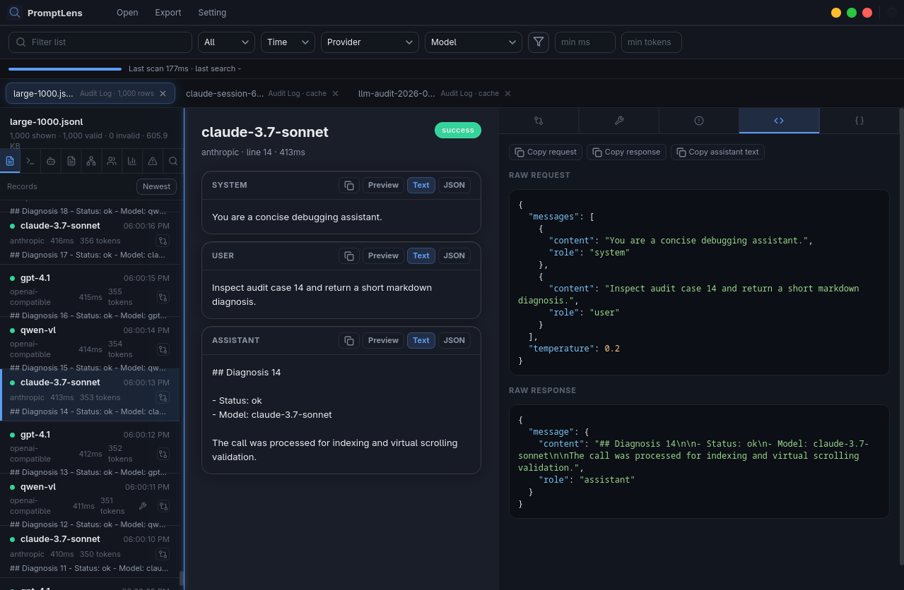

# PromptLens

Local-first desktop viewer for JSONL LLM audit logs. Scans large JSONL files, browses call summaries, reads request/response conversations, renders Markdown, previews embedded images, inspects raw JSON, and searches records — all without uploading data.



## Quick Start

```bash
npm install
npm run tauri:dev
```

Click **Open** and select a `.jsonl` file to begin.

## Build

```bash
# Frontend only
npm run build

# Full desktop app
npm run tauri:dev

# Rust checks
cd src-tauri && cargo fmt --check && cargo check && cargo test
```

## Privacy

PromptLens reads local files through the Tauri desktop app. It does not upload files, call remote services, collect telemetry, or send crash reports.

## Docs

- [Features](docs/FEATURES.md)
- [Usage](docs/USAGE.md)
- [Development](docs/DEVELOPMENT.md)
- [Release](docs/RELEASE.md)
- [Changelog](release/CHANGELOG.md)
