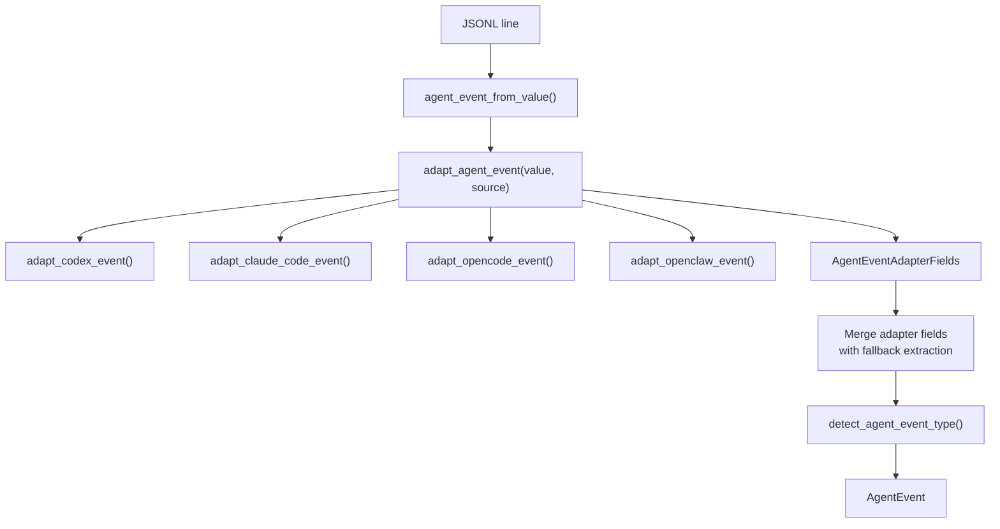
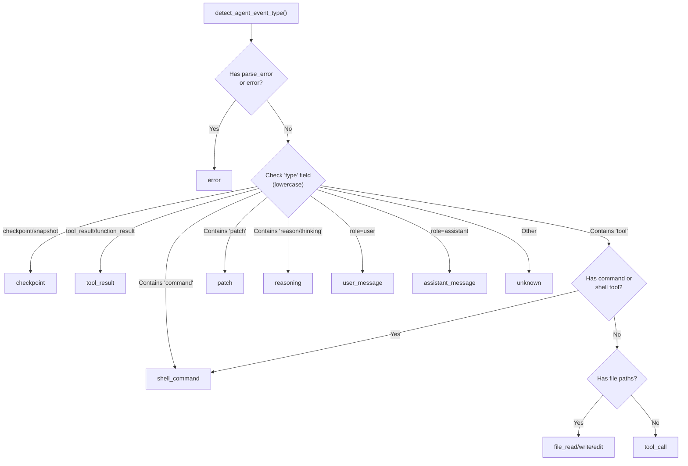
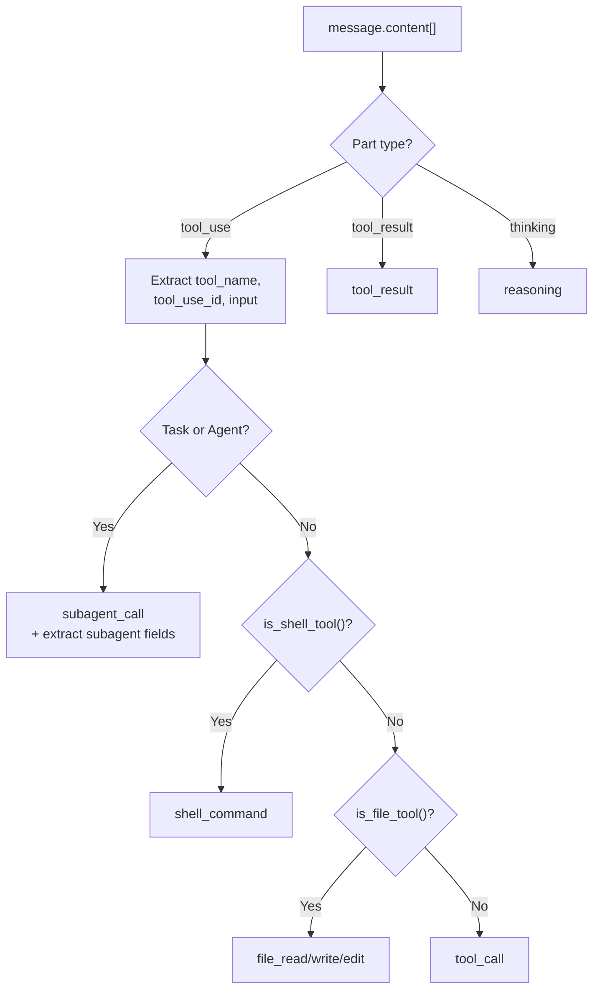

# Agent Event Parsing

Agent event parsing transforms JSONL logs from coding agents (Claude Code, Codex, OpenCode, OpenClaw) into a unified `AgentEvent` structure. Unlike audit log normalization, agent sessions contain tool calls, file operations, reasoning steps, and subagent invocations rather than request/response pairs.

## Architecture



## AgentEvent Fields

```rust
// file: src-tauri/src/types.rs:148
pub(crate) struct AgentEvent {
    pub(crate) id: String,
    pub(crate) event_type: String,
    pub(crate) role: Option<String>,
    pub(crate) tool_name: Option<String>,
    pub(crate) tool_use_id: Option<String>,
    pub(crate) command: Option<String>,
    pub(crate) file_paths: Vec<String>,
    pub(crate) text: Option<String>,
    pub(crate) is_error: bool,
    pub(crate) is_sidechain: bool,
    pub(crate) raw: Value,
    // ... more fields
}
```

## Adapter Fields

Each provider adapter returns an `AgentEventAdapterFields` struct with optional overrides:

```rust
// file: src-tauri/src/agent_adapters.rs:9
#[derive(Debug, Default)]
pub(crate) struct AgentEventAdapterFields {
    pub(crate) role: Option<String>,
    pub(crate) tool_name: Option<String>,
    pub(crate) tool_use_id: Option<String>,
    pub(crate) command: Option<String>,
    pub(crate) file_paths: Vec<String>,
    pub(crate) text: Option<String>,
    pub(crate) event_type: Option<String>,
    pub(crate) status: Option<String>,
    pub(crate) subagent_type: Option<String>,
    pub(crate) subagent_description: Option<String>,
    pub(crate) subagent_prompt: Option<String>,
    pub(crate) is_error: bool,
}
```

Adapter dispatch:

```rust
// file: src-tauri/src/agent_adapters.rs:74
pub(crate) fn adapt_agent_event(value: &Value, source: LogSource) -> AgentEventAdapterFields {
    let mut fields = match source {
        LogSource::Codex => adapt_codex_event(value),
        LogSource::ClaudeCode => adapt_claude_code_event(value),
        LogSource::OpenCode => adapt_opencode_event(value),
        LogSource::OpenClaw => adapt_openclaw_event(value),
        LogSource::Audit | LogSource::GenericAgent => AgentEventAdapterFields::default(),
    };
    normalize_adapter_fields(&mut fields);
    fields
}
```

## Event Type Detection Tree



## Claude Code Adapter

Handles Claude Code's message format with `message.content[]` arrays:



### Special Record Types

| `type` Value | Mapped To | Extra Fields |
|--------------|-----------|--------------|
| `file-history-snapshot` | `checkpoint` | -- |
| `queue-operation` | `checkpoint` | `status` from `operation` |
| `system` | `system` | `status` from `subtype`/`level` |
| `permission-mode` | `checkpoint` | `status` from `permissionMode` |
| `last-prompt` | `checkpoint` | `text` from `lastPrompt` |

## Tool Classification

### Shell Tools

```rust
// file: src-tauri/src/agent_adapters.rs:401
pub(crate) fn is_shell_tool(tool_name: &str) -> bool {
    let lowered = tool_name.to_lowercase();
    lowered.contains("bash") || lowered.contains("shell") || lowered.contains("terminal")
        || lowered.contains("exec") || lowered.contains("command")
}
```

### File Tools

```rust
// file: src-tauri/src/agent_adapters.rs:410
pub(crate) fn is_file_tool(tool_name: &str) -> bool {
    let lowered = tool_name.to_lowercase();
    lowered.contains("edit") || lowered.contains("patch") || lowered.contains("write")
        || lowered.contains("read") || lowered.contains("file")
}
```

### File Event Type Mapping

| Tool Name Contains | Event Type |
|-------------------|------------|
| `read` | `file_read` |
| `write` or `create` | `file_write` |
| `patch` or `edit` | `patch` |
| Other file tool | `file_edit` |

## Field Extraction

### Command Extraction

Commands are found by checking multiple key locations:

```rust
// file: src-tauri/src/agent.rs:446
pub(crate) fn agent_command(value: &Value) -> Option<String> {
    first_string(value, &["command", "cmd", "shell_command", "shellCommand", "bash", "script"])
        .or_else(|| {
            find_first_key(value, &["arguments", "args", "input", "parameters"])
                .and_then(|input| first_string(input, &["cmd", "command"]))
        })
}
```

### File Path Extraction

File paths are recursively collected from `path`, `file`, `file_path`, `filePath`, `target_file`, and other JSON keys. Paths are limited to 16.
