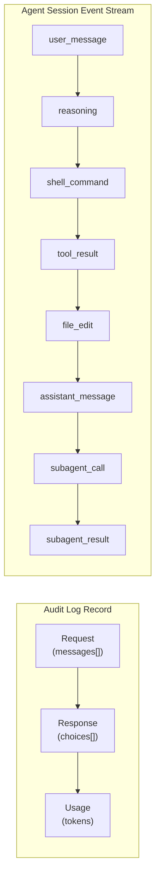
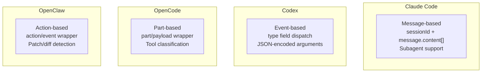
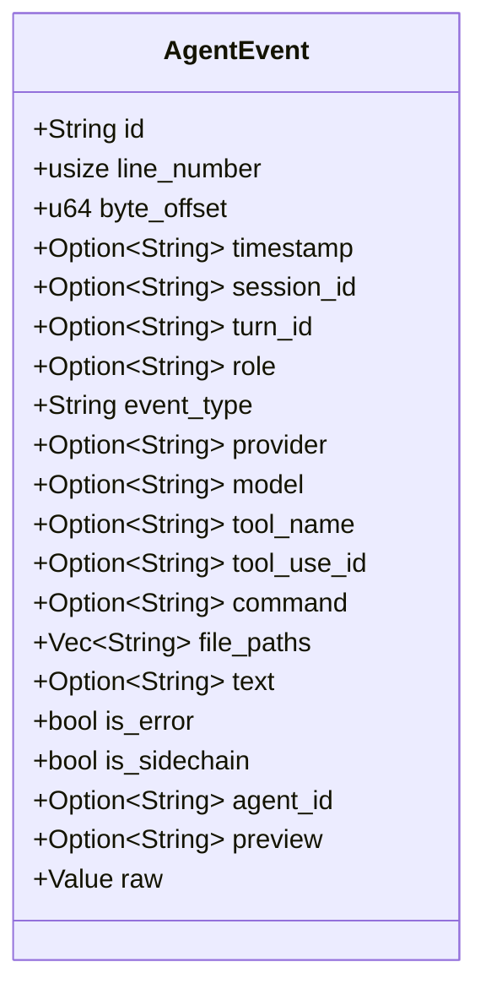
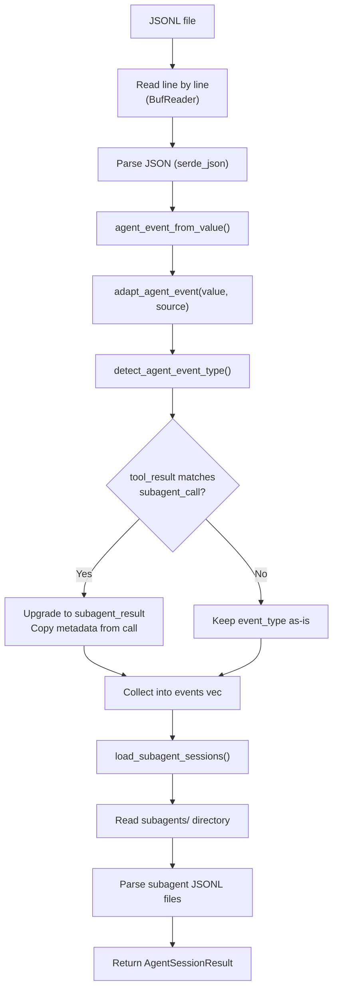
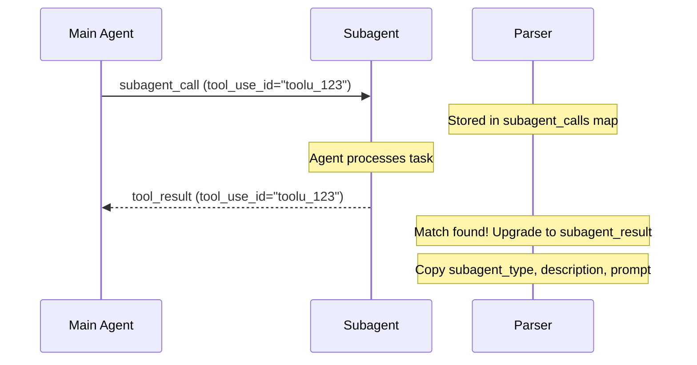
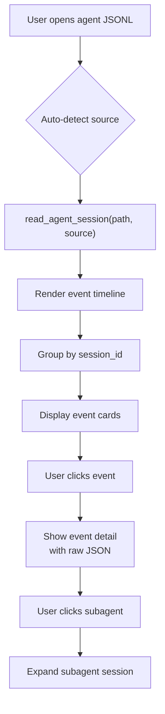

# Agent Sessions Overview

Agent sessions represent activity logs produced by AI coding agents such as Claude Code, Codex, OpenCode, and OpenClaw. Unlike traditional LLM audit logs that record request/response pairs, agent sessions capture the full workflow of autonomous coding tasks: reasoning steps, tool calls, file operations, shell commands, and subagent invocations.

## Audit Logs vs Agent Sessions



| Aspect | Audit Logs | Agent Sessions |
|--------|-----------|----------------|
| Structure | Request/response pairs | Sequential event stream |
| Granularity | Single API call | Multi-step workflow |
| Content | Messages, usage, latency | Tools, files, commands, reasoning |
| Parsing | `normalize_call()` | `agent_event_from_value()` |
| Tauri command | `read_record` | `read_agent_session` |
| Cache key | `(file_path, file_size, modified)` | `(file_path, source, file_size, modified)` |
| Output type | `NormalizedCall` | `Vec<AgentEvent>` |
| UI view | Conversation view | Timeline view |

The key architectural difference is that audit logs produce a single `NormalizedCall` per JSONL line (request + response + usage), while agent sessions produce a stream of `AgentEvent` objects where each line represents a step in the agent's workflow.

## Supported Sources



| Source | Identifier | Log Format | Key Signal |
|--------|-----------|------------|------------|
| Claude Code | `claude_code` | Message-based with `sessionId` and `message.content[]` | `sessionId` + `message` |
| Codex | `codex` | Event-based with `type` field dispatch | `exec_command` tool |
| OpenCode | `opencode` | Part-based with `part` or `payload` wrapper | String contains `opencode` |
| OpenClaw | `openclaw` | Action-based with `action` or `event` wrapper | String contains `openclaw` |

Each source has a dedicated adapter module under `src-tauri/src/agent_adapters.rs` that transforms provider-specific JSON into the common `AgentEvent` structure.

## AgentSessionResult

The `read_agent_session` command returns:

```rust
// file: src-tauri/src/types.rs:128
pub(crate) struct AgentSessionResult {
    pub(crate) file_path: String,                    // Source file path
    pub(crate) source: String,                       // Detected or specified source
    pub(crate) total_events: usize,                  // Parsed event count
    pub(crate) sessions: Vec<String>,                // Unique session IDs
    pub(crate) events: Vec<AgentEvent>,              // All parsed events
    pub(crate) subagent_sessions: Vec<SubagentSession>, // Linked subagent logs
}
```

The `sessions` field contains all unique `session_id` values found in the event stream, allowing the frontend to group events by session.

## AgentEvent Structure

Each event in the session is represented as an `AgentEvent` with 25+ fields:



The full Rust struct definition is at `src-tauri/src/types.rs:150`. Notable fields:

| Field | Purpose |
|-------|---------|
| `event_type` | One of 16 event types (see [Event Types](./event-types.md)) |
| `raw` | Original JSON value, preserved for "raw event" view |
| `file_paths` | File paths extracted from file operation events |
| `subagent_type` | Subagent type (e.g., `explorer`), populated for `subagent_call`/`subagent_result` |
| `is_sidechain` | Whether this event is part of a sidechain (parallel agent execution) |
| `agent_id` | Links subagent events to sessions in `subagent_sessions` |

## Parsing Pipeline



The core parsing loop in `read_agent_events()`:

```rust
// file: src-tauri/src/commands.rs:261
fn read_agent_events(
    reader: &mut BufReader<File>,
    source: LogSource,
    initial_line_number: usize,
    initial_byte_offset: u64,
) -> Result<ReadEventsResult, String> {
    let mut events = Vec::new();
    let mut subagent_calls: HashMap<String, AgentEvent> = HashMap::new();

    loop {
        // Read line, parse JSON
        let mut event = agent_event_from_value(value, line_number, byte_offset, source);

        // Link subagent call -> result
        if event.event_type == "tool_result" {
            if let Some(call) = event.tool_use_id.as_ref()
                .and_then(|id| subagent_calls.get(id))
            {
                event.event_type = "subagent_result".to_string();
                event.subagent_type = call.subagent_type.clone();
                event.subagent_description = call.subagent_description.clone();
                event.subagent_prompt = call.subagent_prompt.clone();
            }
        }
        if event.event_type == "subagent_call" {
            if let Some(id) = &event.tool_use_id {
                subagent_calls.insert(id.clone(), event.clone());
            }
        }

        events.push(event);
    }
    Ok((events, subagent_calls, sessions, line_number, byte_offset))
}
```

The return type `ReadEventsResult` is a tuple alias for concise code:

```rust
// file: src-tauri/src/commands.rs:21
type ReadEventsResult = (
    Vec<AgentEvent>,
    HashMap<String, AgentEvent>,  // subagent_calls
    HashSet<String>,              // unique session IDs
    usize,                        // final line number
    u64,                          // final byte offset
);
```

## Event Linking

### Session Linking

Events with the same `session_id` belong to the same conversation. The `sessions` field in `AgentSessionResult` lists all unique session IDs found.

### Subagent Call/Result Linking

When a subagent is invoked (e.g., Claude Code's `Task` or `Agent` tool), the system links the call to its result via `tool_use_id`:



### Subagent Session Files

Subagents may write their own JSONL log files in a `subagents/` directory alongside the main session file. These are loaded as `SubagentSession` objects with their own event streams. See [Subagent Sessions](./subagent-sessions.md) for details.

## Caching

Agent session results are cached in the `agent_session_cache` SQLite table keyed by `(file_path, source)`. This means the same file can be cached under different source interpretations (e.g., `codex` vs `claude_code`):

```rust
// file: src-tauri/src/cache.rs:44
"CREATE TABLE IF NOT EXISTS agent_session_cache (
    file_path TEXT NOT NULL,
    source TEXT NOT NULL,
    file_size INTEGER NOT NULL,
    modified TEXT,
    payload TEXT NOT NULL,
    updated_at INTEGER NOT NULL,
    PRIMARY KEY (file_path, source)
)"
```

Cache invalidation occurs when the file size or modification time changes, identical to the scan cache strategy. On cache hit, the full `AgentSessionResult` (including all events and subagent sessions) is deserialized from the stored JSON payload.

## Incremental Loading

The `read_agent_session_incremental` command supports loading only new events appended since the last read:

```rust
// file: src-tauri/src/commands.rs:488
fn read_agent_session_incremental(
    file_path: String,
    from_offset: u64,
    from_line_number: usize,
    log_source: Option<String>,
) -> Result<AgentSessionIncrementalResult, String>
```

```rust
// file: src-tauri/src/types.rs:280
struct AgentSessionIncrementalResult {
    events: Vec<AgentEvent>,      // Only new events
    next_line_number: usize,      // For next incremental call
    total_events: usize,          // New event count
}
```

The incremental command:
1. Seeks to `from_offset` in the file
2. Reads and parses only new lines
3. Links subagent calls/results across the full event set
4. Updates the cache with the merged result
5. Returns only the new events

Frontend Tauri wrapper:

```typescript
// file: src/tauri.ts:78
export async function readAgentSessionIncremental(
  filePath: string,
  fromOffset: number,
  fromLineNumber: number,
  logSource: LogSource = "audit",
): Promise<AgentSessionIncrementalResult> {
  return invoke("read_agent_session_incremental", { filePath, fromOffset, fromLineNumber, logSource });
}
```

## Frontend Integration



Each event type has a distinct visual representation in the left panel timeline:
- Messages show text content with role indicators
- Shell commands show commands with syntax highlighting
- File operations show file paths with operation type badges
- Subagent calls expand to show the subagent's event stream

The agent session tab visibility depends on the source type:

```tsx
// file: src/app/components/LeftPanel.tsx:135
const isAgentSession = source !== null && source !== "audit";
```

When `isAgentSession` is true, additional tabs appear in the left panel: Timeline, Subagents, and Agent Files.

## Use Cases

| Use Case | How Agent Sessions Help |
|----------|------------------------|
| Debugging agent behavior | See which tools the agent called and why |
| Auditing file changes | Track which files were read, written, or patched |
| Understanding reasoning | View the agent's thinking steps between actions |
| Cost analysis | See per-event token usage with pricing integration |
| Reproducing issues | Replay the exact sequence of agent operations |
| Subagent inspection | Dive into delegated tasks to see subagent activity |

## Relationship with Audit Logs

Agent sessions and audit logs can coexist in the same PromptLens workspace as separate tabs. The key difference is the parsing path:

| Aspect | Audit Log Path | Agent Session Path |
|--------|---------------|-------------------|
| Command | `read_record` | `read_agent_session` |
| Parser | `normalize_call()` | `agent_event_from_value()` |
| Output | `NormalizedCall` | `AgentEvent[]` |
| View | Conversation view | Timeline view |
| Fields | request/response/usage | event_type/tool_name/command/file_paths |

Some JSONL files may contain both audit-style records and agent events. The `detect_log_source` command helps determine which parsing path to use. If auto-detection identifies an agent source, the frontend shows a confirmation dialog before switching parsing mode.

## Workspace Tab Architecture

Each opened file gets a `WorkspaceTab` in the Zustand store. Agent session tabs expose additional left sub-panel tabs (Timeline, Subagents, Agent Files) that are hidden for audit log tabs:

```tsx
// file: src/app/components/LeftPanel.tsx:135
const isAgentSession = source !== null && source !== "audit";
```

The `useWorkspaceStore` manages all tab state, including per-tab filters, selections, and active session tab ID. When switching between an audit tab and an agent tab, the left panel automatically adjusts which sub-tabs are visible:

```tsx
// file: src/app/App.tsx:181
useEffect(() => {
  const source = activeTab?.source ?? null;
  const isAgentSession = source !== null && source !== "audit";
  if (isAgentSession && (leftTab === "trace" || leftTab === "sessions")) {
    app().setLeftTab("records");
  }
}, [activeTab?.source, leftTab]);
```

## Token Usage and Cost Tracking

Both audit logs and agent sessions support token usage tracking. For audit logs, tokens come from the `usage` field in the raw JSON. For agent sessions, `input_tokens` and `output_tokens` are extracted per event when available:

```rust
// file: src-tauri/src/types.rs:171
pub(crate) input_tokens: Option<u64>,
pub(crate) output_tokens: Option<u64>,
```

The frontend calculates costs via the `calculate_costs` Tauri command using the built-in pricing table:

```typescript
// file: src/tauri.ts:103
export async function calculateCosts(
  requests: Array<{ model: string; prompt_tokens?: number; completion_tokens?: number }>,
): Promise<CostEstimate[]> {
  return invoke("calculate_costs", { requests });
}
```

## Keyboard Shortcuts for Agent Sessions

| Shortcut | Action |
|----------|--------|
| `Arrow Up/Down` | Navigate events in the timeline |
| `Ctrl+F` | Focus search/filter box |
| `Ctrl+R` | Re-scan the active file |
| `Ctrl+W` | Close the current tab |
| `Ctrl+O` | Open a new file |
| `Ctrl+Shift+C` | Copy raw JSON of selected event |
