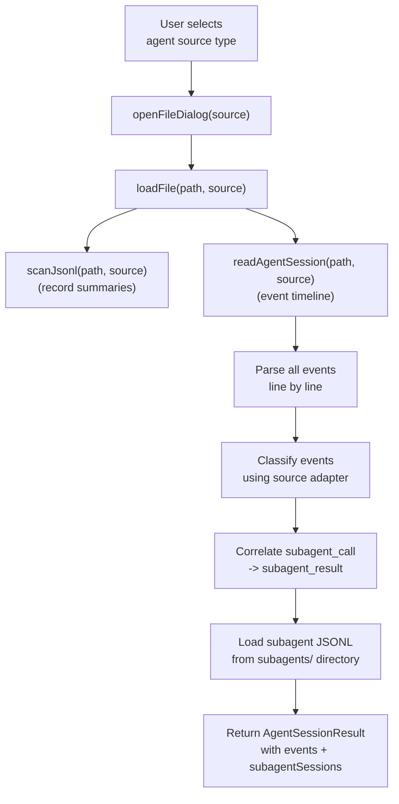
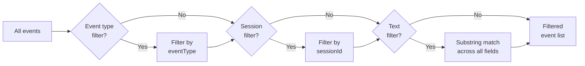
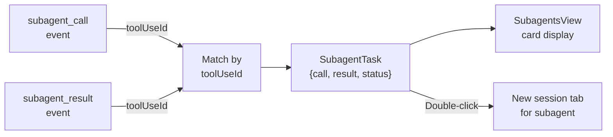
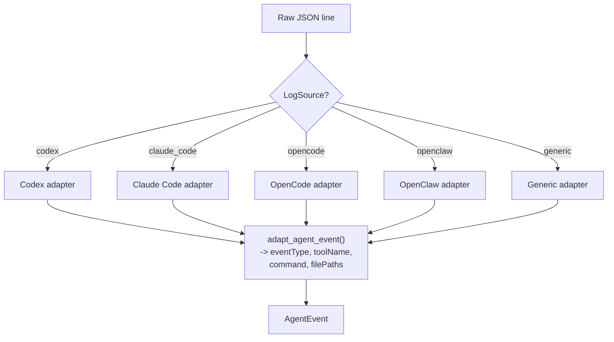
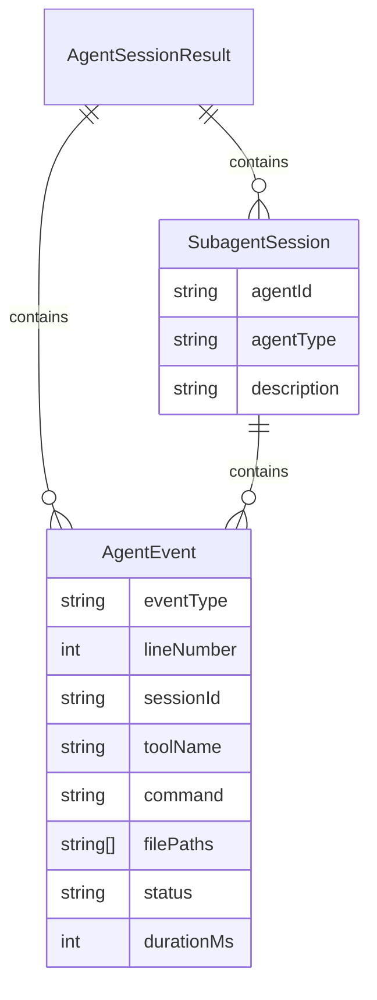
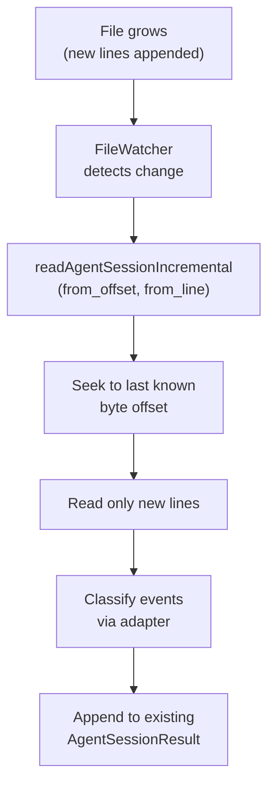
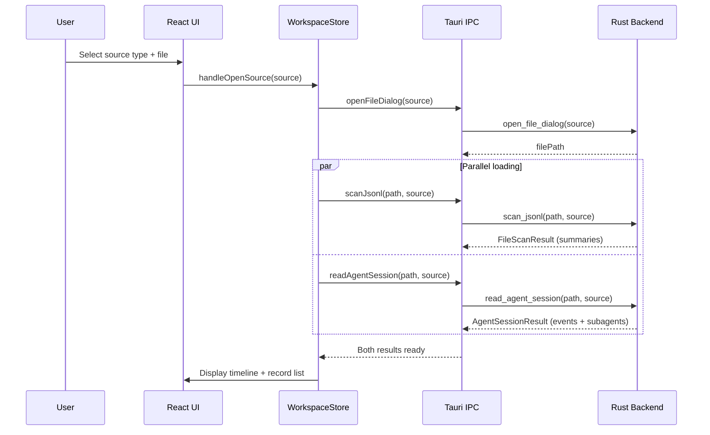

# Agent Sessions

PromptLens can parse and display agent session logs from Codex, Claude Code, OpenCode, OpenClaw, and generic agent JSONL formats. Agent sessions differ from standard audit logs -- they contain a sequence of events (messages, tool calls, file edits, subagent tasks) rather than isolated request/response pairs.

## Opening Agent Sessions

To open an agent session log:

1. Click **Open** in the title bar.
2. Select the appropriate source type (Codex Session, Claude Code Session, etc.).
3. Choose your JSONL file.



## Agent Event Types

Agent sessions produce a variety of event types:

| Event Type | Description | Example |
|-----------|-------------|---------|
| `user_message` | Message from the user | User asks a question |
| `assistant_message` | Message from the assistant | Model reply |
| `tool_call` | Model invokes a tool | Running a shell command |
| `tool_result` | Result of a tool call | Command output |
| `subagent_call` | Model spawns a subagent | Task or Agent tool use |
| `subagent_result` | Subagent returns a result | Subagent completion |
| `shell_command` | A shell command was executed | `npm test` |
| `file_read` | A file was read | Reading source code |
| `file_write` | A file was written | Creating a new file |
| `patch` | A patch was applied to a file | Applying a diff |
| `file_edit` | A file was edited | Modifying source code |
| `checkpoint` | A checkpoint/snapshot was created | Saving progress |
| `plan_update` | The agent updated its plan | Revising approach |
| `reasoning` | Model's internal reasoning | Chain of thought |
| `error` | An error occurred | Tool failure |
| `system` | System-level event | Session start/end |

## Agent Event Data Model

Each agent event is parsed from a JSON line into a structured `AgentEvent` object:

```rust
// file: src-tauri/src/agent.rs:11-80
pub(crate) fn agent_event_from_value(
    value: Value,
    line_number: usize,
    byte_offset: u64,
    source: LogSource,
) -> AgentEvent {
    let timestamp = first_string(
        &value,
        &["timestamp", "created_at", "createdAt", "time", "ts", "date"],
    );
    let session_id = first_string(
        &value,
        &["session_id", "sessionId", "conversation_id", "conversationId",
          "thread_id", "threadId", "chat_id", "chatId"],
    );
    let turn_id = first_string(
        &value,
        &["turn_id", "turnId", "request_id", "requestId",
          "message_id", "messageId", "id", "uuid"],
    );
    let adapter_fields = adapt_agent_event(&value, source);
    // ...
}
```

This function uses `first_string()` to try multiple JSON key names, supporting the different conventions used by each agent framework.

## Left Panel Tabs for Agent Sessions

When an agent session is loaded, the left panel shows three agent-specific tabs.

### Timeline Tab

The timeline tab displays all events in chronological order with virtual scrolling:

```tsx
// file: src/app/components/LeftPanel.tsx:567
const rowVirtualizer = useVirtualizer({
  count: events.length,
  getScrollElement: () => listRef.current,
  estimateSize: () => 132,
  overscan: 8,
});
```

Each event card shows the event type, line number, preview, provider, session, tokens, command, and file paths.

#### Filtering the Timeline

| Control | Description |
|---------|-------------|
| **Event type dropdown** | Filter to a specific event type (e.g., `shell_command`, `file_write`) |
| **Session dropdown** | Filter to a specific session ID |
| **Text input** | Free-text filter across all event fields |



### Subagents Tab

The subagents tab shows subagent tasks spawned during the session. Subagent tasks are built by pairing `subagent_call` events with their corresponding `subagent_result` events:

```tsx
// file: src/app/analytics.ts:278-300
export function buildSubagentTasks(events: AgentEvent[]): SubagentTask[] {
  const resultsByToolUseId = new Map<string, AgentEvent>();
  for (const event of events) {
    if (event.eventType !== "subagent_result") continue;
    if (event.toolUseId) resultsByToolUseId.set(event.toolUseId, event);
  }
  return events
    .filter((event) => event.eventType === "subagent_call")
    .map((call): SubagentTask => {
      const result = call.toolUseId
        ? resultsByToolUseId.get(call.toolUseId)
        : undefined;
      const status = result?.status === "error"
        ? "error"
        : result
          ? "completed"
          : "running";
      return {
        id: call.toolUseId || call.id,
        type: call.subagentType || "subagent",
        description: call.subagentDescription || call.preview || call.text || "Subagent task",
        call,
        result,
        status,
      };
    });
}
```



#### Interacting with Subagents

| Action | Method |
|--------|--------|
| View call details | Click the subagent card |
| View result | Click "Open result" |
| Expand conversation | Click "Show conversation" to inline the subagent's events |
| Open in session tab | Double-click the card to open the subagent in a new session tab |

### Agent Files Tab

The agent files tab summarizes the files the agent has operated on:

```tsx
// file: src/app/analytics.ts:308-320
export function buildAgentFileActivity(events: AgentEvent[]) {
  const map = new Map<string, AgentEvent[]>();
  for (const event of events) {
    for (const path of event.filePaths ?? []) {
      const existing = map.get(path) ?? [];
      existing.push(event);
      map.set(path, existing);
    }
  }
  return Array.from(map.entries())
    .map(([path, evts]) => ({ path, events: evts }))
    .sort((a, b) => b.events.length - a.events.length);
}
```

Files are sorted by activity count (most active first). Each entry shows the file path and the number of events that accessed it.

## Provider-Specific Adapters

Each agent source uses a dedicated adapter to classify events:

| Source | Adapter | Key Classifications |
|--------|---------|-------------------|
| **Codex** | Codex adapter | `reasoning`, `patch`, `checkpoint`, `shell_command`, `tool_result` |
| **Claude Code** | Claude Code adapter | `tool_use` -> `shell_command`/`subagent_call`, `tool_result` -> `subagent_result` |
| **OpenCode** | OpenCode adapter | `tool` -> `file_read`/`file_write`, `snapshot` -> `checkpoint` |
| **OpenClaw** | OpenClaw adapter | `action.kind` -> `patch`/`shell_command`, `tool` -> `shell_command` |
| **Generic** | Generic adapter | Auto-classifies based on common JSON patterns |



## Subagent Session Loading

For Claude Code sessions, the backend loads subagent JSONL files from a `subagents/` directory alongside the main file:

```rust
// file: src-tauri/src/commands.rs:328
fn load_subagent_sessions(
    main_file_path: &Path,
    source: LogSource,
    subagent_calls: &HashMap<String, AgentEvent>,
) -> Vec<SubagentSession> {
    let session_dir = main_file_path.parent().map(|p| {
        let stem = main_file_path.file_stem()
            .map(|s| s.to_string_lossy().to_string())
            .unwrap_or_default();
        p.join(stem)
    }).filter(|d| d.is_dir());

    let subagents_dir = session_dir.join("subagents");
    // ... read .jsonl files and .meta.json files from subagents/
}
```

## Agent Session Data Model



## Incremental Agent Session Loading

For large agent sessions, PromptLens supports incremental loading:

1. Initial load parses events from the start of the file.
2. If the file grows, the incremental loader reads only new bytes.
3. New events are classified and added to the timeline.

```rust
// file: src-tauri/src/commands.rs:487
fn read_agent_session_incremental(
    file_path: String,
    from_offset: u64,
    from_line_number: usize,
    log_source: Option<String>,
) -> Result<AgentSessionIncrementalResult, String> {
    // Seek to from_offset, read new events, classify, cache
}
```



## Agent Session Analysis Tips

| Tip | Description |
|-----|-------------|
| Start with the timeline | Get a chronological overview of what the agent did |
| Filter by event type | Focus on shell_commands to see what commands ran |
| Check agent files | See which files were modified and how many times |
| Use the subagents tab | Understand how the agent decomposed complex tasks |
| Open subagent tabs | Double-click a subagent to inspect its full conversation |
| Inspect errors | Use the Issues tab or filter the timeline by error events |

## Agent Session Loading Sequence

The complete sequence when opening an agent session file:



## AgentEvent TypeScript Type

The TypeScript representation of an agent event:

```ts
// file: src/types.ts:160-190
export type AgentEvent = {
  id: string;
  lineNumber: number;
  byteOffset: number;
  timestamp?: string;
  sessionId?: string;
  turnId?: string;
  parentId?: string;
  role?: string;
  eventType: AgentEventType | string;
  provider?: string;
  model?: string;
  toolName?: string;
  toolUseId?: string;
  subagentType?: string;
  subagentDescription?: string;
  subagentPrompt?: string;
  command?: string;
  filePaths: string[];
  status?: string;
  durationMs?: number;
  inputTokens?: number;
  outputTokens?: number;
  isError?: boolean;
  toolResultContent?: unknown;
  isSidechain?: boolean;
  agentId?: string;
  preview?: string;
  text?: string;
  raw: unknown;
};
```

## SubagentSession Type

```ts
// file: src/types.ts:192-198
export type SubagentSession = {
  agentId: string;
  agentType?: string;
  description?: string;
  toolUseId?: string;
  events: AgentEvent[];
};
```

## Agent Session Caching

Agent sessions are cached in SQLite alongside regular scan results. The cache key includes file path, file size, and modified time. When the file changes, the cache is invalidated and the session is re-parsed.

```rust
// file: src-tauri/src/cache.rs
// Agent sessions are cached with a different key than regular scans
// The cache schema version must match for a cache hit
pub(crate) const CACHE_SCHEMA_VERSION: i64 = 3;
```

## Filtering Agent Events by Type

The timeline supports filtering by event type. Available types depend on the agent source:

| Source | Available Event Types |
|--------|----------------------|
| Codex | `user_message`, `assistant_message`, `reasoning`, `patch`, `checkpoint`, `shell_command`, `tool_result`, `error`, `system` |
| Claude Code | `user_message`, `assistant_message`, `tool_call`, `tool_result`, `subagent_call`, `subagent_result`, `shell_command`, `file_read`, `file_write`, `error`, `system` |
| OpenCode | `user_message`, `assistant_message`, `tool_call`, `tool_result`, `file_read`, `file_write`, `checkpoint`, `error` |
| Generic | `user_message`, `assistant_message`, `tool_call`, `tool_result`, `shell_command`, `file_read`, `file_write`, `error`, `system` |

## Related Pages

- [Tool Calls](tool-calls.md) -- Tool call rendering and normalization
- [Analytics](analytics.md) -- Session grouping and metrics
- [Opening Files](opening-files.md) -- Source type selection
