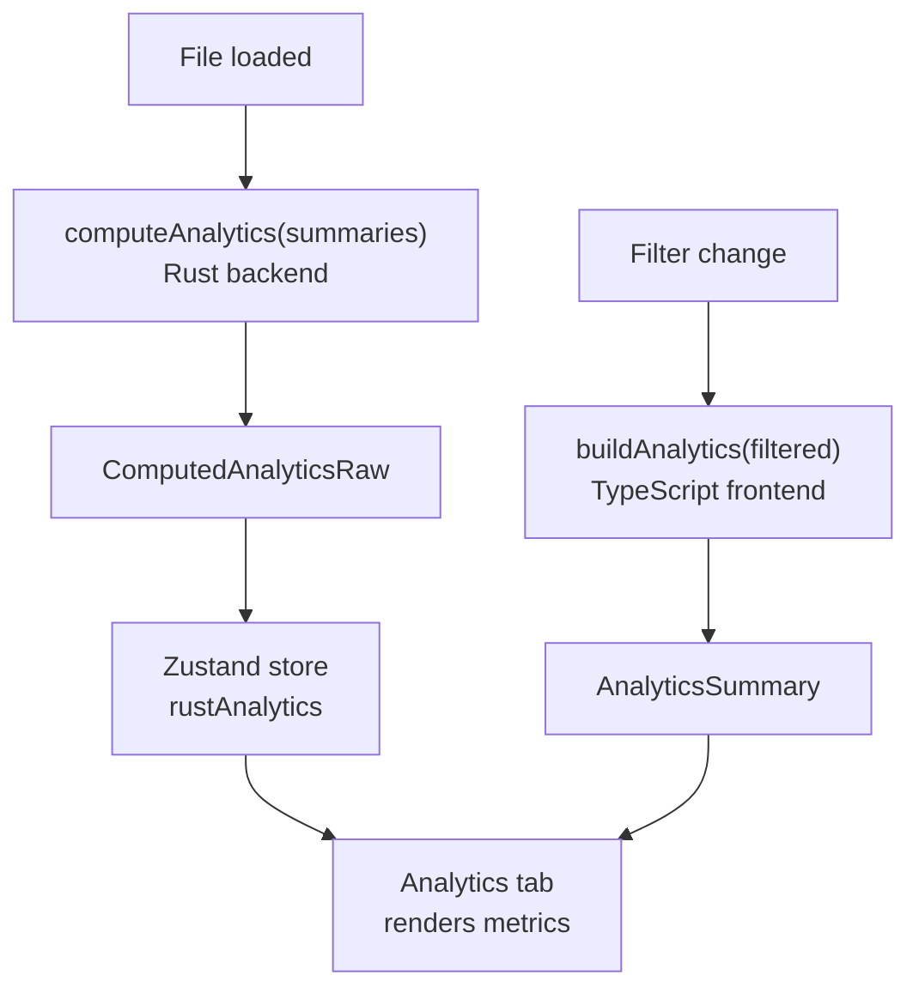
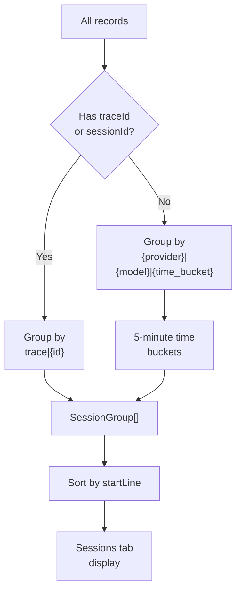

# Analytics

The Analytics tab in the left panel provides a statistical overview of your log data. It displays metrics, charts, and metadata to help you understand LLM usage patterns.

## Accessing Analytics

Click the bar chart icon in the left panel's tab bar to open the analytics view. Analytics are computed from the currently filtered records, so they update when you change filters.

## Metric Cards

The analytics view displays key metrics in a grid at the top:

```
+----------+----------+----------+----------+
| Records  | Errors   | P95      | P99      |
| 1,234    | 23(1.9%) | 891ms    | 2.3s     |
+----------+----------+----------+----------+
| Total    | P95      | Total    | Avg      |
| Tokens   | Tokens   | Cost     | Cost     |
| 4.5M     | 12.3k    | $12.34   | $0.01    |
+----------+----------+----------+----------+
```

| Metric | Description |
|--------|-------------|
| **Records** | Number of filtered records |
| **Errors** | Count and percentage of error records |
| **P95 Latency** | 95th percentile response time |
| **P99 Latency** | 99th percentile response time |
| **Total Tokens** | Sum of all token counts (prompt + completion) |
| **P95 Tokens** | 95th percentile tokens per request |
| **Total Cost** | Sum of estimated costs across all records |
| **Avg Cost** | Average cost per record |

Cost metrics are only shown when the detected model has pricing data available.

## How Analytics Are Computed

Analytics are computed in two places:

### Frontend (TypeScript)

`buildAnalytics()` computes metrics from the filtered summary array. It runs instantly when filters change:

```ts
// file: src/app/analytics.ts:52-69
export function buildAnalytics(items: LogSummary[]): AnalyticsSummary {
  const latencies = items
    .map((item) => item.latencyMs)
    .filter((value): value is number => value !== undefined);
  const tokens = items
    .map((item) => item.totalTokens)
    .filter((value): value is number => value !== undefined);
  const errors = items.filter(
    (item) => item.status === "error" || item.status === "invalid_json"
  ).length;
  return {
    total: items.length,
    success: items.filter((item) => item.status === "success").length,
    errors,
    invalid: items.filter((item) => item.status === "invalid_json").length,
    errorRate: items.length ? (errors / items.length) * 100 : 0,
    p95Latency: percentile(latencies, 0.95),
    p99Latency: percentile(latencies, 0.99),
    totalTokens: tokens.reduce((sum, value) => sum + value, 0),
    p95Tokens: percentile(tokens, 0.95),
    topModels: topCounts(items.map((item) => item.model || "unknown model")),
    topProviders: topCounts(items.map((item) => item.provider || "unknown provider")),
  };
}
```

### Backend (Rust)

`compute_analytics()` runs on the full file for more comprehensive analysis:

```rust
// file: src-tauri/src/analytics.rs:95-150
pub fn compute_analytics(summaries: &[LogSummary]) -> AnalyticsSummary {
    let mut latencies: Vec<f64> = summaries
        .iter()
        .filter_map(|s| s.latency_ms.map(|l| l as f64))
        .collect();
    let mut token_values: Vec<f64> = summaries
        .iter()
        .filter_map(|s| s.total_tokens.map(|t| t as f64))
        .collect();

    AnalyticsSummary {
        total: summaries.len(),
        success: summaries.iter().filter(|s| s.status == "success").count(),
        errors: summaries.iter().filter(|s| s.status == "error" || s.status == "invalid_json").count(),
        error_rate: /* ... */,
        p95_latency: percentile(&mut latencies, 0.95),
        p99_latency: percentile(&mut latencies, 0.99),
        total_tokens: summaries.iter().filter_map(|s| s.total_tokens).sum(),
        p95_tokens: percentile(&mut token_values, 0.95).map(|v| v as u64),
        top_models: top_counts(/* ... */),
        top_providers: top_counts(/* ... */),
    }
}
```

The Rust backend is called when the file loads and when the file size changes. Results are cached in the Zustand store.



### Percentile Calculation

Both frontend and backend use the same percentile algorithm:

```ts
// file: src/app/analytics.ts:106-111
export function percentile(values: number[], quantile: number): number | null {
  if (!values.length) return null;
  const sorted = [...values].sort((a, b) => a - b);
  const index = Math.min(sorted.length - 1, Math.ceil(sorted.length * quantile) - 1);
  return sorted[index];
}
```

```rust
// file: src-tauri/src/analytics.rs:72-79
fn percentile(values: &mut [f64], quantile: f64) -> Option<f64> {
    if values.is_empty() { return None; }
    values.sort_by(|a, b| a.partial_cmp(b).unwrap_or(std::cmp::Ordering::Equal));
    let index = ((values.len() as f64 * quantile).ceil() as usize).min(values.len() - 1);
    Some(values[index])
}
```

## Charts

### Model Bar Chart

Shows top models by usage count. Each bar represents a model name and its request count. The `topCounts()` function groups and ranks by frequency:

```ts
// file: src/app/analytics.ts:113-120
export function topCounts(values: string[]) {
  const counts = new Map<string, number>();
  for (const value of values) counts.set(value, (counts.get(value) ?? 0) + 1);
  return Array.from(counts.entries())
    .map(([name, count]) => ({ name, count }))
    .sort((a, b) => b.count - a.count || a.name.localeCompare(b.name))
    .slice(0, 8);
}
```

```
Models
gpt-4.1            ████████████████████  823
claude-sonnet-4-..  ████████████         312
gemini-2.5-flash    ████                  99
```

### Provider Bar Chart

Shows top providers by usage count, using the same `topCounts()` function with provider names.

```
Providers
openai     ████████████████████  823
anthropic  ████████████         312
gemini     ████                  99
```

### Latency Distribution Histogram

Displays a histogram of response time distribution across all filtered records.

```
Latency Distribution
0ms     ████████████████████  450
200ms   ████████████████      320
400ms   ████████████          210
600ms   ████████              150
800ms   ██████                100
1000ms  ████                   80
1200ms  ██                     24
```

The histogram automatically determines bucket boundaries based on the data range. When all values are identical, a single bar is displayed.

## Metadata Section

Below the charts, the metadata section shows details about the file and the currently selected record.

### File Metadata

| Field | Example |
|-------|---------|
| File | my-audit.log |
| Path | /home/user/logs/my-audit.log |
| Size | 45.2 MB |
| Total lines | 12,345 |
| Valid | 12,300 |
| Invalid | 45 |

### Record Metadata (when a record is selected)

| Field | Example |
|-------|---------|
| Line | 42 |
| Status | success |
| Model | gpt-4.1 |
| Provider | openai |
| Trace | trace-abc123 |
| Session | session-xyz |
| Request | req-789 |
| Latency | 234ms |
| Prompt tokens | 1,200 |
| Completion tokens | 456 |
| Total tokens | 1,656 |

### Agent Event Metadata (when an agent event is selected)

| Field | Example |
|-------|---------|
| Event type | shell_command |
| Event line | 15 |
| Provider | codex |
| Role | assistant |
| Session | session-1 |
| Turn | turn-3 |
| Tool | Bash |
| Tool use | toolu_abc123 |
| Subagent | explorer |
| Status | success |
| Duration | 3.4s |
| Files | src/app.ts, src/lib.rs |

## Issue Detection

The analytics engine automatically detects potential issues in your log data. Issues are classified by type and severity:

```rust
// file: src-tauri/src/analytics.rs:152-225
pub fn detect_issues(summaries: &[LogSummary], analytics: &AnalyticsSummary) -> Vec<IssueRecord> {
    let latency_threshold = analytics.p95_latency.unwrap_or(0.0).max(10_000.0);
    let token_threshold = analytics.p95_tokens.unwrap_or(0) as f64;

    for summary in summaries {
        if summary.status == "invalid_json" {
            // severity: "high"
        } else if summary.status == "error" {
            // severity: "high"
        }
        if let Some(latency) = summary.latency_ms {
            if latency as f64 >= latency_threshold {
                // kind: "latency", severity: "medium"
            }
        }
        if let Some(tokens) = summary.total_tokens {
            if tokens as f64 >= token_threshold {
                // kind: "tokens", severity: "medium"
            }
        }
        if summary.preview.is_none() && summary.status == "success" {
            // kind: "empty", severity: "low"
        }
    }
    issues
}
```

| Type | Severity | Description |
|------|----------|-------------|
| `error` | High | Record has error status |
| `invalid` | High | Record contains invalid JSON |
| `latency` | Medium | Latency exceeds P95 threshold |
| `tokens` | Medium | Token count exceeds P95 threshold |
| `empty` | Low | Response has no text content |

Issues are sorted by severity (high first), then by line number. The severity ranking uses a simple numeric mapping:

```ts
// file: src/app/analytics.ts:138-142
export function severityRank(severity: IssueRecord["severity"]) {
  if (severity === "high") return 3;
  if (severity === "medium") return 2;
  return 1;
}
```

View all detected issues in the **Issues** tab in the left panel. See [Browsing Records](browsing-records.md) for details.

## Cost Estimation

PromptLens includes a built-in pricing table for common LLM models. When you open a file, it calculates an estimated cost for each record based on:

- The detected model name
- Prompt token count
- Completion token count

### Pricing Table

The pricing table is embedded as a JSON file in the Rust binary:

```rust
// file: src-tauri/src/pricing.rs:21
const PRICING_JSON: &str = include_str!("../pricing.json");
```

It is loaded once and cached in a `OnceLock`:

```rust
// file: src-tauri/src/pricing.rs:23-27
static PRICING_TABLE: OnceLock<Vec<ModelPricing>> = OnceLock::new();

pub fn load_pricing_table() -> &'static [ModelPricing] {
    PRICING_TABLE.get_or_init(|| serde_json::from_str(PRICING_JSON).unwrap_or_default())
}
```

### Model Matching

Pricing lookup uses a two-stage matching strategy:

```rust
// file: src-tauri/src/pricing.rs:29-47
pub fn find_pricing<'a>(model: &str, table: &'a [ModelPricing]) -> Option<&'a ModelPricing> {
    let lower = model.to_lowercase();
    // 1. Exact match
    if let Some(p) = table.iter().find(|p| p.model.to_lowercase() == lower) {
        return Some(p);
    }
    // 2. Substring match (longest matching model name wins)
    let mut best: Option<(&ModelPricing, usize)> = None;
    for p in table {
        let p_lower = p.model.to_lowercase();
        if lower.contains(&p_lower) {
            let len = p_lower.len();
            if best.is_none_or(|(_, blen)| len > blen) {
                best = Some((p, len));
            }
        }
    }
    best.map(|(p, _)| p)
}
```

This means a record with model `gpt-4.1-2025-04-14` will match the `gpt-4.1` pricing entry.

### Cost Calculation

```rust
// file: src-tauri/src/pricing.rs:49-72
pub fn calculate_cost(
    model: &str,
    prompt_tokens: Option<u64>,
    completion_tokens: Option<u64>,
    table: &[ModelPricing],
) -> CostEstimate {
    let pricing = find_pricing(model, table);
    let (input_cost, output_cost) = match pricing {
        Some(p) => (
            (input_tokens / 1_000_000.0) * p.input_per_mtok,
            (output_tokens / 1_000_000.0) * p.output_per_mtok,
        ),
        None => (0.0, 0.0),
    };
    CostEstimate {
        model: model.to_string(),
        input_cost,
        output_cost,
        total_cost: input_cost + output_cost,
        matched_pricing: pricing.map(|p| p.model.clone()),
    }
}
```

The cost formula is:

```
input_cost  = (prompt_tokens / 1,000,000) * input_per_mtok
output_cost = (completion_tokens / 1,000,000) * output_per_mtok
total_cost  = input_cost + output_cost
```

If the model is not in the pricing table, the cost is $0. The pricing table is loaded from the Rust backend via the `get_pricing_table` command.

| Model Family | Input Cost | Output Cost |
|-------------|-----------|-------------|
| GPT-4.1 | $2.00/Mtok | $8.00/Mtok |
| GPT-4.1-mini | $0.40/Mtok | $1.60/Mtok |
| Claude Sonnet 4 | $3.00/Mtok | $15.00/Mtok |
| Claude Haiku 3.5 | $0.80/Mtok | $4.00/Mtok |
| Gemini 2.5 Flash | $0.15/Mtok | $0.60/Mtok |

## Filter Options

The analytics engine also computes available filter options from the data:

```ts
// file: src/app/analytics.ts:122-136
export function buildFilterOptions(items: LogSummary[]) {
  const providers = new Set<string>();
  const models = new Set<string>();
  const traces = new Set<string>();
  for (const item of items) {
    providers.add(item.provider || "unknown provider");
    models.add(item.model || "unknown model");
    if (item.traceId || item.sessionId)
      traces.add(item.traceId || item.sessionId || "");
  }
  return {
    providers: Array.from(providers).sort(),
    models: Array.from(models).sort(),
    traces: Array.from(traces).filter(Boolean).sort(),
  };
}
```

| Filter | Source |
|--------|--------|
| Providers | Unique provider names across all records |
| Models | Unique model names across all records |
| Traces | Unique trace/session IDs across all records |

These are used to populate the dropdown filters in the toolbar. The Rust backend computes these on the full dataset, while the frontend falls back to computing them on the filtered set.

## Session Grouping

For audit logs, the analytics engine groups records into **heuristic sessions** based on:

- Trace ID (if present in the data)
- Session ID (if present)
- Proximity in time and line number

```ts
// file: src/app/analytics.ts:13-50
export function buildSessionGroups(items: LogSummary[]): SessionGroup[] {
  const groups = new Map<string, LogSummary[]>();
  for (const item of items) {
    const stable = item.traceId || item.sessionId;
    const time = Date.parse(item.timestamp ?? "");
    const bucket = Number.isFinite(time)
      ? Math.floor(time / (5 * 60 * 1000))  // 5-minute buckets
      : Math.floor(item.lineNumber / 25);     // line-number-based buckets
    const id = stable
      ? `trace|${stable}`
      : `${provider}|${model}|${bucket}`;
    groups.set(id, [...(groups.get(id) ?? []), item]);
  }
  // ... build SessionGroup objects
}
```



Each session group contains:

| Field | Description |
|-------|-------------|
| ID | Unique group identifier |
| Label | Human-readable label (provider / model) |
| Line range | First and last line numbers |
| Time range | First and last timestamps |
| Provider/Model | Dominant provider and model |
| Record count | Number of records in the group |
| Error count | Number of error records |
| Total tokens | Sum of token counts |
| Avg latency | Average response time |

View session groups in the **Sessions** tab in the left panel.

## Related Pages

- [Browsing Records](browsing-records.md) -- Filtering and the Issues tab
- [Export](export.md) -- Exporting analytics data
- [Agent Sessions](agent-sessions.md) -- Agent-specific metrics
