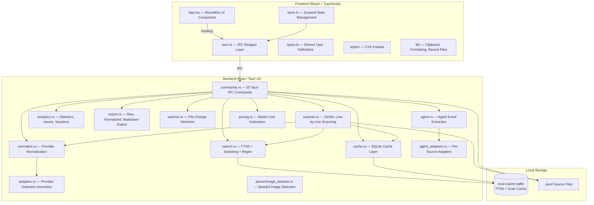
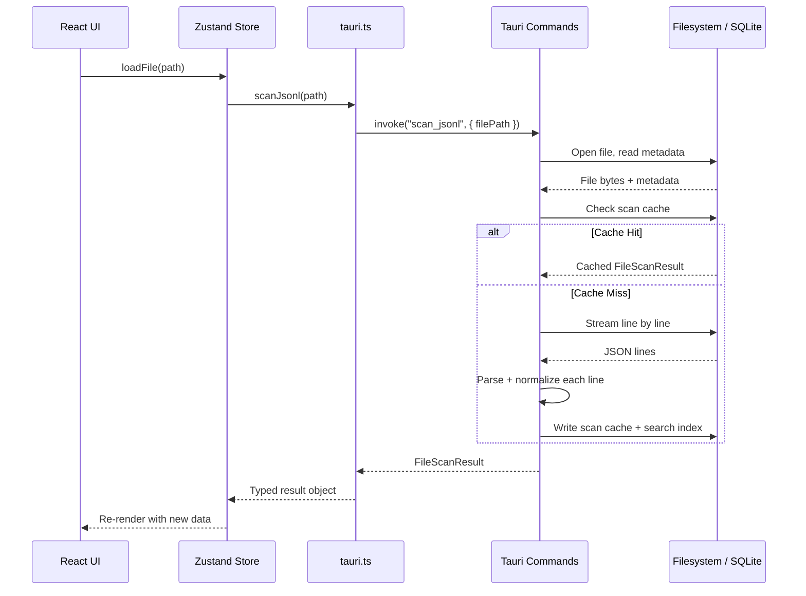
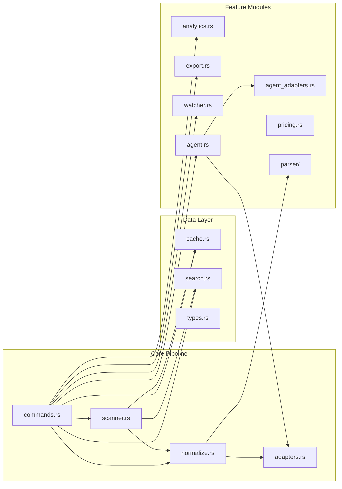
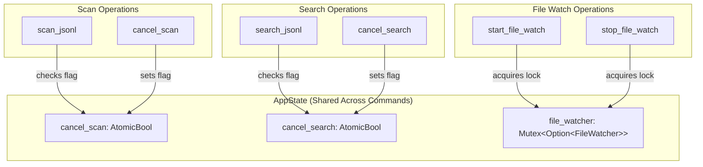
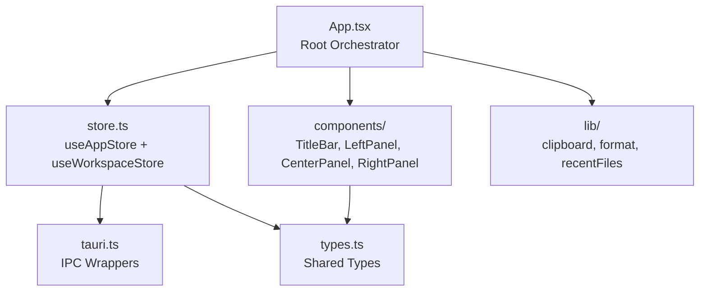
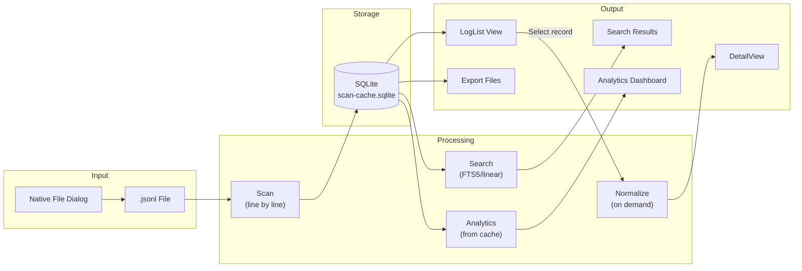
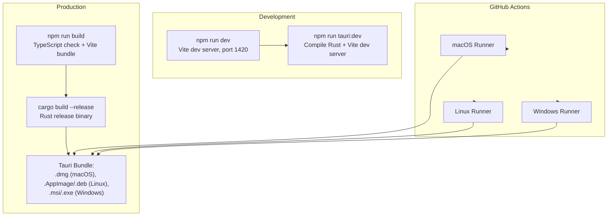

# System Architecture

PromptLens is a local-first Tauri v2 desktop application for viewing and analyzing JSONL-format LLM audit logs. It normalizes logs from OpenAI, Anthropic, Gemini, and Ollama into a unified schema. All processing happens on-device: no network calls, no telemetry.

## High-Level Architecture



## Tauri v2 IPC Boundary

The frontend and backend communicate exclusively through Tauri's `invoke()` IPC mechanism. Each backend capability is exposed as a `#[tauri::command]` function. The frontend wraps each command as a typed async function in `tauri.ts`.



### Registered Commands

The `run()` function in the backend registers 20 IPC commands:

| Command | Purpose |
|---------|---------|
| `open_file_dialog` | Native file picker for `.jsonl` files |
| `scan_jsonl` | Full scan with progress events |
| `scan_jsonl_incremental` | Append-only scan from byte offset |
| `cancel_scan` | Set cancel flag on active scan |
| `clear_scan_cache` | Delete SQLite cache file |
| `get_cache_info` | Return cache file path and existence status |
| `get_file_status` | Check file existence, size, modified time |
| `save_text_file` | Save arbitrary text via native save dialog |
| `export_records` | Export selected records in 3 formats |
| `read_record` | Normalize single record by byte offset |
| `read_agent_session` | Parse agent session JSONL |
| `read_agent_session_incremental` | Incremental agent session read |
| `detect_log_source` | Auto-detect agent log format |
| `search_jsonl` | Full-text search in 3 modes |
| `cancel_search` | Set cancel flag on active search |
| `list_system_fonts` | Enumerate system fonts via `fc-list` |
| `get_pricing_table` | Return embedded model pricing data |
| `calculate_costs` | Estimate token costs for requests |
| `start_file_watch` | Watch file for changes via `notify` |
| `stop_file_watch` | Stop active file watcher |
| `compute_analytics` | Compute analytics from cached scan data |

## Rust Module Structure



### Module Responsibilities

| Module | File | Lines | Responsibility |
|--------|------|-------|----------------|
| `commands` | `src-tauri/src/commands.rs` | ~400 | All `#[tauri::command]` handlers. Manages `AppState` (cancel flags, file watcher mutex). Delegates to specialized modules. |
| `scanner` | `src-tauri/src/scanner.rs` | ~200 | Line-by-line JSONL scanning with byte offset tracking. Emits `scan-progress` every 250 lines, `scan-chunk` every 500 lines for streaming UI updates. |
| `normalize` | `src-tauri/src/normalize.rs` | ~500 | Transforms raw provider JSON into `NormalizedCall`. Provides `summary_from_value` (lightweight extraction) and `normalize_call` (full normalization). |
| `adapters` | `src-tauri/src/adapters.rs` | ~60 | Provider auto-detection via structural JSON heuristics, and role normalization (e.g., Gemini's `model` role maps to `assistant`). |
| `search` | `src-tauri/src/search.rs` | ~250 | Three search modes: `substring`, `fts`, and `regex`. FTS5 index for fast tokenized search. Falls back to linear scan. Capped at 1000 results. |
| `cache` | `src-tauri/src/cache.rs` | ~300 | SQLite operations: 3 tables (`scan_cache`, `agent_session_cache`, `search_index`). Cache key is `(file_path, file_size, modified_timestamp)`. |
| `analytics` | `src-tauri/src/analytics.rs` | ~200 | Computes statistics (error rate, p95/p99 latency, token totals), detects issues, clusters sessions by trace ID or time window. |
| `export` | `src-tauri/src/export.rs` | ~100 | Three export formats: `raw_jsonl`, `normalized_jsonl`, `session_markdown`. |
| `watcher` | `src-tauri/src/watcher.rs` | ~80 | File system event monitoring with the `notify` crate, 500ms debounce. Emits `file-changed` event to frontend. |
| `agent` | `src-tauri/src/agent.rs` | ~150 | Builds `AgentEvent` structs and classifies event types. Links sub-agent calls to results via `tool_use_id` mapping. |
| `agent_adapters` | `src-tauri/src/agent_adapters.rs` | ~300 | Per-source adapters for Codex, Claude Code, OpenCode, and OpenClaw. Each extracts role, tool name, command, file paths from source-specific JSON. |
| `pricing` | `src-tauri/src/pricing.rs` | ~100 | Embeds `pricing.json` at compile time. Matches models by exact name then substring (longest match). Calculates per-million-token costs. |
| `parser` | `src-tauri/src/parser/image_detector.rs` | ~60 | Detects base64 images via data-URL prefix or raw base64 content sniffing using the `infer` crate. |

## AppState and Concurrency

The `AppState` struct is the central coordination point for all concurrent backend operations. It is managed by Tauri and shared across all command invocations:

```rust
// file: src-tauri/src/types.rs:9
pub(crate) struct AppState {
    pub(crate) cancel_scan: AtomicBool,
    pub(crate) cancel_search: AtomicBool,
    pub(crate) file_watcher: Mutex<Option<crate::watcher::FileWatcher>>,
}

impl Default for AppState {
    fn default() -> Self {
        Self {
            cancel_scan: AtomicBool::new(false),
            cancel_search: AtomicBool::new(false),
            file_watcher: Mutex::new(None),
        }
    }
}
```

### Why AtomicBool and Mutex?

The `AtomicBool` cancel flags use `Relaxed` ordering, which is sufficient because they are simple boolean signals checked in tight loops. Stronger ordering guarantees (like `SeqCst` or `AcqRel`) are unnecessary because:

1. The flags only transition from `false` to `true` (one-way)
2. The scanner/searcher reads it in a tight loop, so visibility latency is bounded by one iteration
3. No data depends on the flag being visible at a specific instruction boundary

The file watcher is wrapped in a `Mutex` because it gets replaced when the user opens a different file. The `Mutex` ensures `start_file_watch` and `stop_file_watch` commands do not race when accessing the watcher.



## Frontend Architecture

The React frontend uses Zustand for state management and is organized as a clear component hierarchy:



The `App` component is the sole orchestration point. It reads from both Zustand stores via stable selectors, computes derived state with `useMemo`, and passes data down as props. There are no React Context providers.

### Key Frontend Components

| Component | File | Lines | Responsibility |
|-----------|------|-------|----------------|
| `App` | `src/app/App.tsx` | ~800 | Root orchestration, keyboard shortcuts, resize, event listeners |
| `LeftPanel` | `src/app/components/LeftPanel.tsx` | ~1060 | 8 tab views: Records, Timeline, Sub-agents, Files, Traces, Sessions, Analytics, Issues |
| `CenterPanel` | `src/app/components/CenterPanel.tsx` | ~570 | Detail view: message cards, Markdown rendering, image display |
| `RightPanel` | `src/app/components/RightPanel.tsx` | ~350 | 5 tab views: Diff, Tools, Error, JSON Tree, Raw Payload |
| `TitleBar` | `src/app/components/TitleBar.tsx` | ~370 | macOS-style title bar with menus and settings |
| `Workspace` | `src/app/components/Workspace.tsx` | ~130 | Tab bar and status bar |

## Key Design Decisions

### Why a Monolithic App Component?

PromptLens uses a single `App` component as the orchestration point rather than distributing state management across many smaller components. This design choice has specific trade-offs:

**Advantages:**
- All derived computations (`filtered`, `analytics`, `issues`, `sessions`) are co-located and can share intermediate results
- No prop drilling through intermediate components that do not consume the data
- Keyboard shortcuts and resize handlers can access all state directly
- Event listener registration is centralized in a single `useEffect`

**Disadvantages:**
- The `App.tsx` file is large (~800 lines)
- Any change to orchestration logic requires modifying this file

This trade-off is intentional: PromptLens is a single-user desktop tool, not a collaborative web app. For this use case, the simplicity of a single orchestration point outweighs the benefits of component decomposition.

### Byte-Offset Indexing

Each `LogSummary` stores its `byte_offset` in the source file. This enables O(1) random access via `seek()` when a user selects a record, without needing to re-read preceding lines. See [Byte-Offset Indexing](./byte-offset-indexing.md) for details.

### SQLite + FTS5 Search

The search index is an FTS5 virtual table stored alongside the scan cache in a single SQLite database. This provides fast tokenized full-text search without external dependencies. See [Search Engine](./search-engine.md) for details.

### Incremental Scanning

Append-only file changes are detected by comparing the current file size with the cached size. New lines are scanned from the last known byte offset, and both the scan cache and search index are incrementally appended. See [Caching](./caching.md) for details.

### Provider-Agnostic Normalization

All supported LLM providers are normalized to a common `NormalizedCall` schema with typed `NormalizedContent` parts (text, image, tool_call, tool_result). The normalization pipeline uses heuristic JSON structure matching rather than explicit provider configuration. See [Provider Normalization](./provider-normalization.md) for details.

### Local-First, No Network

PromptLens makes zero network calls. The SQLite cache, pricing table (embedded at compile time via `include_str!`), and all processing are entirely local. File watching uses the OS-native `notify` crate.

### Streaming Scan Events

Large file scans send progress events every 250 lines and chunk events every 500 lines, allowing the UI to incrementally render results instead of waiting for the entire scan to complete. The `AppState` struct holds `AtomicBool` cancel flags so users can abort long-running operations.

## Data Flow Overview



## TypeScript Type Mapping

The Rust types in `types.rs` are mirrored by TypeScript types in `src/types.ts`. Tauri's `serde` serialization with `#[serde(rename_all = "camelCase")]` automatically converts Rust's `snake_case` fields to TypeScript's `camelCase`:

```rust
// file: src-tauri/src/types.rs:25
#[derive(Debug, Serialize, Deserialize, Clone)]
#[serde(rename_all = "camelCase")]
pub(crate) struct LogSummary {
    pub(crate) id: String,
    pub(crate) line_number: usize,
    pub(crate) byte_offset: u64,
    pub(crate) timestamp: Option<String>,
    pub(crate) provider: Option<String>,
    pub(crate) model: Option<String>,
    // ...
}
```

```typescript
// file: src/types.ts:3
export type LogSummary = {
  id: string;
  lineNumber: number;
  byteOffset: number;
  timestamp?: string;
  provider?: string;
  model?: string;
  // ...
};
```

| Rust (`types.rs`) | TypeScript (`types.ts`) | Key Fields |
|--------------------|-------------------------|------------|
| `LogSummary` | `LogSummary` | id, lineNumber, byteOffset, model, status, preview |
| `FileScanResult` | `FileScanResult` | filePath, summaries[], totalLines, cacheHit |
| `NormalizedCall` | `NormalizedCall` | provider, model, request, response, error, usage |
| `NormalizedMessage` | `NormalizedMessage` | role, content (NormalizedContent[]) |
| `NormalizedContent` | `NormalizedContent` | Tagged union: text, image, tool_call, tool_result |
| `SearchResult` | `SearchResult` | lineNumber, byteOffset, context |
| `SearchResponse` | `SearchResponse` | results[], truncated, cancelled, indexed |
| `RecordDetail` | `RecordDetail` | summary, normalized, raw, parseError |
| `ProgressEvent` | `ProgressEvent` | processedBytes, totalBytes, lineNumber |
| `AgentEvent` | `AgentEvent` | eventType, toolName, command, filePaths, text |
| `AgentSessionResult` | `AgentSessionResult` | events[], sessions[], subagentSessions[] |

## Build and Deployment

PromptLens uses Tauri v2's build system:



### Key Dependencies

**Rust:**

| Crate | Purpose |
|-------|---------|
| `tauri` v2 | Desktop application framework |
| `rusqlite` (bundled + fts5) | SQLite with FTS5 support |
| `serde` / `serde_json` | JSON serialization |
| `notify` | File system event monitoring |
| `rfd` | Native file dialogs |
| `regex` | Regular expression search |
| `infer` | MIME type detection for images |
| `base64` | Base64 encoding/decoding |
| `dirs` | Platform-specific data directories |
| `chrono` / `time` | Timestamp parsing |

**Frontend:**

| Package | Purpose |
|---------|---------|
| `react` | UI framework |
| `zustand` | State management |
| `@tauri-apps/api` | Tauri IPC bindings |
| `@tanstack/react-virtual` | Virtual scrolling |
| `react-markdown` | Markdown rendering |
| `lucide-react` | Icons |
| `vite` | Build tool and dev server |
