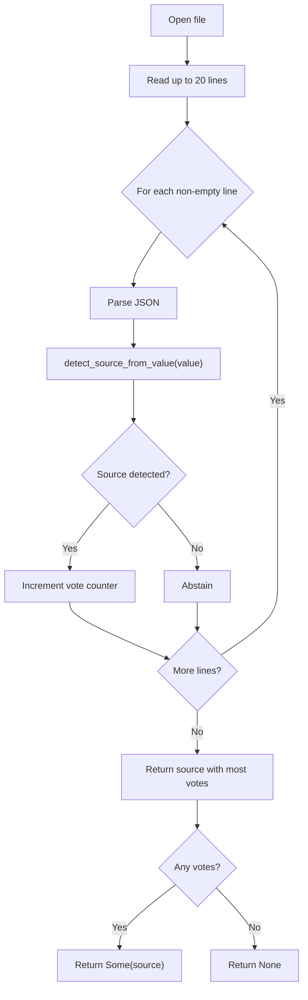
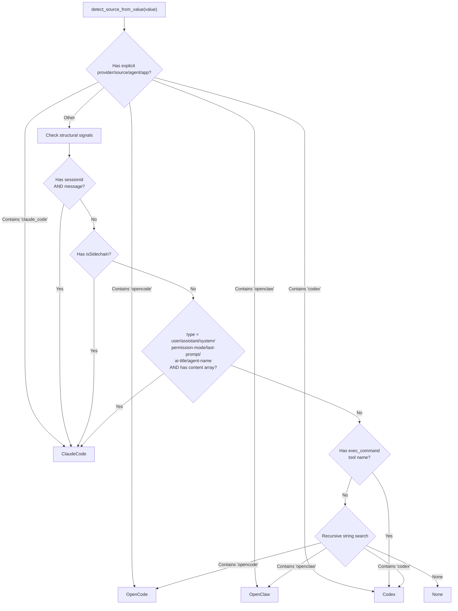
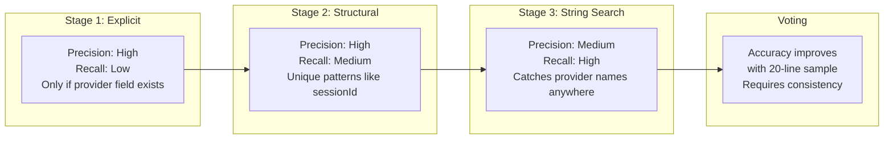

# Auto-Detection

PromptLens can automatically detect which agent tool produced a JSONL log file. The `detect_source_from_value()` function analyzes the JSON structure of individual records to identify the source. The `detect_log_source` command applies this to the first 20 lines and takes a majority vote.

## Detection Command

The `detect_log_source` Tauri command reads up to 20 lines from the file and votes on the source:

```rust
// file: src-tauri/src/commands.rs:457
fn detect_log_source(file_path: String) -> Option<String> {
    let file = match File::open(&file_path) {
        Ok(f) => f,
        Err(_) => return None,
    };
    let mut reader = BufReader::new(file);
    let mut line = String::new();
    let mut votes: HashMap<String, usize> = HashMap::new();

    for _ in 0..20 {
        line.clear();
        if reader.read_line(&mut line).unwrap_or(0) == 0 { break; }
        let trimmed = line.trim();
        if trimmed.is_empty() { continue; }
        if let Ok(value) = serde_json::from_str::<Value>(trimmed) {
            if let Some(source) = detect_source_from_value(&value) {
                *votes.entry(source.as_str().to_string()).or_insert(0) += 1;
            }
        }
    }

    votes.into_iter().max_by_key(|(_, count)| *count).map(|(source, _)| source)
}
```

### Voting Behavior



- Reads up to 20 non-empty lines
- Each line votes for one source (abstains if unrecognizable)
- The source with the most votes wins
- Returns `None` if no source is detected

## Detection Algorithm

The `detect_source_from_value()` function applies a multi-stage detection tree:



## Stage 1: Explicit Provider Fields

```rust
// file: src-tauri/src/agent.rs:328
pub(crate) fn detect_source_from_value(value: &Value) -> Option<LogSource> {
    if let Some(provider) = first_string(value, &["provider", "source", "agent", "app"]) {
        let lower = provider.to_lowercase();
        if lower.contains("claude_code") || lower.contains("claude-code") {
            return Some(LogSource::ClaudeCode);
        }
        if lower.contains("opencode") {
            return Some(LogSource::OpenCode);
        }
        if lower.contains("openclaw") || lower.contains("opwnclaw") {
            return Some(LogSource::OpenClaw);
        }
        if lower.contains("codex") {
            return Some(LogSource::Codex);
        }
    }
    // ... Stage 2
}
```

| Field Value | Detected Source |
|-------------|----------------|
| `claude_code`, `claude-code` | Claude Code |
| `opencode` | OpenCode |
| `openclaw`, `opwnclaw` | OpenClaw |
| `codex` | Codex |

## Stage 2: Structural Signals

### Claude Code Detection

```rust
// file: src-tauri/src/agent.rs:347
let has_session_id = value.get("sessionId").is_some();
let has_message = value.get("message").is_some();
let has_is_sidechain = value.get("isSidechain").is_some();
let has_type_field = value.get("type").and_then(Value::as_str);
let has_content_array = value.get("message")
    .and_then(|m| m.get("content"))
    .and_then(|c| c.as_array())
    .is_some();

if has_is_sidechain || (has_session_id && has_message) {
    return Some(LogSource::ClaudeCode);
}
if matches!(has_type_field, Some("user" | "assistant" | "system"
    | "permission-mode" | "last-prompt" | "ai-title" | "agent-name"))
    && has_content_array
{
    return Some(LogSource::ClaudeCode);
}
```

| Signal | Description |
|--------|-------------|
| `sessionId` + `message` | Claude Code's core message structure |
| `isSidechain` | Claude Code-specific sidechain flag |
| `type` = known type + `content` array | Claude Code record type with content |

### Codex Detection

```rust
// file: src-tauri/src/agent.rs:378
let has_exec_command = value.get("tool_use")
    .and_then(|t| t.get("name"))
    .and_then(Value::as_str)
    .map(|s| s == "exec_command")
    .unwrap_or(false)
    || value.get("name")
        .and_then(Value::as_str)
        .map(|s| s == "exec_command")
        .unwrap_or(false);

if has_exec_command || value_string_contains(value, "codex") {
    return Some(LogSource::Codex);
}
```

### OpenCode and OpenClaw Detection

```rust
// file: src-tauri/src/agent.rs:392
if value_string_contains(value, "opencode") {
    return Some(LogSource::OpenCode);
}
if value_string_contains(value, "openclaw") || value_string_contains(value, "opwnclaw") {
    return Some(LogSource::OpenClaw);
}
```

## String Search Strategy

The `value_string_contains()` function performs a recursive, case-insensitive search across all string values in the JSON tree:

```rust
// file: src-tauri/src/normalize.rs:626
pub(crate) fn value_string_contains(value: &Value, needle: &str) -> bool {
    match value {
        Value::String(s) => s.to_lowercase().contains(needle),
        Value::Array(items) => items.iter().any(|v| value_string_contains(v, needle)),
        Value::Object(map) => map.values().any(|v| value_string_contains(v, needle)),
        _ => false,
    }
}
```

This avoids serializing the entire JSON tree to a string just to search for a substring. The function recursively traverses all nested objects and arrays.

## LogSource Enum

```rust
// file: src-tauri/src/agent_adapters.rs:24
#[derive(Debug, Clone, Copy, PartialEq, Eq)]
pub(crate) enum LogSource {
    Audit,        // Default, no agent detected
    Codex,        // OpenAI Codex
    OpenCode,     // OpenCode
    OpenClaw,     // OpenClaw
    ClaudeCode,   // Anthropic Claude Code
    GenericAgent, // Generic agent format
}
```

### LogSource Conversions

```rust
// file: src-tauri/src/agent_adapters.rs:35
impl LogSource {
    pub(crate) fn from_option(value: Option<String>) -> Self {
        match value.as_deref().unwrap_or("audit").trim().to_lowercase().as_str() {
            "codex" => Self::Codex,
            "opencode" => Self::OpenCode,
            "openclaw" | "opwnclaw" => Self::OpenClaw,
            "claude_code" | "claude-code" | "claudecode" => Self::ClaudeCode,
            "generic_agent" | "generic-agent" | "agent" => Self::GenericAgent,
            _ => Self::Audit,
        }
    }
}
```

| Source | `as_str()` | `forced_agent_provider()` |
|--------|-----------|--------------------------|
| `Audit` | `"audit"` | `None` |
| `Codex` | `"codex"` | `Some("codex")` |
| `OpenCode` | `"opencode"` | `Some("opencode")` |
| `OpenClaw` | `"openclaw"` | `Some("openclaw")` |
| `ClaudeCode` | `"claude_code"` | `Some("claude_code")` |
| `GenericAgent` | `"generic_agent"` | `None` |

The `forced_agent_provider()` method returns the provider name that should be set on all events for this source, overriding any detected provider.

## User Override

Users can manually specify the source type via the `log_source` parameter:

```typescript
await invoke("read_agent_session", {
    filePath: "/path/to/session.jsonl",
    logSource: "claude_code",  // Override auto-detection
});
```

## Detection Accuracy



| Stage | Precision | Recall | Notes |
|-------|-----------|--------|-------|
| Explicit provider | High | Low | Only works when provider field exists |
| Structural signals | High | Medium | Unique patterns like `sessionId` + `message` |
| String search | Medium | High | Catches provider names anywhere in any field |

The voting mechanism across 20 lines further improves accuracy by requiring consistent detection across multiple records. A single anomalous line does not override the majority consensus.
