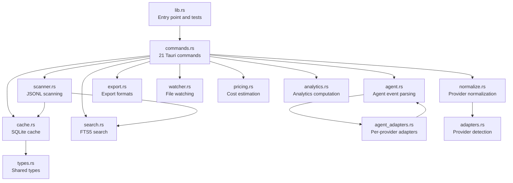
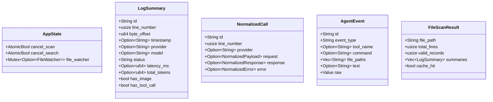
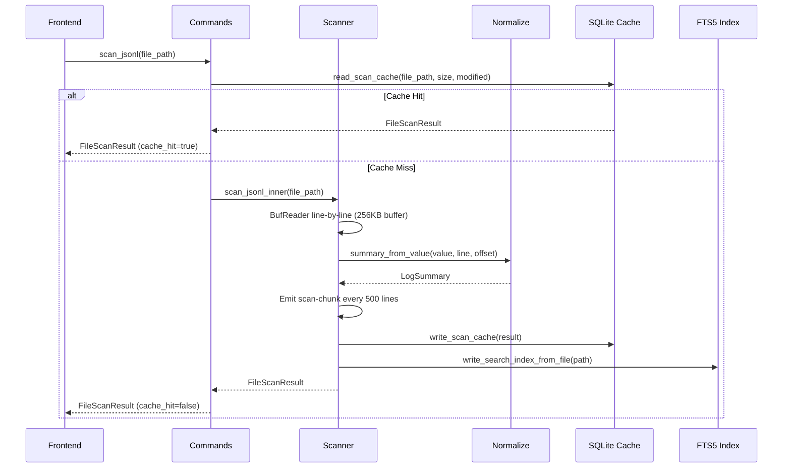

# Backend Architecture

The PromptLens backend is a Rust application built on **Tauri v2** that handles JSONL log scanning, normalization, caching, search, and agent session parsing. It communicates with the React frontend via Tauri IPC commands.

## Module Structure

The backend is organized into 14 modules under `src-tauri/src/`:



### Module Responsibilities

| Module | Size | Purpose |
|--------|------|---------|
| `lib.rs` | ~26k bytes | Entry point, 19 test cases, module declarations |
| `commands.rs` | ~20k bytes | All 21 `#[tauri::command]` functions, Tauri app builder |
| `normalize.rs` | ~22k bytes | Provider normalization, content part parsing, summary extraction |
| `agent.rs` | ~18k bytes | Agent event type detection, field extraction, source detection |
| `agent_adapters.rs` | ~17k bytes | Codex, Claude Code, OpenCode, OpenClaw adapters |
| `analytics.rs` | ~15k bytes | Analytics summaries, issue detection, session grouping |
| `search.rs` | ~9k bytes | FTS5 indexing, substring/regex/FTS search with fallback |
| `types.rs` | ~9k bytes | All shared Rust structs and enums |
| `scanner.rs` | ~8k bytes | Full and incremental JSONL scanning |
| `cache.rs` | ~8k bytes | SQLite read/write for scan and session caches |
| `pricing.rs` | ~3.5k bytes | Token cost estimation for 18 models |
| `export.rs` | ~3.6k bytes | JSONL, normalized JSONL, and Markdown export |
| `adapters.rs` | ~1.8k bytes | Provider detection heuristics and role normalization |
| `watcher.rs` | ~1.8k bytes | File change monitoring via `notify` crate |
| `parser/image_detector.rs` | ~1.7k bytes | Base64 and data-URL image detection |

## Dependencies

| Crate | Version | Purpose |
|-------|---------|---------|
| `tauri` | 2.x | Desktop app framework with IPC |
| `serde` | 1.0 | Serialization with derive macros |
| `serde_json` | 1.0 | JSON parsing and `Value` manipulation |
| `rusqlite` | 0.32 | SQLite database with built-in FTS5 |
| `notify` | 7.0 | Cross-platform file system monitoring |
| `regex` | 1.x | Regular expression search patterns |
| `base64` | 0.22 | Base64 image decoding |
| `infer` | 0.19 | File type detection from magic bytes |
| `dirs` | 6.0 | Platform-specific data directory resolution |
| `rfd` | 0.15 | Native file dialogs (open/save) |
| `time` | 0.3 | ISO 8601 / RFC 3339 timestamp parsing |
| `tempfile` | 3.x | Temporary file creation (test-only) |

## Key Types



## Application State Management

The `AppState` struct holds global mutable state managed by Tauri's dependency injection system. It is initialized via `AppState::default()` and registered via `tauri::Builder::manage()`.

```rust
// file: src-tauri/src/types.rs:9
pub(crate) struct AppState {
    pub(crate) cancel_scan: AtomicBool,
    pub(crate) cancel_search: AtomicBool,
    pub(crate) file_watcher: Mutex<Option<crate::watcher::FileWatcher>>,
}
```

| Field | Type | Purpose |
|-------|------|---------|
| `cancel_scan` | `AtomicBool` | Flag to interrupt a running scan |
| `cancel_search` | `AtomicBool` | Flag to interrupt a running search |
| `file_watcher` | `Mutex<Option<FileWatcher>>` | Active file watcher for live updates |

## Data Flow



## Command Registration

All 21 commands are registered in the `run()` function in `commands.rs`:

```rust
// file: src-tauri/src/commands.rs:592
pub fn run() {
    tauri::Builder::default()
        .manage(AppState::default())
        .invoke_handler(tauri::generate_handler![
            open_file_dialog, scan_jsonl, scan_jsonl_incremental,
            cancel_scan, clear_scan_cache, get_cache_info, get_file_status,
            save_text_file, export_records, read_record,
            read_agent_session, read_agent_session_incremental, detect_log_source,
            search_jsonl, cancel_search, list_system_fonts,
            get_pricing_table, calculate_costs,
            start_file_watch, stop_file_watch, compute_analytics
        ])
        .run(tauri::generate_context!())
        .expect("error while running PromptLens");
}
```

## Constants

| Constant | Value | Location | Purpose |
|----------|-------|----------|---------|
| `MAX_SEARCH_RESULTS` | 1000 | `types.rs:6` | Maximum search results per query |
| `CACHE_SCHEMA_VERSION` | 3 | `types.rs:7` | SQLite schema version for cache invalidation |

## Error Handling

All Tauri commands return `Result<T, String>` where the error string is displayed to the frontend user.

```mermaid
flowchart LR
    A["Command invoked"] --> B{Operation}
    B -->|Success| C["Return Ok(value)"]
    B -->|IO error| D["format!(\"Failed to ...: {err}\")"]
    B -->|Parse error| E["format!(\"Failed to parse ...: {err}\")"]
    D --> F["Return Err(String)"]
    E --> F
    F --> G["Frontend displays error toast"]
```

| Error | Source | Recovery |
|-------|--------|----------|
| `Failed to open file` | `File::open` | Check file path and permissions |
| `Failed to read line` | `BufReader::read_line` | File may be corrupted |
| `Failed to seek record` | `BufReader::seek` | Byte offset may be stale |
| `Failed to parse cache` | `serde_json::from_str` | Cache is corrupted, clear it |
| `No cached scan results` | `compute_analytics` | Scan the file first |
| `File appears to have been truncated` | `scan_jsonl_incremental` | Run a full rescan |

## Testing

The backend has 19 unit tests in `lib.rs` covering: JSONL scanning, provider normalization, image detection, agent session parsing, cache round-trip correctness, search result limits, and incremental scanning. Tests use `tempfile::NamedTempFile` to create temporary JSONL files and override the cache path via the `PROMPTLENS_CACHE_PATH` environment variable.
