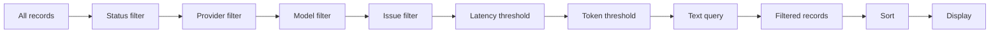

# Browsing Records

The Records tab in the left panel is the primary way to browse your JSONL log file. It displays a virtualized list of all records with filtering, sorting, and search capabilities.

## Record List

Each record card in the list shows a compact summary:

```
+--------------------------------------------------+
| [green dot] gpt-4.1                    14:32:05   |
| openai  234ms  1.2k tokens  $0.0042              |
| What is the capital of France? The capital of... |
+--------------------------------------------------+
```

### Card Elements

| Element | Description |
|---------|-------------|
| **Status dot** | Green = success, Red = error, Yellow = invalid JSON |
| **New badge** | Appears on records loaded via incremental scan or live mode |
| **Model name** | Detected model (e.g., gpt-4.1, claude-sonnet-4-20250514) |
| **Timestamp** | When the request was made |
| **Provider** | Detected provider (openai, anthropic, gemini, ollama) |
| **Latency** | Response time in milliseconds |
| **Token count** | Total tokens (prompt + completion) |
| **Cost** | Estimated cost based on pricing data (when available) |
| **Image icon** | Appears when the record contains embedded images |
| **Tool icon** | Appears when the record contains tool calls |
| **Compare icon** | Click to set this record as the diff comparison baseline |
| **Preview** | Text snippet from the first user message |

## Virtual Scrolling

The record list uses **virtual scrolling** (via `@tanstack/react-virtual`) for efficient handling of large files. Only visible rows are rendered to the DOM. The `LeftPanel` component initializes the virtualizer with an estimated row height of 74px and an overscan of 10 rows:

```tsx
// file: src/app/components/LeftPanel.tsx:303
const rowVirtualizer = useVirtualizer({
  count: items.length,
  getScrollElement: () => parentRef.current,
  estimateSize: () => 74,
  overscan: 10,
});
```

| Parameter | Value | Purpose |
|-----------|-------|---------|
| Estimated row height | 74px | Used for scroll height calculation |
| Overscan | 10 rows | Extra rows rendered above/below the viewport |

When a record is selected, the list auto-scrolls to center it:

```tsx
// file: src/app/components/LeftPanel.tsx:309
useEffect(() => {
  if (!selected) return;
  const index = items.findIndex((item) => isSameLine(item, selected));
  if (index >= 0) rowVirtualizer.scrollToIndex(index, { align: "center" });
}, [items, rowVirtualizer, selected]);
```

The `isSameLine` helper compares records by `lineNumber` and optional `byteOffset`:

```tsx
// file: src/app/analytics.ts:351
export function isSameLine(
  a: { lineNumber: number; byteOffset?: number },
  b: { lineNumber: number; byteOffset?: number } | null
) {
  return Boolean(
    b && a.lineNumber === b.lineNumber &&
    (a.byteOffset === undefined || b.byteOffset === undefined || a.byteOffset === b.byteOffset)
  );
}
```

## Filtering

The toolbar above the record list provides multiple filter controls. All filter state is managed by the `useAppStore` Zustand store (`src/app/store.ts`) and applied through a `useMemo` pipeline in the `App` component.

### Status Filter

| Option | Behavior |
|--------|----------|
| All | Shows all records (default) |
| Errors | Shows only records with `error` or `invalid_json` status |
| Success | Shows only records with `success` status |
| Images | Shows only records flagged as containing images |
| Tools | Shows only records flagged as containing tool calls |

### Provider and Model Filters

The dropdowns are populated from the current file's data. The `buildFilterOptions()` function extracts unique providers, models, and trace IDs:

```tsx
// file: src/app/analytics.ts:122
export function buildFilterOptions(items: LogSummary[]) {
  const providers = new Set<string>();
  const models = new Set<string>();
  const traces = new Set<string>();
  for (const item of items) {
    providers.add(item.provider || "unknown provider");
    models.add(item.model || "unknown model");
    if (item.traceId || item.sessionId) traces.add(item.traceId || item.sessionId || "");
  }
  return {
    providers: Array.from(providers).sort(),
    models: Array.from(models).sort(),
    traces: Array.from(traces).filter(Boolean).sort(),
  };
}
```

### Issue Filter

The issue filter button toggles issue-only mode. Issues are detected by the analytics engine using configurable thresholds based on P95 values:

```tsx
// file: src/app/analytics.ts:71
export function detectIssues(items: LogSummary[], analytics: AnalyticsSummary): IssueRecord[] {
  const latencyThreshold = Math.max(analytics.p95Latency ?? 0, 10_000);
  const tokenThreshold = Math.max(analytics.p95Tokens ?? 0, 8_000);
  return items.flatMap((summary): IssueRecord[] => {
    const issues: IssueRecord[] = [];
    if (summary.status === "invalid_json") {
      issues.push({ summary, kind: "invalid", message: summary.parseError || "Invalid JSON line", severity: "high" });
    } else if (summary.status === "error") {
      issues.push({ summary, kind: "error", message: summary.preview || "Error response", severity: "high" });
    }
    if (summary.latencyMs !== undefined && summary.latencyMs >= latencyThreshold) {
      issues.push({ summary, kind: "latency", message: `High latency: ${formatLatency(summary.latencyMs)}`, severity: "medium" });
    }
    if (summary.totalTokens !== undefined && summary.totalTokens >= tokenThreshold) {
      issues.push({ summary, kind: "tokens", message: `High token usage: ${summary.totalTokens.toLocaleString()} tokens`, severity: "medium" });
    }
    if (!summary.preview && summary.status === "success") {
      issues.push({ summary, kind: "empty", message: "Successful record has no preview text", severity: "low" });
    }
    return issues;
  });
}
```

Issues are sorted by severity (high > medium > low), then by line number:

```tsx
// file: src/app/analytics.ts:138
export function severityRank(severity: IssueRecord["severity"]) {
  if (severity === "high") return 3;
  if (severity === "medium") return 2;
  return 1;
}
```

### Threshold Filters

| Input | Effect |
|-------|--------|
| **Min ms** | Hides records with latency below this value |
| **Min tokens** | Hides records with total tokens below this value |

### Filter Pipeline

All filters are applied in combination (AND logic) in a single `useMemo` hook in `App.tsx`. A record must pass every active filter to appear in the list. The pipeline also applies text search across the model, provider, preview, timestamp, status, traceId, sessionId, and requestId fields:

```tsx
// file: src/app/App.tsx:110
const filtered = useMemo(() => {
  if (!file) return [];
  const q = query.trim().toLowerCase();
  const minLatency = Number(latencyMin);
  const minTokens = Number(tokensMin);
  return [...file.summaries]
    .filter((item) => {
      if (filter === "error" && item.status !== "error" && item.status !== "invalid_json") return false;
      if (filter === "success" && item.status !== "success") return false;
      if (filter === "image" && !item.hasImage) return false;
      if (filter === "tool" && !item.hasToolCall) return false;
      if (providerFilter && (item.provider || "unknown provider") !== providerFilter) return false;
      if (modelFilter && (item.model || "unknown model") !== modelFilter) return false;
      if (issueOnly && !issueLineSet.has(item.lineNumber)) return false;
      if (latencyMin && (!item.latencyMs || item.latencyMs < minLatency)) return false;
      if (tokensMin && (!item.totalTokens || item.totalTokens < minTokens)) return false;
      if (!q) return true;
      return [item.model, item.provider, item.preview, item.timestamp, item.status]
        .filter(Boolean)
        .some((value) => String(value).toLowerCase().includes(q));
    })
    .sort((a, b) => compareSummary(a, b, sortKey));
}, [file, filter, sortKey, query, latencyMin, tokensMin, providerFilter, modelFilter, issueOnly]);
```



## Sorting

The sort dropdown controls the order of records. The `compareSummary()` function handles all sort keys:

```tsx
// file: src/app/analytics.ts:5
export function compareSummary(a: LogSummary, b: LogSummary, key: SortKey) {
  if (key === "latency") return (b.latencyMs ?? -1) - (a.latencyMs ?? -1);
  if (key === "tokens") return (b.totalTokens ?? -1) - (a.totalTokens ?? -1);
  if (key === "model") return (a.model ?? "").localeCompare(b.model ?? "");
  if (key === "status") return a.status.localeCompare(b.status);
  return (Date.parse(b.timestamp ?? "") || b.lineNumber) - (Date.parse(a.timestamp ?? "") || a.lineNumber);
}
```

| Sort Key | Order |
|----------|-------|
| **Time** | By timestamp (default, newest first) |
| **Latency** | By response time (highest first) |
| **Tokens** | By total tokens (highest first) |
| **Model** | Alphabetical by model name |
| **Status** | Grouped by status (errors first) |

The `SortKey` type is defined alongside other UI state types:

```tsx
// file: src/app/types.ts:13
export type SortKey = "time" | "latency" | "tokens" | "model" | "status";
```

## Navigation

| Action | Method |
|--------|--------|
| Select a record | Click |
| Move up one record | Press `Arrow Up` |
| Move down one record | Press `Arrow Down` |
| Focus search box | Press `Ctrl+F` |
| Jump to search result | Click a result in the search results list |
| Set diff baseline | Click the compare icon on a record card |

Keyboard navigation is handled by the global `keydown` listener in the `App` component:

```tsx
// file: src/app/App.tsx:190
useEffect(() => {
  function onKeyDown(event: KeyboardEvent) {
    const mod = event.metaKey || event.ctrlKey;
    if (mod && event.key.toLowerCase() === "f") {
      event.preventDefault();
      app().setLeftTab("records");
      document.querySelector<HTMLInputElement>(".records-search input")?.focus();
    }
    if (event.key === "ArrowDown") {
      event.preventDefault();
      ws().moveSelection(1, filtered);
    }
    if (event.key === "ArrowUp") {
      event.preventDefault();
      ws().moveSelection(-1, filtered);
    }
  }
  window.addEventListener("keydown", onKeyDown);
  return () => window.removeEventListener("keydown", onKeyDown);
}, [filtered]);
```

## File Header

Above the tab bar, the file header shows the file name, displayed record count, valid/invalid counts, and file size:

```tsx
// file: src/app/components/LeftPanel.tsx:265
const FileHeader = memo(function FileHeader({ file, count }) {
  if (!file) return <div className="file-header muted">No file loaded</div>;
  return (
    <div className="file-header">
      <div className="file-name" title={file.filePath}>{file.fileName}</div>
      <div className="file-stats">
        {count.toLocaleString()} shown · {file.validRecords.toLocaleString()} valid ·{" "}
        {file.invalidRecords.toLocaleString()} invalid · {formatBytes(file.fileSize)}
      </div>
    </div>
  );
});
```

Example: `my-audit.log  1,234 shown · 1,200 valid · 34 invalid · 45.2 MB`

## Record Card Internals

Each record card is a `<button>` element with the `log-row` class. The virtual scroller positions each row absolutely using `transform: translateY()`:

```
button.log-row
  div.row-top
    span.status-dot.success
    span.new-badge (if new)
    span.model "gpt-4.1"
    span.time "14:32:05"
  div.row-meta
    span "openai"
    span "234ms"
    span "1.2k tokens"
    span.cost "$0.0042" (if available)
    svg (Image icon, if has images)
    svg (Wrench icon, if has tool calls)
    span.row-spacer
    span.row-compare (compare icon button)
  div.preview "What is the capital of France?..."
```

The underlying data structure for each card is the `LogSummary` type, with fields for every displayed element:

```rust
// file: src-tauri/src/types.rs:27
pub(crate) struct LogSummary {
    pub(crate) id: String,
    pub(crate) line_number: usize,
    pub(crate) byte_offset: u64,
    pub(crate) timestamp: Option<String>,
    pub(crate) provider: Option<String>,
    pub(crate) model: Option<String>,
    pub(crate) status: String,
    pub(crate) latency_ms: Option<u64>,
    pub(crate) total_tokens: Option<u64>,
    pub(crate) has_image: bool,
    pub(crate) has_tool_call: bool,
    pub(crate) preview: Option<String>,
    // ... trace_id, session_id, request_id, etc.
}
```

## Cost Estimation

When pricing data is available, each record card shows an estimated cost. The frontend sends token counts to the backend's `calculate_costs` command:

```typescript
// file: src/tauri.ts:103
export async function calculateCosts(
  requests: Array<{ model: string; prompt_tokens?: number; completion_tokens?: number }>,
): Promise<CostEstimate[]> {
  return invoke("calculate_costs", { requests });
}
```

Costs are aligned with filtered records by index in `LeftPanel`:

```tsx
// file: src/app/components/LeftPanel.tsx:126
const costMap = useMemo(() => {
  const aligned = new Map<number, CostEstimate>();
  for (let i = 0; i < Math.min(filtered.length, costEstimates.length); i++) {
    aligned.set(filtered[i].lineNumber, costEstimates[i]);
  }
  return aligned;
}, [filtered, costEstimates]);
```

## Analytics Summary

The `buildAnalytics()` function computes aggregated statistics for the current filtered set of records:

```tsx
// file: src/app/analytics.ts:52
export function buildAnalytics(items: LogSummary[]): AnalyticsSummary {
  const latencies = items.map((i) => i.latencyMs).filter((v): v is number => v !== undefined);
  const tokens = items.map((i) => i.totalTokens).filter((v): v is number => v !== undefined);
  const errors = items.filter((i) => i.status === "error" || i.status === "invalid_json").length;
  return {
    total: items.length,
    success: items.filter((i) => i.status === "success").length,
    errors,
    invalid: items.filter((i) => i.status === "invalid_json").length,
    errorRate: items.length ? (errors / items.length) * 100 : 0,
    p95Latency: percentile(latencies, 0.95),
    p99Latency: percentile(latencies, 0.99),
    totalTokens: tokens.reduce((sum, v) => sum + v, 0),
    p95Tokens: percentile(tokens, 0.95),
    topModels: topCounts(items.map((i) => i.model || "unknown model")),
    topProviders: topCounts(items.map((i) => i.provider || "unknown provider")),
  };
}
```

## Performance Notes

| Aspect | Implementation |
|--------|---------------|
| Rendering | Virtual scrolling -- only visible rows in DOM |
| Memory | Summaries are lightweight objects; full JSON loaded on demand via `read_record` |
| Filtering | Runs in `useMemo` hook; recalculated only when filter dependencies change |
| Sorting | Runs after filtering; uses `compareSummary()` per sort key |
| Selection | Tracked by line number; auto-scrolled via `scrollToIndex` |
| New records | Tracked by line number set; highlighted with CSS animation |
| Cost estimation | Computed asynchronously via backend `calculate_costs` command |
