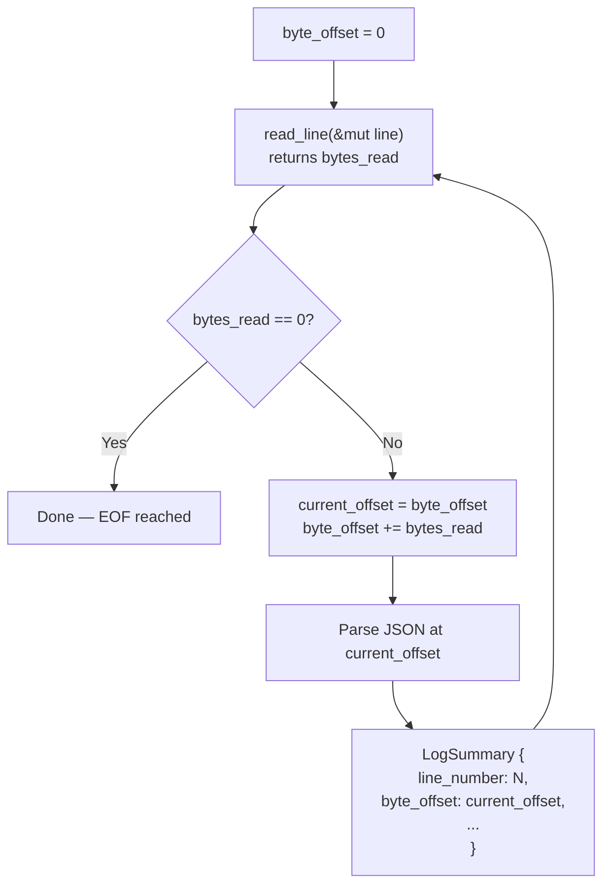
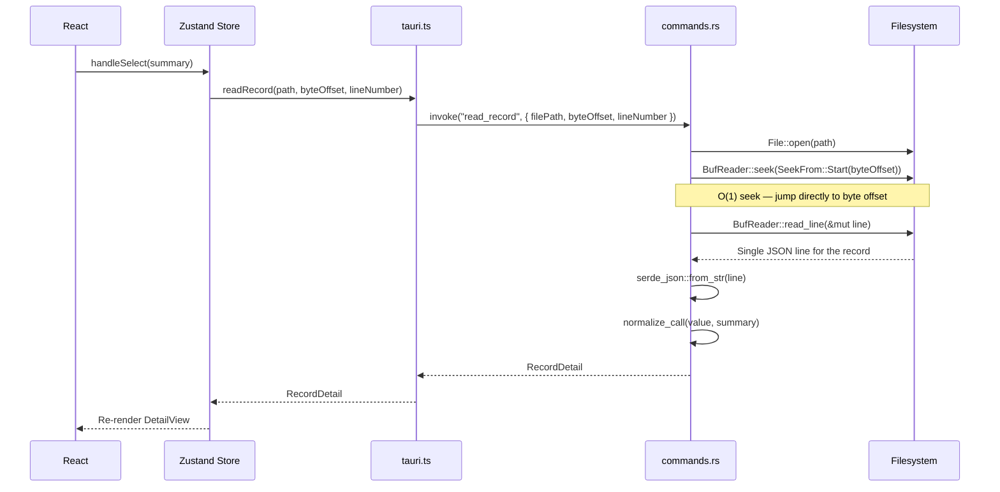
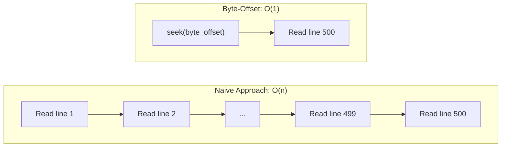
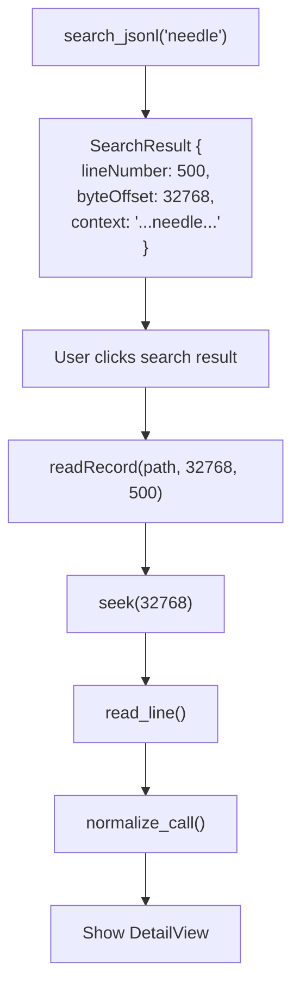
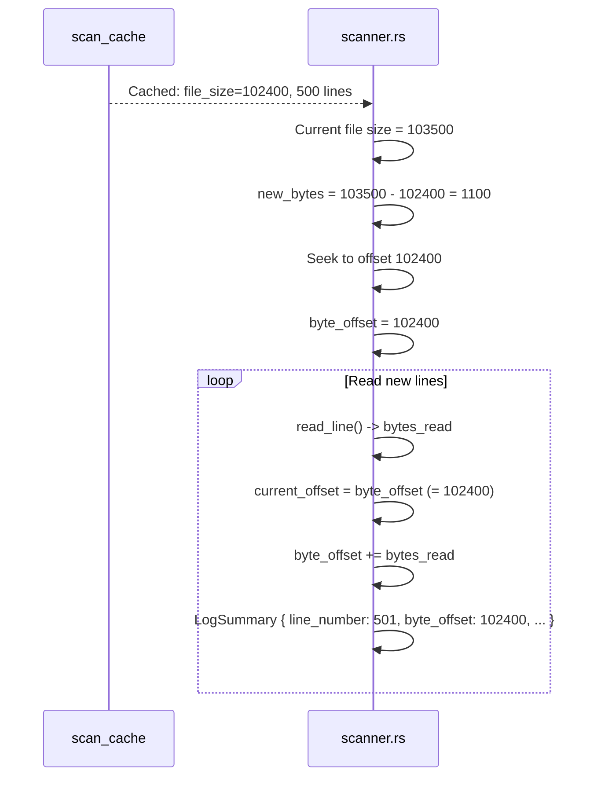

# Byte-Offset Indexing

PromptLens stores the byte offset of each JSONL record during the initial scan. This allows O(1) random access via `seek()` when a user selects a record, without reading any preceding lines. This is the core mechanism that makes the record detail view fast regardless of file size.

## JSONL File Layout

A JSONL file consists of newline-separated JSON objects. Each line is a complete, self-contained JSON value:

```
Bytes: 0                                                           1023    1070    2047
       |                                                             |       |       |
       v                                                             v       v       v
       {"id":"call_1","model":"gpt-4.1","request":{...},"response":{...}}\n{"id":"call_2",...}\n
       |<------------------- Line 1 (1024 bytes) ------------------->| |<-- Line 2 -->|

Line 1: byte_offset = 0,    length = 1024
Line 2: byte_offset = 1025, length = 975
```

During scanning, the starting byte position of each line is recorded as its `byte_offset`:

```
Line 1:  byte_offset = 0
Line 2:  byte_offset = (bytes read for line 1)
Line 3:  byte_offset = (bytes read for line 1 + bytes read for line 2)
...
Line N:  byte_offset = sum of bytes read for lines 1..N-1
```

## How the Scanner Tracks Offsets

The scanner in `scanner.rs` maintains a cumulative `byte_offset` counter that accumulates the bytes read for each line:

```rust
// file: src-tauri/src/scanner.rs:42
let mut byte_offset = 0u64;
let mut line = String::new();

loop {
    line.clear();
    let bytes_read = reader.read_line(&mut line)?;
    if bytes_read == 0 { break; }

    total_lines += 1;
    let current_offset = byte_offset;
    byte_offset += bytes_read as u64;

    // Parse the line, create LogSummary with current_offset as byte_offset
    match serde_json::from_str::<Value>(line.trim()) {
        Ok(value) => {
            valid_records += 1;
            let summary = summary_from_value(&value, total_lines, current_offset, None);
            summaries.push(summary);
        }
        Err(err) => {
            invalid_records += 1;
            let summary = invalid_line_summary(total_lines, current_offset, line.trim(), &err);
            summaries.push(summary);
        }
    }
}
```



### Offset Tracking Diagram

```
File contents (hex positions shown):
0x0000: {"id":"a","model":"gpt-4.1"}\n
0x0020: {"id":"b","model":"claude-sonnet-4"}\n
0x0045: {"id":"c","model":"gemini-2.5-pro"}\n
        ^^^^                 ^^^^                    ^^^^
        0x0000               0x0020                  0x0045

LogSummary entries:
+----------+--------------+------------------------------+
| Line     | Byte Offset  | ID                           |
+----------+--------------+------------------------------+
| 1        | 0x0000 (0)   | a                            |
| 2        | 0x0020 (32)  | b                            |
| 3        | 0x0045 (69)  | c                            |
+----------+--------------+------------------------------+
```

## O(1) Random Access via seek()

When a user clicks a record in the list, the `read_record` command uses the stored byte offset to seek directly to that line:



### Why This Is O(1)

Without byte-offset indexing, reading the 500th record from a 10,000-line file would require:

```
Naive approach: O(n) — read all 499 preceding lines to find line 500

+--------------------------------------------------------------+
| Read line 1, discard                                         |
| Read line 2, discard                                         |
| Read line 3, discard                                         |
| ...                                                          |
| Read line 499, discard                                       |
| Read line 500 — this is the one we want                      |
+--------------------------------------------------------------+
Total: 500 read_line() calls
```

With byte-offset indexing, the OS `seek()` syscall moves the file cursor directly:

```
Byte-offset approach: O(1) — seek to byte offset, read one line

+--------------------------------------------------------------+
| seek(byte_offset)  — OS moves file position directly         |
| read_line()        — read exactly one line                   |
+--------------------------------------------------------------+
Total: 1 seek + 1 read_line() call
```



### The seek() Syscall

`SeekFrom::Start(byte_offset)` in Rust translates to:

| Platform | Syscall | Description |
|----------|---------|-------------|
| Linux/macOS | `lseek(fd, offset, SEEK_SET)` | Moves file position to exact byte location |
| Windows | `SetFilePointer(handle, offset, NULL, FILE_BEGIN)` | Same functionality, Win32 API |

Both are O(1) operations because the filesystem maintains a file position pointer that can be moved to any location without reading intermediate data. The kernel's page cache may need to load the relevant disk block, but this is a single I/O operation regardless of the offset.

## seek() Implementation

The `read_record` function in the backend:

```rust
// Pseudocode from commands.rs read_record handler
fn read_record(file_path: String, byte_offset: u64, line_number: usize)
    -> Result<RecordDetail, String>
{
    let file = File::open(&file_path)?;
    let mut reader = BufReader::new(file);
    reader.seek(SeekFrom::Start(byte_offset))?;

    let mut line = String::new();
    reader.read_line(&mut line)?;

    // Parse and normalize the single line
    let value: Value = serde_json::from_str(line.trim())?;
    let summary = summary_from_value(&value, line_number, byte_offset, None);
    let normalized = normalize_call(&value, &summary);

    Ok(RecordDetail {
        summary,
        normalized: Some(normalized),
        raw: Some(value),
        parse_error: None,
    })
}
```

The `BufReader` wrapping `File` is important: it adds buffering for the `read_line()` call, making reads efficient even when a line spans multiple disk blocks.

## Byte Offsets in the Cache

The `LogSummary` struct stores the byte offset alongside other summary fields:

```rust
// file: src-tauri/src/types.rs:25
#[derive(Debug, Serialize, Deserialize, Clone)]
#[serde(rename_all = "camelCase")]
pub(crate) struct LogSummary {
    pub(crate) id: String,
    pub(crate) line_number: usize,
    pub(crate) byte_offset: u64,       // <-- byte position in source file
    pub(crate) timestamp: Option<String>,
    pub(crate) provider: Option<String>,
    pub(crate) model: Option<String>,
    // ... other fields
}
```

These summaries are serialized as JSON in the `payload` column of the `scan_cache` table. When the frontend receives a `FileScanResult`, each summary carries its byte offset, enabling instant record access.

```
scan_cache.payload (JSON, simplified):
{
  "filePath": "/path/to/audit.jsonl",
  "fileSize": 1048576,
  "summaries": [
    { "lineNumber": 1, "byteOffset": 0,     "model": "gpt-4.1", ... },
    { "lineNumber": 2, "byteOffset": 1024,   "model": "gpt-4.1", ... },
    { "lineNumber": 3, "byteOffset": 2048,   "model": "gpt-4.1", ... },
    ...
  ]
}
```

### TypeScript Side

The frontend TypeScript types mirror the Rust structs:

```typescript
// file: src/types.ts:3
export type LogSummary = {
  id: string;
  lineNumber: number;
  byteOffset: number;   // <-- used for readRecord()
  timestamp?: string;
  provider?: string;
  model?: string;
  // ...
};
```

When a user selects a record, the frontend passes `byteOffset` directly to the IPC wrapper:

```typescript
// file: src/tauri.ts:62
export async function readRecord(
  filePath: string,
  byteOffset: number,
  lineNumber: number,
): Promise<RecordDetail> {
  return invoke("read_record", { filePath, byteOffset, lineNumber });
}
```

## Byte Offsets in Search Results

Search results also carry byte offsets, so clicking a search result jumps directly to the matching record:



This means the search-to-detail flow is also O(1) -- the search result's byte offset is passed directly to `readRecord()`.

### Search Index Storage

The FTS5 search index also stores byte offsets:

```sql
-- file: src-tauri/src/search.rs:65
INSERT INTO search_index (file_path, line_number, byte_offset, content)
VALUES (?1, ?2, ?3, ?4)
```

When search results are returned, the `byte_offset` column is included:

```typescript
// file: src/types.ts:108
export type SearchResult = {
  lineNumber: number;
  byteOffset: number;   // <-- O(1) access from search results
  context: string;
};
```

## Incremental Scans and Offset Continuity

When new lines are appended to a file, the incremental scanner starts from the last known offset:



New summaries' byte offsets continue from where the previous scan ended, maintaining a consistent offset space across the entire file.

```
Original scan:
  Line 1:   offset 0
  Line 2:   offset 1024
  ...
  Line 500: offset 102399

Incremental scan (file grew by 1100 bytes):
  Line 501: offset 102400
  Line 502: offset 102900
  Line 503: offset 103400
```

### Offset Consistency Across Scans

The byte offset space is consistent because:

1. JSONL files are append-only by convention -- existing lines are never modified
2. The incremental scanner starts from `file_size` (the end of previously scanned data)
3. Each line's offset is the cumulative sum of bytes read so far

This consistency is critical: if offsets were inconsistent, the `seek()` in `read_record` would land in the middle of a JSON line, causing a parse error.

## Edge Cases

### File Truncation

If the file shrinks (size < cached offset), the incremental scanner returns an error:

```rust
if metadata.len() < from_offset {
    return Err("File appears to have been truncated. Run a full rescan.".to_string());
}
```

This prevents seeking past the end of the file, which would produce undefined behavior. The user must trigger a full rescan to rebuild the offset index.

### Empty Lines

Empty lines (containing only whitespace or newlines) are skipped during scanning. The byte offset still advances past them, but no `LogSummary` is created. This means there can be "gaps" in the byte offsets at empty lines:

```
Line 1:  {"data": "..."}\n    -> offset 0,    summary created
         \n                   -> offset 50,   skipped (empty)
Line 2:  {"data": "..."}\n    -> offset 51,   summary created
```

This is safe because `seek()` followed by `read_line()` will read the complete line regardless of what precedes it.

### Invalid JSON Lines

Lines that fail JSON parsing still get a `LogSummary` with `status: "invalid_json"`. Their byte offsets are valid and can be used to seek back to the original line content for display:

```rust
// file: src-tauri/src/scanner.rs:91
Err(err) => {
    invalid_records += 1;
    let summary = invalid_line_summary(total_lines, current_offset, trimmed, &err);
    summaries.push(summary);
}
```

### Multi-byte Characters (UTF-8)

Byte offsets count raw bytes, not characters. JSONL files containing UTF-8 multi-byte characters (e.g., Chinese, emojis) will have byte offsets that do not correspond to character positions. This is correct because:

1. `seek()` operates on bytes, not characters
2. `read_line()` reads until `\n` (byte 0x0A), which is always a single byte in UTF-8
3. JSON parsing handles UTF-8 internally

## Performance Impact

| Operation | Without Byte Offsets | With Byte Offsets |
|-----------|---------------------|-------------------|
| Read record #1 | O(1) | O(1) |
| Read record #500 | O(500) line reads | O(1) seek + 1 read |
| Read record #10000 | O(10000) line reads | O(1) seek + 1 read |
| Scan all records | O(n) | O(n) |
| View match from search | O(n) + O(n) = O(n) | O(n) + O(1) = O(n) |
| Storage overhead | 0 bytes | 8 bytes per record |

The byte-offset approach has zero overhead during scanning (it is just an incrementing counter) but makes record access constant-time regardless of file size or record position. For a 100,000-line file, when the user selects the last record, this is the difference between reading 99,999 lines versus reading 1 line.

The storage overhead is 8 bytes per record (a `u64`). For a 50,000-record file, this is 400KB of offset data -- negligible compared to the multi-megabyte JSONL file itself.

## Architecture Diagram

```mermaid
graph TD
    subgraph Scan["Scan Phase"]
        Read["Read line by line"]
        Track["Track byte_offset += bytes_read"]
        Store["Store in LogSummary.byte_offset"]
        Cache["Serialize to scan_cache.payload"]
    end

    subgraph Select["Select Phase"]
        User["User clicks record"]
        GetOffset["Get summary.byteOffset"]
        Invoke["invoke('read_record', { byteOffset })"]
        Seek["File::seek(SeekFrom::Start(offset))"]
        ReadLine["read_line() -> single JSON line"]
        Normalize["normalize_call() -> NormalizedCall"]
    end

    subgraph Search["Search Phase"]
        SearchQuery["Search for query"]
        FTSResult["FTS5 returns line_number + byte_offset"]
        ClickResult["User clicks search result"]
        SeekResult["seek(byteOffset) -> read_line()"]
    end

    Read --> Track --> Store --> Cache
    User --> GetOffset --> Invoke --> Seek --> ReadLine --> Normalize
    SearchQuery --> FTSResult --> ClickResult --> SeekResult
```


