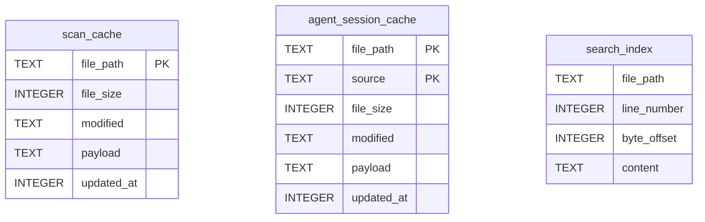
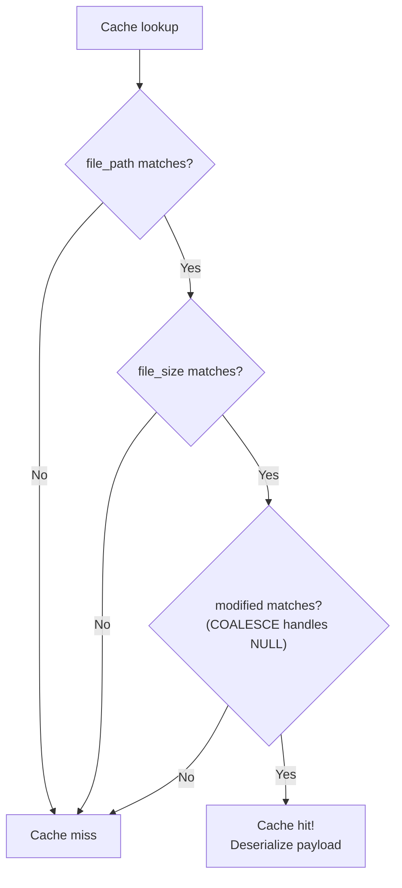
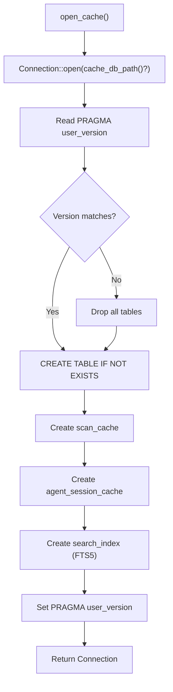

# Cache Layer

PromptLens uses a local SQLite database to cache scan results, agent session parses, and FTS5 search indexes. This avoids re-scanning large files on every application launch. The cache layer is implemented in `cache.rs` using the `rusqlite` crate with the built-in SQLite engine.

## Database Location

| Platform | Path |
|----------|------|
| Linux | `~/.local/share/PromptLens/scan-cache.sqlite` |
| macOS | `~/Library/Application Support/PromptLens/scan-cache.sqlite` |
| Windows | `C:\Users\{user}\AppData\Local\PromptLens\scan-cache.sqlite` |

```rust
// file: src-tauri/src/cache.rs:6
pub(crate) fn cache_db_path() -> Result<std::path::PathBuf, String> {
    if let Ok(path) = std::env::var("PROMPTLENS_CACHE_PATH") {
        return Ok(std::path::PathBuf::from(path));
    }
    let base = dirs::data_local_dir().or_else(dirs::data_dir)
        .ok_or_else(|| "Failed to resolve app data directory".to_string())?
        .join("PromptLens");
    fs::create_dir_all(&base)?;
    Ok(base.join("scan-cache.sqlite"))
}
```

## Schema

The database contains three tables:



### scan_cache

Stores serialized `FileScanResult` objects keyed by file identity.

| Column | Type | Description |
|--------|------|-------------|
| `file_path` | `TEXT PRIMARY KEY` | Absolute path to the JSONL file |
| `file_size` | `INTEGER NOT NULL` | File size at scan time (bytes) |
| `modified` | `TEXT` | Modification timestamp (seconds since epoch) |
| `payload` | `TEXT NOT NULL` | JSON-serialized `FileScanResult` |
| `updated_at` | `INTEGER NOT NULL` | Cache write timestamp via `strftime('%s','now')` |

### agent_session_cache

Stores serialized `AgentSessionResult` objects keyed by both file and source type. The composite primary key `(file_path, source)` allows the same file to be cached under different source interpretations.

### search_index

An FTS5 virtual table for full-text search. Only the `content` column is indexed for full-text search.

## Cache Key Matching



```sql
-- file: src-tauri/src/cache.rs:79
SELECT payload FROM scan_cache
WHERE file_path = ?1 AND file_size = ?2
  AND COALESCE(modified, '') = COALESCE(?3, '')
```

## Schema Versioning

The database tracks schema changes using `PRAGMA user_version`:

```rust
// file: src-tauri/src/types.rs:7
pub(crate) const CACHE_SCHEMA_VERSION: i64 = 3;
```

At startup, if the stored version does not match `CACHE_SCHEMA_VERSION`, all tables are dropped and recreated.

## Connection Management

Each cache operation opens a new SQLite connection via `open_cache()`:



## Cache Operations

### Read Scan Cache

```rust
// file: src-tauri/src/cache.rs:71
pub(crate) fn read_scan_cache(
    file_path: &str, file_size: u64, modified: Option<&str>,
) -> Result<Option<FileScanResult>, String>
```

### Write Scan Cache

Uses upsert to handle both new and existing entries:

```rust
// file: src-tauri/src/cache.rs:100
pub(crate) fn write_scan_cache(result: &FileScanResult) -> Result<(), String> {
    // INSERT ... ON CONFLICT(file_path) DO UPDATE SET ...
}
```

### Append Scan Cache

For incremental scans, extends the existing cache entry: reads existing payload, validates `file_size == from_offset`, extends summaries, and writes back.

## Performance Characteristics

| Aspect | Behavior |
|--------|----------|
| Connections | New connection per operation (SQLite handles pooling internally) |
| Serialization | JSON serialization of entire `FileScanResult` |
| Cache hit speed | &lt;10ms for typical files |
| Write speed | Depends on payload size; typically &lt;100ms |
