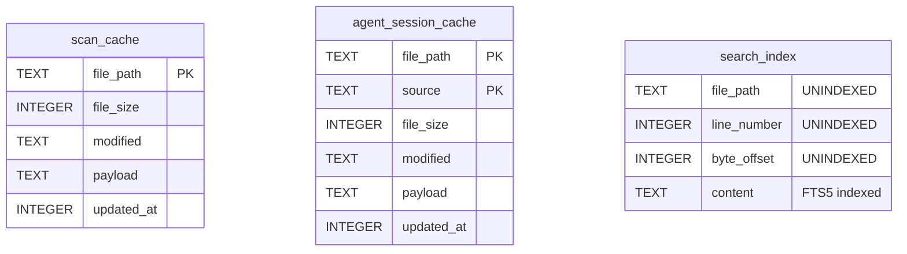
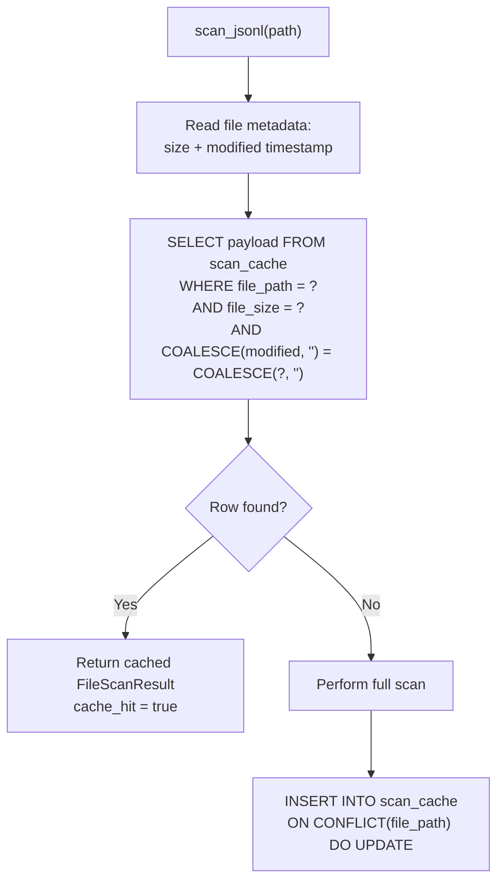
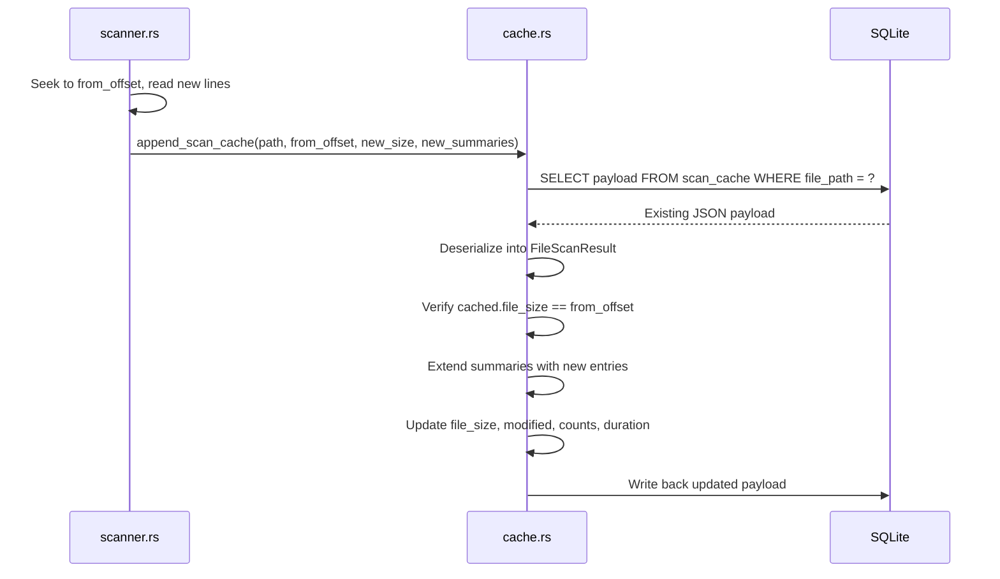
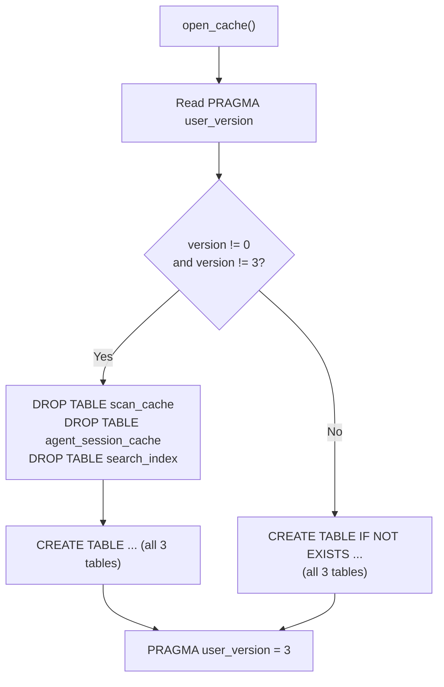
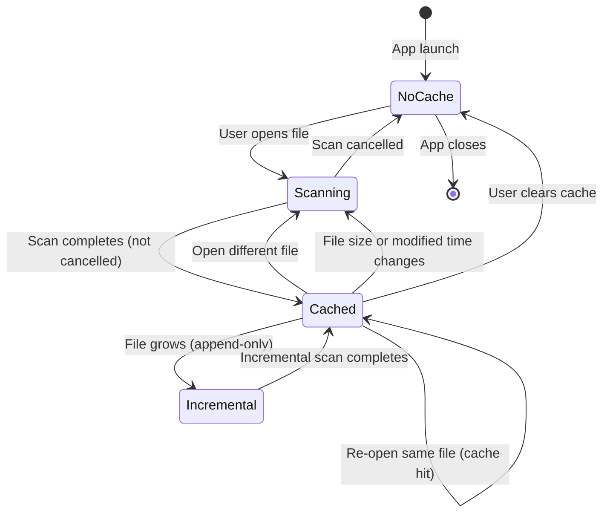

# SQLite Caching Strategy

PromptLens uses a single SQLite database to cache scan results, agent session data, and full-text search indexes. This avoids re-scanning unchanged files and provides fast search over previously scanned content.

## Database Location

| Platform | Path |
|----------|------|
| macOS | `~/Library/Application Support/PromptLens/scan-cache.sqlite` |
| Linux | `~/.local/share/PromptLens/scan-cache.sqlite` |
| Windows | `C:\Users\{user}\AppData\Local\PromptLens\scan-cache.sqlite` |

The path is resolved by the `cache_db_path` function using the `dirs` crate. It can be overridden via the `PROMPTLENS_CACHE_PATH` environment variable (useful for testing).

```rust
// file: src-tauri/src/cache.rs:6
pub(crate) fn cache_db_path() -> Result<std::path::PathBuf, String> {
    if let Ok(path) = std::env::var("PROMPTLENS_CACHE_PATH") {
        return Ok(std::path::PathBuf::from(path));
    }
    let base = dirs::data_local_dir()
        .or_else(dirs::data_dir)
        .ok_or_else(|| "Failed to resolve app data directory".to_string())?
        .join("PromptLens");
    fs::create_dir_all(&base)?;
    Ok(base.join("scan-cache.sqlite"))
}
```

## Schema

The database contains three tables:



### Table 1: `scan_cache`

Stores the complete `FileScanResult` object serialized as JSON.

```sql
CREATE TABLE IF NOT EXISTS scan_cache (
    file_path TEXT PRIMARY KEY,
    file_size INTEGER NOT NULL,
    modified TEXT,
    payload TEXT NOT NULL,
    updated_at INTEGER NOT NULL
)
```

| Column | Purpose |
|--------|---------|
| `file_path` | Absolute path to the JSONL file (primary key) |
| `file_size` | File size at scan time (bytes) |
| `modified` | File modification timestamp (Unix epoch seconds) |
| `payload` | Full `FileScanResult` serialized as JSON |
| `updated_at` | Timestamp when the cache was written |

### Table 2: `agent_session_cache`

Stores parsed agent session results, keyed by both file path and log source. The composite primary key `(file_path, source)` allows the same file to be cached under different log source interpretations.

### Table 3: `search_index` (FTS5 Virtual Table)

```sql
CREATE VIRTUAL TABLE IF NOT EXISTS search_index USING fts5(
    file_path UNINDEXED,
    line_number UNINDEXED,
    byte_offset UNINDEXED,
    content
)
```

```rust
// file: src-tauri/src/cache.rs:57
conn.execute(
    "CREATE VIRTUAL TABLE IF NOT EXISTS search_index USING fts5(
        file_path UNINDEXED,
        line_number UNINDEXED,
        byte_offset UNINDEXED,
        content
    )",
    [],
)
```

Only the `content` column is indexed by FTS5 for full-text search. The `file_path`, `line_number`, and `byte_offset` columns are stored but not indexed -- they are used for filtering and result construction.

## Cache Key and Invalidation

The cache is keyed by a triple: **(file_path, file_size, modified_timestamp)**.



### Invalidation Triggers

| Condition | Example |
|-----------|---------|
| Different file path | Opening a different file |
| File size change | New lines appended to the log |
| Modified time change | File edited since last scan |
| Cache schema version | `PRAGMA user_version` differs from `CACHE_SCHEMA_VERSION` (currently 3) |

## Cache Write Path

When a full scan completes and is not cancelled, the result is written to the cache:

```rust
// file: src-tauri/src/cache.rs:100
pub(crate) fn write_scan_cache(result: &FileScanResult) -> Result<(), String> {
    let conn = open_cache()?;
    let payload = serde_json::to_string(result)?;
    conn.execute(
        "INSERT INTO scan_cache (file_path, file_size, modified, payload, updated_at)
         VALUES (?1, ?2, ?3, ?4, strftime('%s','now'))
         ON CONFLICT(file_path) DO UPDATE SET
            file_size = excluded.file_size,
            modified = excluded.modified,
            payload = excluded.payload,
            updated_at = excluded.updated_at",
        params![result.file_path, result.file_size as i64, result.modified, payload],
    )?;
    Ok(())
}
```

The `ON CONFLICT(file_path) DO UPDATE` clause means re-scanning the same file replaces the existing cache entry.

## Incremental Cache Update

When a file grows (append-only), the cache is updated incrementally rather than rewritten:



The critical safety check is `cached.file_size != from_offset` -- if the cached size does not match the expected offset (e.g., the file was truncated or externally modified), the append is skipped and a full rescan is required.

## Schema Versioning

```rust
// file: src-tauri/src/types.rs:7
pub(crate) const CACHE_SCHEMA_VERSION: i64 = 3;
```



## Error Handling

Cache operations are designed to be non-fatal. If any cache read or write fails, the error is silently ignored and the operation falls back to a full scan or skips the cache:

| Operation | On Error | Reason |
|-----------|----------|--------|
| `read_scan_cache` | Returns `Ok(None)` | Treated as cache miss, triggers full scan |
| `write_scan_cache` | Returns `Err` (ignored by caller) | Scan result is already in memory |
| `append_scan_cache` | Returns `Ok(())` if entry does not exist | No existing data to extend |

## Cache Lifecycle



## Performance Characteristics

| Operation | Complexity | Notes |
|-----------|-----------|-------|
| Cache read (hit) | O(1) | Single SQL query by primary key |
| Full scan | O(n) | n = total lines in file |
| Incremental scan | O(delta) | delta = new lines since last scan |
| FTS5 search (indexed) | O(k) | k = matching results (typically fast) |
| Linear search (fallback) | O(n) | n = total lines, used for regex mode |
| Cache write | O(1) | Single INSERT/UPDATE |
| Search index write | O(n) | One INSERT per line |
| Search index append | O(delta) | One INSERT per new line |

### Why Store the Entire Payload as JSON?

Storing the complete `FileScanResult` as a JSON blob in a single column is a deliberate design choice. The alternatives would be:

1. **Normalized tables** -- Store `LogSummary` entries in separate tables with foreign keys. This would enable SQL queries on individual records but adds join complexity and serialization overhead.
2. **One column per field** -- Flatten all fields into columns. Breaks when the schema changes and creates a wide, sparse table.

The JSON blob approach is optimal for PromptLens because:
- The entire scan result is always read/written as a unit
- No SQL queries operate on individual `LogSummary` fields
- Schema changes only affect the Rust struct, not the SQL schema
- SQLite handles large text blobs efficiently with its built-in storage engine
