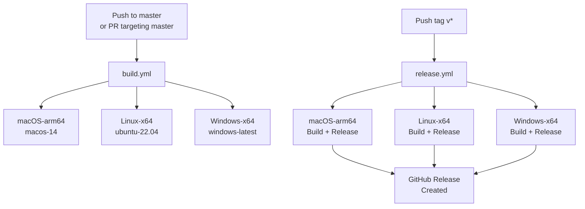
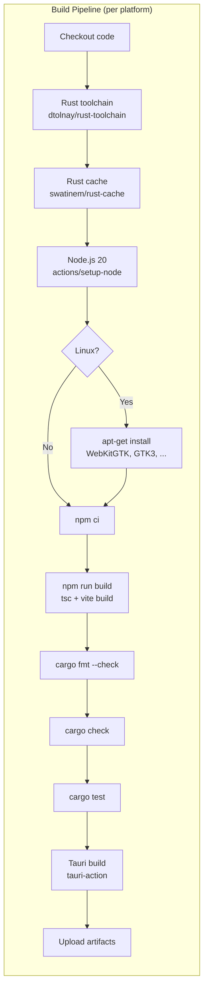

# CI/CD

PromptLens uses GitHub Actions for continuous integration and release automation. Two workflows handle all builds and releases.

## Workflow Overview





## Build Workflow (`build.yml`)

**Trigger:** Push to `master` or pull request targeting `master`.

**Concurrency:** Cancels in-progress builds per branch.

`.github/workflows/build.yml`

### Full Workflow YAML

```yaml
# file: .github/workflows/build.yml:1-12
name: Build

on:
  push:
    branches: [master]
  pull_request:
    branches: [master]

concurrency:
  group: ${{ github.workflow }}-${{ github.ref }}
  cancel-in-progress: true
```

### Build Matrix

```yaml
# file: .github/workflows/build.yml:14-30
strategy:
  fail-fast: false
  matrix:
    include:
      - platform: macos-14
        target: aarch64-apple-darwin
        bundles: dmg,app
        label: macOS-arm64
      - platform: ubuntu-22.04
        target: x86_64-unknown-linux-gnu
        bundles: deb,rpm,appimage
        label: Linux-x64
      - platform: windows-latest
        target: x86_64-pc-windows-msvc
        bundles: msi,nsis
        label: Windows-x64
```

| Platform | Runner | Target | Bundles | Label |
|----------|--------|--------|---------|-------|
| macOS | `macos-14` | `aarch64-apple-darwin` | dmg, app | macOS-arm64 |
| Linux | `ubuntu-22.04` | `x86_64-unknown-linux-gnu` | deb, rpm, appimage | Linux-x64 |
| Windows | `windows-latest` | `x86_64-pc-windows-msvc` | msi, nsis | Windows-x64 |

### Build Steps

| Step | Action/Command | Description |
|------|---------------|-------------|
| Checkout | `actions/checkout@v4` | Clone the repository |
| Rust toolchain | `dtolnay/rust-toolchain@stable` | Install Rust with target triple |
| Rust cache | `swatinem/rust-cache@v2` | Cache `src-tauri/target/` |
| Node.js setup | `actions/setup-node@v4` | Node 20, npm cache |
| Linux deps | `apt-get install` | WebKitGTK, GTK3, libayatana, librsvg, patchelf |
| Frontend install | `npm ci` | Clean install from lockfile |
| Frontend build | `npm run build` | TypeScript check + Vite production build |
| Rust checks | `cargo fmt --check && cargo check` | Formatting + type checking |
| Rust tests | `cargo test` | Run all unit tests |
| Tauri build | `tauri-apps/tauri-action@v0` | Build platform-specific installers |
| Upload artifacts | `actions/upload-artifact@v4` | Upload to GitHub Actions artifacts |

Linux dependency installation step:
```yaml
# file: .github/workflows/build.yml:54-63
- name: Install system dependencies (Linux)
  if: matrix.platform == 'ubuntu-22.04'
  run: |
    sudo apt-get update
    sudo apt-get install -y \
      libwebkit2gtk-4.1-dev \
      libgtk-3-dev \
      libayatana-appindicator3-dev \
      librsvg2-dev \
      patchelf
```

### Artifact Names

| Label | Artifact Name | Files |
|-------|--------------|-------|
| macOS-arm64 | `promptlens-macOS-arm64` | `.dmg`, `.app.tar.gz` |
| Linux-x64 | `promptlens-Linux-x64` | `.deb`, `.rpm`, `.AppImage` |
| Windows-x64 | `promptlens-Windows-x64` | `.exe`, `.msi`, `.nsis.zip` |

Upload step pattern:
```yaml
# file: .github/workflows/build.yml:88-100
- name: Upload artifacts
  uses: actions/upload-artifact@v4
  with:
    name: promptlens-${{ matrix.label }}
    path: |
      src-tauri/target/${{ matrix.target }}/release/bundle/**/*.dmg
      src-tauri/target/${{ matrix.target }}/release/bundle/**/*.app.tar.gz
      src-tauri/target/${{ matrix.target }}/release/bundle/**/*.deb
      src-tauri/target/${{ matrix.target }}/release/bundle/**/*.rpm
      src-tauri/target/${{ matrix.target }}/release/bundle/**/*.exe
      src-tauri/target/${{ matrix.target }}/release/bundle/**/*.msi
      src-tauri/target/${{ matrix.target }}/release/bundle/**/*.nsis.zip
    if-no-files-found: ignore
```

## Release Workflow (`release.yml`)

**Trigger:** Push of a tag matching `v*` (e.g., `v0.7.0`).

**Permissions:** `contents: write` (for creating GitHub releases).

`.github/workflows/release.yml`

```yaml
# file: .github/workflows/release.yml:1-9
name: Release

on:
  push:
    tags:
      - "v*"

permissions:
  contents: write
```

### Release Matrix

Same as the build matrix (macOS-arm64, Linux-x64, Windows-x64).

### Release Steps

Same as build steps, plus the release-specific Tauri action:

```yaml
# file: .github/workflows/release.yml:83-93
- name: Build and release
  uses: tauri-apps/tauri-action@v0
  env:
    GITHUB_TOKEN: ${{ secrets.GITHUB_TOKEN }}
  with:
    tagName: ${{ github.ref_name }}
    releaseName: "PromptLens ${{ github.ref_name }}"
    releaseBody: "See the assets below for platform-specific installers."
    releaseDraft: false
    prerelease: false
    args: --target ${{ matrix.target }} --bundles ${{ matrix.bundles }}
```

| Step | Description |
|------|-------------|
| Tauri build + release | `tauri-apps/tauri-action@v0` configured with `tagName`, `releaseName`, `releaseBody` |
| GitHub Release | Created automatically as non-draft, non-prerelease |

### Release Naming

| Field | Pattern | Example |
|-------|---------|---------|
| Tag | `v{version}` | `v0.7.0` |
| Release name | `PromptLens v{version}` | `PromptLens v0.7.0` |
| Body | Static: "See the assets below for platform-specific installers." | |

## Setting Up CI

### Fork / New Repository

1. Workflow definitions are in `.github/workflows/build.yml` and `.github/workflows/release.yml`
2. Build-only runs require no secrets
3. For releases, `GITHUB_TOKEN` is automatically provided by GitHub Actions

### Self-Hosted Runners

If using self-hosted runners, ensure:

| Platform | Requirements |
|----------|-------------|
| macOS | Xcode CLI tools, Rust toolchain, Node.js 20 |
| Linux | WebKitGTK 4.1 dev, GTK3 dev, libayatana, librsvg, patchelf |
| Windows | Visual Studio Build Tools with C++ workload |

## Cache Strategy

| Cache | Scope | Key | Action |
|-------|-------|-----|--------|
| Rust | Per target + Cargo.lock hash | `swatinem/rust-cache@v2` | Caches `src-tauri/target/` |
| npm | Per `package-lock.json` hash | `actions/setup-node@v4` cache | Caches `~/.npm` |

```yaml
# file: .github/workflows/build.yml:42-46
- name: Rust cache
  uses: swatinem/rust-cache@v2
  with:
    workspaces: src-tauri -> target
```

The Rust cache stores the `src-tauri/target/` directory. Incremental builds typically take 1-3 minutes after the first run.

## CI Troubleshooting

| Issue | Cause | Fix |
|-------|-------|-----|
| Linux build fails on `apt-get` | Missing system deps | Ensure the Linux deps step runs before Rust checks |
| macOS code signing error | Missing certificates | PR builds do not require code signing; only release builds attempt notarization |
| Rust cache miss | `Cargo.lock` changed | Expected; cache rebuilds automatically |
| `cargo fmt --check` fails | Code not formatted | Run `cargo fmt` locally before pushing |
| Tauri action timeout | Large binary compilation | First build may take 15-20 minutes; subsequent builds are cached |
| `npm ci` fails | Corrupted lockfile | Run `npm install` locally to regenerate `package-lock.json` |
| WebKitGTK not found | Linux deps missing | Verify the `apt-get install` step ran successfully |
| Windows linker error | MSVC not installed | Install Visual Studio Build Tools with C++ workload |

## Build Time Estimates

| Platform | First Build | Cached Build |
|----------|------------|-------------|
| macOS-arm64 | 12-18 min | 3-6 min |
| Linux-x64 | 10-15 min | 2-5 min |
| Windows-x64 | 12-18 min | 3-6 min |

First builds are slower because all Rust dependencies must be compiled from scratch. Subsequent builds benefit from the `swatinem/rust-cache` action caching the `target/` directory.

## Local CI Simulation

Verify your changes will pass CI before pushing:

```bash
# 1. Frontend checks
npm ci
npm run build

# 2. Backend checks
cd src-tauri
cargo fmt --check
cargo check
cargo test

# 3. Return to project root
cd ..
```

## Adding a New Platform Target

To add a new platform (e.g., macOS x86_64):

1. Add a new entry to the `matrix.include` array in both `build.yml` and `release.yml`
2. Specify the correct `platform` runner, `target` triple, and `bundles`
3. Add any platform-specific dependency installation steps
4. Test the workflow on a feature branch before merging

## Branch Protection

Recommended branch protection rules for `master`:

| Rule | Setting |
|------|---------|
| Require PR reviews | 1 approval |
| Require status checks | `Build . macOS-arm64`, `Build . Linux-x64`, `Build . Windows-x64` |
| Require branches up to date | Yes |
| Require linear history | Optional (recommended: squash merge) |

## Workflow File Locations

| File | Path |
|------|------|
| Build workflow | `.github/workflows/build.yml` |
| Release workflow | `.github/workflows/release.yml` |

## Secrets Reference

| Secret | Required By | Purpose |
|--------|------------|---------|
| `GITHUB_TOKEN` | Release workflow | Automatically provided by GitHub Actions; used for creating releases and uploading assets |
| `APPLE_CERTIFICATE` | Release (macOS, optional) | Base64-encoded Apple signing certificate |
| `APPLE_CERTIFICATE_PASSWORD` | Release (macOS, optional) | Certificate password |
| `APPLE_ID` | Release (macOS, optional) | Apple ID for notarization |
| `APPLE_PASSWORD` | Release (macOS, optional) | App-specific password for notarization |
| `APPLE_TEAM_ID` | Release (macOS, optional) | Apple Developer Team ID |

macOS signing secrets are optional. Without them, macOS builds produce unsigned artifacts that users can open via right-click > Open.
