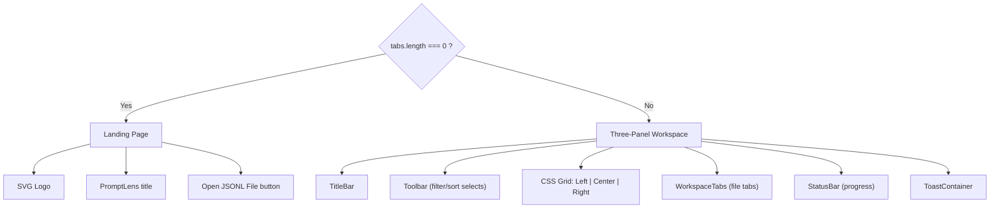
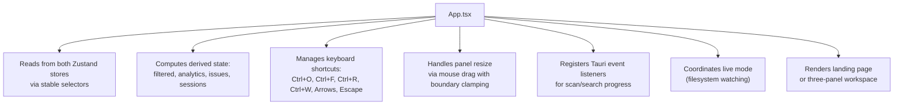
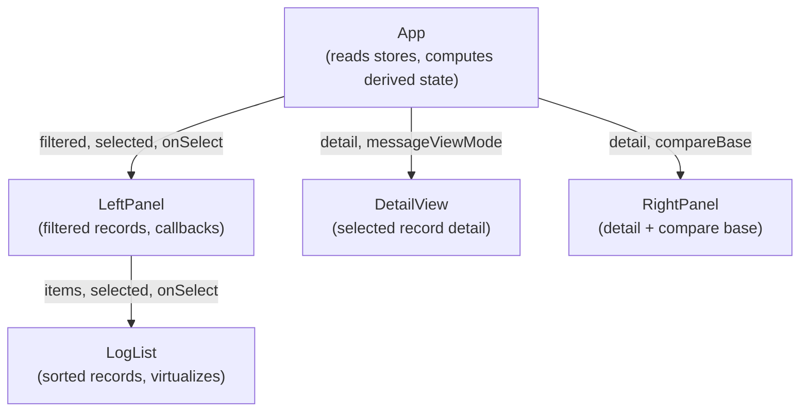
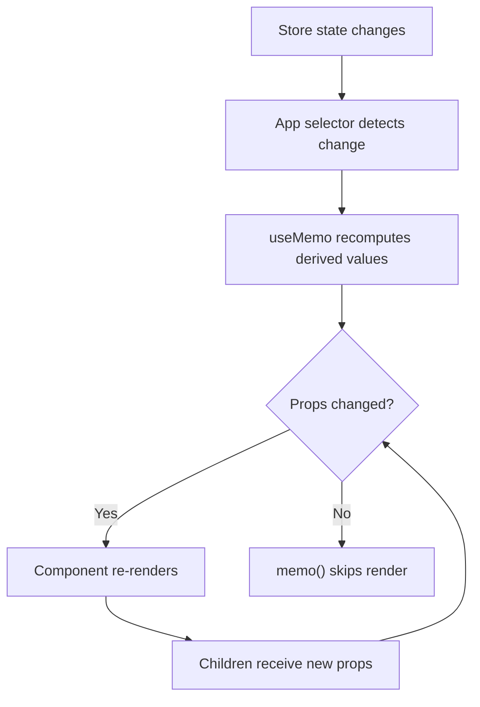

# Component Hierarchy

PromptLens uses a three-panel layout managed by a single root component. The component tree is intentionally flat -- there are no deep nesting layers and no Context Providers beyond React's built-in `StrictMode`.

## Component Tree

```mermaid
graph TD
    App["App (root)"]
    TitleBar["TitleBar"]
    Landing["Landing (no file)"]
    Toolbar["Toolbar (filters)"]
    WorkspaceGrid["Workspace Grid"]
    LeftPanel["LeftPanel"]
    CenterPanel["CenterPanel (DetailView)"]
    RightPanel["RightPanel"]
    ResizeHandleL["Resize Handle (left)"]
    ResizeHandleR["Resize Handle (right)"]
    StatusBar["StatusBar"]
    WorkspaceTabs["WorkspaceTabs"]
    ToastContainer["ToastContainer"]
    SourceConfirmDialog["SourceConfirmDialog"]
    ImagePreview["ImagePreview Modal"]

    App --> TitleBar
    App --> Landing
    App --> Toolbar
    App --> WorkspaceGrid
    App --> StatusBar
    App --> WorkspaceTabs
    App --> ToastContainer
    App --> SourceConfirmDialog
    App --> ImagePreview

    WorkspaceGrid --> LeftPanel
    WorkspaceGrid --> ResizeHandleL
    WorkspaceGrid --> CenterPanel
    WorkspaceGrid --> ResizeHandleR
    WorkspaceGrid --> RightPanel

    LeftPanel --> FileHeader["FileHeader"]
    LeftPanel --> LogList["LogList (virtual)"]
    LeftPanel --> AgentTimelineView["AgentTimelineView"]
    LeftPanel --> SubagentsView["SubagentsView"]
    LeftPanel --> AgentFilesView["AgentFilesView"]
    LeftPanel --> TraceView["TraceView"]
    LeftPanel --> SessionsView["SessionsView"]
    LeftPanel --> AnalyticsView["AnalyticsView"]
    LeftPanel --> IssuesView["IssuesView"]

    CenterPanel --> DetailView["DetailView"]
    CenterPanel --> AgentEventDetailView["AgentEventDetailView"]
    CenterPanel --> MessageCard["MessageCard"]
    CenterPanel --> RawRecordFallback["RawRecordFallback"]

    RightPanel --> DiffView["DiffView"]
    RightPanel --> ToolCallsView["ToolCallsView"]
    RightPanel --> ErrorView["ErrorView"]
    RightPanel --> JsonTreeView["JsonTreeView"]
    RightPanel --> RawPayloadView["RawPayloadView"]

    AnalyticsView --> BarChart["BarChart"]
    AnalyticsView --> Histogram["Histogram"]
```



## Rendering Modes

The `App` component renders one of two top-level layouts depending on whether a file is loaded:



When no file is open, a centered landing page is shown with the PromptLens logo and an "Open JSONL File" button. Once a file is loaded, the three-panel workspace takes over the full viewport.

### Why Two Modes?

The landing page serves as a clean entry point that avoids showing an empty workspace. It also provides a visual anchor for the app branding. The transition between modes is handled by a simple conditional in the rendering logic -- no routing library is needed because PromptLens is a single-page application with no URL-based navigation.

## Component Responsibilities

### Root Component

**`App`** (`src/app/App.tsx`)
The single orchestration point for the entire application. It:



### Title Bar

**`TitleBar`** (`src/app/components/TitleBar.tsx`)
A macOS-style draggable title bar containing:

| Feature | Implementation |
|---------|---------------|
| Window controls | Tauri window API (minimize, maximize, close) |
| App menu | Open (with source selection), Export, Settings |
| Recent files | Submenu from localStorage |
| Theme toggle | Dark/light switch |
| Settings panel | Overlay for font family, font size, code font |
| Cache info | Shows path and clear action |

### Workspace Components

**`WorkspaceTabs`** (`src/app/components/Workspace.tsx`)
Renders the session tab bar at the top of the workspace. Each tab represents a sub-agent session or the main session:

```typescript
// Each tab has:
type SessionTab = {
  id: string;           // "main" or "subagent:<agentId>"
  kind: SessionTabKind; // "main" | "subagent"
  label: string;        // Display name
  agentId?: string;     // For sub-agent tabs
  selected: LogSummary | null;
  detail: RecordDetail | null;
  compareBase: RecordDetail | null;
  searchTerm: string;
  searchResults: SearchResult[];
};
```

**`StatusBar`** (`src/app/components/Workspace.tsx`)
A thin bar at the bottom that shows a progress bar with cancel button for scan/search progress. When idle, it displays the duration of the last scan and search operations.

### Left Panel

**`LeftPanel`** (`src/app/components/LeftPanel.tsx`)
The primary navigation interface. It is a `memo`-wrapped component with a tabbed interface containing up to 8 sub-views:

| Tab | Icon | When Visible | Purpose |
|-----|------|-------------|---------|
| Records | FileText | Always | Virtualized list of all log records |
| Timeline | Terminal | Agent session | Chronological agent event timeline |
| Sub-agents | Bot | Agent session | Sub-agent tasks with status |
| Agent Files | FileText | Agent session | File activity during agent session |
| Traces | Network | Audit logs | Trace chain grouping |
| Sessions | Users | Audit logs | Heuristic session grouping |
| Analytics | BarChart3 | Always | Token usage, latency, error rate charts |
| Issues | AlertTriangle | Always | Detected anomalies and high-latency records |

```typescript
// file: src/app/components/LeftPanel.tsx:51
export const LeftPanel = memo(function LeftPanel({
  tab, setTab, source, sortOrder, setSortOrder,
  query, setQuery, file, filtered, selected,
  selectedAgentEvent, newLineNumbers, agentSession,
  sessions, issues, filterOptions,
  searchTerm, setSearchTerm, searching, searchResults,
  lastSearchIndexed, analytics, detail, costEstimates,
  onSearch, onSelect, onCompare, onJump,
  onAgentEventSelect, onTraceFilter,
  onClearSearchResults, onOpenSubagentTab,
}: { /* ... */ }) {
  // Tab switching, search input, virtual list rendering
});
```

### Center Panel

**`CenterPanel`** (`src/app/components/CenterPanel.tsx`)
The main content area that displays the full normalized record:

| Sub-component | Purpose |
|---------------|---------|
| `DetailView` | Full record with request/response tabs |
| `MessageCard` | Single message with role badge, Markdown, view mode toggle |
| `AgentEventDetailView` | Agent event details (tool name, command, files) |
| `RawRecordFallback` | Raw JSON when normalization fails |
| `KeyValue` | Reusable key-value row for metadata |
| `JsonCode` | Syntax-highlighted JSON with copy button |

### Right Panel

**`RightPanel`** (`src/app/components/RightPanel.tsx`)
A tabbed sidebar for supplementary views:

| Tab | Icon | Purpose |
|-----|------|---------|
| Diff | GitCompare | Side-by-side text diff between two records |
| Tools | Wrench | Tool calls extracted from current record |
| Error | AlertCircle | Error details with stack traces |
| JSON | Braces | Interactive JSON tree with expand/collapse |
| Raw | Code | Raw JSON payload with syntax highlighting |

### Overlay Components

**`ToastContainer`** (`src/app/components/Toast.tsx`)
Renders auto-dismissing notification toasts (5-second timeout). Supports error, success, and info variants.

**`SourceConfirmDialog`** (`src/app/components/SourceConfirmDialog.tsx`)
A modal shown when the auto-detected log source differs from the default. Lets the user confirm the detected source or pick an alternative.

**`ImagePreview`** (inline in `App.tsx`)
A fullscreen modal overlay for viewing base64/data-URL images found in records. Dismissed with Escape or clicking outside.

### Utility Components

**`BarChart`** and **`Histogram`** (`src/app/components/Charts.tsx`)
Pure rendering components for analytics visualization:

```typescript
// file: src/app/components/Charts.tsx
export function BarChart({ data, max }: { data: { label: string; value: number }[]; max: number }) {
  return (
    <div className="bar-chart">
      {data.map((d) => (
        <div key={d.label} className="bar-row">
          <span className="bar-label">{d.label}</span>
          <div className="bar-track">
            <div className="bar-fill" style={{ width: `${(d.value / max) * 100}%` }} />
          </div>
          <span className="bar-value">{d.value}</span>
        </div>
      ))}
    </div>
  );
}
```

## Props Flow

All data flows top-down from `App` through props. There are no React Context providers:



Components never directly call store actions -- they receive callback props from `App`, which delegates to the store's action methods. This makes the component tree testable and the data flow predictable.

## Component Size Reference

| Component | File | Lines | Complexity |
|-----------|------|-------|------------|
| LeftPanel | `LeftPanel.tsx` | ~1,060 | High -- 8 tab views, virtual list, search |
| CenterPanel | `CenterPanel.tsx` | ~570 | Medium -- message cards, content blocks |
| App | `App.tsx` | ~800 | High -- orchestration, effects, resize |
| TitleBar | `TitleBar.tsx` | ~370 | Medium -- menus, settings, window controls |
| RightPanel | `RightPanel.tsx` | ~350 | Medium -- 5 tab views, diff, JSON tree |
| Workspace | `Workspace.tsx` | ~130 | Low -- tabs, status bar |
| Charts | `Charts.tsx` | ~60 | Low -- BarChart, Histogram |
| SourceConfirmDialog | `SourceConfirmDialog.tsx` | ~57 | Low -- modal dialog |
| Toast | `Toast.tsx` | ~24 | Low -- notification rendering |

## Re-render Optimization

The component tree is designed to minimize re-renders through multiple layers:



| Layer | Mechanism | Notes |
|-------|-----------|-------|
| 1. Store selectors | `useAppStore((s) => s.theme)` | Re-renders only when selected value changes |
| 2. `useMemo` | `useMemo(() => buildAnalytics(filtered), [filtered])` | Does not recompute when dependencies unchanged |
| 3. `React.memo()` | `memo(function LeftPanel(...))` | Skips render when props are shallow-equal |
| 4. Callback stability | Store actions are stable references | Passing actions as props does not trigger re-renders |
| 5. Virtual scrolling | `@tanstack/react-virtual` | Only visible rows in the DOM |
