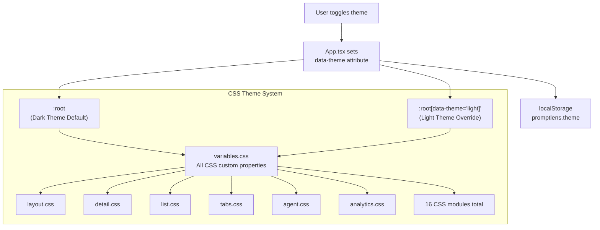
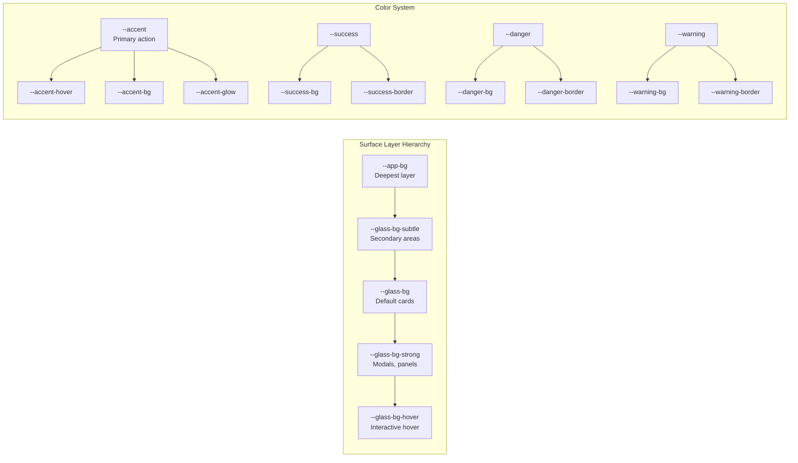

# CSS Variables

PromptLens uses CSS custom properties for its theming system. All variables are defined in `src/styles/variables.css`. The dark theme is the default (`:root`), and light theme overrides are applied via `:root[data-theme="light"]`.

## Theme Architecture





## Theme Switching

Themes are toggled by setting the `data-theme` attribute on the root element:

```typescript
document.documentElement.setAttribute("data-theme", "light");
document.documentElement.setAttribute("data-theme", "dark");
```

The current theme is persisted to localStorage under the key `promptlens.theme`.

```typescript
// file: src/app/types.ts:117
export const THEME_KEY = "promptlens.theme";
```

## Full Variable Reference

### Surface Layers

Background surfaces from back to front.

```css
/* file: src/styles/variables.css:8-13 */
:root {
  --app-bg: #0a0c10;
  --glass-bg: rgba(22, 27, 36, 0.72);
  --glass-bg-strong: rgba(28, 33, 44, 0.88);
  --glass-bg-subtle: rgba(18, 22, 30, 0.55);
  --glass-bg-hover: rgba(38, 44, 58, 0.72);
}
```

```css
/* file: src/styles/variables.css:80-85 */
:root[data-theme="light"] {
  --app-bg: #e8ecf1;
  --glass-bg: rgba(255, 255, 255, 0.55);
  --glass-bg-strong: rgba(255, 255, 255, 0.82);
  --glass-bg-subtle: rgba(255, 255, 255, 0.40);
  --glass-bg-hover: rgba(240, 244, 250, 0.65);
}
```

| Variable | Dark | Light | Purpose |
|----------|------|-------|---------|
| `--app-bg` | `#0a0c10` | `#e8ecf1` | Application background |
| `--glass-bg` | `rgba(22,27,36,0.72)` | `rgba(255,255,255,0.55)` | Glass card background |
| `--glass-bg-strong` | `rgba(28,33,44,0.88)` | `rgba(255,255,255,0.82)` | Strong glass (modals, panels) |
| `--glass-bg-subtle` | `rgba(18,22,30,0.55)` | `rgba(255,255,255,0.40)` | Subtle glass (secondary areas) |
| `--glass-bg-hover` | `rgba(38,44,58,0.72)` | `rgba(240,244,250,0.65)` | Hover state background |

### Borders and Edges

```css
/* file: src/styles/variables.css:15-18 */
:root {
  --glass-border: rgba(255, 255, 255, 0.08);
  --glass-border-strong: rgba(255, 255, 255, 0.14);
  --glass-border-accent: rgba(91, 156, 246, 0.30);
}
```

| Variable | Dark | Light | Purpose |
|----------|------|-------|---------|
| `--glass-border` | `rgba(255,255,255,0.08)` | `rgba(255,255,255,0.60)` | Default glass border |
| `--glass-border-strong` | `rgba(255,255,255,0.14)` | `rgba(0,0,0,0.08)` | Emphasized border |
| `--glass-border-accent` | `rgba(91,156,246,0.30)` | `rgba(52,120,246,0.30)` | Accent-colored border |

### Shadows and Highlights

```css
/* file: src/styles/variables.css:20-24 */
:root {
  --glass-shadow: 0 2px 20px rgba(0, 0, 0, 0.35);
  --glass-shadow-lg: 0 8px 40px rgba(0, 0, 0, 0.45);
  --glass-highlight: inset 0 1px 0 rgba(255, 255, 255, 0.05);
  --glass-inset: inset 0 1px 3px rgba(0, 0, 0, 0.2);
}
```

| Variable | Dark | Light | Purpose |
|----------|------|-------|---------|
| `--glass-shadow` | `0 2px 20px rgba(0,0,0,0.35)` | `0 2px 16px rgba(0,0,0,0.06)` | Card shadow |
| `--glass-shadow-lg` | `0 8px 40px rgba(0,0,0,0.45)` | `0 8px 32px rgba(0,0,0,0.08)` | Large shadow (modals) |
| `--glass-highlight` | `inset 0 1px 0 rgba(255,255,255,0.05)` | `inset 0 1px 0 rgba(255,255,255,0.80)` | Top edge highlight |
| `--glass-inset` | `inset 0 1px 3px rgba(0,0,0,0.2)` | `inset 0 1px 3px rgba(0,0,0,0.06)` | Inner shadow |

### Typography

```css
/* file: src/styles/variables.css:26-29 */
:root {
  --text-primary: #e8eaed;
  --text-secondary: #8b95a5;
  --text-tertiary: #5a6370;
  --text-inverse: #1d1d1f;
}
```

| Variable | Dark | Light | Purpose |
|----------|------|-------|---------|
| `--text-primary` | `#e8eaed` | `#1d1d1f` | Primary text color |
| `--text-secondary` | `#8b95a5` | `#6e7681` | Secondary text |
| `--text-tertiary` | `#5a6370` | `#9ca3af` | Tertiary/disabled text |
| `--text-inverse` | `#1d1d1f` | `#ffffff` | Text on accent backgrounds |

### Accent

```css
/* file: src/styles/variables.css:31-36 */
:root {
  --accent: #5b9cf6;
  --accent-hover: #7ab3ff;
  --accent-bg: rgba(91, 156, 246, 0.15);
  --accent-bg-strong: rgba(91, 156, 246, 0.25);
  --accent-glow: 0 0 16px rgba(91, 156, 246, 0.20);
  --surface-selected: rgba(91, 156, 246, 0.10);
}
```

| Variable | Dark | Light | Purpose |
|----------|------|-------|---------|
| `--accent` | `#5b9cf6` | `#3478f6` | Primary accent color |
| `--accent-hover` | `#7ab3ff` | `#2563eb` | Accent hover state |
| `--accent-bg` | `rgba(91,156,246,0.15)` | `rgba(52,120,246,0.10)` | Accent background tint |
| `--accent-bg-strong` | `rgba(91,156,246,0.25)` | `rgba(52,120,246,0.18)` | Stronger accent background |
| `--accent-glow` | `0 0 16px rgba(91,156,246,0.20)` | `0 0 12px rgba(52,120,246,0.15)` | Accent glow effect |
| `--surface-selected` | `rgba(91,156,246,0.10)` | `rgba(52,120,246,0.08)` | Selected item background |

### Semantic Colors

#### Success

```css
/* file: src/styles/variables.css:39-42 */
:root {
  --success: #34d399;
  --success-bg: rgba(52, 211, 153, 0.12);
  --success-border: rgba(52, 211, 153, 0.25);
}
```

| Variable | Dark | Light | Purpose |
|----------|------|-------|---------|
| `--success` | `#34d399` | `#059669` | Success text/icon |
| `--success-bg` | `rgba(52,211,153,0.12)` | `rgba(5,150,105,0.08)` | Success background |
| `--success-border` | `rgba(52,211,153,0.25)` | `rgba(5,150,105,0.20)` | Success border |

#### Danger

```css
/* file: src/styles/variables.css:43-46 */
:root {
  --danger: #f87171;
  --danger-bg: rgba(248, 113, 113, 0.10);
  --danger-border: rgba(248, 113, 113, 0.25);
  --danger-text: #fecaca;
}
```

| Variable | Dark | Light | Purpose |
|----------|------|-------|---------|
| `--danger` | `#f87171` | `#dc2626` | Danger text/icon |
| `--danger-bg` | `rgba(248,113,113,0.10)` | `rgba(220,38,38,0.06)` | Danger background |
| `--danger-border` | `rgba(248,113,113,0.25)` | `rgba(220,38,38,0.20)` | Danger border |
| `--danger-text` | `#fecaca` | `#991b1b` | Text on danger background |

#### Warning

```css
/* file: src/styles/variables.css:48-50 */
:root {
  --warning: #fbbf24;
  --warning-bg: rgba(251, 191, 36, 0.10);
  --warning-border: rgba(251, 191, 36, 0.25);
}
```

| Variable | Dark | Light | Purpose |
|----------|------|-------|---------|
| `--warning` | `#fbbf24` | `#d97706` | Warning text/icon |
| `--warning-bg` | `rgba(251,191,36,0.10)` | `rgba(217,119,6,0.08)` | Warning background |
| `--warning-border` | `rgba(251,191,36,0.25)` | `rgba(217,119,6,0.20)` | Warning border |

### Code and Syntax

```css
/* file: src/styles/variables.css:52-59 */
:root {
  --code-bg: rgba(8, 10, 15, 0.60);

  /* JSON syntax highlighting */
  --json-key: #7cc4f7;
  --json-string: #9bd88f;
  --json-number: #f8c77e;
  --json-boolean: #c69cff;
}
```

| Variable | Dark | Light | Purpose |
|----------|------|-------|---------|
| `--code-bg` | `rgba(8,10,15,0.60)` | `rgba(0,0,0,0.04)` | Code block background |
| `--json-key` | `#7cc4f7` | `#176b9e` | JSON property key |
| `--json-string` | `#9bd88f` | `#2e7d32` | JSON string value |
| `--json-number` | `#f8c77e` | `#b5651d` | JSON number value |
| `--json-boolean` | `#c69cff` | `#7b1fa2` | JSON boolean value |

### Blur Presets

```css
/* file: src/styles/variables.css:61-64 */
:root {
  --blur-sm: blur(12px);
  --blur-md: blur(20px);
  --blur-lg: blur(28px);
}
```

| Variable | Value | Purpose |
|----------|-------|---------|
| `--blur-sm` | `blur(12px)` | Small blur (cards) |
| `--blur-md` | `blur(20px)` | Medium blur (panels) |
| `--blur-lg` | `blur(28px)` | Large blur (overlays) |

### Transitions

```css
/* file: src/styles/variables.css:66 */
:root {
  --ease: cubic-bezier(0.25, 0.1, 0.25, 1);
}
```

| Variable | Value | Purpose |
|----------|-------|---------|
| `--ease` | `cubic-bezier(0.25, 0.1, 0.25, 1)` | Standard easing curve |

### Base Typography

```css
/* file: src/styles/variables.css:68-76 */
:root {
  font-family: Inter, ui-sans-serif, system-ui, -apple-system,
    BlinkMacSystemFont, "Segoe UI", sans-serif;
  -webkit-font-smoothing: antialiased;
  -moz-osx-font-smoothing: grayscale;
  background: var(--app-bg);
  color: var(--text-primary);
  font-size: 13px;
  line-height: 1.45;
}
```

| Property | Value |
|----------|-------|
| `font-family` | `Inter, ui-sans-serif, system-ui, -apple-system, BlinkMacSystemFont, "Segoe UI", sans-serif` |
| `font-size` | `13px` |
| `line-height` | `1.45` |
| `-webkit-font-smoothing` | `antialiased` |
| `-moz-osx-font-smoothing` | `grayscale` |

## CSS Module Files

The variables are consumed across these CSS modules:

| File | Purpose |
|------|---------|
| `styles/layout.css` | Main layout grid |
| `styles/titlebar.css` | Custom title bar |
| `styles/toolbar.css` | Top toolbar |
| `styles/banners.css` | Status banners |
| `styles/tabs.css` | Tab components |
| `styles/loading.css` | Loading states |
| `styles/list.css` | Record list |
| `styles/detail.css` | Detail view |
| `styles/media.css` | Image/media display |
| `styles/rightpanel.css` | Right panel |
| `styles/sessions.css` | Session views |
| `styles/agent.css` | Agent session UI |
| `styles/analytics.css` | Analytics dashboard |
| `styles/diff.css` | Diff view |
| `styles/metadata.css` | Metadata display |
| `styles/search.css` | Search UI |
| `styles/misc.css` | Miscellaneous |

## Usage Examples

```css
/* Frosted glass card */
.card {
  background: var(--glass-bg);
  border: 1px solid var(--glass-border);
  border-radius: 10px;
  box-shadow: var(--glass-shadow);
  backdrop-filter: var(--blur-md);
  color: var(--text-primary);
}

.card:hover {
  background: var(--glass-bg-hover);
  border-color: var(--glass-border-strong);
}

/* Success status badge */
.status-success {
  color: var(--success);
  background: var(--success-bg);
  border: 1px solid var(--success-border);
}

/* Danger status badge */
.status-error {
  color: var(--danger);
  background: var(--danger-bg);
  border: 1px solid var(--danger-border);
}

/* Accent button */
.btn-primary {
  background: var(--accent);
  color: var(--text-inverse);
  box-shadow: var(--accent-glow);
}

.btn-primary:hover {
  background: var(--accent-hover);
}

/* JSON syntax highlighting */
.json-key { color: var(--json-key); }
.json-string { color: var(--json-string); }
.json-number { color: var(--json-number); }
.json-boolean { color: var(--json-boolean); }
```

## Adding a New Theme

To add a third theme (e.g., "high-contrast"):

1. Add a new selector in `variables.css`:
   ```css
   :root[data-theme="high-contrast"] {
     --app-bg: #000000;
     --text-primary: #ffffff;
     /* ... other overrides ... */
   }
   ```
2. Add the theme option to the `Theme` type in `src/app/types.ts`
3. Update the theme toggle logic in `App.tsx`

## Design System Principles

| Principle | Description |
|-----------|-------------|
| Frosted glass | Surfaces use semi-transparent backgrounds with blur for a frosted glass effect |
| Layered depth | Multiple opacity levels create visual hierarchy (subtle, default, strong) |
| Semantic colors | Success/danger/warning have consistent text, background, and border variants |
| Accent consistency | One accent color (`--accent`) used throughout with hover/active/glow variants |
| Dark-first | Dark theme is the default; light theme overrides are additive |

## Font Stacks

The app uses system font stacks for maximum compatibility and native feel:

```
Inter, ui-sans-serif, system-ui, -apple-system, BlinkMacSystemFont, "Segoe UI", sans-serif
```

Code blocks use a monospace font stack:

```
ui-monospace, SFMono-Regular, Menlo, Consolas, monospace
```

Both are customizable via the `AppSettings` type and the settings panel in the UI:

```typescript
// file: src/app/types.ts:156-160
export const DEFAULT_SETTINGS: AppSettings = {
  fontFamily: 'Inter, ui-sans-serif, system-ui, -apple-system, BlinkMacSystemFont, "Segoe UI", sans-serif',
  fontSize: 13,
  codeFontFamily: "ui-monospace, SFMono-Regular, Menlo, Consolas, monospace",
};
```
