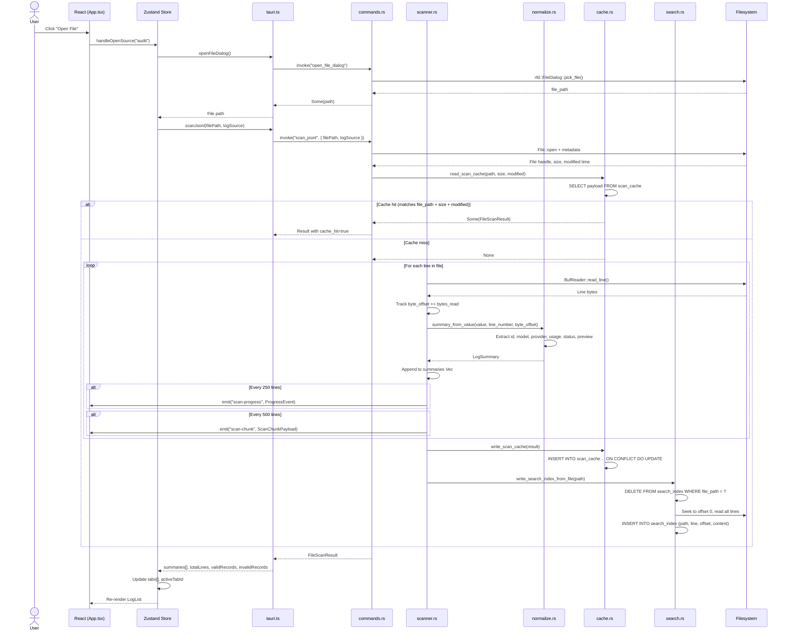
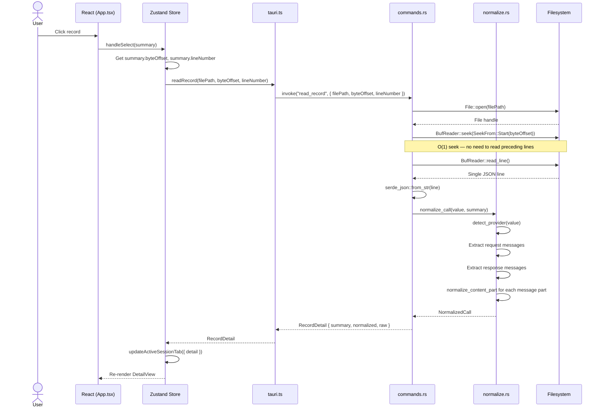
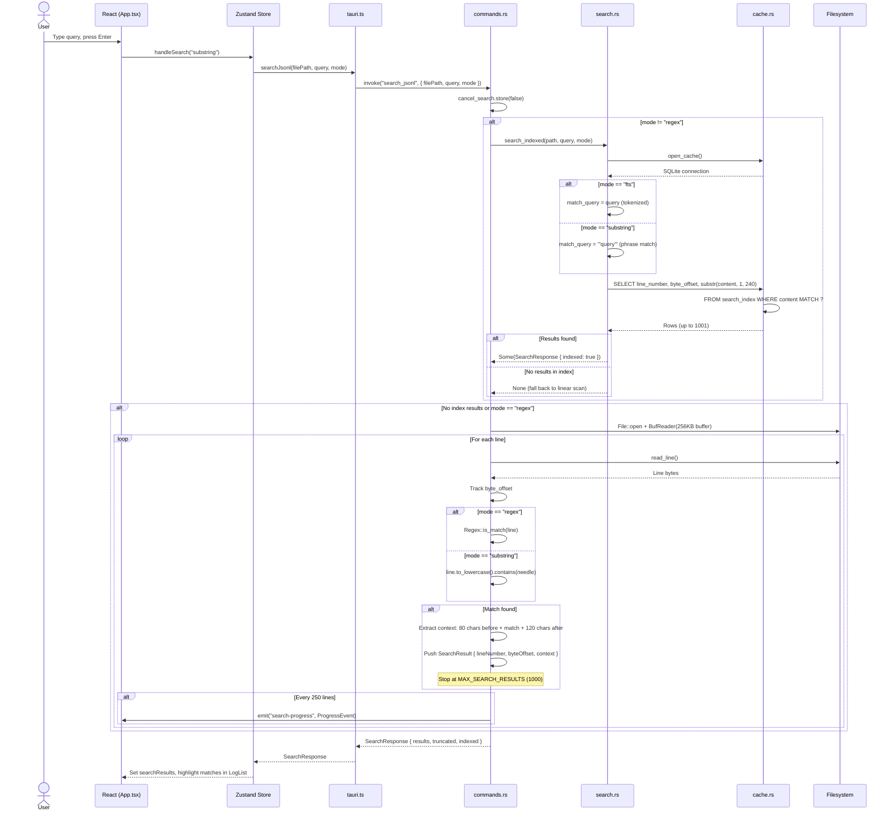
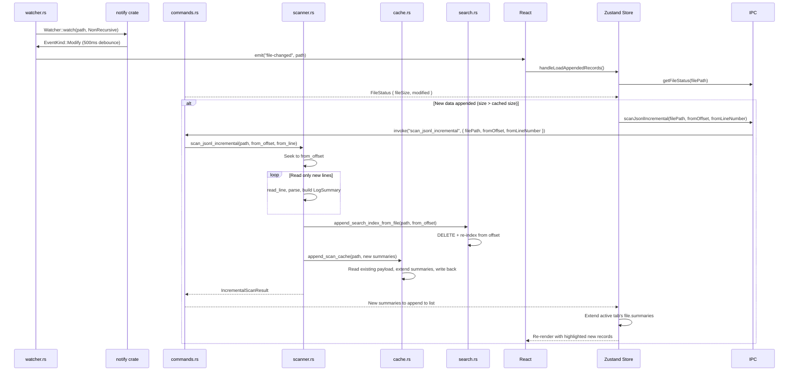

# Data Flow

This document traces four major user-initiated flows through the PromptLens technology stack using Mermaid sequence diagrams. Each flow shows the exact IPC calls, Rust functions, and storage interactions involved.

## Flow 1: Opening a File

The user opens a `.jsonl` file through the native file dialog. The backend scans the file line by line, builds `LogSummary` entries with byte offsets, writes the scan cache and FTS5 search index, and returns the complete result.



### Scan Progress Events

During a full scan, the backend emits two types of Tauri events:

```rust
// file: src-tauri/src/scanner.rs:66
if total_lines == 1 || total_lines.is_multiple_of(250) {
    if let Some(app) = app {
        let _ = app.emit("scan-progress", ProgressEvent {
            processed_bytes: byte_offset,
            total_bytes: metadata.len(),
            line_number: total_lines,
        });
    }
}
```

| Event | Frequency | Payload | Purpose |
|-------|-----------|---------|---------|
| `scan-progress` | Every 250 lines | `{ processedBytes, totalBytes, lineNumber }` | Progress bar update |
| `scan-chunk` | Every 500 lines | `{ filePath, summaries[], lineFrom, lineTo }` | Incremental list rendering |

### Cancellation

Users can cancel an active scan by invoking `cancel_scan`. This sets an `AtomicBool` flag that the scanner checks on each read loop iteration:

```rust
// file: src-tauri/src/scanner.rs:49
if cancel_flag.is_some_and(|flag| flag.load(Ordering::Relaxed)) {
    cancelled = true;
    break;
}
```

## Flow 2: Selecting a Record (Read Record)

When a user clicks a record in the list, the backend seeks directly to the stored byte offset and reads a single line. This is an O(1) operation regardless of where the record is in the file.



### On-Demand Normalization

Normalization happens only when the user selects a record, not during the initial scan. The scan phase extracts only the lightweight `LogSummary` (id, model, provider, tokens, preview). The full `NormalizedCall` (with messages, content parts, tool calls, and errors) is computed on-demand from the raw JSON read via the byte offset.

## Flow 3: Search

The user enters a query in the search bar. The backend uses the FTS5 index for `substring` and `fts` modes, falling back to a linear scan if the index is unavailable. The `regex` mode always uses a linear scan.



### Search Modes

| Mode | Index Used | Query Style | Performance | Use Case |
|------|-----------|-------------|-------------|----------|
| `substring` | FTS5 | Phrase match (`"query"`) | Fast (indexed) | Finding exact phrases |
| `fts` | FTS5 | Tokenized match | Fast (indexed) | Word-based search |
| `regex` | None | Compiled `Regex` pattern | Slower (linear) | Complex pattern matching |

## Flow 4: Incremental Scan (File Watching)

When a file is being actively written to (e.g., live audit logs), the file watcher detects changes and triggers an incremental scan from the last known byte offset.



### Incremental vs Full Scan

| Aspect | Full Scan | Incremental Scan |
|--------|-----------|------------------|
| Trigger | Initial file open | Watcher detects file change |
| Starting offset | 0 | Last known `file_size` from cache |
| Lines scanned | All lines | Only new lines |
| Cache operation | `write_scan_cache` (overwrite) | `append_scan_cache` (extend) |
| Search index | `write_search_index_from_file` | `append_search_index_from_file` |
| Speed | O(n), n = total lines | O(delta), delta = new lines |
