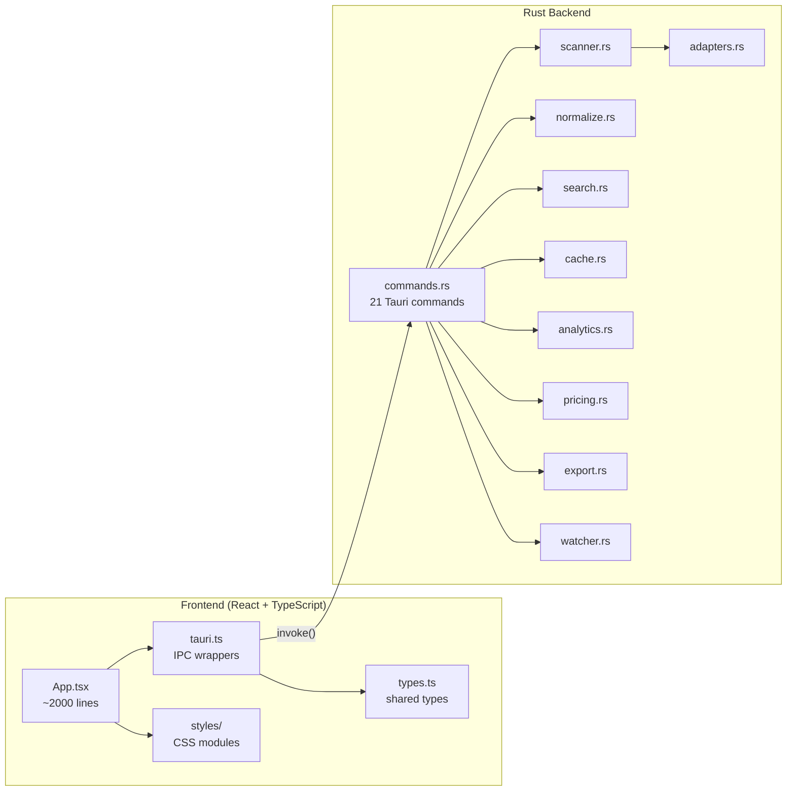
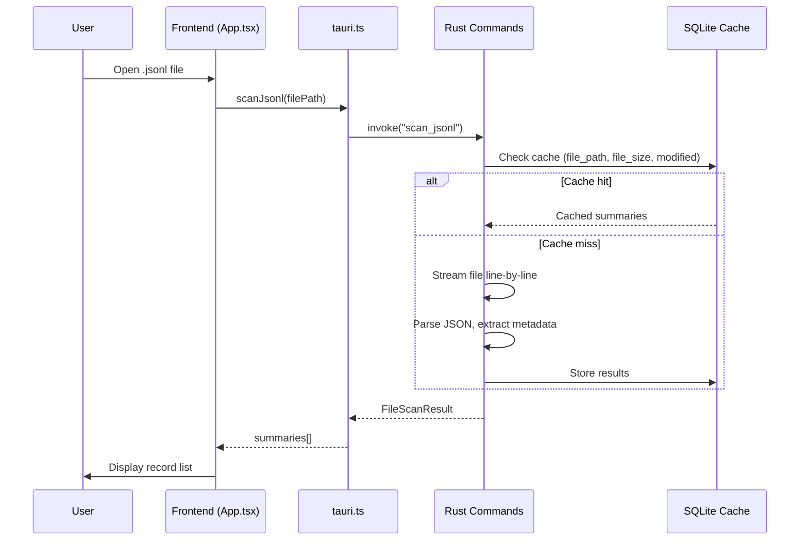
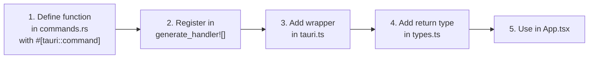

# Development Guide

This guide covers everything you need to build, run, and debug PromptLens from source. PromptLens is a Tauri v2 desktop application with a React + TypeScript frontend and a Rust backend, communicating via Tauri IPC commands.

## Architecture Overview





## Prerequisites

| Tool          | Minimum Version | Purpose                              |
|---------------|-----------------|--------------------------------------|
| Node.js       | 18+ (20 recommended) | Frontend build and dev server  |
| npm           | 9+              | Package management                   |
| Rust          | 1.70+           | Backend compilation                  |
| Cargo         | Ships with Rust | Rust package manager                 |
| Xcode CLI     | Latest          | macOS: Apple SDK and linker          |
| WebKitGTK     | 4.1             | Linux: Tauri webview runtime         |
| MSVC          | Latest          | Windows: Visual Studio Build Tools   |

### Platform-Specific Dependencies

**macOS**
```bash
xcode-select --install
```

**Linux (Ubuntu/Debian)**
```bash
sudo apt-get update
sudo apt-get install -y \
  libwebkit2gtk-4.1-dev \
  libgtk-3-dev \
  libayatana-appindicator3-dev \
  librsvg2-dev \
  patchelf
```
{/* file: .github/workflows/build.yml:57-63 */}

**Windows**

Install Visual Studio Build Tools with the "Desktop development with C++" workload.

## Quick Setup

```bash
# Clone the repository
git clone https://github.com/XUranus/promptlens.git
cd promptlens

# Install frontend dependencies
npm install

# Run the full desktop app (compiles Rust + starts Vite)
npm run tauri:dev
```

## Command Reference

### Frontend Commands

| Command              | Description                                      |
|----------------------|--------------------------------------------------|
| `npm run dev`        | Start Vite frontend dev server only (port 1420)  |
| `npm run tauri:dev`  | Full Tauri desktop app (Rust + Vite)             |
| `npm run build`      | Type-check and build production frontend (`tsc && vite build`) |
| `npm run test`       | Run Vitest tests once (`vitest run`)             |
| `npm run test:watch` | Run Vitest in watch mode                         |
| `npm run sample:large` | Generate large JSONL sample for testing        |

The `build` script in `package.json` runs TypeScript compilation before Vite:
```json
// file: package.json:7-14
{
  "scripts": {
    "dev": "vite",
    "build": "tsc && vite build",
    "preview": "vite preview",
    "tauri": "tauri",
    "tauri:dev": "tauri dev",
    "test": "vitest run",
    "test:watch": "vitest"
  }
}
```

### Backend Commands (run from `src-tauri/`)

| Command                | Description                      |
|------------------------|----------------------------------|
| `cargo fmt --check`    | Verify Rust formatting           |
| `cargo check`          | Type-check Rust code             |
| `cargo test`           | Run all Rust unit tests          |
| `cargo clippy`         | Rust linting                     |
| `cargo build --release` | Build optimized release binary  |
| `cargo tauri build`    | Build full Tauri app with installers |

## Project Structure

```
promptlens/
  src/                    # Frontend (React + TypeScript)
    app/
      App.tsx             # Main UI component (~2000 lines)
      types.ts            # App-level types (Filter, WorkspaceTab, etc.)
      analytics.test.ts   # Analytics unit tests
      storage.test.ts     # Storage unit tests
    lib/
      format.ts           # Formatting utilities
      format.test.ts      # Formatting unit tests
    types.ts              # Shared types (LogSummary, NormalizedCall, etc.)
    tauri.ts              # Tauri IPC wrappers (21 functions)
    styles/
      variables.css       # CSS custom properties (dark/light theme)
      layout.css          # Main layout grid
      detail.css          # Detail view
      list.css            # Record list
      ...                 # 16 CSS module files total
  src-tauri/
    src/
      lib.rs              # Tauri entry + tests
      commands.rs         # All 21 #[tauri::command] functions
      adapters.rs         # Provider detection heuristics
      normalize.rs        # Normalization pipeline
      scanner.rs          # JSONL scanner (byte-offset indexing)
      search.rs           # FTS5 search engine
      cache.rs            # SQLite cache layer
      analytics.rs        # Analytics computation
      pricing.rs          # Cost calculation engine
      types.rs            # Rust types (with serde annotations)
      export.rs           # Export logic (JSONL, Markdown)
      watcher.rs          # File watcher (using notify crate)
    fixtures/             # Test fixture JSON files
    pricing.json          # Model pricing data (18 models)
    Cargo.toml            # Rust dependencies
  package.json            # Node dependencies
  .github/workflows/
    build.yml             # CI build workflow
    release.yml           # Release workflow
```

## Debugging

### Frontend Debugging

The Vite dev server runs on port 1420. Use browser DevTools (right-click inside the Tauri window, or use the debuggable webview opened by `tauri:dev`).

```bash
# Start frontend only for fast iteration
npm run dev
# Open http://localhost:1420 in a browser
```

### Backend Debugging

Run unit tests with output using `cargo test`:

```bash
cd src-tauri
cargo test -- --nocapture
```

Run specific tests by name:

```bash
cargo test scan_jsonl_tracks
cargo test normalizes_provider
cargo test adapters::tests
cargo test pricing::tests
```

### Environment Variables

| Variable               | Purpose                              |
|------------------------|--------------------------------------|
| `PROMPTLENS_CACHE_PATH` | Override SQLite cache file location (useful for testing) |

This environment variable is read at runtime to determine the cache file path:
```rust
// Conceptual usage in src-tauri/src/cache.rs
fn cache_path() -> PathBuf {
    if let Ok(custom) = std::env::var("PROMPTLENS_CACHE_PATH") {
        return PathBuf::from(custom);
    }
    // Fall back to platform data directory
    dirs::data_dir()
        .unwrap_or_else(|| PathBuf::from("."))
        .join("promptlens")
        .join("cache.db")
}
```

### Tauri DevTools

When running `npm run tauri:dev`, press `Ctrl+Shift+I` (Windows/Linux) or `Cmd+Option+I` (macOS) to open the webview DevTools.

### Logging

Tauri logs are written to the system log. On macOS, use Console.app. On Linux, check `journalctl`. On Windows, use Event Viewer.

## Common Workflows

### Adding a New Tauri Command



1. Define the command function with `#[tauri::command]` in `src-tauri/src/commands.rs`
2. Register it in the `tauri::generate_handler![]` macro
3. Add a TypeScript wrapper in `src/tauri.ts`
4. Add the return type in `src/types.ts`

Example TypeScript IPC wrapper:
```typescript
// file: src/tauri.ts:21-23
export async function scanJsonl(
  filePath: string,
  logSource: LogSource = "audit"
): Promise<FileScanResult> {
  return invoke("scan_jsonl", { filePath, logSource });
}
```

### Adding a New CSS Variable

1. Define the variable under `:root` (dark theme) in `src/styles/variables.css`
2. Add a light mode override under `:root[data-theme="light"]`
3. Reference it in the relevant CSS module in `src/styles/`

```css
/* file: src/styles/variables.css:5-13 */
:root {
  --app-bg: #0a0c10;
  --glass-bg: rgba(22, 27, 36, 0.72);
  --glass-bg-strong: rgba(28, 33, 44, 0.88);
  /* ... */
}

:root[data-theme="light"] {
  --app-bg: #e8ecf1;
  --glass-bg: rgba(255, 255, 255, 0.55);
  /* ... */
}
```

### Modifying the Pricing Table

1. Edit `src-tauri/pricing.json` to add new model entries
2. The pricing table is loaded at startup via `include_str!`
3. Add tests in `src-tauri/src/pricing.rs` if the model requires special matching

```rust
// file: src-tauri/src/pricing.rs:21
const PRICING_JSON: &str = include_str!("../pricing.json");
```

## Troubleshooting

| Issue | Solution |
|-------|----------|
| `cargo build` fails on Linux | Install WebKitGTK dev packages (see Prerequisites) |
| `npm run tauri:dev` hangs | Make sure port 1420 is not in use by another process |
| Cache errors | Run `npm run tauri:dev` and clear the cache from the UI, or delete the SQLite file |
| Font rendering issues | Check system fonts with `fc-list` on Linux |
| Tauri recompilation is slow | First build takes 30-60 seconds; incremental changes are faster |
| `npm ci` fails | Delete `node_modules/` and `package-lock.json`, then run `npm install` |

## Code Style

### Rust

- Formatting is enforced by `rustfmt` (run `cargo fmt`)
- Linting via `clippy` (run `cargo clippy`)
- All structs use `#[serde(rename_all = "camelCase")]` for JSON interop
- Internal types use `pub(crate)` visibility

```rust
// file: src-tauri/src/types.rs:25-27
#[derive(Debug, Serialize, Deserialize, Clone)]
#[serde(rename_all = "camelCase")]
pub(crate) struct LogSummary {
    pub(crate) id: String,
    pub(crate) line_number: usize,
    pub(crate) byte_offset: u64,
    // ...
}
```

### TypeScript

- No formatter or linter is currently configured
- Follow existing patterns: function components, hooks, early returns
- Type definitions in `src/types.ts` (shared) and `src/app/types.ts` (UI)
- Tauri IPC wrappers in `src/tauri.ts`

### CSS

- All styles are CSS modules in `src/styles/`
- Use CSS custom properties from `variables.css` for all colors and spacing
- Avoid inline styles; prefer class-based styling

## Architecture Decisions

| Decision | Rationale |
|----------|-----------|
| Byte-offset indexing | O(1) random access to any record in a JSONL file |
| SQLite + FTS5 | Local-first cache and full-text search with no external dependencies |
| Incremental scanning | Detects append-only changes without full rescan |
| Provider normalization | All LLM providers unified to a common `NormalizedCall` schema |
| Monolithic frontend | Single `App.tsx` file co-locates all UI logic |
| Static pricing table | Compile-time included pricing data avoids network calls |
| `include_str!` for pricing | Pricing JSON is compiled into the binary; no runtime file I/O |
| `AtomicBool` for cancellation | Lock-free scan/search operation cancellation flags |
