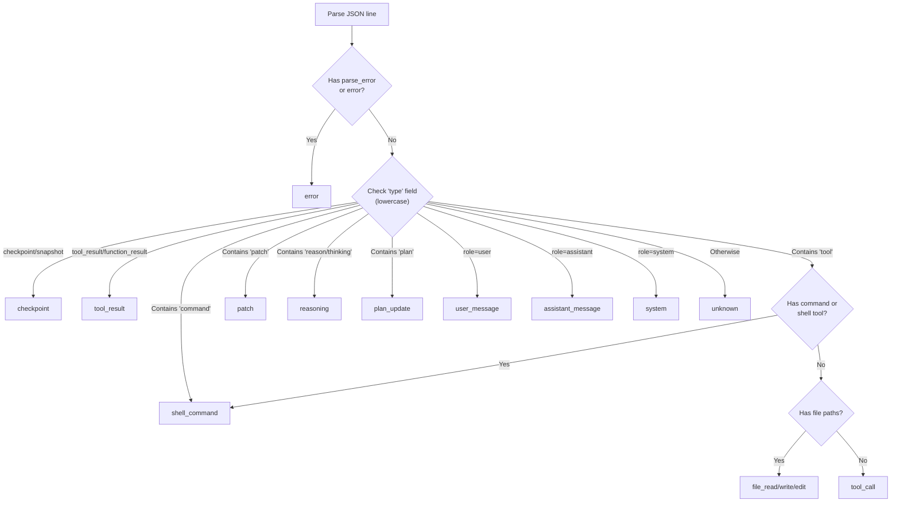
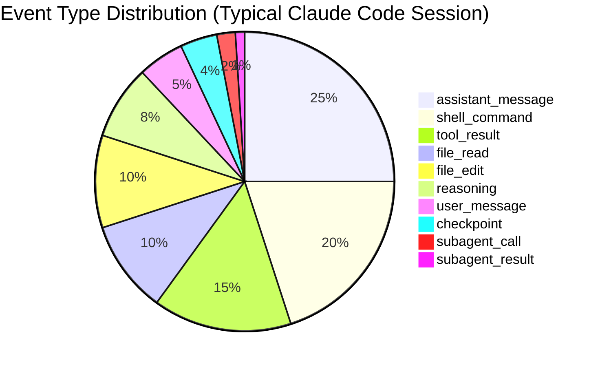
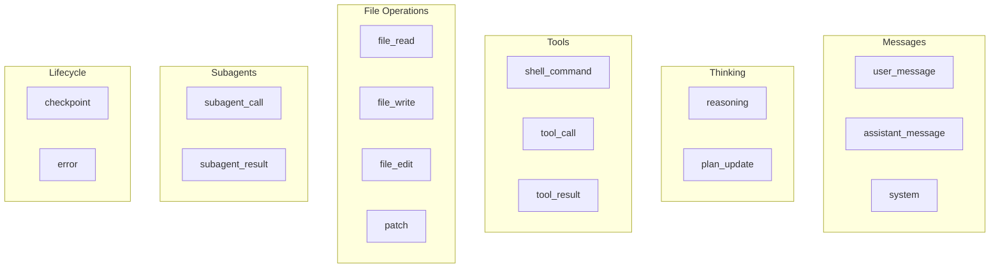

# Event Types

PromptLens classifies agent session events into 16 types. Each type has a distinct visual representation in the UI and specific fields that are populated. The event type is determined by a combination of adapter-specific logic and a generic fallback detection tree.

## Full Event Type Reference

| # | Event Type | Icon | Description | Key Fields |
|---|------------|------|-------------|------------|
| 1 | `user_message` | User | User input to the agent | `role`, `text` |
| 2 | `assistant_message` | Bot | Agent's text response | `role`, `text` |
| 3 | `system` | Gear | System or developer message | `role`, `text`, `status` |
| 4 | `reasoning` | Brain | Agent's thinking/reasoning step | `text` |
| 5 | `shell_command` | Terminal | Shell or terminal command | `command`, `tool_name` |
| 6 | `tool_result` | Check | Result of a tool call | `tool_name`, `text`, `is_error` |
| 7 | `tool_call` | Wrench | Generic tool invocation | `tool_name`, `tool_use_id` |
| 8 | `file_read` | Eye | File read operation | `file_paths` |
| 9 | `file_write` | Pencil | File write/create operation | `file_paths` |
| 10 | `file_edit` | Edit | File edit/modify operation | `file_paths` |
| 11 | `patch` | Diff | Diff/patch applied to a file | `file_paths` |
| 12 | `subagent_call` | Branch | Subagent (Task/Agent) invoked | `subagent_type`, `subagent_description`, `tool_use_id` |
| 13 | `subagent_result` | Merge | Subagent task completed | `subagent_type`, `subagent_description`, `text` |
| 14 | `checkpoint` | Flag | Session state checkpoint | `status` |
| 15 | `plan_update` | List | Agent's plan update | `text` |
| 16 | `error` | Alert | Parse or execution error | `text`, `is_error` |

The `AgentEvent` struct contains all possible fields for any event type:

```rust
// file: src-tauri/src/types.rs:150
pub(crate) struct AgentEvent {
    pub(crate) id: String,
    pub(crate) line_number: usize,
    pub(crate) byte_offset: u64,
    pub(crate) timestamp: Option<String>,
    pub(crate) session_id: Option<String>,
    pub(crate) turn_id: Option<String>,
    pub(crate) parent_id: Option<String>,
    pub(crate) role: Option<String>,
    pub(crate) event_type: String,
    pub(crate) provider: Option<String>,
    pub(crate) model: Option<String>,
    pub(crate) tool_name: Option<String>,
    pub(crate) tool_use_id: Option<String>,
    pub(crate) subagent_type: Option<String>,
    pub(crate) subagent_description: Option<String>,
    pub(crate) subagent_prompt: Option<String>,
    pub(crate) command: Option<String>,
    pub(crate) file_paths: Vec<String>,
    pub(crate) status: Option<String>,
    pub(crate) duration_ms: Option<u64>,
    pub(crate) input_tokens: Option<u64>,
    pub(crate) output_tokens: Option<u64>,
    pub(crate) is_error: bool,
    pub(crate) tool_result_content: Option<Value>,
    pub(crate) is_sidechain: bool,
    pub(crate) agent_id: Option<String>,
    pub(crate) preview: Option<String>,
    pub(crate) text: Option<String>,
    pub(crate) raw: Value,
}
```

## Event Type Detection

The primary detection happens in `detect_agent_event_type()` in `agent.rs`. The detection tree examines the JSON structure and `type` field to classify events:



Each source adapter (Claude Code, Codex, OpenCode, OpenClaw) may override or refine the detection via its own `adapt_agent_event()` function before the generic detection runs.

## Detailed Examples

### 1. user_message

```json
{
  "type": "user",
  "sessionId": "session-1",
  "message": {
    "role": "user",
    "content": [{ "type": "text", "text": "Fix the bug in the login form" }]
  }
}
```

**Extracted:** `role: "user"`, `text: "Fix the bug in the login form"`, `event_type: "user_message"`

### 2. assistant_message

```json
{
  "type": "assistant",
  "sessionId": "session-1",
  "message": {
    "role": "assistant",
    "content": [{ "type": "text", "text": "I'll investigate the login form." }]
  }
}
```

**Extracted:** `role: "assistant"`, `text: "I'll investigate..."`, `event_type: "assistant_message"`

### 3. system

```json
{
  "type": "system",
  "sessionId": "session-1",
  "subtype": "init",
  "content": "Session initialized with permissions: read, write"
}
```

**Extracted:** `role: "system"`, `status: "init"`, `event_type: "system"`

### 4. reasoning

**Codex format:**
```json
{"type": "reasoning", "summary": "Need to inspect the form component"}
```

**Claude Code format:**
```json
{
  "type": "assistant",
  "message": {
    "role": "assistant",
    "content": [{"type": "thinking", "thinking": "Let me look at the form..."}]
  }
}
```

**Extracted:** `text` (reasoning content), `event_type: "reasoning"`

### 5. shell_command

**Codex format:**
```json
{"type": "function_call", "tool_name": "exec_command", "arguments": "{\"cmd\": \"grep -r 'validate' src/\"}"}
```

**Claude Code format:**
```json
{
  "message": {"content": [{"type": "tool_use", "name": "Bash", "input": {"command": "grep -r 'validate' src/"}}]}
}
```

**Extracted:** `command: "grep -r 'validate' src/"`, `tool_name: "Bash"`, `event_type: "shell_command"`

### 6. tool_result

```json
{
  "message": {"content": [{"type": "tool_result", "tool_use_id": "toolu_123", "content": "Found 3 matches"}]}
}
```

**Extracted:** `tool_use_id: "toolu_123"`, `text: "Found 3 matches"`, `event_type: "tool_result"`

Note: If this `tool_use_id` matches a previously seen `subagent_call`, the event type is upgraded to `subagent_result` (see [Subagent Sessions](./subagent-sessions.md)).

### 7. tool_call

A generic tool call that is not a shell command or file operation.

```json
{"type": "tool_call", "name": "web_search", "input": {"query": "react form validation"}}
```

**Extracted:** `tool_name: "web_search"`, `event_type: "tool_call"`

### 8-10. file_read, file_write, file_edit

```json
{
  "message": {"content": [{"type": "tool_use", "name": "Read", "input": {"file_path": "src/LoginForm.tsx"}}]}
}
```

**Extracted:** `file_paths: ["src/LoginForm.tsx"]`, `tool_name: "Read"`, `event_type: "file_read"`

The file operation subtype (`file_read`, `file_write`, `file_edit`) is distinguished by tool name during adapter-specific processing:

| Tool Name Pattern | Event Type |
|-------------------|------------|
| `Read`, `read_file` | `file_read` |
| `Write`, `write_file`, `create_file` | `file_write` |
| `Edit`, `edit_file`, `MultiEdit` | `file_edit` |

### 11. patch

**Codex format:**
```json
{"type": "patch_apply_end", "path": "src/form.tsx", "diff": "@@ -10,6 +10,8 @@"}
```

**Extracted:** `file_paths: ["src/form.tsx"]`, `event_type: "patch"`

### 12. subagent_call

```json
{
  "message": {"content": [{"type": "tool_use", "id": "toolu_sub_1", "name": "Task", "input": {
    "subagent_type": "explorer",
    "description": "Find all validation functions",
    "prompt": "Search the codebase for form validation logic"
  }}]}
}
```

**Extracted:** `tool_use_id: "toolu_sub_1"`, `subagent_type: "explorer"`, `event_type: "subagent_call"`

### 13. subagent_result

Created by upgrading a `tool_result` when its `tool_use_id` matches a `subagent_call`:

```json
{
  "message": {"content": [{"type": "tool_result", "tool_use_id": "toolu_sub_1", "content": "Found validation in src/validate.ts"}]}
}
```

**Extracted:** `tool_use_id: "toolu_sub_1"`, `subagent_type: "explorer"` (copied from call), `event_type: "subagent_result"`

### 14. checkpoint

```json
{"type": "task_started", "id": "ckpt-1"}
{"type": "file-history-snapshot"}
```

### 15. plan_update

```json
{"type": "plan", "content": "1. Read the form\n2. Fix validation\n3. Add tests"}
```

### 16. error

```json
{"parse_error": "invalid JSON at position 42", "raw": "not valid json{"}
```

Error events are generated when a JSON line fails to parse. The raw text is preserved for debugging:

```rust
// file: src-tauri/src/commands.rs:290
let value = match serde_json::from_str::<Value>(trimmed) {
    Ok(value) => value,
    Err(err) => json!({
        "parse_error": err.to_string(),
        "raw": trimmed,
    }),
};
```

## Event Type Labels in UI

The frontend maps event types to human-readable labels for display:

```tsx
// file: src/app/analytics.ts:327
export function agentEventTypeLabel(type: string) {
  const labels: Record<string, string> = {
    user_message: "User",
    assistant_message: "Assistant",
    system_message: "System",
    tool_call: "Tool Call",
    tool_result: "Tool Result",
    shell_command: "Shell",
    file_read: "File Read",
    file_write: "File Write",
    file_edit: "File Edit",
    reasoning: "Reasoning",
    plan_update: "Plan",
    error: "Error",
    checkpoint: "Checkpoint",
    subagent_call: "Subagent Call",
    subagent_result: "Subagent Result",
  };
  return labels[type] ?? type;
}
```

## Event Type Distribution

A typical Claude Code session contains roughly the following proportions of events:



## Event Type Hierarchy

Events are grouped logically for filtering and display in the left panel timeline:



## File Activity Tracking

The frontend builds a file activity map from all events, grouping events by the file paths they reference:

```tsx
// file: src/app/analytics.ts:308
export function buildAgentFileActivity(events: AgentEvent[]) {
  const map = new Map<string, AgentEvent[]>();
  for (const event of events) {
    for (const path of event.filePaths ?? []) {
      const existing = map.get(path) ?? [];
      existing.push(event);
      map.set(path, existing);
    }
  }
  return Array.from(map.entries())
    .map(([path, evts]) => ({ path, events: evts }))
    .sort((a, b) => b.events.length - a.events.length);
}
```

This powers the "Agent Files" tab in the left panel, showing which files were most actively read, written, or edited during the agent session.

## Event Filtering in UI

When viewing an agent session, the main timeline filters out sidechain events and subagent events. Only events belonging to the main session (or the selected subagent tab) are shown:

```tsx
// file: src/app/App.tsx:90
const filteredAgentSession = useMemo(() => {
  if (!agentSession) return null;
  if (activeSessionTabId === "main") {
    return { ...agentSession, events: agentSession.events.filter(
      (e) => !e.isSidechain && !e.agentId
    )};
  }
  const sub = agentSession.subagentSessions.find(
    (s) => `subagent:${s.agentId}` === activeSessionTabId
  );
  if (!sub) return agentSession;
  return { ...agentSession, events: sub.events };
}, [agentSession, activeSessionTabId]);
```

Events can also be reordered using `orderAgentEvents()` via sort order controls:

```tsx
// file: src/app/analytics.ts:254
export function orderAgentEvents(items: AgentEvent[], order: SortOrder) {
  const factor = orderFactor(order);
  return [...items].sort((a, b) => factor * (lineTimeValue(a) - lineTimeValue(b)));
}
```

## Adding New Event Types

To add a new event type, update the following locations:

1. **Detection**: Add a new branch in `detect_agent_event_type()` in `agent.rs`
2. **Type label**: Add an entry in `agentEventTypeLabel()` at `src/app/analytics.ts:327`
3. **Adapter**: Add handling in the relevant adapter under `agent_adapters.rs` if provider-specific
4. **UI rendering**: Add a case in the `AgentEventDetailView` in `src/app/components/CenterPanel.tsx`
