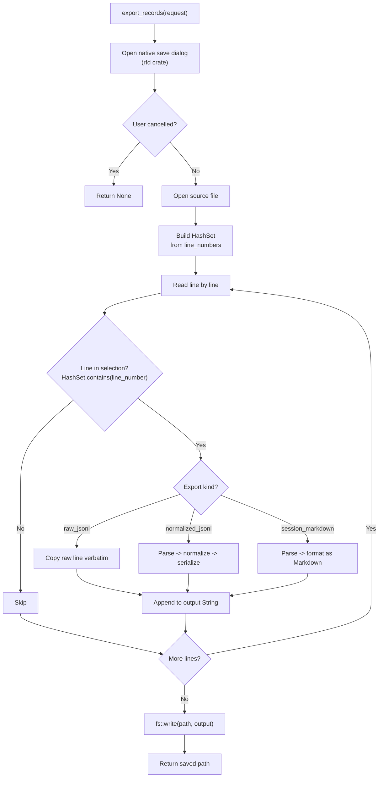
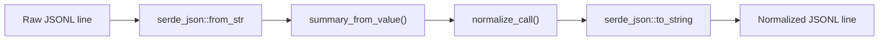
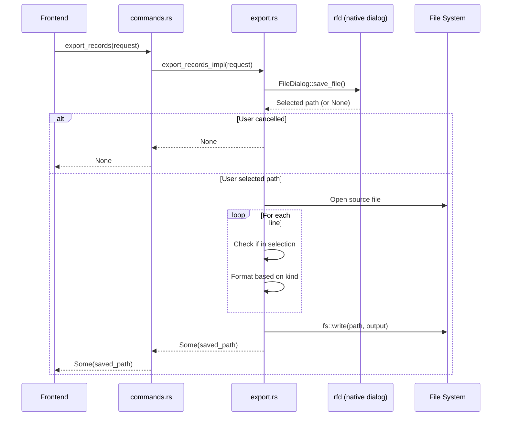

# Export Module

The export module allows users to save selected records from a JSONL file in one of three formats. It reads the raw file line by line, filters by selected line numbers, and writes the output to a user-chosen path. The module is implemented in `export.rs`.

## Export Flow



## Export Request

```rust
// file: src-tauri/src/types.rs:288
#[derive(Debug, Deserialize)]
#[serde(rename_all = "camelCase")]
pub(crate) struct ExportRecordsRequest {
    pub(crate) file_path: String,         // Source JSONL file
    pub(crate) line_numbers: Vec<usize>,  // 1-based line numbers to export
    pub(crate) kind: String,              // Export format
    pub(crate) default_file_name: String, // Suggested filename for save dialog
}
```

## Export Formats

### raw_jsonl

Copies raw JSONL lines verbatim, preserving the exact formatting from the source file.

```rust
// file: src-tauri/src/export.rs:45
"raw_jsonl" => {
    output.push_str(trimmed);
    output.push('\n');
}
```

**Input:**
```jsonl
{"id":"call_1","model":"gpt-4o","request":{...},"response":{...}}
{"id":"call_2","model":"claude-sonnet-4","request":{...},"response":{...}}
```

**Output:** Identical to input (only selected lines).

**Use case:** Sharing raw logs with others or feeding into other analysis tools.

### normalized_jsonl

Re-parses each selected line through the normalization pipeline and writes `NormalizedCall` JSON.



```rust
// file: src-tauri/src/export.rs:49
"normalized_jsonl" => {
    let value = serde_json::from_str::<Value>(trimmed)
        .map_err(|err| format!("Failed to parse line {line_number}: {err}"))?;
    let summary = summary_from_value(&value, line_number, current_offset, None);
    let normalized = normalize_call(&value, &summary);
    output.push_str(&serde_json::to_string(&normalized)?);
    output.push('\n');
}
```

**Per-line output structure:**
```json
{
  "id": "call_1",
  "lineNumber": 1,
  "provider": "openai",
  "model": "gpt-4o",
  "request": { "messages": [...] },
  "response": { "text": "...", "messages": [...] },
  "usage": { "promptTokens": 100, "completionTokens": 50 },
  "raw": { ... }
}
```

**Use case:** Consuming normalized data in downstream pipelines or scripts.

### session_markdown

Generates a human-readable Markdown document with record metadata and response text.

```rust
// file: src-tauri/src/export.rs:60
"session_markdown" => {
    let value = serde_json::from_str::<Value>(trimmed)?;
    let summary = summary_from_value(&value, line_number, current_offset, None);
    let normalized = normalize_call(&value, &summary);
    output.push_str(&format!(
        "## Line {} · {}\n\n- Provider: {}\n- Model: {}\n- Trace: {}\n- Session: {}\n- Status: {}\n- Latency: {} ms\n\n",
        summary.line_number, summary.id,
        summary.provider.as_deref().unwrap_or("unknown"),
        summary.model.as_deref().unwrap_or("unknown"),
        summary.trace_id.as_deref().unwrap_or("-"),
        summary.session_id.as_deref().unwrap_or("-"),
        summary.status,
        summary.latency_ms.map(|v| v.to_string()).unwrap_or_else(|| "-".to_string()),
    ));
    if let Some(response) = normalized.response.and_then(|r| r.text) {
        output.push_str(&response);
        output.push_str("\n\n");
    }
}
```

**Output format:**
```markdown
## Line 1 · call_1

- Provider: openai
- Model: gpt-4o
- Trace: trace-abc
- Session: session-123
- Status: success
- Latency: 150 ms

The assistant's response text here...

## Line 5 · call_2

- Provider: anthropic
- Model: claude-sonnet-4
- Trace: -
- Session: session-456
- Status: success
- Latency: 200 ms

Another response...
```

**Use case:** Sharing conversation logs in documentation, issue reports, or chat.

## Format Summary

| Format | Extension | Content | Preserves Original | Human-Readable | Parses JSON |
|--------|-----------|---------|-------------------|----------------|-------------|
| `raw_jsonl` | `.jsonl` | Raw lines | Yes | No | No |
| `normalized_jsonl` | `.jsonl` | Normalized records | Nested in `raw` | No | Yes |
| `session_markdown` | `.md` | Formatted text | No | Yes | Yes |

## Implementation Details

### Selection Filtering

Selected line numbers are collected into a `HashSet<usize>` for O(1) lookup:

```rust
// file: src-tauri/src/export.rs:17
let selected: HashSet<usize> = request.line_numbers.into_iter().collect();
```

During line-by-line reading, only lines whose `line_number` is in the set are processed. This avoids sorting and allows efficient filtering regardless of selection order.

### File Dialog

The native save dialog is provided by the `rfd` crate:

```rust
// file: src-tauri/src/export.rs:11
let Some(path) = rfd::FileDialog::new()
    .set_file_name(request.default_file_name)
    .save_file()
else {
    return Ok(None);  // User cancelled
};
```

### Error Handling

Each line is parsed individually. If JSON parsing fails for a line during `normalized_jsonl` or `session_markdown` export, the entire operation returns an error with the failing line number:

```rust
let value = serde_json::from_str::<Value>(trimmed)
    .map_err(|err| format!("Failed to parse line {line_number}: {err}"))?;
```

### Output Writing

Output is accumulated in a `String` and written at the end via a single `fs::write`:

```rust
// file: src-tauri/src/export.rs:84
fs::write(&path, output).map_err(|err| format!("Failed to save export: {err}"))?;
Ok(Some(path.to_string_lossy().to_string()))
```

## Performance Considerations

| Aspect | Behavior |
|--------|----------|
| Memory | Entire output buffered in `String` before writing |
| Parsing | Each selected line re-parsed from raw JSON |
| Normalization | Full normalization pipeline applied per line for non-raw formats |
| File I/O | Single `fs::write` at the end |
| Selection | O(1) per line via HashSet |

For large exports (thousands of records), memory usage grows linearly with total output size. The raw JSONL format is most efficient since it copies lines without parsing.

## Data Flow



## Frontend Usage

```typescript
import { invoke } from "@tauri-apps/api/core";

const savedPath = await invoke("export_records", {
    request: {
        filePath: currentFile,
        lineNumbers: selectedLines,
        kind: "session_markdown",
        defaultFileName: "session-export.md",
    },
});

if (savedPath) {
    // Show success notification
}
```

The `default_file_name` parameter is pre-populated based on the current filename and selected export format.

## Extending Export Formats

To add a new export format:

1. Add a new match branch in `export_records()` in `export.rs`
2. Implement formatting logic for the new kind
3. Add the kind string to the frontend's export format selector
4. Set appropriate default filename and extension

Format strings are matched exactly -- unknown formats return `Err("Unsupported export kind")`.
