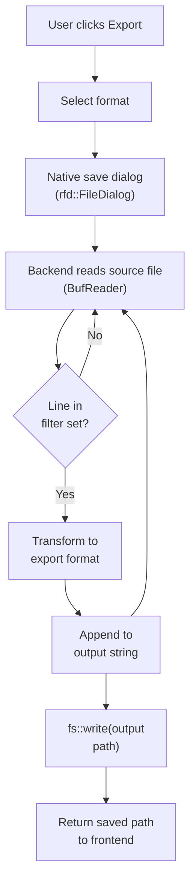
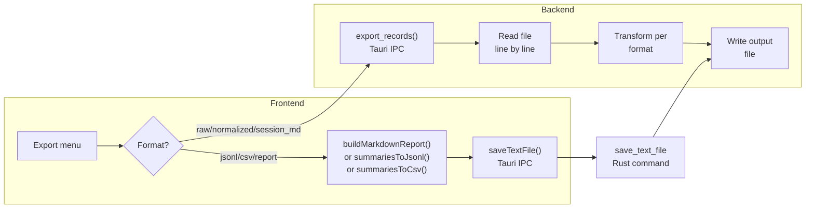
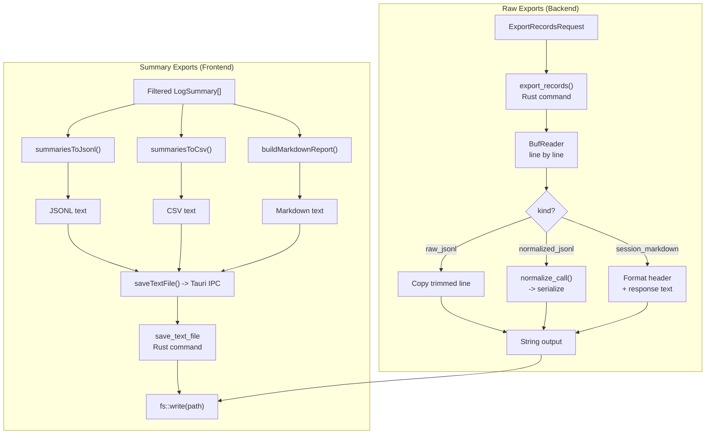

# Export

PromptLens provides six export formats for getting data out of the application. Exports include only the currently filtered records, so apply filters before exporting to control what is included.

## Accessing Export

Click **Export** in the title bar to open the export menu. The menu shows:

- The count of filtered records and detected issues
- Six export format options

## Export Formats

### Summary Exports

These formats export the summary metadata extracted during scanning.

#### JSONL Summary

Exports filtered records as a JSONL file where each line is a summary object:

```json
{"id":"call_1","lineNumber":1,"provider":"openai","model":"gpt-4.1","status":"success","latencyMs":234,"totalTokens":1656,"timestamp":"2026-05-13T10:00:00Z"}
```

| Field | Description |
|-------|-------------|
| `id` | Record identifier |
| `lineNumber` | Line number in the source file |
| `provider` | Detected provider |
| `model` | Detected model |
| `status` | success, error, or invalid_json |
| `latencyMs` | Response time in milliseconds |
| `promptTokens` | Prompt token count |
| `completionTokens` | Completion token count |
| `totalTokens` | Total token count |
| `timestamp` | Request timestamp |
| `traceId` | Trace identifier (if present) |
| `sessionId` | Session identifier (if present) |
| `requestId` | Request identifier (if present) |
| `hasImage` | Whether the record contains images |
| `hasToolCall` | Whether the record contains tool calls |
| `preview` | Text snippet of the first user message |

**Best for:** Importing into other tools, data pipelines, programmatic analysis.

JSONL summary is generated in the frontend:

```ts
// file: src/app/analytics.ts:144-146
export function summariesToJsonl(items: LogSummary[]) {
  return items.map((item) => JSON.stringify(item)).join("\n") +
    (items.length ? "\n" : "");
}
```

#### CSV Summary

Exports the same summary data as a CSV file with a header row. Fields are comma-separated and quoted when necessary.

```ts
// file: src/app/analytics.ts:148-192
export function summariesToCsv(items: LogSummary[]) {
  const header = [
    "lineNumber", "byteOffset", "timestamp", "provider", "model",
    "traceId", "sessionId", "requestId", "parentId", "status",
    "latencyMs", "promptTokens", "completionTokens", "totalTokens",
    "hasImage", "hasToolCall", "preview",
  ];
  const rows = items.map((item) =>
    [/* fields */].map(csvCell).join(",")
  );
  return [header.join(","), ...rows].join("\n") + "\n";
}
```

**Best for:** Opening in spreadsheet applications (Excel, Google Sheets), pivot tables, chart making.

#### Markdown Report

Generates a human-readable Markdown report containing:

- **File overview** -- Path, size, total/valid/invalid line counts
- **Analytics summary** -- Record count, error rate, latency percentiles, total tokens
- **Top models and providers** -- Ranked by usage
- **Detected issues** -- List of problematic records grouped by severity
- **Cost summary** -- Total and average cost estimates

```ts
// file: src/app/analytics.ts:199-235
export function buildMarkdownReport(
  file: FileScanResult,
  filtered: LogSummary[],
  analytics: AnalyticsSummary,
  issues: IssueRecord[],
  sessions: SessionGroup[],
) {
  const lines = [
    `# PromptLens Report: ${file.fileName}`,
    "",
    `- Source: ${file.filePath}`,
    `- Filtered records: ${filtered.length.toLocaleString()}`,
    // ... more metadata, top models, issues, sessions
  ];
  return `${lines.join("\n")}\n`;
}
```

**Best for:** Sharing with team members, including in documentation, reviewing in a Markdown viewer.

### Raw Exports

These formats export the actual JSON content of records. They are processed by the Rust backend:

```rust
// file: src-tauri/src/export.rs:10-86
pub(crate) fn export_records(request: ExportRecordsRequest) -> Result<Option<String>, String> {
    let Some(path) = rfd::FileDialog::new()
        .set_file_name(request.default_file_name)
        .save_file()
    else {
        return Ok(None);  // User cancelled the dialog
    };
    let selected: HashSet<usize> = request.line_numbers.into_iter().collect();
    // ... read file line by line, filter to selected lines
    match request.kind.as_str() {
        "raw_jsonl" => { /* copy trimmed lines */ }
        "normalized_jsonl" => { /* normalize_call -> serialize */ }
        "session_markdown" => { /* format as markdown blocks */ }
        _ => return Err("Unsupported export kind".to_string()),
    }
}
```

#### Raw JSONL

Exports the raw JSON lines from the source file. Each line is copied exactly as it appears in the source, preserving the original formatting.

```rust
// file: src-tauri/src/export.rs:45-48
"raw_jsonl" => {
    output.push_str(trimmed);
    output.push('\n');
}
```

**Best for:** Creating subsets of the original file, feeding into other LLM tools, archiving.

#### Normalized JSONL

Exports records in PromptLens's unified schema. Each line contains the full `NormalizedCall` object:

```rust
// file: src-tauri/src/export.rs:49-59
"normalized_jsonl" => {
    let value = serde_json::from_str::<Value>(trimmed)?;
    let summary = summary_from_value(&value, line_number, current_offset, None);
    let normalized = normalize_call(&value, &summary);
    output.push_str(&serde_json::to_string(&normalized)?);
    output.push('\n');
}
```

```json
{
  "id": "call_1",
  "lineNumber": 1,
  "provider": "openai",
  "model": "gpt-4.1",
  "status": "success",
  "request": {
    "messages": [
      {"role": "system", "content": [{"type": "text", "text": "You are helpful."}]},
      {"role": "user", "content": [{"type": "text", "text": "Hello!"}]}
    ]
  },
  "response": {
    "messages": [
      {"role": "assistant", "content": [{"type": "text", "text": "Hi! How can I help?"}]}
    ]
  },
  "usage": {"promptTokens": 10, "completionTokens": 8, "totalTokens": 18},
  "raw": { ... }
}
```

**Best for:** Cross-provider analysis, building datasets with a consistent schema, migration between tools.

#### Session Markdown

Exports each record as a Markdown block with a metadata header and the response text:

```rust
// file: src-tauri/src/export.rs:60-80
"session_markdown" => {
    // Format header with line number, id, provider, model, trace, session, status, latency
    output.push_str(&format!(
        "## Line {} · {}\n\n- Provider: {}\n- Model: {}\n- Trace: {}\n- Session: {}\n- Status: {}\n- Latency: {} ms\n\n",
        summary.line_number, summary.id, ...
    ));
    // Append response text if available
    if let Some(response) = normalized.response.and_then(|r| r.text) {
        output.push_str(&response);
        output.push_str("\n\n");
    }
}
```

```markdown
## Line 1 · call_1

- Provider: openai
- Model: gpt-4.1
- Trace: trace-abc
- Session: session-xyz
- Status: success
- Latency: 234 ms

Hi! How can I help you today?

## Line 2 · call_2

...
```

**Best for:** Reading conversations in a Markdown viewer, generating documentation, human review.

## How Export Works

When you select an export format:

1. PromptLens opens a native save dialog with a suggested filename.
2. The Rust backend reads the source file line by line.
3. For each line, it checks if the line number is in the filtered set.
4. Matching lines are transformed according to the export format.
5. Output is written to the selected file path.
6. The saved file path is returned to the frontend.



## Export Pipeline Architecture



## Export Tips

| Tip | Description |
|-----|-------------|
| Filter first | Export only filtered records -- use filters to precisely select what you need |
| Check the count | The export menu shows how many records will be included |
| Choose the right format | JSONL for tools, CSV for spreadsheets, Markdown for human reading |
| Normalize for consistency | Use normalized JSONL when you need a consistent schema across providers |
| Raw for fidelity | Use raw JSONL when you need the exact original content |

## Export Limitations

| Limitation | Details |
|-----------|---------|
| Single file export | Only the currently open file is exported |
| Filtered records only | Only records matching the current filter are included |
| No scheduled exports | Exports must be triggered manually |
| No streaming | The entire export is built in memory before writing |
| Requires file dialog | Each export requires a save dialog interaction |

## Export File Naming

PromptLens suggests a default filename based on the source file and export format:

| Format | Default Filename Pattern |
|--------|------------------------|
| JSONL Summary | `{filename}-summaries.jsonl` |
| CSV Summary | `{filename}-summaries.csv` |
| Markdown Report | `{filename}-report.md` |
| Raw JSONL | `{filename}-raw.jsonl` |
| Normalized JSONL | `{filename}-normalized.jsonl` |
| Session Markdown | `{filename}-session.md` |

You can change the filename in the save dialog before confirming.

## Tauri Commands for Export

| Command | Purpose |
|---------|---------|
| `export_records` | Exports selected records in the specified format |
| `save_text_file` | Saves arbitrary text content to a file (used for CSV, Markdown, JSONL summaries) |

The `export_records` command accepts an `ExportRecordsRequest`:

```rust
// file: src-tauri/src/types.rs:288-295
pub(crate) struct ExportRecordsRequest {
    pub(crate) file_path: String,
    pub(crate) line_numbers: Vec<usize>,
    pub(crate) kind: String,
    pub(crate) default_file_name: String,
}
```

| Field | Type | Description |
|-------|------|-------------|
| `file_path` | string | Path to the source JSONL file |
| `line_numbers` | number[] | Which lines to include in the export |
| `kind` | string | Export format: `raw_jsonl`, `normalized_jsonl`, or `session_markdown` |
| `default_file_name` | string | Suggested filename for the save dialog |

The backend reads the source file line by line, filters to the selected lines, transforms each line according to the export format, and writes the output to the user-chosen file path.

## Export Data Flow Details

Complete data flow for each export format:



## CSV Format Details

The CSV export follows RFC 4180:

- Fields containing commas, double quotes, or newlines are enclosed in double quotes
- Double quotes within fields are escaped as `""`
- The first row is always the header row
- All fields are included even if empty (as empty strings)

```ts
// file: src/app/analytics.ts:194-197
function csvCell(value: unknown) {
  const text = String(value);
  return /[",\n]/.test(text) ? `"${text.replace(/"/g, '""')}"` : text;
}
```

## Export Workflow Example

A typical export workflow for analyzing costs across providers:

1. Open your JSONL audit log.
2. Set the provider filter to "openai" to see only OpenAI records.
3. Click Export and choose "CSV Summary".
4. Save the file as `openai-records.csv`.
5. Open the CSV in Excel or Google Sheets.
6. Create a pivot table grouping by model, summing totalTokens and cost.
7. Repeat for other providers and compare.

## Export Error Handling

| Scenario | Behavior |
|----------|----------|
| User cancels save dialog | Export returns `null`, no file is written |
| Source file deleted | Error toast shown: "Failed to open file" |
| Disk full | Error toast shown with OS error message |
| No filtered records | Export menu shows "0 records", export still creates an empty file |
| Invalid JSON line in raw export | Line is copied as-is (raw export does not parse) |

## Related Pages

- [Settings](settings.md) -- Cache management
- [Analytics](analytics.md) -- Metrics used in reports
- [Search](search.md) -- Filtering records before export
