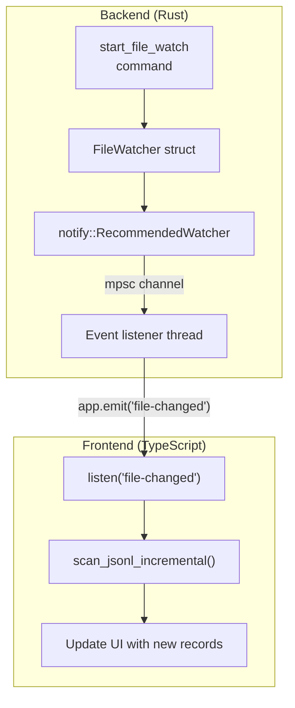
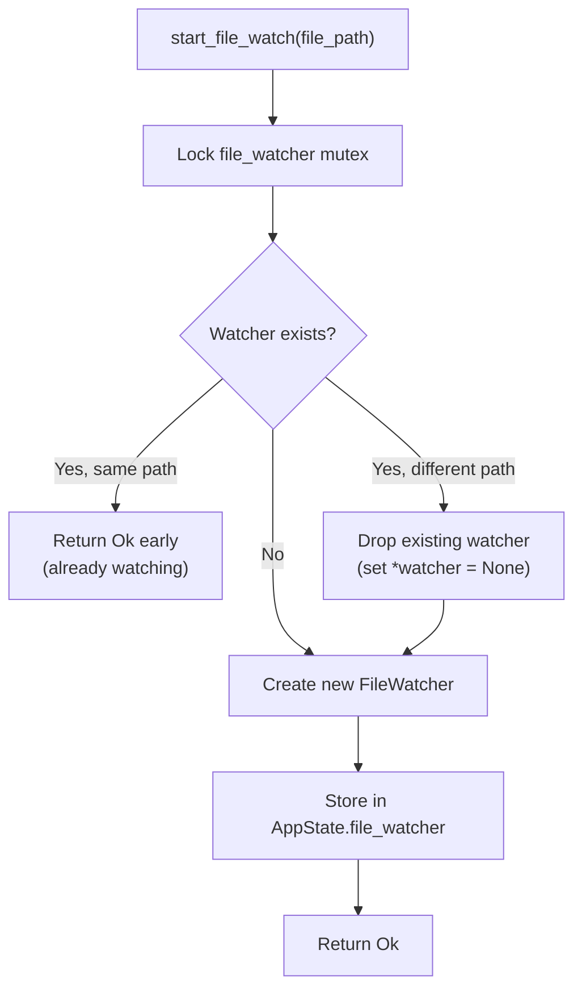
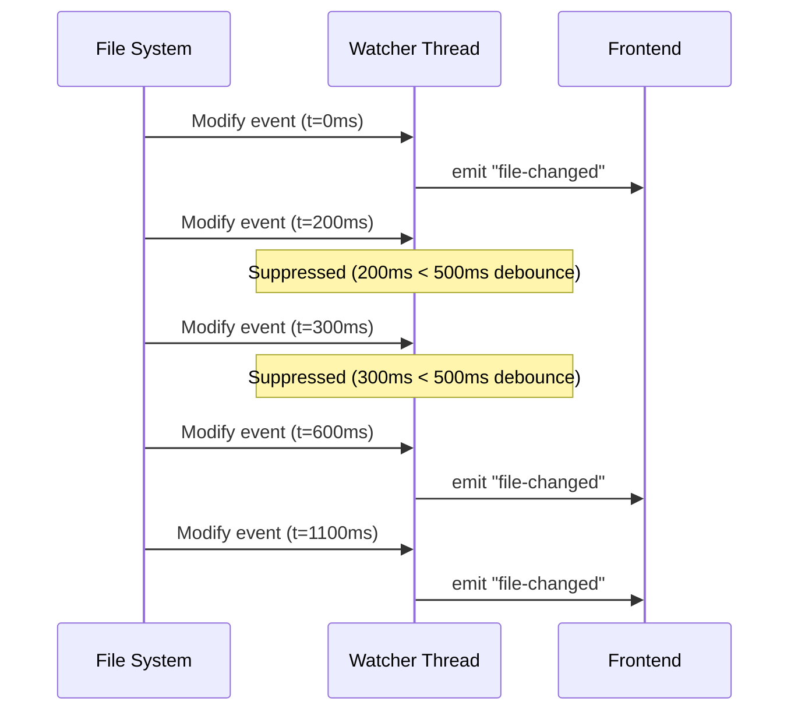
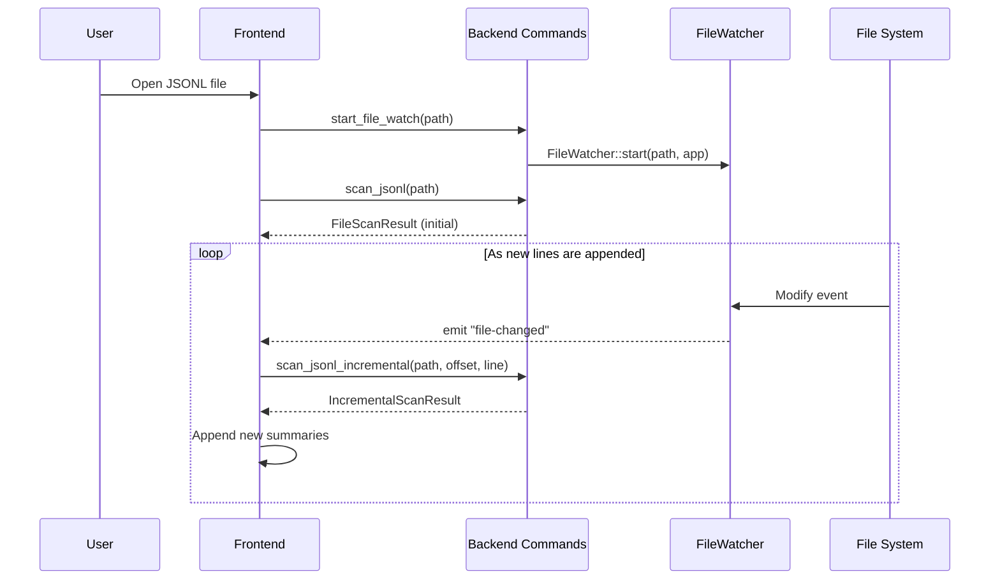

# File Watcher

The file watcher monitors JSONL files for changes and notifies the frontend when new data is available. It uses the `notify` crate for cross-platform file system events, with debouncing to avoid flooding the UI. The implementation lives in `src-tauri/src/watcher.rs`.

## Architecture



## FileWatcher Struct

```rust
// file: src-tauri/src/watcher.rs:7
pub struct FileWatcher {
    _watcher: RecommendedWatcher,  // Keeps the watcher alive
    path: PathBuf,                 // The watched path
}
```

The `_watcher` field holds the `notify::RecommendedWatcher` instance. The underscore prefix indicates it is stored only for its `Drop` implementation -- dropping this struct stops the watcher. The `path()` method provides read access to the watched path:

```rust
// file: src-tauri/src/watcher.rs:54
pub fn path(&self) -> &std::path::Path {
    &self.path
}
```

## Starting a Watch

The `start_file_watch` command manages the watcher lifecycle. It uses the `Mutex<Option<FileWatcher>>` in `AppState` to ensure only one watcher exists at a time:



```rust
// file: src-tauri/src/commands.rs:554
fn start_file_watch(
    file_path: String,
    state: State<'_, AppState>,
    app: AppHandle,
) -> Result<(), String> {
    let mut watcher = state.file_watcher.lock().map_err(|e| e.to_string())?;
    if let Some(ref w) = *watcher {
        if w.path().to_string_lossy() != file_path {
            *watcher = None;  // Drop old watcher
        } else {
            return Ok(());    // Already watching this file
        }
    }
    let new_watcher = crate::watcher::FileWatcher::start(
        std::path::PathBuf::from(&file_path), app
    )?;
    *watcher = Some(new_watcher);
    Ok(())
}
```

The `AppState` struct holds the watcher behind a mutex for thread safety:

```rust
// file: src-tauri/src/types.rs:9
pub(crate) struct AppState {
    pub(crate) cancel_scan: AtomicBool,
    pub(crate) cancel_search: AtomicBool,
    pub(crate) file_watcher: Mutex<Option<crate::watcher::FileWatcher>>,
}
```

## Watcher Creation

The `FileWatcher::start()` method creates a platform-specific watcher and spawns a listener thread:

```rust
// file: src-tauri/src/watcher.rs:13
pub fn start(path: PathBuf, app: tauri::AppHandle) -> Result<Self, String> {
    let (tx, rx) = mpsc::channel::<notify::Result<Event>>();
    let watch_path = path.clone();

    let mut watcher = RecommendedWatcher::new(
        tx,
        notify::Config::default().with_poll_interval(Duration::from_millis(500)),
    ).map_err(|e| format!("Failed to create file watcher: {e}"))?;

    watcher.watch(&watch_path, RecursiveMode::NonRecursive)
        .map_err(|e| format!("Failed to watch file: {e}"))?;

    // ... spawn listener thread

    Ok(Self { _watcher: watcher, path })
}
```

### Watcher Configuration

| Setting | Value | Purpose |
|---------|-------|---------|
| Poll interval | 500ms | How often to check for changes (fallback for non-native events) |
| Recursive mode | `NonRecursive` | Watches only the single file, not its directory |

## Event Listener Thread

A dedicated thread receives events from the `notify` watcher via an `mpsc` channel and forwards them to the frontend using Tauri's event system:

```rust
// file: src-tauri/src/watcher.rs:28
let watched_path = path.clone();
std::thread::spawn(move || {
    let mut last_emit = std::time::Instant::now();
    let debounce = Duration::from_millis(500);

    while let Ok(event_result) = rx.recv() {
        let Ok(event) = event_result else { continue };
        match event.kind {
            EventKind::Modify(_) | EventKind::Create(_) => {
                let now = std::time::Instant::now();
                if now.duration_since(last_emit) >= debounce {
                    last_emit = now;
                    let _ = app.emit(
                        "file-changed",
                        watched_path.to_string_lossy().to_string(),
                    );
                }
            }
            _ => {}  // Ignore Remove, Rename, Access, etc.
        }
    }
});
```

### Debounce Logic

The watcher implements a simple time-based debounce that coalesces rapid file system events into a single notification:



The debounce compares `Instant::now()` against `last_emit` with a 500ms threshold. This prevents the frontend from being flooded with incremental scan requests during rapid file writes (e.g., a logging library flushing buffers).

### Event Type Filtering

Only `Modify` and `Create` events are forwarded. Other event types are ignored:

| Event Type | Forwarded? | Reason |
|------------|-----------|--------|
| `Modify(_)` | Yes | File content changed |
| `Create(_)` | Yes | File created (new log file) |
| `Remove(_)` | No | Not actionable |
| `Rename(_)` | No | Requires special handling |
| `Access(_)` | No | Would cause event storms |
| `Any` | No | Too generic |

## Stopping a Watch

The `stop_file_watch` command drops the watcher by setting the mutex-protected field to `None`:

```rust
// file: src-tauri/src/commands.rs:574
fn stop_file_watch(state: State<'_, AppState>) -> Result<(), String> {
    let mut watcher = state.file_watcher.lock().map_err(|e| e.to_string())?;
    *watcher = None;
    Ok(())
}
```

When the `FileWatcher` is dropped, the cascade is:

1. `_watcher` (RecommendedWatcher) is dropped -- stops the underlying `notify` watcher
2. The `mpsc::Sender` (inside the watcher) is dropped -- closes the channel
3. The listener thread's `rx.recv()` returns `Err` -- the `while let Ok(...)` loop exits
4. The thread terminates naturally

This clean shutdown ensures no leaked threads or file handles.

## Frontend Integration

The frontend listens for `file-changed` events and triggers an incremental scan. The event listener is set up in the `App` component:

```tsx
// file: src/app/App.tsx:156
const unlistenScan = listen<ProgressEvent>("scan-progress", (event) =>
  ws().setScanProgress(event.payload)
);
```

The `file-changed` listener is managed in the workspace store, which calls `scanJsonlIncremental` with the last known offset:

```typescript
import { listen } from "@tauri-apps/api/event";

const unlisten = await listen<string>("file-changed", async (event) => {
    const filePath = event.payload;
    const result = await invoke("scan_jsonl_incremental", {
        filePath,
        fromOffset: lastOffset,
        fromLineNumber: lastLineNumber,
    });
    // Append new summaries to UI
    lastOffset = result.nextOffset;
    lastLineNumber = result.nextLineNumber;
});
```

Frontend Tauri wrapper:

```typescript
// file: src/tauri.ts:25
export async function scanJsonlIncremental(
  filePath: string,
  fromOffset: number,
  fromLineNumber: number,
): Promise<IncrementalScanResult> {
  return invoke("scan_jsonl_incremental", { filePath, fromOffset, fromLineNumber });
}
```

## Thread Safety

All access to the watcher (start, stop, path check) requires acquiring the mutex on `AppState.file_watcher`. If the mutex is poisoned (panic while holding the lock), commands return an error via `map_err(|e| e.to_string())`.

`AppState` also uses `AtomicBool` for cancellation flags that scan and search commands check without locking:

```rust
// file: src-tauri/src/types.rs:9
pub(crate) struct AppState {
    pub(crate) cancel_scan: AtomicBool,      // Lock-free cancellation flag for scans
    pub(crate) cancel_search: AtomicBool,    // Lock-free cancellation flag for searches
    pub(crate) file_watcher: Mutex<Option<FileWatcher>>,  // Mutex-guarded watcher lifecycle
}
```

## Platform Behavior

The `notify` crate uses platform-specific backends for native file system event detection:

| Platform | Backend | Behavior |
|----------|---------|----------|
| Linux | `inotify` | Native kernel events, no polling needed |
| macOS | `FSEvents` | Native file system events |
| Windows | `ReadDirectoryChangesW` | Native directory monitoring |

The 500ms poll interval is a fallback for platforms or file systems that do not support native events (e.g., network file systems, WSL mounts, Docker volumes). On native platforms, the poll interval is rarely triggered.

## Integration with Incremental Scanning

Typical workflow when a file is actively being written:



The backend's incremental scan only reads bytes after `from_offset`, making it efficient even for very large files:

```rust
// file: src-tauri/src/scanner.rs:177
reader.seek(SeekFrom::Start(from_offset))?;
// ... only reads new lines from the seek position
```

New records get a "New" badge in the UI, tracked by line number in the `newLineNumbers` set:

```tsx
// file: src/app/App.tsx:99
const newLineNumbers = useMemo(() => activeTab?.newLineNumbers ?? [], [activeTab]);
```

## Live Mode Toggle

The frontend exposes a "Live Mode" toggle to start or stop the file watcher. The state is managed by `useAppStore`:

```tsx
// file: src/app/App.tsx:40
const liveMode = useAppStore((s) => s.liveMode);
```

When live mode is enabled, the frontend calls `startFileWatch`; when disabled, it calls `stopFileWatch`:

```typescript
// file: src/tauri.ts:109
export async function startFileWatch(filePath: string): Promise<void> {
  return invoke("start_file_watch", { filePath });
}

export async function stopFileWatch(): Promise<void> {
  return invoke("stop_file_watch");
}
```

## Limitations

| Limitation | Description |
|------------|-------------|
| Single file | Only one file can be watched at a time (stored in a single `Mutex<Option<FileWatcher>>`) |
| No rename detection | File renames are not tracked (Rename events are ignored) |
| Debounce granularity | Changes within 500ms are coalesced into one event |
| Thread lifetime | Listener thread runs until the watcher is dropped or the app exits |
| No recursive watch | Only the file itself is watched, not its directory |
| No cross-platform poll fallback config | The 500ms poll interval is hardcoded, not user-configurable |

## Implementation Summary

The file watcher consists of three tightly coupled components:

| Component | Location | Responsibility |
|-----------|----------|----------------|
| `FileWatcher` struct | `src-tauri/src/watcher.rs:7` | Holds `notify` watcher and path; owns listener thread lifetime |
| `start_file_watch` command | `src-tauri/src/commands.rs:554` | Creates/replaces watcher; acquires mutex; checks for existing watcher |
| `stop_file_watch` command | `src-tauri/src/commands.rs:574` | Drops watcher by setting mutex-protected field to `None` |

Data flow from file system change to UI update:

1. OS detects file modification via native backend (inotify/FSEvents/ReadDirectoryChangesW)
2. `notify` crate converts OS event into an `Event` struct with `EventKind`
3. Listener thread receives event via `mpsc` channel
4. If event kind is `Modify` or `Create` and 500ms have passed since last emit, thread calls `app.emit("file-changed", path)`
5. Frontend Tauri event listener receives the path string
6. Workspace store calls `scanJsonlIncremental(filePath, lastOffset, lastLineNumber)`
7. Rust backend seeks to `lastOffset`, reads only new lines, returns `IncrementalScanResult`
8. Frontend appends new `LogSummary` objects to the active tab's file summaries
9. New records display a "New" badge animation in the record list

## Error Handling

The watcher handles several error scenarios gracefully:

| Scenario | Behavior |
|----------|----------|
| File deleted while watched | `notify` watcher continues running; no events emitted until file is recreated |
| Mutex poisoned | Commands return error string via `map_err(\|e\| e.to_string())` |
| Watcher creation fails | `start_file_watch` propagates error message to frontend |
| Channel closed | Listener thread exits naturally when `rx.recv()` returns `Err` |
| App exit | All threads killed when process exits; no explicit cleanup needed |

The `_watcher` field with underscore prefix is a Rust convention indicating the field exists solely for its `Drop` implementation. When the `FileWatcher` struct goes out of scope (either via `stop_file_watch` setting it to `None` or the app shutting down), the `RecommendedWatcher` is automatically cleaned up.
