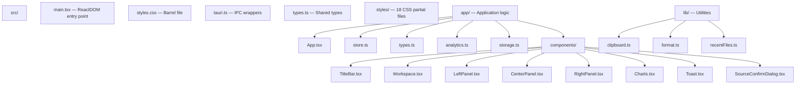
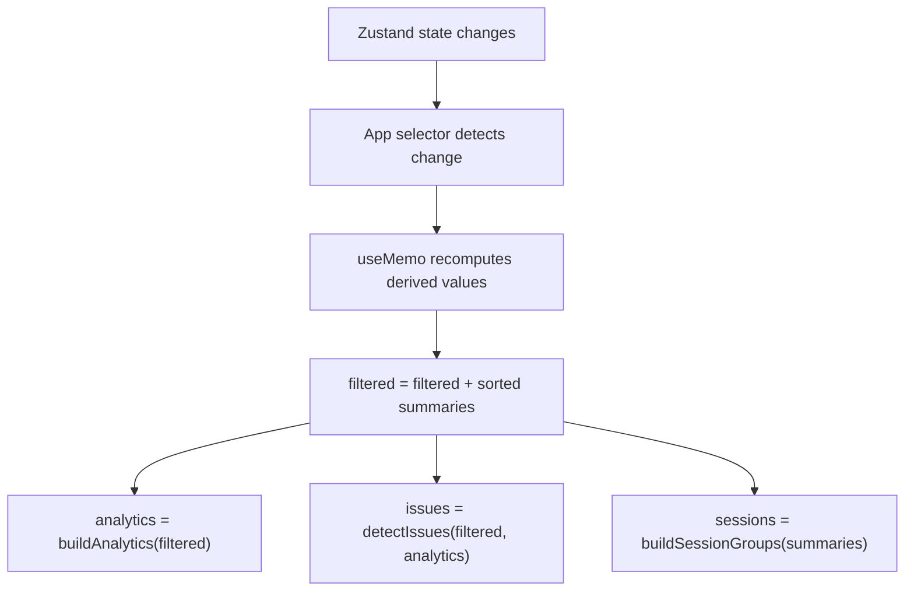
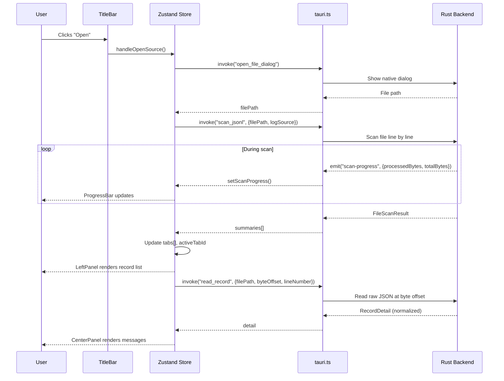
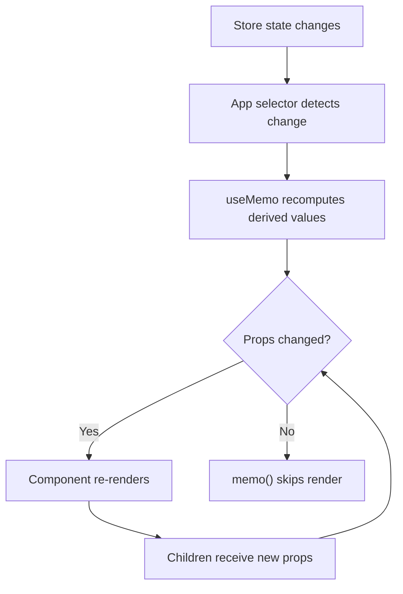

# Frontend Architecture

PromptLens is a single-page application built with React 18 and TypeScript on top of Vite. The frontend communicates with the Rust backend exclusively through Tauri v2 IPC commands. There are no REST endpoints, no WebSocket connections, and no network calls of any kind.

## Technology Stack

| Layer | Technology | Version | Purpose |
|-------|-----------|---------|---------|
| Framework | React | 18.3 | UI rendering with hooks |
| Language | TypeScript | 5.6 | Type safety across the entire codebase |
| Bundler | Vite | 5.4 | Dev server + production build |
| State Management | Zustand | 5.0 | Dual-store architecture (app + workspace) |
| Virtual Scrolling | @tanstack/react-virtual | 3.13 | Efficient rendering of large lists |
| Markdown Rendering | react-markdown + remark-gfm | 9.1 / 4.0 | Displaying formatted LLM responses |
| Icons | lucide-react | 0.468 | SVG icon library |
| Desktop Shell | Tauri v2 (@tauri-apps/api) | 2.9 | IPC, file dialogs, window management |
| Testing | Vitest + @testing-library/react | 4.1 / 16.3 | Unit tests for analytics and storage |

## Directory Structure



### File Responsibility Table

| File | Lines | Purpose |
|------|-------|---------|
| `main.tsx` | ~15 | ReactDOM.createRoot, renders App |
| `styles.css` | ~20 | Barrel import of all CSS partials |
| `tauri.ts` | ~120 | Typed wrappers for all 20 IPC commands |
| `types.ts` | ~200 | Shared TypeScript types (LogSummary, NormalizedCall, etc.) |
| `app/App.tsx` | ~800 | Root component: orchestration, keyboard shortcuts, resize |
| `app/store.ts` | ~600 | Zustand stores: useAppStore + useWorkspaceStore |
| `app/types.ts` | ~100 | App-level types (Filter, SortKey, WorkspaceTab, etc.) |
| `app/analytics.ts` | ~300 | Client-side analytics, issue detection, session grouping |
| `app/storage.ts` | ~80 | localStorage persistence helpers |
| `components/LeftPanel.tsx` | ~1060 | 8 tab views with virtual scrolling |
| `components/CenterPanel.tsx` | ~570 | Detail view with message cards |
| `components/RightPanel.tsx` | ~350 | 5 tab views: diff, tools, error, JSON, raw |
| `components/TitleBar.tsx` | ~370 | macOS-style title bar with menus |
| `components/Workspace.tsx` | ~130 | Tab bar and status bar |
| `components/Charts.tsx` | ~60 | BarChart and Histogram components |
| `lib/format.ts` | ~40 | Time, latency, token, byte formatting |
| `lib/clipboard.ts` | ~25 | Copy to clipboard utilities |
| `lib/recentFiles.ts` | ~20 | Recent file history in localStorage |

## IPC Wrappers (`tauri.ts`)

Every call to the Rust backend goes through a single file: `src/tauri.ts`. This file wraps Tauri's `invoke()` function with typed signatures that match the Rust `#[command]` handlers.

```typescript
// file: src/tauri.ts:1
import { invoke } from "@tauri-apps/api/core";
import type {
  AgentSessionIncrementalResult, AgentSessionResult, CacheInfo,
  ComputedAnalyticsRaw, CostEstimate, FileScanResult, FileStatus,
  IncrementalScanResult, LogSource, ModelPricing, RecordDetail, SearchResponse,
} from "./types";
```

```typescript
// file: src/tauri.ts:17
export async function openFileDialog(): Promise<string | null> {
  return invoke("open_file_dialog");
}

export async function scanJsonl(
  filePath: string,
  logSource: LogSource = "audit",
): Promise<FileScanResult> {
  return invoke("scan_jsonl", { filePath, logSource });
}

export async function readRecord(
  filePath: string,
  byteOffset: number,
  lineNumber: number,
): Promise<RecordDetail> {
  return invoke("read_record", { filePath, byteOffset, lineNumber });
}
```

### Complete Command Catalog

| Wrapper | Rust Command | Purpose |
|---------|-------------|---------|
| `openFileDialog()` | `open_file_dialog` | Native file picker |
| `scanJsonl()` | `scan_jsonl` | Full file scan with provider auto-detection |
| `scanJsonlIncremental()` | `scan_jsonl_incremental` | Append-only rescan from byte offset |
| `cancelScan()` | `cancel_scan` | Cancel in-progress scan |
| `clearScanCache()` | `clear_scan_cache` | Clear SQLite cache |
| `getCacheInfo()` | `get_cache_info` | Get cache database path |
| `getFileStatus()` | `get_file_status` | Check file existence/size/modified time |
| `saveTextFile()` | `save_text_file` | Save-as dialog for exports |
| `exportRecords()` | `export_records` | Export filtered records (JSONL/Markdown) |
| `readRecord()` | `read_record` | Read single record by byte offset |
| `detectLogSource()` | `detect_log_source` | Auto-detect provider format |
| `readAgentSession()` | `read_agent_session` | Read full agent session |
| `readAgentSessionIncremental()` | `read_agent_session_incremental` | Incremental agent session read |
| `searchJsonl()` | `search_jsonl` | Full-text search (substring/regex/FTS5) |
| `cancelSearch()` | `cancel_search` | Cancel in-progress search |
| `listSystemFonts()` | `list_system_fonts` | Enumerate system fonts |
| `getPricingTable()` | `get_pricing_table` | Get model pricing data |
| `calculateCosts()` | `calculate_costs` | Estimate token costs |
| `startFileWatch()` | `start_file_watch` | Start filesystem watcher for live mode |
| `stopFileWatch()` | `stop_file_watch` | Stop filesystem watcher |
| `computeAnalytics()` | `compute_analytics` | Server-side analytics computation |

### Event Listeners

In addition to request/response IPC, the frontend subscribes to Tauri event channels for real-time progress updates:

```typescript
// file: src/app/store.ts:77
import { listen } from "@tauri-apps/api/event";

// Scan progress (processed bytes, line number)
const unlistenScan = listen<ProgressEvent>("scan-progress", (event) => {
  workspaceStore.setScanProgress(event.payload);
});

// Search progress
const unlistenSearch = listen<ProgressEvent>("search-progress", (event) => {
  workspaceStore.setSearchProgress(event.payload);
});
```

## Key Design Patterns

### No Local Data Fetching

The app avoids fetching data in `useEffect` and storing it in local component state. All persistent state lives in Zustand stores. Components select only the specific slices they need through stable selector functions, preventing unnecessary re-renders.

```typescript
// Good: primitive selector, re-renders only when theme changes
const theme = useAppStore((s) => s.theme);

// Good: derived with useMemo, stable reference
const file = useMemo(() => activeTab?.file ?? null, [activeTab]);
```

### Derived State with `useMemo`

Expensive computations like filtering, sorting, analytics, and issue detection are memoized in the root `App` component using `useMemo`. The dependency arrays contain only the primitive values that actually change, avoiding stale closures and infinite re-render loops.

```typescript
const filtered = useMemo(() => {
  return [...file.summaries]
    .filter((item) => { /* provider, model, status, query */ })
    .sort((a, b) => compareSummary(a, b, sortKey));
}, [file, filter, sortKey, query, providerFilter, modelFilter, ...]);

const analytics = useMemo(() => buildAnalytics(filtered), [filtered]);
const issues = useMemo(() => detectIssues(filtered, analytics), [filtered, analytics]);
```



### Component Memoization

All major panel components are wrapped with `React.memo()` and receive only stable prop references from store selectors:

```typescript
// file: src/app/components/LeftPanel.tsx:51
export const LeftPanel = memo(function LeftPanel({
  tab, setTab, source, sortOrder, setSortOrder, query, setQuery,
  file, filtered, selected, selectedAgentEvent, newLineNumbers,
  agentSession, sessions, issues, filterOptions,
  searchTerm, setSearchTerm, searching, searchResults,
  // ... more props
}: { /* ... */ }) {
  // Component body
});
```

### Keyboard Shortcuts

Global keyboard shortcuts are registered in `App.tsx` via a `useEffect` that adds a `keydown` listener to `window`:

| Shortcut | Action |
|----------|--------|
| `Cmd/Ctrl + O` | Open file dialog |
| `Cmd/Ctrl + F` | Focus search input |
| `Cmd/Ctrl + R` | Rescan current file |
| `Cmd/Ctrl + Shift + C` | Copy raw JSON of selected record |
| `Cmd/Ctrl + W` | Close active tab |
| `Arrow Up/Down` | Navigate records |
| `Escape` | Close image preview |

### Resize Handles

The three-panel layout (left, center, right) uses CSS Grid with draggable resize handles. Mouse events are dynamically attached and detached via `useEffect`, with boundary clamping enforced by constants:

```typescript
// file: src/app/types.ts (approximate)
export const LEFT_MIN = 260;
export const LEFT_MAX = 560;
export const LEFT_DEFAULT = 340;
export const RIGHT_MIN = 300;
export const RIGHT_MAX_RATIO = 0.6;
export const RIGHT_DEFAULT = 400;
export const CENTER_MIN = 200;
```

## Utility Libraries

### clipboard.ts

Provides three functions for copying data to the system clipboard:

```typescript
// file: src/lib/clipboard.ts
export async function copyText(value: string): Promise<void> {
  await navigator.clipboard.writeText(value);
}

export async function copyJson(value: unknown): Promise<void> {
  await navigator.clipboard.writeText(JSON.stringify(value, null, 2));
}

export function safeJson(value: unknown): string {
  try { return JSON.stringify(value, null, 2); }
  catch { return String(value); }
}
```

### format.ts

Formatting functions used across the UI for consistent value display:

| Function | Input | Example Output |
|----------|-------|----------------|
| `formatTime(timestamp)` | ISO string | `"14:32:05"` |
| `formatLatency(ms)` | Milliseconds | `"250ms"` or `"1.5s"` |
| `formatTokens(count)` | Token count | `"1.5k tokens"` or `"450 tokens"` |
| `formatBytes(bytes)` | Byte count | `"2.4 MB"` or `"512 KB"` |
| `basename(path)` | File path | `"session.jsonl"` |

### recentFiles.ts

Manages the list of recently opened files in `localStorage`:

- `loadRecentFiles()` -- Reads the array from `localStorage` key `"promptlens.recentFiles"`
- `rememberRecentFile(path)` -- Adds the file to the front of the list, deduplicates, and caps at 8 entries

## Development Workflow

```bash
# Start Vite dev server only (frontend hot-reload, port 1420)
npm run dev

# Start full Tauri app (compiles Rust backend + runs Vite)
npm run tauri:dev

# Type-check and build production frontend
npm run build

# Run frontend unit tests
npm run test
```

During `npm run tauri:dev`, the Rust backend compiles once, then the Vite dev server serves the frontend with hot module replacement (HMR). Changes to TypeScript or CSS files are reflected immediately without restarting the app. Changes to Rust code trigger a backend recompilation.

## Data Flow Overview

When the user opens a JSONL file, data flows through the frontend as follows:



## Re-render Optimization

The component tree is designed to minimize re-renders through multiple layers:



| Optimization Layer | Mechanism | Effect |
|-------------------|-----------|--------|
| Store selectors | `useAppStore((s) => s.theme)` | Re-renders only when selected value changes |
| `useMemo` | Memoized derived computations | Does not recompute when dependencies unchanged |
| `React.memo()` | Shallow prop comparison | Skips render when props are equal |
| Callback stability | Store actions are stable references | Passing actions as props does not trigger re-renders |
| Virtual scrolling | Only visible rows rendered | Minimizes DOM updates on list changes |
