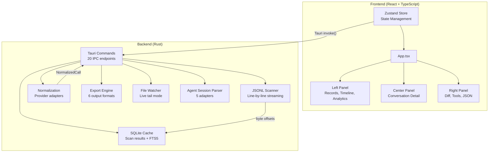
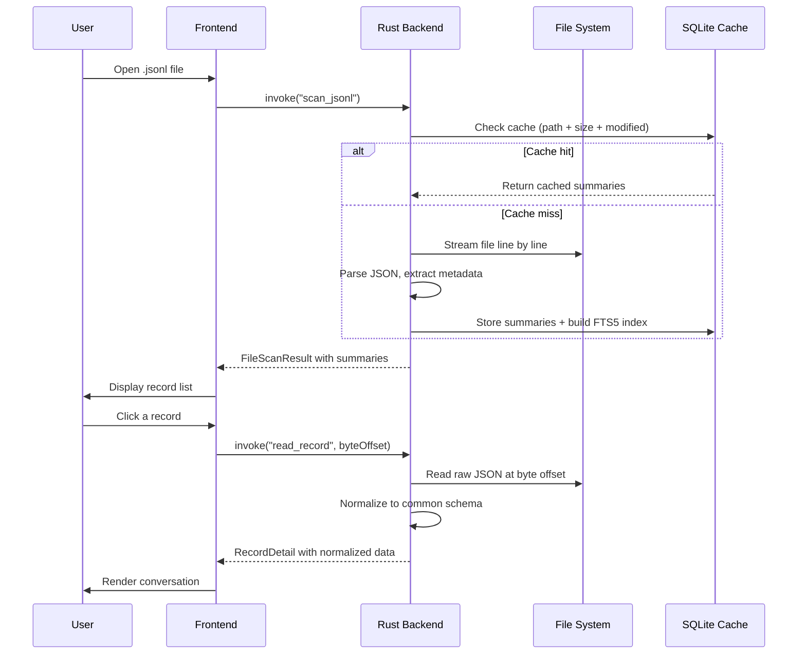

# Getting Started with PromptLens

PromptLens is a local-first desktop application for viewing, searching, and analyzing JSONL audit logs from LLM providers. It runs entirely on your machine with no network calls and no telemetry.

## What is PromptLens?

When you use LLM APIs from providers like OpenAI, Anthropic, Gemini, or Ollama, you typically generate large JSONL files containing request/response pairs. PromptLens transforms these files into an interactive, searchable interface where you can inspect conversations, debug errors, track token usage, and analyze costs.

PromptLens also supports agent session logs from Codex, Claude Code, OpenCode, OpenClaw, and generic agent JSONL formats.

## Core Features

| Feature | Description |
|---------|-------------|
| **Multi-provider normalization** | Auto-detects OpenAI, Anthropic, Gemini, and Ollama formats and normalizes them into a unified schema |
| **Agent session support** | Parses logs from Codex, Claude Code, OpenCode, OpenClaw, and generic agent JSONL formats |
| **Byte-offset indexing** | Locates records by byte offset for O(1) random access, even on multi-GB files |
| **SQLite + FTS5 cache** | Scan results cached locally; full-text search powered by SQLite FTS5 |
| **Incremental scanning** | Detects append-only file changes without rescanning the entire file |
| **Virtual scrolling** | Handles millions of records smoothly with virtualized lists |
| **Three view modes** | Renders messages as Markdown preview, plain text, or raw JSON |
| **Diff comparison** | Side-by-side comparison of any two records with text-level diffs |
| **Analytics dashboard** | Token usage, latency percentiles, error rates, model distribution, and cost estimation |
| **Export** | Export filtered records as JSONL, CSV, Markdown report, raw JSONL, normalized JSONL, or session Markdown |

## Architecture Overview

PromptLens is built on [Tauri v2](https://v2.tauri.app/), combining a React + TypeScript frontend with a Rust backend. This hybrid architecture is a deliberate design choice: Rust handles performance-critical I/O (file scanning, JSON parsing, SQLite operations), while React provides a responsive, component-driven UI.



The Rust backend registers as a Tauri application state with atomic cancellation flags for long-running operations:

```rust
// file: src-tauri/src/types.rs:9
pub(crate) struct AppState {
    pub(crate) cancel_scan: AtomicBool,
    pub(crate) cancel_search: AtomicBool,
    pub(crate) file_watcher: Mutex<Option<crate::watcher::FileWatcher>>,
}
```

All Tauri commands are registered in the `run()` function at the library entry point:

```rust
// file: src-tauri/src/commands.rs:593
pub fn run() {
    tauri::Builder::default()
        .manage(AppState::default())
        .invoke_handler(tauri::generate_handler![
            open_file_dialog,
            scan_jsonl,
            scan_jsonl_incremental,
            cancel_scan,
            clear_scan_cache,
            get_cache_info,
            get_file_status,
            save_text_file,
            export_records,
            read_record,
            read_agent_session,
            read_agent_session_incremental,
            detect_log_source,
            search_jsonl,
            cancel_search,
            list_system_fonts,
            get_pricing_table,
            calculate_costs,
            start_file_watch,
            stop_file_watch,
            compute_analytics
        ])
        .run(tauri::generate_context!())
        .expect("error while running PromptLens");
}
```

## Data Flow

The data flow follows a two-phase pattern: **scanning** (indexing all records) and **reading** (loading individual records on demand). This design means the record list loads quickly even for multi-GB files, because the scan phase only creates lightweight summaries.



The scan phase streams the file using a 256KB buffer, emitting progress events every 250 lines:

```rust
// file: src-tauri/src/scanner.rs:37
let mut reader = BufReader::with_capacity(256 * 1024, file);
// ...
// Report progress every 250 lines:
if total_lines == 1 || total_lines.is_multiple_of(250) {
    if let Some(app) = app {
        let _ = app.emit("scan-progress", ProgressEvent {
            processed_bytes: byte_offset,
            total_bytes: metadata.len(),
            line_number: total_lines,
        });
    }
}
```

## State Management with Zustand

PromptLens uses two Zustand stores for separation of concerns:

```tsx
// file: src/app/store.ts:147
export const useAppStore = create<AppState>((set, get) => ({
  theme: loadTheme(),
  settings: loadSettings(),
  messageViewMode: loadMessageViewMode(),
  // ... UI preferences and transient state
}));

// file: src/app/store.ts:284
export const useWorkspaceStore = create<WorkspaceState>((set, get) => ({
  tabs: [],
  activeTabId: null,
  recentFiles: loadRecentFiles(),
  // ... file data, tabs, async operations
}));
```

| Store | Purpose | Persistence |
|-------|---------|-------------|
| **App Store** | UI preferences (theme, font, filter, sort key, panel widths) | Written to `localStorage` via subscribe middleware |
| **Workspace Store** | File tabs, scan results, agent sessions, search state | Open file paths stored in `localStorage` |

This separation means UI preference changes do not trigger re-renders of file data components and vice versa.

## Supported LLM Providers

PromptLens auto-detects providers based on JSON structure. Detection happens in the Rust backend with simple key-existence checks:

```rust
// file: src-tauri/src/adapters.rs:11
pub(crate) fn detect_provider(value: &Value) -> Option<String> {
    if value.get("choices").is_some() || value.get("output").is_some() {
        return Some("openai".to_string());
    }
    if value.get("candidates").is_some() || value.get("contents").is_some() {
        return Some("gemini".to_string());
    }
    if value.get("message").is_some() && value.get("done").is_some() {
        return Some("ollama".to_string());
    }
    // Anthropic: content array with typed items
    if value.get("content").and_then(Value::as_array).is_some_and(|items| {
        items.iter().any(|item| item.get("type").and_then(Value::as_str) == Some("text"))
    }) {
        return Some("anthropic".to_string());
    }
    None
}
```

| Provider | Detection Signal |
|----------|-----------------|
| **OpenAI** | Presence of `choices`, `output`, or `output_text` field |
| **Anthropic** | `content` array with typed items (e.g. `{"type": "text"}`) |
| **Gemini** | Presence of `candidates` or `contents` field |
| **Ollama** | Presence of `message` and `done` fields |

## Supported Agent Sources

| Source | Label | Description |
|--------|-------|-------------|
| `audit` | Audit JSONL Log | Standard LLM audit log (default) |
| `codex` | Codex | OpenAI Codex CLI session log |
| `claude_code` | Claude Code | Anthropic Claude Code session log |
| `opencode` | OpenCode | OpenCode session log |
| `openclaw` | OpenClaw | OpenClaw session log |
| `generic_agent` | Agent JSONL | Generic agent JSONL with flexible schema |

## How PromptLens Compares to Other Tools

| Capability | PromptLens | Browser DevTools | CLI Tools | Cloud Dashboards |
|------------|-----------|-----------------|-----------|-----------------|
| Local-first | Yes | Yes | Yes | No |
| Multi-provider support | Yes | No | Varies | Provider-specific |
| Agent session parsing | Yes | No | No | No |
| Visual conversation view | Yes | No | No | Yes |
| Full-text search | Yes (FTS5) | No | grep | Yes |
| Cost estimation | Yes | No | No | Yes |
| Export formats | 6 formats | None | Limited | CSV/JSON |
| Offline use | Yes | Yes | Yes | No |

## System Requirements

| Requirement | Minimum |
|-------------|---------|
| Operating System | macOS 11+, Windows 10+, or Linux (Ubuntu 20.04+, Fedora 36+, Arch) |
| Memory | 512 MB free (more for large files) |
| Disk | 100 MB for the app, additional space for SQLite cache |
| Display | 1280x720 minimum recommended |

## Project Structure

For developers interested in the codebase:

```
promptlens/
├── src/                          # Frontend (React + TypeScript)
│   ├── app/
│   │   ├── App.tsx               # Main application component
│   │   ├── store.ts              # Zustand state management
│   │   ├── types.ts              # Frontend type definitions
│   │   ├── analytics.ts          # Analytics calculations
│   │   ├── storage.ts            # localStorage persistence
│   │   └── components/
│   │       ├── TitleBar.tsx       # Title bar and menus
│   │       ├── Workspace.tsx      # Tab bar and status bar
│   │       ├── LeftPanel.tsx      # Records, timeline, analytics
│   │       ├── CenterPanel.tsx    # Conversation detail view
│   │       ├── RightPanel.tsx     # Diff, tools, JSON view
│   │       ├── Charts.tsx         # Bar charts and histograms
│   │       └── Toast.tsx          # Notification toasts
│   ├── tauri.ts                  # Tauri IPC wrappers
│   ├── types.ts                  # Shared TypeScript types
│   ├── lib/                      # Utilities (clipboard, formatting, etc.)
│   └── styles/                   # Glassmorphism CSS
├── src-tauri/                    # Backend (Rust)
│   └── src/
│       ├── lib.rs                # Entry point + tests
│       ├── commands.rs           # Tauri command handlers
│       ├── scanner.rs            # JSONL line-by-line scanner
│       ├── normalize.rs          # Provider normalization
│       ├── adapters.rs           # Provider auto-detection
│       ├── agent_adapters.rs     # Agent session adapters
│       ├── cache.rs              # SQLite cache layer
│       ├── search.rs             # FTS5 search engine
│       ├── export.rs             # Export formats
│       ├── analytics.rs          # Server-side analytics
│       ├── pricing.rs            # Cost estimation
│       ├── types.rs              # Rust type definitions
│       └── parser/               # Specialized parsers
└── package.json                  # Node.js configuration
```

## Quick Install

Download the latest release for your platform from the [GitHub Releases](https://github.com/xuranus/promptlens/releases) page. For detailed instructions including building from source, see the [Installation Guide](installation.md).

## Quick Test

After installation, try opening a sample file:

```bash
# Generate a sample JSONL file
npm run sample:large

# Open PromptLens and load the generated file
```

Or use any existing JSONL file from your LLM API audit logs.

## TypeScript State Types

The frontend uses TypeScript types that mirror the Rust backend structures. The `LogSummary` type is the primary data structure flowing between frontend and backend:

```ts
// file: src/types.ts:3-23
export type LogSummary = {
  id: string;
  lineNumber: number;
  byteOffset: number;
  timestamp?: string;
  provider?: string;
  model?: string;
  traceId?: string;
  sessionId?: string;
  requestId?: string;
  parentId?: string;
  status: Status;
  latencyMs?: number;
  promptTokens?: number;
  completionTokens?: number;
  totalTokens?: number;
  hasImage: boolean;
  hasToolCall: boolean;
  preview?: string;
  parseError?: string;
};
```

The `NormalizedCall` type represents a fully normalized LLM API call:

```ts
// file: src/types.ts:62-99
export type NormalizedCall = {
  id: string;
  lineNumber: number;
  timestamp?: string;
  provider?: string;
  model?: string;
  status: "success" | "error" | "unknown";
  latencyMs?: number;
  usage?: {
    promptTokens?: number;
    completionTokens?: number;
    totalTokens?: number;
  };
  request?: {
    messages?: NormalizedMessage[];
    raw?: unknown;
  };
  response?: {
    text?: string;
    messages?: NormalizedMessage[];
    toolCalls?: unknown;
    raw?: unknown;
  };
  error?: {
    message?: string;
    errorType?: string;
    stack?: string;
    raw?: unknown;
  };
  raw: unknown;
};
```

## Tauri IPC Wrapper

All communication between the frontend and backend goes through typed wrappers in `tauri.ts`:

```ts
// file: src/tauri.ts
export function scanJsonl(filePath: string, source: LogSource) {
  return invoke<FileScanResult>("scan_jsonl", { filePath, source });
}

export function readRecord(filePath: string, byteOffset: number, lineNumber: number) {
  return invoke<RecordDetail>("read_record", { filePath, byteOffset, lineNumber });
}

export function searchJsonl(filePath: string, query: string, mode: string) {
  return invoke<SearchResponse>("search_jsonl", { filePath, query, mode });
}

export function exportRecords(request: ExportRecordsRequest) {
  return invoke<string | null>("export_records", { request });
}
```

These wrappers provide full TypeScript type safety for every IPC call, ensuring that the frontend and backend stay in sync.

## Key Design Patterns

| Pattern | Description |
|---------|-------------|
| **Byte-offset indexing** | Records are located by byte offset for O(1) random access, avoiding linear scans |
| **Two-phase loading** | Scan phase creates lightweight summaries; read phase loads full records on demand |
| **Incremental updates** | Append-only file changes detected without full rescan |
| **Dual computation** | Analytics computed in both frontend (instant filters) and backend (comprehensive) |
| **Provider normalization** | All LLM providers normalized to a common schema for consistent UI rendering |
| **Virtual scrolling** | Only visible records rendered to DOM, enabling million-record files |
| **Atomic cancellation** | Long-running operations check `AtomicBool` flags for cooperative cancellation |

## Next Steps

- [Installation Guide](installation.md) -- Download releases or build from source
- [Quick Start](quick-start.md) -- Launch the app and inspect your first log file
- [User Guide](user-guide.md) -- Deep dive into all features
