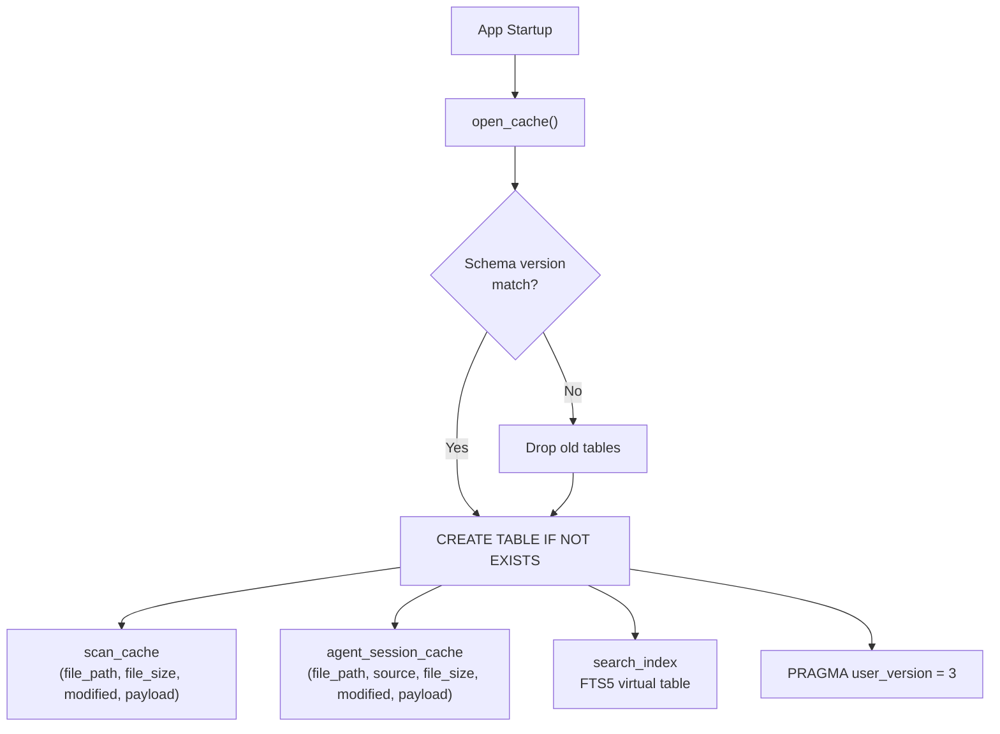
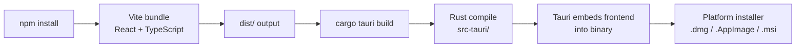
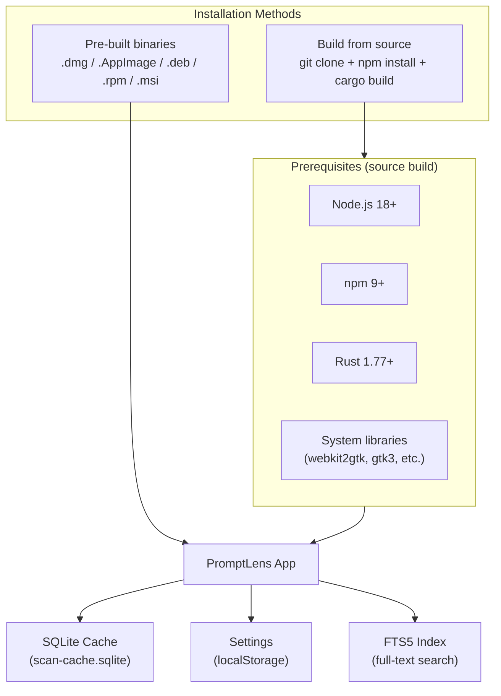

# Installation Guide

PromptLens provides pre-built binaries for macOS, Linux, and Windows. You can also choose to build from source.

## Download Pre-built Releases

Visit the [GitHub Releases](https://github.com/xuranus/promptlens/releases) page and download the installer for your platform.

| Platform | File Format | Notes |
|----------|-------------|-------|
| macOS (Apple Silicon) | `.dmg` | Recommended for M1/M2/M3/M4 Macs |
| macOS (Intel) | `.dmg` | For older Intel Macs |
| Linux | `.AppImage`, `.deb`, `.rpm` | AppImage works on most distros |
| Windows | `.msi`, `.exe` | MSI installer recommended |

### macOS

1. Download the `.dmg` file for your architecture.
2. Open the `.dmg` and drag **PromptLens** to the Applications folder.
3. On first launch, macOS may show a security warning. Go to **System Settings > Privacy & Security** and click **Open Anyway**.

### Linux

**AppImage (recommended):**

```bash
chmod +x PromptLens_*.AppImage
./PromptLens_*.AppImage
```

**Debian/Ubuntu (.deb):**

```bash
sudo dpkg -i promptlens_*.deb
```

**Fedora (.rpm):**

```bash
sudo rpm -i promptlens_*.rpm
```

### Windows

1. Download the `.msi` installer.
2. Run the installer and follow the prompts.
3. Launch PromptLens from the Start menu.

## Building from Source

If you want to build PromptLens yourself, you need Node.js, Rust, and platform-specific dependencies.

### Prerequisites

| Tool | Minimum Version | Check Command |
|------|-----------------|---------------|
| Node.js | 18+ | `node --version` |
| npm | 9+ | `npm --version` |
| Rust | 1.77+ | `rustc --version` |
| Cargo | (ships with Rust) | `cargo --version` |

### Linux System Dependencies

On Debian/Ubuntu, install the required system libraries:

```bash
sudo apt update
sudo apt install -y \
  libwebkit2gtk-4.1-dev \
  libgtk-3-dev \
  libayatana-appindicator3-dev \
  librsvg2-dev \
  patchelf
```

On Fedora:

```bash
sudo dnf install -y \
  webkit2gtk4.1-devel \
  gtk3-devel \
  libappindicator-gtk3-devel \
  librsvg2-devel
```

On Arch Linux:

```bash
sudo pacman -S --needed \
  webkit2gtk-4.1 \
  gtk3 \
  libappindicator-gtk3 \
  librsvg
```

### Clone and Build

```bash
# Clone the repository
git clone https://github.com/xuranus/promptlens.git
cd promptlens

# Install frontend dependencies
npm install

# Run the full Tauri desktop app in dev mode
npm run tauri:dev

# Build for production
npm run tauri:build
```

Production builds output platform-specific installers in `src-tauri/target/release/bundle/`.

### Frontend-Only Development

If you only want to develop the React frontend without compiling Rust:

```bash
npm run dev
```

This starts a Vite dev server at `http://localhost:1420`. Note that Tauri IPC commands will not work without the Rust backend.

### Running Rust Checks

```bash
cd src-tauri

# Format check
cargo fmt --check

# Compiler check
cargo check

# Run unit tests
cargo test
```

## Cache Database Initialization

When PromptLens starts, the Rust backend opens (or creates) a SQLite database. The cache schema includes three tables and uses a version number for migrations:

```rust
// file: src-tauri/src/cache.rs:6
pub(crate) fn cache_db_path() -> Result<std::path::PathBuf, String> {
    if let Ok(path) = std::env::var("PROMPTLENS_CACHE_PATH") {
        return Ok(std::path::PathBuf::from(path));
    }
    let base = dirs::data_local_dir()
        .or_else(dirs::data_dir)
        .ok_or_else(|| "Failed to resolve app data directory".to_string())?
        .join("PromptLens");
    fs::create_dir_all(&base).map_err(|err| format!("Failed to create cache directory: {err}"))?;
    Ok(base.join("scan-cache.sqlite"))
}
```



The FTS5 virtual table stores the content of each JSONL line for full-text search:

```rust
// file: src-tauri/src/cache.rs:57
conn.execute(
    "CREATE VIRTUAL TABLE IF NOT EXISTS search_index USING fts5(
        file_path UNINDEXED,
        line_number UNINDEXED,
        byte_offset UNINDEXED,
        content
    )",
    [],
)
```

## Cache Storage Location

| Platform | Typical Location |
|----------|-----------------|
| macOS | `~/Library/Application Support/PromptLens/scan-cache.sqlite` |
| Linux | `~/.local/share/PromptLens/scan-cache.sqlite` |
| Windows | `%APPDATA%\PromptLens\scan-cache.sqlite` |

You can override the cache path by setting the `PROMPTLENS_CACHE_PATH` environment variable. This is useful for development and testing.

## Build Pipeline



## Verifying Installation

After launching PromptLens, you should see the splash screen with the PromptLens logo and an "Open JSONL File" button. To verify everything works:

1. Click **Open JSONL File** or press `Ctrl+O`.
2. Select any `.jsonl` file containing LLM audit logs.
3. The record list should appear in the left panel.

## Generating Sample Data

For testing, you can generate sample JSONL files:

```bash
# Generate a large sample file (default: 1000 lines)
npm run sample:large

# Or specify row count and approximate size (MB)
node scripts/generate-large-sample.mjs 5000 10
```

## Troubleshooting

### "webkit2gtk not found" on Linux

Install the webkit2gtk development package for your distro. See the Linux system dependencies section above.

### Linker errors with "cargo build"

Ensure all required system libraries are installed. On Debian/Ubuntu:

```bash
sudo apt install -y build-essential pkg-config libssl-dev
```

### Blank page after `npm run dev`

The Vite dev server runs without the Tauri backend. Tauri IPC calls will fail. Use `npm run tauri:dev` instead to run the full application.

### AppImage won't start on Linux

Make the file executable:

```bash
chmod +x PromptLens_*.AppImage
```

Some distros require FUSE for AppImages. Install it:

```bash
sudo apt install fuse libfuse2
```

### macOS "app is damaged" error

This is a Gatekeeper issue. Run:

```bash
xattr -cr /Applications/PromptLens.app
```

## Updating

PromptLens does not auto-update. When a new version is released, download the latest version from GitHub. Your scan cache and recent files are stored in the platform-specific app data directory and will persist across updates.

## Uninstalling

| Platform | Steps |
|----------|-------|
| macOS | Drag PromptLens from Applications to Trash |
| Linux (AppImage) | Delete the AppImage file |
| Linux (.deb) | `sudo apt remove promptlens` |
| Linux (.rpm) | `sudo rpm -e promptlens` |
| Windows | Use "Add or remove programs" in Settings |

The scan cache and settings are stored in the platform-specific app data directory. To completely remove all data, delete the PromptLens data directory after uninstalling.

## Environment Variables

| Variable | Purpose | Default |
|----------|---------|---------|
| `PROMPTLENS_CACHE_PATH` | Override the SQLite cache database path | Platform-specific app data directory |

Setting `PROMPTLENS_CACHE_PATH` is useful for development, testing, or when you want the cache on a different disk:

```bash
# Example: Store cache on a fast SSD
export PROMPTLENS_CACHE_PATH=/mnt/ssd/promptlens-cache.sqlite
npm run tauri:dev
```

## CI/CD Builds

PromptLens uses GitHub Actions to build artifacts for all three platforms. The CI pipeline:

1. Installs Node.js and Rust toolchains
2. Installs platform-specific system dependencies
3. Runs `cargo fmt --check` and `cargo check` for the Rust backend
4. Runs `cargo test` for unit tests
5. Builds the frontend with `npm run build`
6. Produces platform installers with `npm run tauri:build`
7. Uploads artifacts to the GitHub release

Build artifacts are produced for:
- macOS (Apple Silicon `.dmg`)
- macOS (Intel `.dmg`)
- Linux (`.AppImage`, `.deb`, `.rpm`)
- Windows (`.msi`, `.exe`)

## Development Workflow

For day-to-day development:

```bash
# Start the full app with hot-reload
npm run tauri:dev

# In another terminal, run Rust checks
cd src-tauri && cargo watch -x check

# Run frontend type-checking
npm run build
```

The `tauri:dev` command starts both the Vite dev server (with hot module replacement) and the Rust backend. Changes to React components are reflected instantly. Changes to Rust code trigger a recompile (typically 2-5 seconds for incremental builds).

## Build Output Structure

After a production build, the output is organized as follows:

```
src-tauri/target/release/bundle/
├── macos/
│   └── PromptLens.app
├── dmg/
│   └── PromptLens_0.1.0_aarch64.dmg
├── appimage/
│   └── promptlens_0.1.0_amd64.AppImage
├── deb/
│   └── promptlens_0.1.0_amd64.deb
├── rpm/
│   └── promptlens-0.1.0-1.x86_64.rpm
└── nsis/
    └── PromptLens_0.1.0_x64-setup.exe
```

## Disk Space Requirements

| Component | Approximate Size |
|-----------|-----------------|
| Source code | ~5 MB |
| node_modules | ~200 MB |
| Rust target (debug) | ~500 MB |
| Rust target (release) | ~300 MB |
| Final binary | ~15-30 MB |
| SQLite cache | Varies (proportional to scanned files) |

## Supported File Formats

PromptLens can open files with the following extensions:

| Extension | Description |
|-----------|-------------|
| `.jsonl` | JSON Lines format (one JSON object per line) |
| `.ndjson` | Newline-Delimited JSON (same as JSONL) |
| `.log` | Plain text log files containing JSON lines |

The file dialog filters to these extensions by default. Any text file where each line is valid JSON will work, regardless of extension.

## Architecture Diagram



## Next Steps

- [Quick Start](quick-start.md) -- Launch the app and inspect your first log file
- [Getting Started](getting-started.md) -- Overview of features and architecture
- [User Guide](user-guide.md) -- Comprehensive guide to all features
