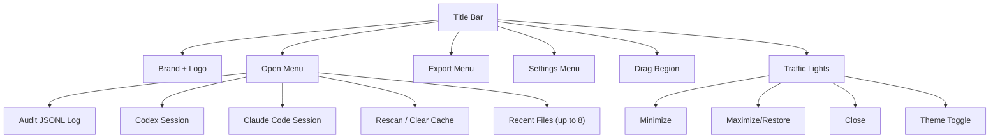
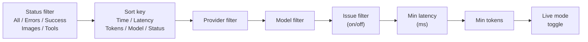
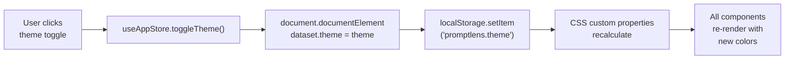
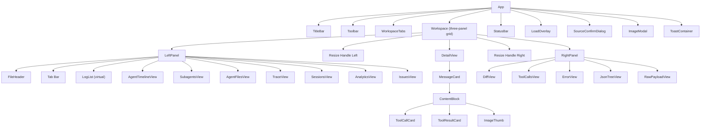

# Interface Overview

PromptLens uses a three-panel layout with a title bar at the top and a status bar at the bottom. The design uses a glassmorphism aesthetic with CSS custom properties for theming.

## Layout Diagram

```
+------------------------------------------------------------------+
| [Logo] PromptLens    [Open] [Export] [Settings]           [_][O][X] |
+------------------------------------------------------------------+
| [All v] [Time v] [Provider v] [Model v] [!] MinMS MinTokens      |
|                                                     [Live]        |
+----------+----+-------------------------+----+-------------------+
|          | |  |                         | |  |                   |
|  Left    | |  |      Center Panel       | |  |   Right Panel     |
|  Panel   |R|  |                         |R|  |                   |
|          |e|  |   Conversation View     |e|  |   Diff / Tools    |
| Records  |s|  |                         |s|  |   Error / JSON    |
| Timeline |i|  |   Message Cards         |i|  |   Raw             |
| Sessions |z|  |                         |z|  |                   |
| Analytics|e|  |   [Preview] [Text]      |e|  |                   |
| Issues   | |  |   [JSON]                | |  |                   |
|          | |  |                         | |  |                   |
+----------+----+-------------------------+----+-------------------+
| Ready · 2.3s · 1,234 records                                    |
+------------------------------------------------------------------+
```

## Title Bar

The title bar spans the top of the window. It uses Tauri's window API for dragging and traffic light controls:

```tsx
// file: src/app/components/TitleBar.tsx:110
<div className="title-bar" onMouseDown={startDrag} onDoubleClick={() => appWindow.toggleMaximize()}>
```

| Element | Description |
|---------|-------------|
| **Logo + brand name** | Shows the PromptLens logo. The label changes based on the active source (e.g., "Claude Code" for Claude Code sessions). |
| **Open menu** | Dropdown with source type options, recent files, rescan, and cache controls. |
| **Export menu** | Dropdown with all six export formats. |
| **Settings menu** | Dropdown for font and display preferences. |
| **Traffic lights** | Window controls (minimize, maximize/restore, close). Platform-specific styling. |
| **Theme toggle** | Sun/moon icon to switch between light and dark themes. |



## Toolbar

Below the title bar, the toolbar provides quick access to filters and sorting:



## Workspace Tabs

When multiple files are open, workspace tabs appear between the toolbar and the three-panel workspace. Each tab represents an open file.

```tsx
// file: src/app/components/Workspace.tsx:43
<div className="workspace-tabs" role="tablist">
  {sessionTabs.map((tab) => (
    <button
      key={tab.id}
      role="tab"
      aria-selected={tab.id === activeSessionTabId}
      className={`${tab.kind === "subagent" ? "subagent-tab" : ""} ${tab.id === activeSessionTabId ? "active" : ""}`}
      onClick={() => onActivate(tab.id)}
      onContextMenu={(e) => handleContextMenu(e, tab.id)}
    >
      <span>{tab.label}</span>
      {tab.kind === "subagent" && (
        <span className="tab-close" onClick={(e) => { e.stopPropagation(); onClose(tab.id); }}>
          &times;
        </span>
      )}
    </button>
  ))}
</div>
```

- Click a tab to switch to that file.
- Right-click a tab to see context menu options: Close, Close Others, Close All.
- Press `Ctrl+W` to close the active tab.

For agent sessions, **session tabs** are also shown here. The "Main" tab shows the primary conversation. Subagent tabs are added when you double-click a subagent task.

## Left Panel

The left panel is the navigation hub. It has its own tab bar at the top:

| Tab | Icon | When Available | Description |
|-----|------|----------------|-------------|
| **Records** | File | Always | Filterable, sortable list of all records |
| **Timeline** | Terminal | Agent sessions only | Chronological list of agent events |
| **Subagents** | Bot | Agent sessions only | Subagent tasks with status |
| **Agent Files** | File | Agent sessions only | Files the agent operated on |
| **Trace** | Network | Audit logs only | Records grouped by trace/session ID |
| **Sessions** | User | Audit logs only | Heuristic session grouping |
| **Analytics** | Bar chart | Always | Metrics, charts, and metadata |
| **Issues** | Warning triangle | Always | Records with detected issues |

The left panel is resizable. Drag the resize handle (thin vertical line) between the left panel and center panel to adjust width. Panel width constraints are defined as constants:

```tsx
// file: src/app/types.ts:162
export const LEFT_MIN = 260;
export const LEFT_MAX = 560;
export const LEFT_DEFAULT = 340;
export const RIGHT_MIN = 300;
export const RIGHT_MAX_RATIO = 0.6;
export const RIGHT_DEFAULT = 400;
export const CENTER_MIN = 200;
```

## Center Panel

The center panel shows the conversation details of the selected record. It displays:

1. **Record header** -- Model name, provider, line number, latency, and status badge.
2. **Error card** (if applicable) -- Error type and message.
3. **Request messages** -- From the LLM API request.
4. **Response messages** -- From the LLM API response.

Each message card has:
- **Role label** (system, user, assistant, tool)
- **View mode buttons** (Preview, Text, JSON)
- **Copy button** to copy the message to clipboard
- **Content** rendered according to the selected view mode

## Right Panel

The right panel provides supplementary views. It has five tabs:

| Tab | Icon | Description |
|-----|------|-------------|
| **Diff** | GitCompare | Side-by-side comparison of two records |
| **Tools** | Wrench | Structured view of tool calls and results |
| **Error** | Warning circle | Error details and stack trace |
| **JSON** | Curly braces | Interactive JSON tree view with search |
| **Raw** | Code | Raw JSON payload with syntax highlighting |

## Status Bar

At the bottom of the window, the status bar displays:

```tsx
// file: src/app/components/Workspace.tsx:81
export const StatusBar = memo(function StatusBar({ loading, searching, scanProgress, ... }) {
  const percent = active && active.totalBytes > 0
    ? Math.min(100, (active.processedBytes / active.totalBytes) * 100)
    : 0;
  // ...
  return (
    <footer className="status-bar">
      <div className="status-right">
        <div className="status-progress-track" role="progressbar" ...>
          <div style={{ width: `${percent}%` }} />
        </div>
        <span className="status-progress-label">{label}</span>
        <button onClick={loading ? onCancelScan : onCancelSearch}>Cancel</button>
      </div>
    </footer>
  );
});
```

- Current status (Ready, Scanning, Searching)
- Scan/search duration
- Record count
- Cancel button when scan or search is in progress
- Progress bar during long operations

## Theme System

PromptLens uses CSS custom properties for theming. Themes are applied via the `data-theme` attribute on the root element:

```css
/* file: src/styles/variables.css:5 */
:root {
  --app-bg: #0a0c10;
  --glass-bg: rgba(22, 27, 36, 0.72);
  --text-primary: #e8eaed;
  --accent: #5b9cf6;
  --success: #34d399;
  --danger: #f87171;
  /* ... */
}

:root[data-theme="light"] {
  --app-bg: #e8ecf1;
  --glass-bg: rgba(255, 255, 255, 0.55);
  --text-primary: #1d1d1f;
  --accent: #3478f6;
  /* ... */
}
```



## Component Hierarchy

The UI is organized as a React component tree:



## State Management

PromptLens uses [Zustand](https://zustand-demo.pmnd.rs/) for state management with two stores:

| Store | Purpose | Key State |
|-------|---------|-----------|
| **App Store** | UI preferences and transient state | Theme, settings, filters, sort key, query, left/right tabs, image preview |
| **Workspace Store** | File and tab state | Open tabs, active tab, recent files, loading state, scan/search progress |

Settings and workspace state are persisted to `localStorage` and restored on startup.

## Resize Handles

The three-panel layout includes two resize handles -- thin vertical lines between panels that can be dragged to adjust widths:

```tsx
// file: src/app/components/Workspace.tsx
<div className="resize-handle" onMouseDown={startResize} />
```

Dragging a resize handle updates the panel width in the Zustand store, which triggers a re-render with the new dimensions. The widths are clamped to their min/max bounds and persisted to `localStorage`.

| Handle | Between | Min Left | Max Left | Min Right | Max Right |
|--------|---------|----------|----------|-----------|-----------|
| Left handle | Left panel and Center panel | 260px | 560px | -- | -- |
| Right handle | Center panel and Right panel | -- | -- | 300px | 60% of window |

## Responsive Behavior

PromptLens is designed for desktop use with a minimum recommended resolution of 1280x720. At smaller sizes:

- The center panel shrinks to its minimum width (200px)
- Left and right panels maintain their minimum widths
- Content within panels scrolls vertically

## Color Coding

PromptLens uses consistent color coding throughout the interface:

| Color | CSS Variable | Usage |
|-------|-------------|-------|
| Green | `--success` | Success status, successful records |
| Red | `--error` | Error status, error records, error badges |
| Yellow/Orange | `--warning` | Invalid JSON, warnings |
| Blue | `--accent` | Brand color, links, active states, selection highlight |
| Gray | `--muted` | Secondary text, disabled states, borders |

## Accessibility Features

| Feature | Implementation |
|---------|---------------|
| ARIA roles | Tab lists use `role="tablist"` and `role="tab"` |
| ARIA selected | Active tabs have `aria-selected="true"` |
| ARIA labels | Interactive elements have `title` or `aria-label` |
| Keyboard navigation | All interactive elements are focusable |
| Progress bar | Uses `role="progressbar"` with `aria-valuenow` |
| Error alerts | Error banners use `role="alert"` |
| Dialog semantics | Image preview uses `role="dialog"` and `aria-modal="true"` |

## Performance Characteristics

| Aspect | Strategy |
|--------|----------|
| Record list | Virtual scrolling via `@tanstack/react-virtual` |
| Filtering | `useMemo` pipeline, recalculated only on dependency change |
| Message rendering | Memoized `MessageCard` components |
| Theme switching | CSS custom property cascade, no JS recalculation |
| Panel resize | Direct style update, no layout thrashing |
| Tab switching | Instant, no re-fetching (data cached in store) |

## Toast Notifications

PromptLens uses toast notifications to communicate transient messages to the user. Toasts appear in the bottom-right corner and auto-dismiss after a few seconds.

| Toast Type | Color | Example |
|-----------|-------|---------|
| Success | Green | "Copied to clipboard.", "Scan cache cleared." |
| Error | Red | "Copy failed.", "Search stopped after 1,000 matches." |
| Info | Blue | "File changed on disk. Load appended records?" |

Toasts are managed by the `useAppStore` Zustand store:

```tsx
// file: src/app/store.ts
addToast: (message, type) =>
  set((s) => ({
    toasts: [...s.toasts, { id: Date.now(), message, type }],
  })),
```

## Image Preview Modal

When an embedded image is clicked in a message card, a full-size preview modal opens. The modal uses `role="dialog"` and `aria-modal="true"` for accessibility. Press `Escape` or click outside the image to close it.

The modal is managed by the `imagePreview` state in `useAppStore`:

```tsx
// file: src/app/store.ts
setImagePreview: (url) => set({ imagePreview: url }),
```

## Source Confirmation Dialog

When auto-detection identifies a file as an agent session rather than a standard audit log, a confirmation dialog appears asking the user to confirm the detected source type. The user can accept the detected source or fall back to opening it as an audit log.

This dialog is managed by the `sourceConfirm` state in the workspace store and rendered as an overlay on top of the main workspace.

## Load Overlay

During long-running operations like file scanning, a semi-transparent overlay may appear over the workspace. The overlay shows:

- A spinner or progress indicator
- The current operation name ("Scanning...", "Searching...")
- A cancel button

The overlay is controlled by the `loading` and `searching` states in the workspace store. It automatically dismisses when the operation completes or is cancelled.

## Keyboard Navigation Order

Tab navigation follows the visual order of elements:

1. Title bar menu buttons (Open, Export, Setting)
2. Theme toggle
3. Toolbar filters (status, sort, provider, model)
4. Left panel tabs
5. Record list items
6. Center panel message cards
7. Right panel tabs
8. Right panel content

This order ensures that keyboard users can reach all interactive elements efficiently.
