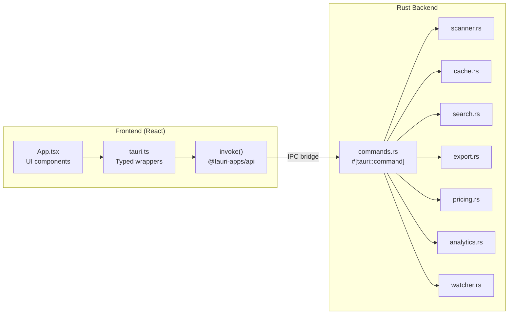
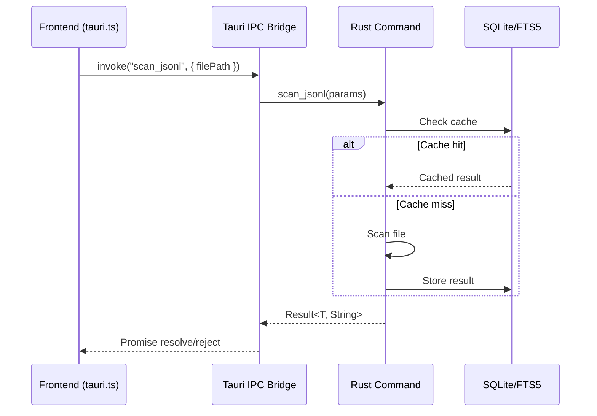
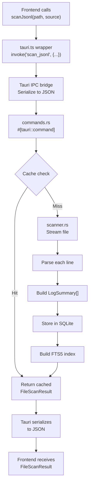

# IPC Commands

PromptLens exposes 21 Tauri IPC commands. The frontend calls these commands via `invoke()` wrappers defined in `src/tauri.ts`.

## IPC Architecture





## Command Overview

| # | Command | Category | Description |
|---|---------|----------|-------------|
| 1 | `open_file_dialog` | File | Open native file picker |
| 2 | `scan_jsonl` | Scan | Full scan of a JSONL file |
| 3 | `scan_jsonl_incremental` | Scan | Scan new lines appended to a file |
| 4 | `cancel_scan` | Scan | Cancel in-progress scan |
| 5 | `clear_scan_cache` | Cache | Delete the SQLite cache |
| 6 | `get_cache_info` | Cache | Get cache file path and existence |
| 7 | `get_file_status` | File | Check file existence, size, modified time |
| 8 | `save_text_file` | Export | Save text via native save dialog |
| 9 | `export_records` | Export | Export selected records as JSONL or Markdown |
| 10 | `read_record` | Read | Read and normalize a single record by byte offset |
| 11 | `detect_log_source` | Agent | Auto-detect log source type |
| 12 | `read_agent_session` | Agent | Read full agent session from JSONL file |
| 13 | `read_agent_session_incremental` | Agent | Read new agent events from byte offset |
| 14 | `search_jsonl` | Search | Full-text search with FTS5 or substring mode |
| 15 | `cancel_search` | Search | Cancel in-progress search |
| 16 | `list_system_fonts` | System | List available system fonts |
| 17 | `get_pricing_table` | Pricing | Return full model pricing table |
| 18 | `calculate_costs` | Pricing | Calculate cost estimates for token usage |
| 19 | `start_file_watch` | Watch | Start watching file for changes |
| 20 | `stop_file_watch` | Watch | Stop file watcher |
| 21 | `compute_analytics` | Analytics | Compute analytics from cached scan results |

## Command Categories

```mermaid
flowchart TB
    subgraph FileOps["File Operations"]
        A["open_file_dialog"]
        B["get_file_status"]
        C["save_text_file"]
    end

    subgraph ScanOps["Scan Operations"]
        D["scan_jsonl"]
        E["scan_jsonl_incremental"]
        F["cancel_scan"]
    end

    subgraph CacheOps["Cache Operations"]
        G["clear_scan_cache"]
        H["get_cache_info"]
    end

    subgraph SearchOps["Search Operations"]
        I["search_jsonl"]
        J["cancel_search"]
    end

    subgraph ExportOps["Export Operations"]
        K["export_records"]
    end

    subgraph ReadOps["Read Operations"]
        L["read_record"]
    end

    subgraph AgentOps["Agent Operations"]
        M["detect_log_source"]
        N["read_agent_session"]
        O["read_agent_session_incremental"]
    end

    subgraph PricingOps["Pricing Operations"]
        P["get_pricing_table"]
        Q["calculate_costs"]
    end

    subgraph WatchOps["Watch Operations"]
        R["start_file_watch"]
        S["stop_file_watch"]
    end

    subgraph AnalyticsOps["Analytics"]
        T["compute_analytics"]
    end

    subgraph SystemOps["System"]
        U["list_system_fonts"]
    end
```



## Detailed Command Reference

### 1. `open_file_dialog`

Opens a native file picker dialog filtered to JSONL files.

| Parameter | Type | Required | Description |
|-----------|------|----------|-------------|
| (none) | - | - | - |

**Returns:** `string | null` -- File path, or `null` if cancelled.

```typescript
// file: src/tauri.ts:17-19
export async function openFileDialog(): Promise<string | null> {
  return invoke("open_file_dialog");
}
```

### 2. `scan_jsonl`

Performs a full scan of a JSONL file, parsing every line and building summaries.

| Parameter | Type | Required | Description |
|-----------|------|----------|-------------|
| `filePath` | `string` | Yes | Absolute path to the JSONL file |
| `logSource` | `LogSource` | No | Parser hint: `"audit"`, `"codex"`, `"opencode"`, `"openclaw"`, `"claude_code"`, `"generic_agent"` |

**Returns:** `FileScanResult`

```typescript
// file: src/tauri.ts:21-23
export async function scanJsonl(
  filePath: string,
  logSource: LogSource = "audit"
): Promise<FileScanResult> {
  return invoke("scan_jsonl", { filePath, logSource });
}
```

### 3. `scan_jsonl_incremental`

Scans only new lines appended since the last scan, using byte offset for O(1) seeking.

| Parameter | Type | Required | Description |
|-----------|------|----------|-------------|
| `filePath` | `string` | Yes | Absolute path to the JSONL file |
| `fromOffset` | `number` | Yes | Byte offset to seek to |
| `fromLineNumber` | `number` | Yes | Line number to resume from |

**Returns:** `IncrementalScanResult`

```typescript
// file: src/tauri.ts:25-31
export async function scanJsonlIncremental(
  filePath: string,
  fromOffset: number,
  fromLineNumber: number,
): Promise<IncrementalScanResult> {
  return invoke("scan_jsonl_incremental", { filePath, fromOffset, fromLineNumber });
}
```

### 4. `cancel_scan`

Sets the cancellation flag to stop an in-progress scan.

| Parameter | Type | Required | Description |
|-----------|------|----------|-------------|
| (none) | - | - | - |

**Returns:** `void`

```typescript
// file: src/tauri.ts:33-35
export async function cancelScan(): Promise<void> {
  return invoke("cancel_scan");
}
```

### 5. `clear_scan_cache`

Deletes the SQLite cache file.

| Parameter | Type | Required | Description |
|-----------|------|----------|-------------|
| (none) | - | - | - |

**Returns:** `void`

```typescript
// file: src/tauri.ts:37-39
export async function clearScanCache(): Promise<void> {
  return invoke("clear_scan_cache");
}
```

### 6. `get_cache_info`

Returns the path and existence status of the SQLite cache.

| Parameter | Type | Required | Description |
|-----------|------|----------|-------------|
| (none) | - | - | - |

**Returns:** `CacheInfo`

```typescript
// file: src/tauri.ts:41-43
export async function getCacheInfo(): Promise<CacheInfo> {
  return invoke("get_cache_info");
}
```

### 7. `get_file_status`

Checks whether a file exists, its size, and last modified timestamp.

| Parameter | Type | Required | Description |
|-----------|------|----------|-------------|
| `filePath` | `string` | Yes | Absolute path to the file |

**Returns:** `FileStatus`

```typescript
// file: src/tauri.ts:45-47
export async function getFileStatus(filePath: string): Promise<FileStatus> {
  return invoke("get_file_status", { filePath });
}
```

### 8. `save_text_file`

Opens a native save dialog and writes text content to the chosen path.

| Parameter | Type | Required | Description |
|-----------|------|----------|-------------|
| `defaultFileName` | `string` | Yes | Suggested file name |
| `contents` | `string` | Yes | Text content to write |

**Returns:** `string | null` -- Save path, or `null` if cancelled.

```typescript
// file: src/tauri.ts:49-51
export async function saveTextFile(
  defaultFileName: string,
  contents: string
): Promise<string | null> {
  return invoke("save_text_file", { defaultFileName, contents });
}
```

### 9. `export_records`

Exports selected records in the specified format via a save dialog.

| Parameter | Type | Required | Description |
|-----------|------|----------|-------------|
| `filePath` | `string` | Yes | Source JSONL file path |
| `lineNumbers` | `number[]` | Yes | Line numbers of records to export |
| `kind` | `"raw_jsonl" \| "normalized_jsonl" \| "session_markdown"` | Yes | Export format |
| `defaultFileName` | `string` | Yes | Suggested file name |

**Returns:** `string | null` -- Save path, or `null` if cancelled.

```typescript
// file: src/tauri.ts:53-60
export async function exportRecords(
  filePath: string,
  lineNumbers: number[],
  kind: "raw_jsonl" | "normalized_jsonl" | "session_markdown",
  defaultFileName: string,
): Promise<string | null> {
  return invoke("export_records", {
    request: { filePath, lineNumbers, kind, defaultFileName }
  });
}
```

### 10. `read_record`

Seeks to a byte offset in the file, reads that line, and normalizes it.

| Parameter | Type | Required | Description |
|-----------|------|----------|-------------|
| `filePath` | `string` | Yes | Absolute path to the JSONL file |
| `byteOffset` | `number` | Yes | Byte offset of the record |
| `lineNumber` | `number` | Yes | Line number of the record |

**Returns:** `RecordDetail`

```typescript
// file: src/tauri.ts:62-68
export async function readRecord(
  filePath: string,
  byteOffset: number,
  lineNumber: number,
): Promise<RecordDetail> {
  return invoke("read_record", { filePath, byteOffset, lineNumber });
}
```

### 11. `detect_log_source`

Reads the first 20 lines of a file and votes on the most likely log source type.

| Parameter | Type | Required | Description |
|-----------|------|----------|-------------|
| `filePath` | `string` | Yes | Absolute path to the JSONL file |

**Returns:** `string | null` -- Detected source type, or `null`.

```typescript
// file: src/tauri.ts:70-72
export async function detectLogSource(filePath: string): Promise<LogSource | null> {
  return invoke("detect_log_source", { filePath });
}
```

### 12. `read_agent_session`

Reads and parses an entire agent session JSONL file, including subagent sessions.

| Parameter | Type | Required | Description |
|-----------|------|----------|-------------|
| `filePath` | `string` | Yes | Absolute path to the agent session JSONL |
| `logSource` | `LogSource` | No | Agent log source type hint |

**Returns:** `AgentSessionResult`

```typescript
// file: src/tauri.ts:74-76
export async function readAgentSession(
  filePath: string,
  logSource: LogSource = "audit"
): Promise<AgentSessionResult> {
  return invoke("read_agent_session", { filePath, logSource });
}
```

### 13. `read_agent_session_incremental`

Reads new agent events from a byte offset (for append-only files).

| Parameter | Type | Required | Description |
|-----------|------|----------|-------------|
| `filePath` | `string` | Yes | Absolute path to the JSONL file |
| `fromOffset` | `number` | Yes | Byte offset to seek to |
| `fromLineNumber` | `number` | Yes | Line number to resume from |
| `logSource` | `LogSource` | No | Agent log source type hint |

**Returns:** `AgentSessionIncrementalResult`

```typescript
// file: src/tauri.ts:78-85
export async function readAgentSessionIncremental(
  filePath: string,
  fromOffset: number,
  fromLineNumber: number,
  logSource: LogSource = "audit",
): Promise<AgentSessionIncrementalResult> {
  return invoke("read_agent_session_incremental", {
    filePath, fromOffset, fromLineNumber, logSource
  });
}
```

### 14. `search_jsonl`

Performs a full-text search using the FTS5 index or substring fallback.

| Parameter | Type | Required | Description |
|-----------|------|----------|-------------|
| `filePath` | `string` | Yes | Absolute path to the JSONL file |
| `query` | `string` | Yes | Search query string |
| `mode` | `string` | No | `"substring"` (default) or `"fts5"` |

**Returns:** `SearchResponse`

```typescript
// file: src/tauri.ts:87-89
export async function searchJsonl(
  filePath: string,
  query: string,
  mode: string = "substring"
): Promise<SearchResponse> {
  return invoke("search_jsonl", { filePath, query, mode });
}
```

### 15. `cancel_search`

Sets the cancellation flag to stop an in-progress search.

| Parameter | Type | Required | Description |
|-----------|------|----------|-------------|
| (none) | - | - | - |

**Returns:** `void`

```typescript
// file: src/tauri.ts:91-93
export async function cancelSearch(): Promise<void> {
  return invoke("cancel_search");
}
```

### 16. `list_system_fonts`

Lists all available system fonts (uses `fc-list` on Linux/macOS).

| Parameter | Type | Required | Description |
|-----------|------|----------|-------------|
| (none) | - | - | - |

**Returns:** `string[]`

```typescript
// file: src/tauri.ts:95-97
export async function listSystemFonts(): Promise<string[]> {
  return invoke("list_system_fonts");
}
```

### 17. `get_pricing_table`

Returns the full model pricing table.

| Parameter | Type | Required | Description |
|-----------|------|----------|-------------|
| (none) | - | - | - |

**Returns:** `ModelPricing[]`

```typescript
// file: src/tauri.ts:99-101
export async function getPricingTable(): Promise<ModelPricing[]> {
  return invoke("get_pricing_table");
}
```

### 18. `calculate_costs`

Calculates cost estimates for a list of token usage records.

| Parameter | Type | Required | Description |
|-----------|------|----------|-------------|
| `requests[].model` | `string` | Yes | Model name |
| `requests[].prompt_tokens` | `number` | No | Input token count |
| `requests[].completion_tokens` | `number` | No | Output token count |

**Returns:** `CostEstimate[]`

```typescript
// file: src/tauri.ts:103-107
export async function calculateCosts(
  requests: Array<{ model: string; prompt_tokens?: number; completion_tokens?: number }>,
): Promise<CostEstimate[]> {
  return invoke("calculate_costs", { requests });
}
```

### 19. `start_file_watch`

Starts watching a file for changes (append-only). Emits events via the Tauri event system.

| Parameter | Type | Required | Description |
|-----------|------|----------|-------------|
| `filePath` | `string` | Yes | Absolute path to watch |

**Returns:** `void`

```typescript
// file: src/tauri.ts:109-111
export async function startFileWatch(filePath: string): Promise<void> {
  return invoke("start_file_watch", { filePath });
}
```

### 20. `stop_file_watch`

Stops the active file watcher.

| Parameter | Type | Required | Description |
|-----------|------|----------|-------------|
| (none) | - | - | - |

**Returns:** `void`

```typescript
// file: src/tauri.ts:113-115
export async function stopFileWatch(): Promise<void> {
  return invoke("stop_file_watch");
}
```

### 21. `compute_analytics`

Computes analytics summaries from cached scan results. Requires a prior `scan_jsonl` call.

| Parameter | Type | Required | Description |
|-----------|------|----------|-------------|
| `filePath` | `string` | Yes | Absolute path to the JSONL file |

**Returns:** `ComputedAnalyticsRaw`

```typescript
// file: src/tauri.ts:117-119
export async function computeAnalytics(filePath: string): Promise<ComputedAnalyticsRaw> {
  return invoke("compute_analytics", { filePath });
}
```

## TypeScript Wrapper Location

All IPC wrappers are defined in `src/tauri.ts`. Each function calls `invoke()` from `@tauri-apps/api/core` with the command name and arguments.

```typescript
// file: src/tauri.ts:1
import { invoke } from "@tauri-apps/api/core";
```

## Error Handling

All commands that return `Result<T, String>` in Rust reject the Promise with the error string on the frontend. Use try/catch:

```typescript
try {
  const result = await scanJsonl(path);
} catch (err) {
  console.error("Scan failed:", err);
}
```

## IPC Data Flow


