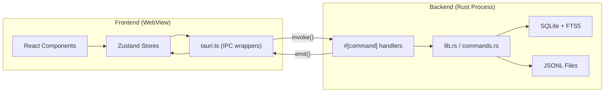
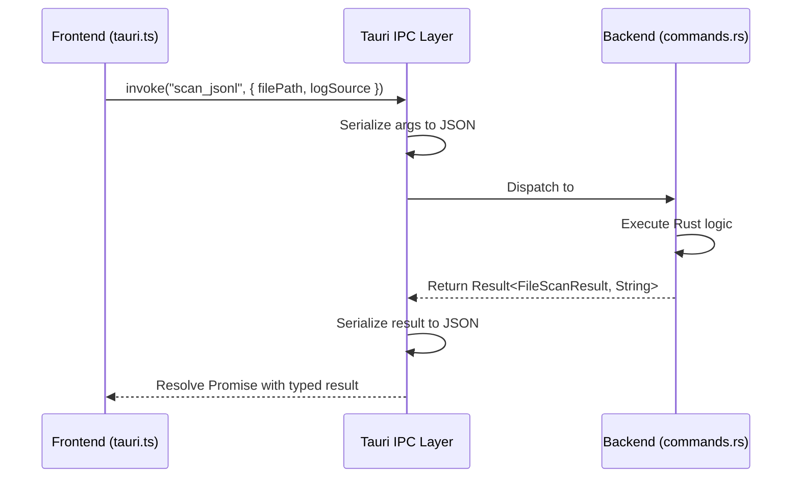
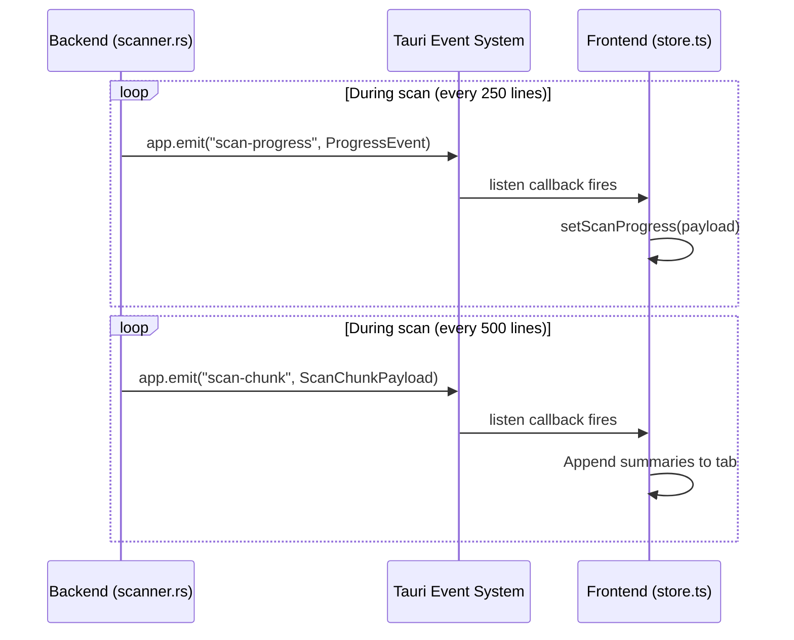
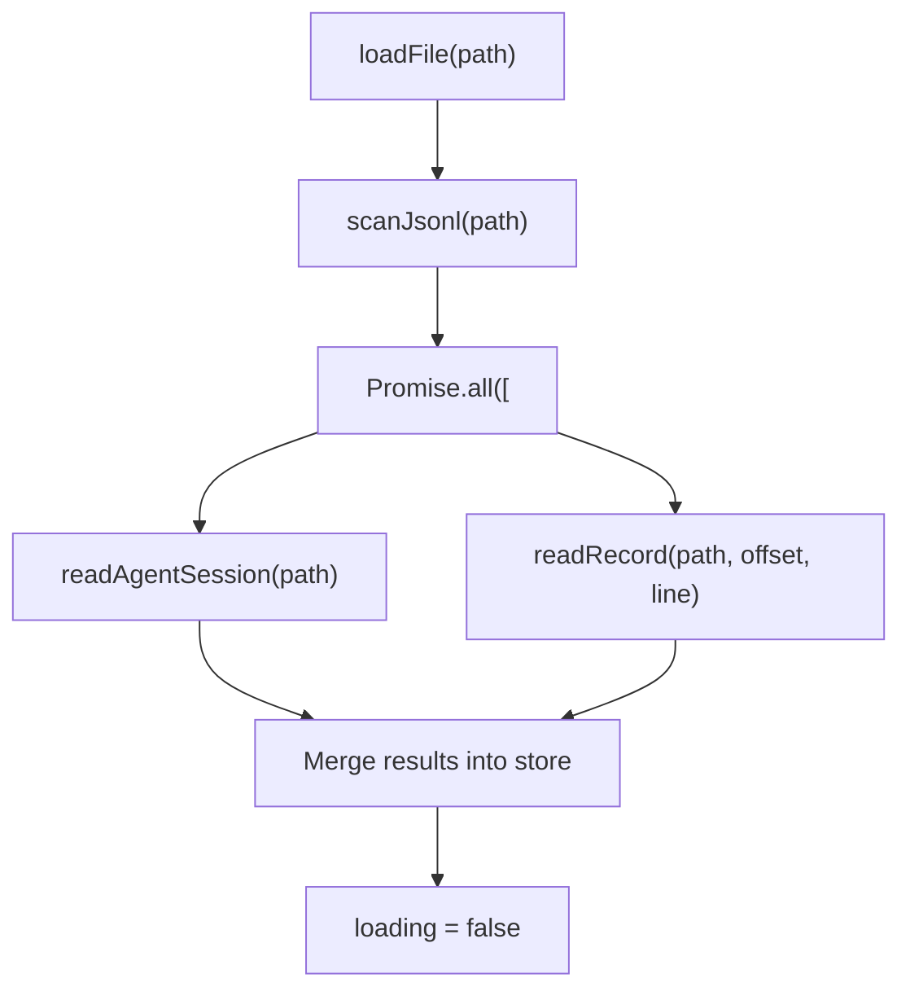
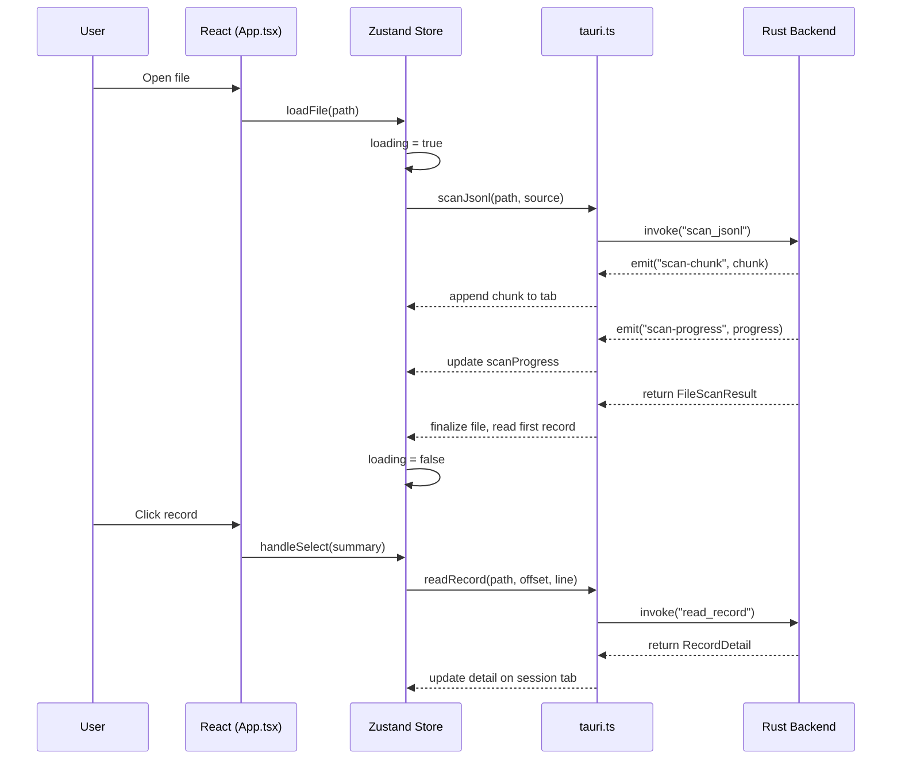

# IPC Communication

PromptLens is a Tauri v2 desktop application. The React frontend and Rust backend run in separate processes, communicating through Tauri's IPC (Inter-Process Communication) layer. There is no HTTP server, no WebSocket, and no network calls.

## Architecture Overview



## Two Communication Patterns

Tauri v2 supports two IPC patterns, and PromptLens uses both:

### Pattern 1: Request/Response (`invoke`)

The frontend calls a named command and receives a response. This is the primary pattern used for all data fetching and mutation.

```typescript
// file: src/tauri.ts:21
export async function scanJsonl(
  filePath: string,
  logSource: LogSource = "audit",
): Promise<FileScanResult> {
  return invoke("scan_jsonl", { filePath, logSource });
}
```

```rust
// file: src-tauri/src/commands.rs (approximate)
#[tauri::command]
async fn scan_jsonl(
    app: tauri::AppHandle,
    state: tauri::State<'_, AppState>,
    file_path: String,
    log_source: LogSource,
) -> Result<FileScanResult, String> {
    // ... scanning logic
}
```



### Pattern 2: Server-Push Events (`listen`)

The backend emits events to the frontend without a prior request. Used for progress updates during long-running operations.

```typescript
// file: src/app/store.ts:77
import { listen } from "@tauri-apps/api/event";

const unlistenScan = listen<ProgressEvent>("scan-progress", (event) => {
  workspaceStore.setScanProgress(event.payload);
});

const unlistenSearch = listen<ProgressEvent>("search-progress", (event) => {
  workspaceStore.setSearchProgress(event.payload);
});

const unlistenChunk = listen<ScanChunkPayload>("scan-chunk", (event) => {
  // Append chunk summaries to the active tab's file
});

const unlistenFileChange = listen<string>("file-changed", () => {
  // Trigger incremental rescan in live mode
});
```



## Complete Command Reference

All commands grouped by domain. Each wrapper in `src/tauri.ts` maps 1:1 to a Rust `#[tauri::command]` handler.

### File Operations

| Wrapper | Signature | Returns | Source |
|---------|-----------|---------|--------|
| `openFileDialog()` | No params | `string \| null` | `tauri.ts:17` |
| `getFileStatus(filePath)` | `{ filePath }` | `FileStatus` | `tauri.ts:45` |
| `saveTextFile(name, contents)` | `{ defaultFileName, contents }` | `string \| null` | `tauri.ts:49` |

### Scanning

| Wrapper | Signature | Returns | Source |
|---------|-----------|---------|--------|
| `scanJsonl(filePath, logSource)` | `{ filePath, logSource }` | `FileScanResult` | `tauri.ts:21` |
| `scanJsonlIncremental(filePath, offset, line)` | `{ filePath, fromOffset, fromLineNumber }` | `IncrementalScanResult` | `tauri.ts:25` |
| `cancelScan()` | No params | `void` | `tauri.ts:33` |
| `detectLogSource(filePath)` | `{ filePath }` | `LogSource \| null` | `tauri.ts:70` |

### Record Access

| Wrapper | Signature | Returns | Source |
|---------|-----------|---------|--------|
| `readRecord(path, offset, line)` | `{ filePath, byteOffset, lineNumber }` | `RecordDetail` | `tauri.ts:62` |
| `readAgentSession(path, source)` | `{ filePath, logSource }` | `AgentSessionResult` | `tauri.ts:74` |
| `readAgentSessionIncremental(path, offset, line, source)` | `{ filePath, fromOffset, fromLineNumber, logSource }` | `AgentSessionIncrementalResult` | `tauri.ts:78` |

### Search

| Wrapper | Signature | Returns | Source |
|---------|-----------|---------|--------|
| `searchJsonl(path, query, mode)` | `{ filePath, query, mode }` | `SearchResponse` | `tauri.ts:87` |
| `cancelSearch()` | No params | `void` | `tauri.ts:91` |

The `mode` parameter accepts `"substring"`, `"regex"`, or `"fts"`.

### Analytics and Pricing

| Wrapper | Signature | Returns | Source |
|---------|-----------|---------|--------|
| `computeAnalytics(filePath)` | `{ filePath }` | `ComputedAnalyticsRaw` | `tauri.ts:117` |
| `getPricingTable()` | No params | `ModelPricing[]` | `tauri.ts:99` |
| `calculateCosts(requests)` | `{ requests }` | `CostEstimate[]` | `tauri.ts:103` |

### Cache and File Watching

| Wrapper | Signature | Returns | Source |
|---------|-----------|---------|--------|
| `clearScanCache()` | No params | `void` | `tauri.ts:37` |
| `getCacheInfo()` | No params | `CacheInfo` | `tauri.ts:41` |
| `startFileWatch(filePath)` | `{ filePath }` | `void` | `tauri.ts:109` |
| `stopFileWatch()` | No params | `void` | `tauri.ts:113` |
| `listSystemFonts()` | No params | `string[]` | `tauri.ts:95` |

## Event Channels

### `scan-progress`

Emits incremental progress during `scan_jsonl`.

```typescript
// file: src/types.ts:122
type ProgressEvent = {
  processedBytes: number;   // Bytes read so far
  totalBytes: number;       // Total file size
  lineNumber: number;       // Current line number being processed
};
```

The `StatusBar` component renders this as a progress bar with percentage and line count.

### `search-progress`

Same type as `scan-progress`, emitted during `search_jsonl`.

### `scan-chunk`

Emits batches of parsed summaries during `scan_jsonl`. This enables progressive rendering:

```typescript
type ScanChunkPayload = {
  filePath: string;
  summaries: LogSummary[];    // Batch of parsed records
  lineFrom: number;
  lineTo: number;
};
```

The workspace store listens for this event and appends the chunk to the active tab:

```typescript
// file: src/app/store.ts (approximate listen setup)
const unlistenChunk = listen<ScanChunkPayload>("scan-chunk", (event) => {
  const chunk = event.payload;
  if (chunk.filePath !== scanningFilePath) return;
  set((s) => ({
    tabs: s.tabs.map((t) =>
      t.id === chunk.filePath
        ? { ...t, file: { ...t.file, summaries: [...t.file.summaries, ...chunk.summaries] } }
        : t,
    ),
  }));
});
```

### `file-changed`

Emitted by the file system watcher when the opened JSONL file is modified. Used by live mode to trigger an incremental rescan.

```typescript
listen<string>("file-changed", () => {
  if (!loading && file) void ws().handleLoadAppendedRecords();
});
```

## Async Patterns

### Concurrent Operations

The `loadFile` action uses `Promise.all` to launch multiple independent operations concurrently:

```typescript
// file: src/app/store.ts (approximate)
const [agentSession, detail] = await Promise.all([
  readAgentSession(result.filePath, source).catch(() => null),
  first
    ? readRecord(result.filePath, first.byteOffset, first.lineNumber).catch(() => null)
    : Promise.resolve(null),
]);
```



Both operations are non-blocking, and their results are merged into the store once both complete. Errors are caught individually so one failure does not block the other.

### Cancellation

Long-running operations (scan, search) support cancellation via dedicated IPC commands:

```typescript
// User clicks "Cancel" in the status bar
<button onClick={loading ? onCancelScan : onCancelSearch}>Cancel</button>

// Handler calls the cancel command
async function onCancelScan() {
  await cancelScan();  // Sets cancel flag in Rust
}
```

```mermaid
sequenceDiagram
    participant User
    participant UI as React
    participant Store as Zustand Store
    participant IPC as tauri.ts
    participant BE as Rust Backend

    User->>UI: Clicks "Cancel"
    UI->>Store: onCancelScan()
    Store->>IPC: cancelScan()
    IPC->>BE: invoke("cancel_scan")
    BE->>BE: cancel_scan.store(true, Relaxed)
    Note over BE: Scanner checks flag next iteration
    BE->>BE: cancelled = true; break
    BE-->>IPC: FileScanResult { cancelled: true }
    IPC-->>Store: result
    Store->>Store: loading = false
    Store-->>UI: Hide loading overlay
```

### Loading State Management

The `loadFile` action uses a loading overlay pattern:

```typescript
// file: src/app/store.ts:395
set({ loading: true, scanProgress: null });

// Yield to let the loading overlay render before heavy work begins
await new Promise((r) => setTimeout(r, 50));

// ... perform scan ...

set({ loading: false, scanProgress: null });
```

The 50ms yield ensures the browser has time to paint the loading overlay before the IPC call blocks the thread. Without this yield, the loading spinner would never appear because the JavaScript thread is blocked by the synchronous IPC call.

### Error Handling

All IPC wrappers can throw exceptions. The store catches errors and routes them to the error display:

```typescript
try {
  const result = await scanJsonl(path, source);
  // ... handle result
} catch (err) {
  if (!options?.quiet) {
    app.setError(err instanceof Error ? err.message : String(err));
  }
} finally {
  set({ loading: false, scanProgress: null });
}
```

Errors are displayed as toast notifications or as a persistent error banner in the UI.

## Type Safety

The IPC boundary is fully typed. The frontend `tauri.ts` file mirrors the Rust command signatures:

```typescript
// file: src/types.ts:25
export type FileScanResult = {
  filePath: string;
  fileName: string;
  fileSize: number;
  modified?: string;
  totalLines: number;
  validRecords: number;
  invalidRecords: number;
  durationMs: number;
  cancelled: boolean;
  cacheHit: boolean;
  summaries: LogSummary[];
};
```

```rust
// file: src-tauri/src/types.rs:49
#[derive(Debug, Serialize, Deserialize, Clone)]
#[serde(rename_all = "camelCase")]
pub(crate) struct FileScanResult {
    pub(crate) file_path: String,
    pub(crate) file_name: String,
    pub(crate) file_size: u64,
    pub(crate) modified: Option<String>,
    pub(crate) total_lines: usize,
    pub(crate) valid_records: usize,
    pub(crate) invalid_records: usize,
    pub(crate) duration_ms: u128,
    pub(crate) cancelled: bool,
    pub(crate) cache_hit: bool,
    pub(crate) summaries: Vec<LogSummary>,
}
```

Tauri handles serialization/deserialization between Rust structs and TypeScript types automatically via serde. Field names are `snake_case` in Rust and `camelCase` in TypeScript, with Tauri handling the conversion via `#[serde(rename_all = "camelCase")]`.

### Type Mapping Table

| Rust Type | TypeScript Type | Serialization |
|-----------|-----------------|---------------|
| `String` | `string` | Direct |
| `u64`, `u128`, `usize` | `number` | Direct |
| `bool` | `boolean` | Direct |
| `Option<T>` | `T \| undefined` | `null` -> `undefined` |
| `Vec<T>` | `T[]` | JSON array |
| `Value` (serde_json) | `unknown` | Pass-through |
| `HashMap<K, V>` | `Record<K, V>` | JSON object |

## Lifecycle



## Performance Considerations

| Aspect | Behavior | Impact |
|--------|----------|--------|
| IPC serialization | JSON serde on both sides | ~1ms for typical payloads |
| Event emission | Every 250 lines for progress | Minimal overhead |
| Chunk emission | Every 500 lines | Batching improves efficiency |
| Cancellation | AtomicBool check per iteration | Near-instant response |
| Concurrent ops | Promise.all for independent calls | Parallel execution |
| Loading yield | 50ms setTimeout before IPC | Ensures UI responsiveness |
