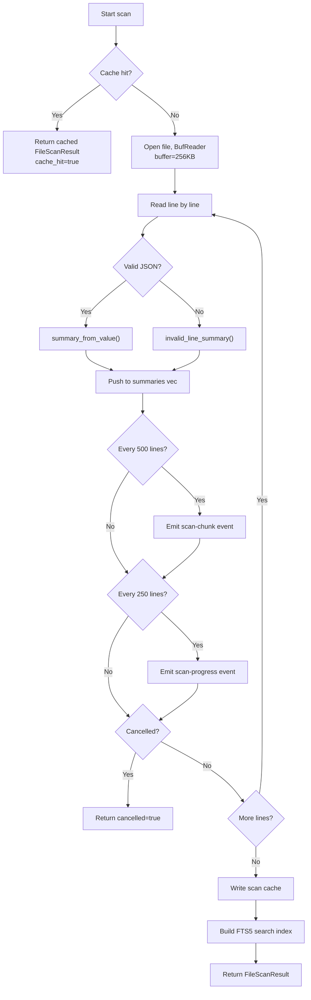
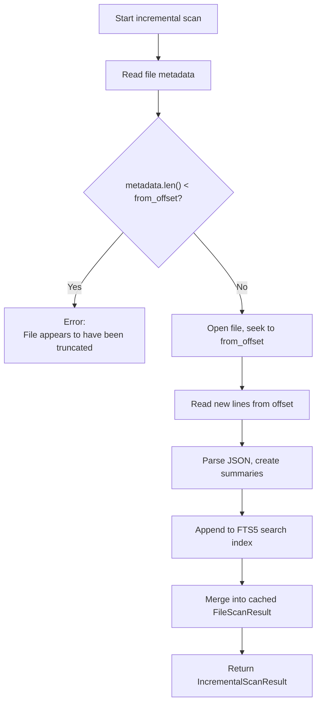
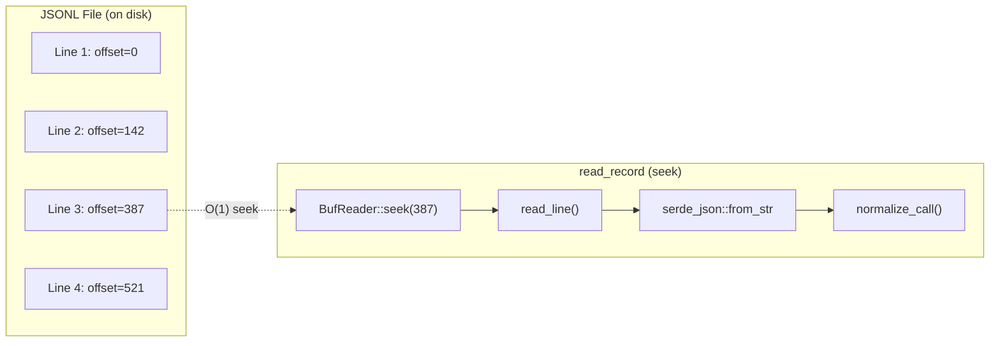

# JSONL Scanner

The JSONL scanner is responsible for reading JSONL files line by line, parsing each line into a `LogSummary`, and building a search index. It supports both full scans and incremental scans for append-only files. The scanner is the entry point for all data ingestion in PromptLens.

## Full Scan

The `scan_jsonl_inner` function in `scanner.rs` performs a complete scan of a JSONL file.



### Cache Key

Before scanning, the function checks the SQLite cache for existing results. The cache key is a combination of three fields:

| Field | Type | Source |
|-------|------|--------|
| `file_path` | `TEXT PRIMARY KEY` | Absolute path to the JSONL file |
| `file_size` | `INTEGER` | `metadata.len()` |
| `modified` | `TEXT` | Unix epoch seconds from `metadata.modified()` |

```rust
// file: src-tauri/src/scanner.rs:30
if let Ok(Some(mut cached)) = read_scan_cache(&file_path, metadata.len(), modified.as_deref()) {
    cached.duration_ms = started.elapsed().as_millis();
    cached.cache_hit = true;
    cached.cancelled = false;
    return Ok(cached);
}
```

### BufReader Configuration

The scanner uses a 256 KB buffer for optimized sequential I/O:

```rust
// file: src-tauri/src/scanner.rs:37
let mut reader = BufReader::with_capacity(256 * 1024, file);
```

### Progress Events

| Event | Condition | Payload |
|-------|-----------|---------|
| `scan-progress` | Line 1, then every 250 lines | `ProgressEvent { processed_bytes, total_bytes, line_number }` |
| `scan-chunk` | Every 500 lines | `ScanChunkPayload { file_path, summaries[], line_from, line_to }` |

### Post-Scan Operations

After a successful (non-cancelled) scan:

```rust
// file: src-tauri/src/scanner.rs:156
if !result.cancelled {
    let _ = write_scan_cache(&result);
    let _ = write_search_index_from_file(&result.file_path);
}
```

1. **Write scan cache**: Serializes the entire `FileScanResult` into the `scan_cache` SQLite table
2. **Build search index**: Calls `write_search_index_from_file` to insert all lines into the FTS5 virtual table

## Incremental Scan

The `scan_jsonl_incremental` function handles append-only file changes without re-reading the entire file.



```rust
// file: src-tauri/src/scanner.rs:163
pub(crate) fn scan_jsonl_incremental(
    file_path: String, from_offset: u64, from_line_number: usize,
) -> Result<IncrementalScanResult, String>
```

### Cache Appending

The incremental scan updates the existing cache entry rather than replacing it:

```rust
// file: src-tauri/src/cache.rs:187
pub(crate) fn append_scan_cache(
    file_path: &str, from_offset: u64, file_size: u64,
    modified: Option<String>, summaries: &[LogSummary],
    total_lines: usize, valid_records: usize, invalid_records: usize, duration_ms: u128,
) -> Result<(), String>
```

## Byte Offset Tracking

Each `LogSummary` records the byte offset where its line begins in the file. This enables O(1) random access to any record via `read_record` using `BufReader::seek(SeekFrom::Start(byte_offset))`.



## Cancellation Mechanism

Both `scan_jsonl` and `search_jsonl` check the `AtomicBool` cancellation flag at the start of each line iteration:

```rust
// file: src-tauri/src/scanner.rs:49
if cancel_flag.is_some_and(|flag| flag.load(Ordering::Relaxed)) {
    cancelled = true;
    break;
}
```

`Relaxed` ordering is used because precise ordering is not critical -- a one-iteration delay in cancellation notification is acceptable.

## Invalid Line Handling

When a line fails JSON parsing, the scanner creates an `invalid_line_summary`:

```rust
// file: src-tauri/src/normalize.rs:636
pub(crate) fn invalid_line_summary(
    line_number: usize, byte_offset: u64, trimmed: &str, err: &serde_json::Error,
) -> LogSummary {
    LogSummary {
        id: format!("line-{line_number}"),
        status: "invalid_json".to_string(),
        preview: Some(trimmed.chars().take(180).collect()),
        parse_error: Some(err.to_string()),
        // ... other fields set to None/false
    }
}
```

## Performance Characteristics

| Metric | Behavior |
|--------|----------|
| I/O buffer | 256 KB `BufReader` for sequential reads |
| Progress granularity | Per-line for progress, per-250 for events, per-500 for chunks |
| Memory usage | All summaries held in memory during scan |
| Cache write | Single JSON serialization of entire `FileScanResult` |
| Index write | One INSERT per line into FTS5 table |

For a typical 100 MB JSONL file (100,000 lines):
- Full scan: ~2-5 seconds depending on line complexity
- Cache hit: &lt;10ms (deserialization only)
- Incremental scan: proportional to appended data size
