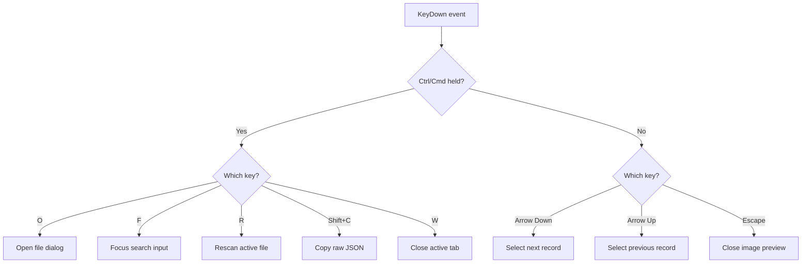
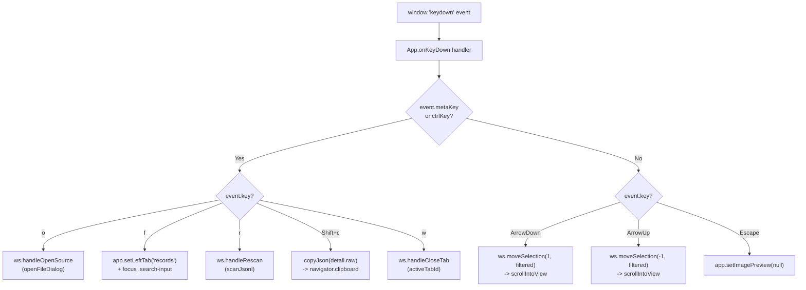
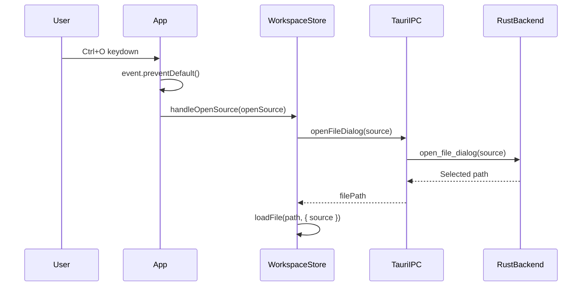
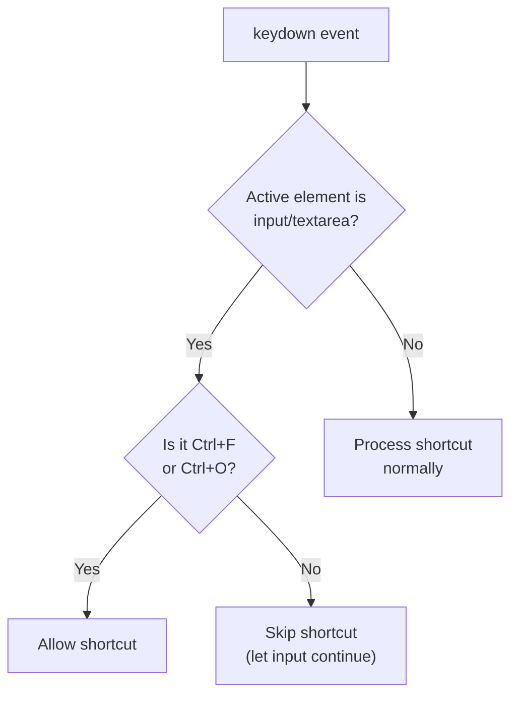
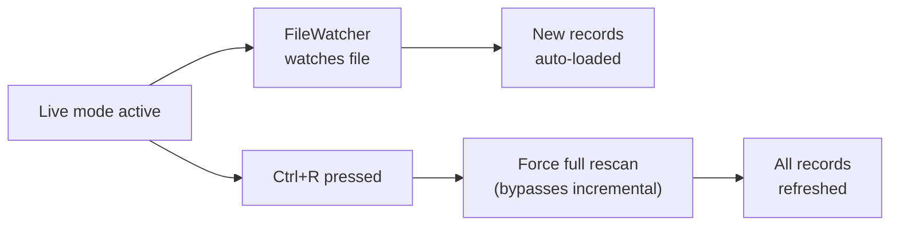
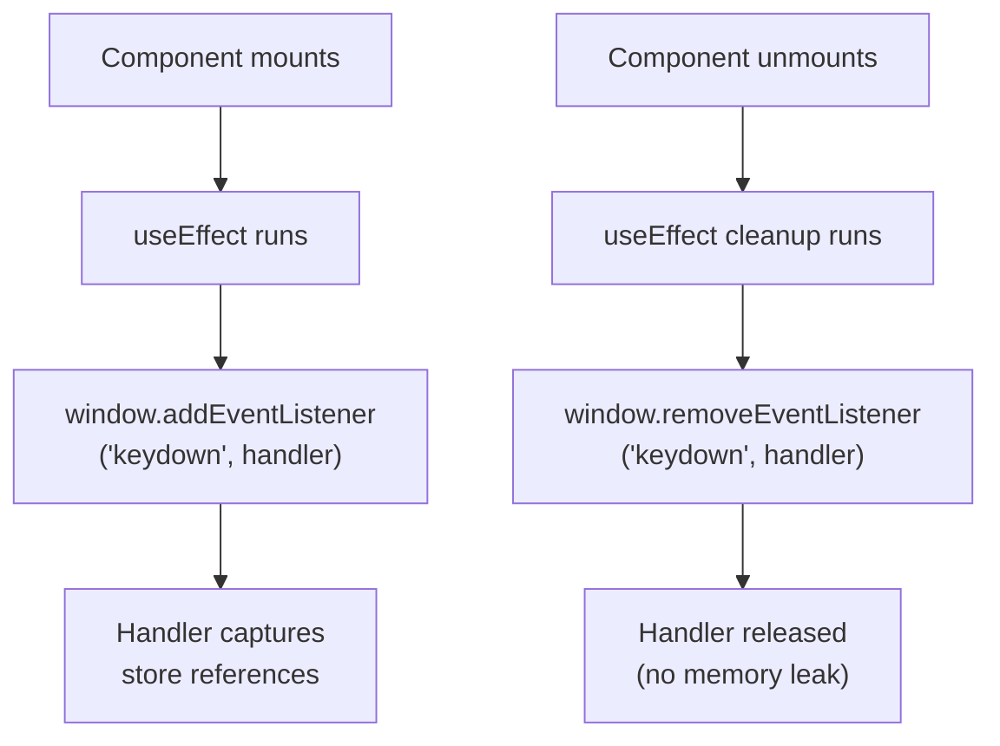

# Keyboard Shortcuts

PromptLens provides keyboard shortcuts for common operations. On macOS, use `Cmd` instead of `Ctrl`.

## File Operations

| Shortcut | Action | Description |
|----------|--------|-------------|
| `Ctrl+O` | Open file | Opens native file dialog to select a JSONL file |
| `Ctrl+R` | Rescan | Forces a full rescan of the current active file |
| `Ctrl+W` | Close tab | Closes the current active workspace or session tab |

## Navigation

| Shortcut | Action | Description |
|----------|--------|-------------|
| `Arrow Down` | Next record | Selects the next record in the list |
| `Arrow Up` | Previous record | Selects the previous record in the list |
| `Escape` | Close preview | Closes the image preview modal |

## Editing and Clipboard

| Shortcut | Action | Description |
|----------|--------|-------------|
| `Ctrl+Shift+C` | Copy JSON | Copies the raw JSON of the selected record to clipboard |
| `Ctrl+F` | Focus search | Focuses the search/filter input in the Records tab |

## Quick Reference Table

| Shortcut | Windows/Linux | macOS |
|----------|:------------:|:-----:|
| Open file dialog | `Ctrl+O` | `Cmd+O` |
| Rescan file | `Ctrl+R` | `Cmd+R` |
| Close tab | `Ctrl+W` | `Cmd+W` |
| Focus search | `Ctrl+F` | `Cmd+F` |
| Copy raw JSON | `Ctrl+Shift+C` | `Cmd+Shift+C` |
| Next record | `Arrow Down` | `Arrow Down` |
| Previous record | `Arrow Up` | `Arrow Up` |
| Close modal | `Escape` | `Escape` |

## How Shortcuts Work

Shortcuts are implemented via a global `keydown` event listener on the `window` object. The listener detects modifier keys (`Ctrl` or `Cmd`) and key names.



## Context-Dependent Behavior

Some shortcuts behave differently depending on the current focus:

| Context | `Enter` Behavior |
|---------|-----------------|
| Search input | Executes full-text search with current query and mode |
| Record list | No action (selection is via click) |
| Filter input | No action (filters are instant) |

| Context | `Escape` Behavior |
|---------|------------------|
| Image preview open | Closes the image preview modal |
| Search results shown | Does not clear results (use x button to clear) |
| Dropdown open | Closes the dropdown |

## Menu Navigation

The title bar menus (Open, Export, Setting) are navigable via mouse. There are no dedicated keyboard shortcuts to open specific menus, except `Ctrl+O` for the file dialog.

| Action | Method |
|--------|--------|
| Open a menu | Click the menu button |
| Close a menu | Click outside the menu, or click the menu button again |
| Select a menu item | Click the item |
| Close all menus | Click the main workspace area |

## Window Management

| Action | Method |
|--------|--------|
| Minimize | Click the minimize button in the traffic light area |
| Maximize/Restore | Click the maximize button or double-click the title bar |
| Close | Click the close button |
| Drag window | Click and drag on the title bar (not on buttons or menus) |

## Shortcut Implementation Details

All shortcuts are registered in a single `keydown` event listener in the main `App` component. The listener is added on mount and removed on unmount.

```tsx
// file: src/app/App.tsx
useEffect(() => {
  const onKeyDown = (e: KeyboardEvent) => {
    const mod = e.metaKey || e.ctrlKey;
    if (mod && e.key === "o") {
      e.preventDefault();
      ws.handleOpenSource(app.openSource);
    }
    if (mod && e.key === "f") {
      e.preventDefault();
      app.setLeftTab("records");
      setTimeout(() => {
        (document.querySelector(".search-input") as HTMLInputElement)?.focus();
      }, 50);
    }
    if (mod && e.key === "r") {
      e.preventDefault();
      ws.handleRescan();
    }
    if (mod && e.key === "w") {
      e.preventDefault();
      ws.handleCloseTab(ws.activeTabId ?? "");
    }
    if (mod && e.shiftKey && e.key === "C") {
      e.preventDefault();
      if (detail?.raw) copyJson(detail.raw);
    }
    if (!mod && e.key === "ArrowDown") {
      e.preventDefault();
      ws.moveSelection(1, filtered);
    }
    if (!mod && e.key === "ArrowUp") {
      e.preventDefault();
      ws.moveSelection(-1, filtered);
    }
    if (!mod && e.key === "Escape") {
      app.setImagePreview(null);
    }
  };
  window.addEventListener("keydown", onKeyDown);
  return () => window.removeEventListener("keydown", onKeyDown);
}, [/* deps */]);
```

The handler captures the current `openSource`, `detail`, and `filtered` values from the stores to perform actions. It calls `event.preventDefault()` for all handled shortcuts to prevent the browser's default behavior.



## moveSelection Internals

The `moveSelection` function calculates the next index based on the current selection and filtered list, then auto-scrolls the virtual list to keep the selected record visible:

```ts
// file: src/app/store.ts
moveSelection: (delta, filtered) => {
  const tab = get().tabs.find((t) => t.id === get().activeTabId);
  if (!tab) return;
  const sel = tab.sessionTabs.find((st) => st.id === tab.activeSessionTabId);
  const current = sel?.selected;
  const idx = current ? filtered.findIndex((s) => s.lineNumber === current.lineNumber) : -1;
  const next = Math.max(0, Math.min(filtered.length - 1, idx + delta));
  const summary = filtered[next];
  if (summary) get().handleSelect(summary);
},
```

## Keyboard-Driven File Opening Flow

When `Ctrl+O` / `Cmd+O` is pressed, the following call chain executes:



## Usage Tips

- Shortcuts only work when no input field has focus (except `Ctrl+F`, which focuses the search input).
- `Ctrl+O` always opens the file dialog for audit logs. To open a specific source type, use the Open menu.
- `Arrow Up/Down` navigation auto-scrolls the virtual list to keep the selected record visible.
- `Escape` only closes the image preview modal when it is open. It does not close other UI elements.
- `Ctrl+W` closes the current active tab when multiple workspace tabs are open.
- The comparison baseline persists until you clear it or close the file.

## Accessibility

PromptLens implements several accessibility features beyond keyboard shortcuts:

| Feature | Implementation |
|---------|---------------|
| Tab navigation | All interactive elements are focusable via keyboard |
| ARIA roles | Tab lists use `role="tablist"` and `role="tab"` |
| ARIA selected state | Active tabs have `aria-selected="true"` |
| ARIA labels | Buttons have `title` or `aria-label` attributes |
| Status announcements | Error banners use `role="alert"` |
| Modal semantics | Image preview uses `role="dialog"` and `aria-modal="true"` |
| Current record | Selected record has `aria-current="true"` |

## Zustand Store Integration

The shortcut handler reads state from both Zustand stores:

```ts
// file: src/app/store.ts
// UI preferences store
export const useAppStore = create<AppState>((set, get) => ({
  theme: loadTheme(),
  leftTab: "records",
  // ...
  setImagePreview: (v) => set({ imagePreview: v }),
  setLeftTab: (t) => set({ leftTab: t }),
}));

// Workspace/file data store
export const useWorkspaceStore = create<WorkspaceState>((set, get) => ({
  tabs: [],
  activeTabId: null,
  // ...
  handleOpenSource: async (source) => { /* open dialog + load file */ },
  handleRescan: async () => { /* force full rescan */ },
  handleCloseTab: (tabId) => { /* close tab */ },
  moveSelection: (delta, filtered) => { /* navigate record list */ },
}));
```

The `useEffect` hook that registers the keydown listener depends on the store values it reads, so it re-registers when those values change, ensuring it always captures the latest state.

## Platform Differences

| Aspect | Windows/Linux | macOS |
|--------|:------------:|:-----:|
| Modifier key | `Ctrl` | `Cmd` |
| Window close | `Ctrl+W` or Alt+F4 | `Cmd+W` or `Cmd+Q` |
| Traffic light buttons | Standard window buttons | macOS-style colored dots |
| File dialog | Native OS dialog | Native macOS dialog |
| Context menu | Right-click | Right-click or Ctrl+click |

All shortcuts listed in the reference table use `Ctrl`. On macOS, replace `Ctrl` with `Cmd`.

## Future Planned Shortcuts

The current shortcut set covers the most common operations. Future versions may add:

- Switching between workspace tabs (e.g., `Ctrl+1` through `Ctrl+9`)
- Switching between left panel tabs (e.g., `Ctrl+[` / `Ctrl+]`)
- Switching between right panel tabs
- Toggling live mode (e.g., `Ctrl+L`)
- Toggling filters (e.g., `Ctrl+E` for errors only)

## Copy JSON Implementation

When `Ctrl+Shift+C` is pressed, the raw JSON of the selected record is copied to the clipboard:

```ts
// src/app/lib/clipboard.ts
export function copyJson(raw: unknown) {
  const text = typeof raw === "string" ? raw : JSON.stringify(raw, null, 2);
  navigator.clipboard.writeText(text).then(
    () => useAppStore.getState().addToast("Copied to clipboard.", "success"),
    () => useAppStore.getState().addToast("Copy failed.", "error"),
  );
}
```

The clipboard function is asynchronous, using the `navigator.clipboard` API. A toast notification confirms success or reports failure.

## Event Propagation and Input Focus

The keydown handler includes a guard to prevent shortcuts from firing when the user is typing in an input field:



This ensures that typing in the search box, filter inputs, or any text field does not accidentally trigger shortcuts like `Ctrl+R` (rescan) or `Ctrl+W` (close tab).

## Shortcut Debugging

If shortcuts are not working, check these common causes:

| Symptom | Cause | Fix |
|---------|-------|-----|
| Shortcut ignored | Input field has focus | Click the main workspace area first |
| Wrong action triggered | Browser shortcut conflict | PromptLens calls `preventDefault()` for handled shortcuts |
| Cmd not working on macOS | Using Ctrl instead of Cmd | Use Cmd as the modifier key on macOS |
| Arrow keys not navigating | Record list not focused | Click a record first, then use arrow keys |
| Ctrl+C not copying | No record selected | Select a record first |

## Shortcuts and Live Mode

When live mode is active, the file watcher runs in the background. Shortcuts continue to work normally in live mode. The `Ctrl+R` rescan shortcut forces a full rescan even when live mode is active, which can be useful if the incremental watcher missed changes.



## Keyboard vs Mouse Operations

Some operations are only available via mouse, some only via keyboard:

| Operation | Keyboard | Mouse |
|-----------|:--------:|:-----:|
| Open file dialog | `Ctrl+O` | Open menu |
| Navigate records | `Arrow Up/Down` | Click record |
| Copy JSON | `Ctrl+Shift+C` | -- |
| Focus search | `Ctrl+F` | Click search input |
| Close tab | `Ctrl+W` | Click tab close button |
| Toggle theme | -- | Click sun/moon icon |
| Open settings | -- | Click Setting menu |
| Export | -- | Click Export menu |
| Rescan | `Ctrl+R` | Open menu > Rescan |
| Close image preview | `Escape` | Click outside modal |

## Shortcut Registration Cleanup

The event listener is properly cleaned up on component unmount to prevent memory leaks:



## Shortcut Conflicts

PromptLens handles shortcuts to avoid conflicts with browser and OS defaults:

| Potential Conflict | How PromptLens Handles It |
|-------------------|--------------------------|
| `Ctrl+F` (browser find) | `preventDefault()` prevents browser find dialog |
| `Ctrl+O` (browser open) | `preventDefault()` prevents browser file open |
| `Ctrl+W` (close tab) | `preventDefault()` prevents browser tab close |
| `Ctrl+R` (browser reload) | `preventDefault()` prevents page reload |
| `Arrow keys` (page scroll) | `preventDefault()` prevents page scrolling |

All handled shortcuts call `event.preventDefault()` to suppress the browser's default behavior. This ensures shortcuts work consistently regardless of the browser engine used by Tauri's webview.

## Shortcut Timing

All shortcuts are processed synchronously in the keydown handler. There is no debounce or delay -- actions execute immediately when the key combination is pressed. For operations that trigger async work (like opening a file or rescanning), the shortcut initiates the operation and the UI updates asynchronously via store subscriptions.

## Modifier Key Detection

The modifier key detection uses both `metaKey` (for Cmd on macOS) and `ctrlKey` (for Ctrl on Windows/Linux):

```ts
const mod = event.metaKey || event.ctrlKey;
```

This single check handles both platforms, so the same shortcut code works on macOS, Windows, and Linux without platform-specific branching.

## Shortcuts and Agent Sessions

When viewing agent sessions, all standard shortcuts continue to work:

| Shortcut | Agent Session Behavior |
|----------|----------------------|
| `Arrow Up/Down` | Navigates the timeline event list (when timeline tab is active) |
| `Ctrl+F` | Focuses the timeline filter input |
| `Ctrl+Shift+C` | Copies the selected agent event's raw JSON |
| `Escape` | Closes image preview (if open) |
| `Ctrl+W` | Closes the active session tab (subagent tab) |

## Related Pages

- [Settings](settings.md) -- Customizing fonts, themes, and display options
- [Interface Overview](interface-overview.md) -- Layout and component details
- [Quick Start](quick-start.md) -- Getting started tutorial
- [Search](search.md) -- Full-text search and quick filters
