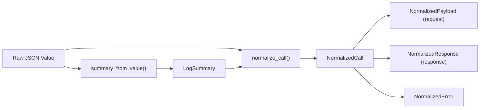
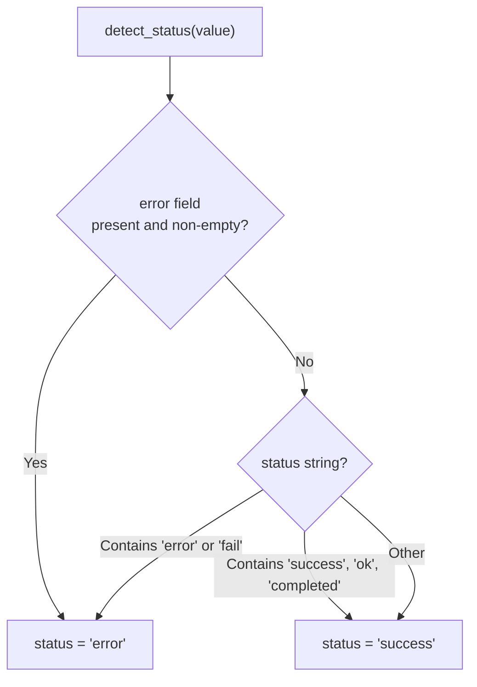
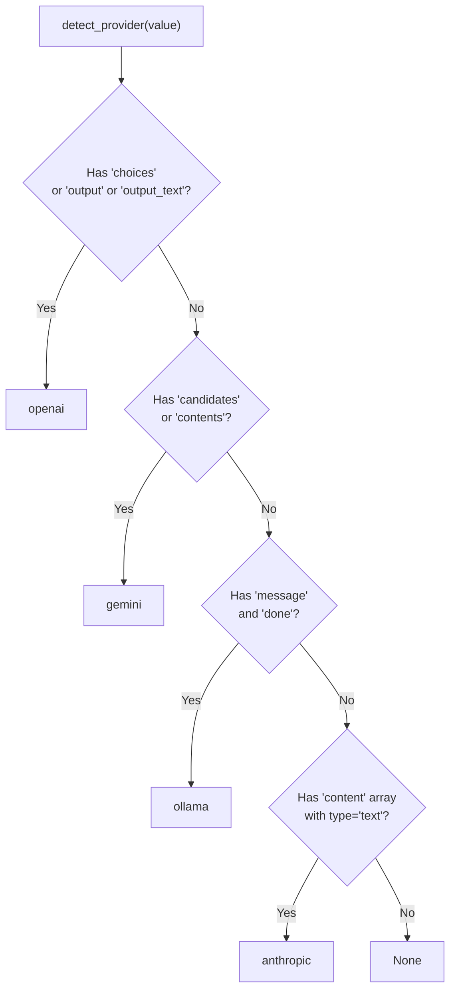
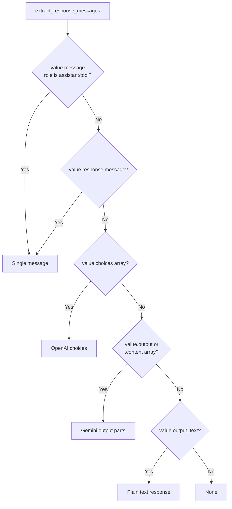

# Normalization Pipeline

The normalization pipeline transforms raw JSONL records from any supported LLM provider into a unified `NormalizedCall` structure. This allows the frontend to render conversations identically regardless of the source provider. The pipeline handles OpenAI, Anthropic, Gemini, Ollama, and Claude Code formats through flexible key lookups and structural heuristics.

## Pipeline Overview



## Step 1: Summary Extraction

`summary_from_value()` extracts metadata fields from the raw JSON value using flexible key lookups:

```rust
// file: src-tauri/src/normalize.rs:16
pub(crate) fn summary_from_value(
    value: &Value, line_number: usize, byte_offset: u64, parse_error: Option<String>,
) -> LogSummary
```

### Field Extraction Strategy

Each field is extracted by trying multiple key names in priority order:

| Field | Keys Tried |
|-------|-----------|
| `id` | `id`, falls back to `line-{line_number}` |
| `timestamp` | `timestamp`, `time`, `created_at`, `createdAt` |
| `provider` | `provider`, `vendor` |
| `model` | `model`, `model_name`, `modelName`, or inside `request` |
| `trace_id` | `trace_id`, `traceId`, `trace`, `traceID`, `run_id`, `runId` |
| `session_id` | `session_id`, `sessionId`, `conversation_id`, `conversationId`, `thread_id`, `threadId` |
| `latency_ms` | `latency_ms`, `latencyMs`, `duration_ms`, `durationMs` |

The multi-key strategy is implemented via the `first_string()` helper:

```rust
// file: src-tauri/src/normalize.rs:578
pub(crate) fn first_string(value: &Value, keys: &[&str]) -> Option<String> {
    keys.iter()
        .find_map(|key| find_first_key(value, &[*key]))
        .and_then(Value::as_str)
        .map(str::to_string)
}
```

The `find_first_key()` function recursively searches through nested JSON objects and arrays:

```rust
// file: src-tauri/src/normalize.rs:591
pub(crate) fn find_first_key<'a>(value: &'a Value, keys: &[&str]) -> Option<&'a Value> {
    match value {
        Value::Object(map) => {
            for key in keys {
                if let Some(found) = map.get(*key) { return Some(found); }
            }
            map.values().find_map(|child| find_first_key(child, keys))
        }
        Value::Array(items) => items.iter().find_map(|child| find_first_key(child, keys)),
        _ => None,
    }
}
```

### Status Detection



## Step 2: Provider Detection

When no explicit `provider` field exists, `detect_provider()` uses structural heuristics based on unique JSON keys:



```rust
// file: src-tauri/src/adapters.rs:11
pub(crate) fn detect_provider(value: &Value) -> Option<String> {
    if value.get("choices").is_some() || value.get("output").is_some() || value.get("output_text").is_some() {
        return Some("openai".to_string());
    }
    if value.get("candidates").is_some() || value.get("contents").is_some() {
        return Some("gemini".to_string());
    }
    if value.get("message").is_some() && value.get("done").is_some() {
        return Some("ollama".to_string());
    }
    if value.get("content").and_then(Value::as_array).is_some_and(|items| {
        items.iter().any(|item| item.get("type").and_then(Value::as_str) == Some("text"))
    }) {
        return Some("anthropic".to_string());
    }
    None
}
```

## Step 3: Call Normalization

`normalize_call()` builds the complete `NormalizedCall` by extracting request and response payloads.

### Response Extraction

Response messages are extracted through a multi-step fallback chain:



## Content Part Normalization

Each message contains a `Vec<NormalizedContent>` with typed content parts:

### NormalizedContent Enum

```rust
// file: src-tauri/src/types.rs:247
#[serde(tag = "type", rename_all = "snake_case")]
pub(crate) enum NormalizedContent {
    Text { text: String },
    Image { mime: Option<String>, data_url: Option<String>, base64: Option<String> },
    ToolCall { name: Option<String>, arguments: Option<Value> },
    ToolResult { name: Option<String>, result: Option<Value> },
    Unknown { raw: Value },
}
```

### Image Detection

Images are detected through two mechanisms:

```rust
// file: src-tauri/src/parser/image_detector.rs:3
pub(crate) fn normalize_image_string(value: &str) -> Option<(Option<String>, Option<String>, Option<String>)> {
    // 1. Data URL: data:image/png;base64,...
    if value.starts_with("data:image/") && value.contains(";base64,") { /* ... */ }
    // 2. Raw base64: 128 bytes to 8MB, valid base64, decodes to image MIME
    if value.len() < 128 || value.len() > 8 * 1024 * 1024 { return None; }
    // ...
}
```

## Provider-Specific Normalization

| Provider | Request Source | Response Source | Image Format |
|----------|---------------|-----------------|--------------|
| OpenAI | `request.messages[]` or `messages[]` | `choices[].message` | `image_url.url` with data URL |
| Anthropic | `request.messages[]` with content array | `response.content[]` | `source.data` with `media_type` |
| Gemini | `contents[]` with `parts[]` | `candidates[].content` | `inline_data` with `mime_type` |
| Ollama | `messages[]` | `message` object | N/A |
| Claude Code | Flat messages, split by role | Flat messages, split by role | Same as Anthropic |

## Role Normalization

```rust
// file: src-tauri/src/adapters.rs:3
pub(crate) fn normalize_role(role: &str) -> String {
    match role {
        "system" | "developer" | "user" | "assistant" | "tool" | "function" => role.to_string(),
        "model" => "assistant".to_string(),
        _ => "unknown".to_string(),
    }
}
```

| Input | Output |
|-------|--------|
| `system`, `developer`, `user`, `assistant`, `tool`, `function` | Same value |
| `model` | `assistant` |
| Other | `unknown` |
