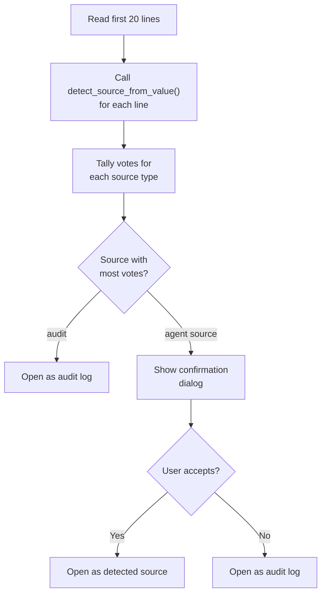
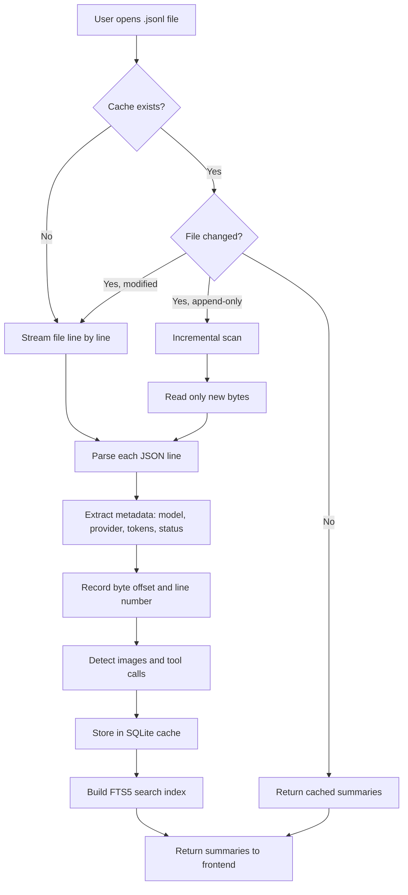

# Opening Files

PromptLens supports multiple ways to open JSONL files and can auto-detect log source formats. The file opening process involves native dialogs, source type selection, auto-detection, and cached scanning.

## Methods for Opening Files

### 1. Keyboard Shortcut

Press `Ctrl+O` (`Cmd+O` on macOS) to open the native file dialog. This opens the file with the default audit log source. The keyboard shortcut is registered in the global keydown handler of the `App` component:

```tsx
// file: src/app/App.tsx:192
if (mod && event.key.toLowerCase() === "o") {
  event.preventDefault();
  void ws().handleOpenSource(openSource);
}
```

The frontend calls the `openFileDialog` Tauri command, which opens a native file picker filtered to `.jsonl`, `.ndjson`, and `.log` files:

```rust
// file: src-tauri/src/commands.rs:30
fn open_file_dialog() -> Option<String> {
    rfd::FileDialog::new()
        .add_filter("JSONL", &["jsonl", "ndjson", "log"])
        .pick_file()
        .map(|path| path.to_string_lossy().to_string())
}
```

### 2. Splash Screen Button

When no files are open, click the "Open JSONL File" button on the splash screen.

### 3. Open Menu

Click "Open" in the title bar to see a dropdown with all source types:

```
+-----------------------------+
| Open                        |
+-----------------------------+
| [folder] Audit JSONL Log    |  Ctrl+O
| [folder] Codex Session      |
| [folder] Claude Code Session|
| [folder] OpenCode Session   |
| [folder] OpenClaw Session   |
| [folder] Agent JSONL Session|
|-----------------------------|
| [rotate] Rescan active file |  Ctrl+R
| [db]     Clear scan cache   |
|-----------------------------|
| Recent                      |
| [file]   my-audit-log.jsonl |
| [file]   claude-session.jsonl|
+-----------------------------+
```

Selecting a source type opens a file dialog pre-filtered to `.jsonl` files.

### 4. Recent Files

The Open menu shows the most recently opened files (up to 8). Recent files are stored in localStorage and deduplicated by path:

```tsx
// file: src/lib/recentFiles.ts:12
export function rememberRecentFile(path: string) {
  const next = [path, ...loadRecentFiles().filter((item) => item !== path)].slice(0, 8);
  localStorage.setItem(RECENT_KEY, JSON.stringify(next));
  return next;
}
```

The workspace store persists and restores recent files across sessions on app startup.

### 5. Source Selection Menu

Each source type maps to a specific log adapter. The `LogSource` type determines which parsing pipeline handles the file:

```tsx
// file: src/app/types.ts:123
export const LOG_SOURCE_OPTIONS: Array<{ value: LogSource; label: string }> = [
  { value: "audit", label: "Audit Log" },
  { value: "codex", label: "Codex" },
  { value: "opencode", label: "OpenCode" },
  { value: "openclaw", label: "OpenClaw" },
  { value: "claude_code", label: "Claude Code" },
  { value: "generic_agent", label: "Agent JSONL" },
];
```

## Source Types

PromptLens supports six source types. Each uses a different adapter to parse and normalize log events.

| Source Type | Adapter | Description |
|-------------|---------|-------------|
| **Audit JSONL Log** | Standard LLM adapter | Plain LLM API audit logs with request/response pairs |
| **Codex Session** | Codex adapter | OpenAI Codex CLI session logs with tool calls, patches, checkpoints |
| **Claude Code Session** | Claude Code adapter | Anthropic Claude Code logs with tool_use, Task/Agent subagents |
| **OpenCode Session** | OpenCode adapter | OpenCode session logs with tool and snapshot events |
| **OpenClaw Session** | OpenClaw adapter | OpenClaw session logs with action, patch, and shell events |
| **Agent JSONL Session** | Generic agent adapter | Flexible agent JSONL with auto-classifying event types |

## Auto-Detection

When opening a file via the Audit JSONL Log option, PromptLens runs **auto-detection** to identify the source format. Detection reads the first 20 lines and uses a voting system:

```rust
// file: src-tauri/src/commands.rs:457
fn detect_log_source(file_path: String) -> Option<String> {
    let mut votes: HashMap<String, usize> = HashMap::new();
    for _ in 0..20 {
        // ... read each line
        if let Ok(value) = serde_json::from_str::<Value>(trimmed) {
            if let Some(source) = detect_source_from_value(&value) {
                *votes.entry(source.as_str().to_string()).or_insert(0) += 1;
            }
        }
    }
    votes.into_iter().max_by_key(|(_, count)| *count).map(|(source, _)| source)
}
```

The `detect_source_from_value()` function inspects JSON structure to identify the provider. The voting method ensures robust detection even in mixed or noisy log files.

If the file looks like an agent session log rather than a standard audit log, PromptLens shows a confirmation dialog:



## Provider Detection for Audit Logs

For standard audit logs, the `detect_provider()` function in the adapters module uses heuristic JSON structure matching:

```rust
// file: src-tauri/src/adapters.rs:11
pub(crate) fn detect_provider(value: &Value) -> Option<String> {
    if value.get("choices").is_some()
        || value.get("output").is_some()
        || value.get("output_text").is_some()
    {
        return Some("openai".to_string());
    }
    if value.get("candidates").is_some() || value.get("contents").is_some() {
        return Some("gemini".to_string());
    }
    if value.get("message").is_some() && value.get("done").is_some() {
        return Some("ollama".to_string());
    }
    if value.get("content").and_then(Value::as_array).is_some_and(|items| {
        items.iter().any(|item| item.get("type").and_then(Value::as_str) == Some("text"))
    }) {
        return Some("anthropic".to_string());
    }
    None
}
```

| Provider | Detection Signal |
|----------|-----------------|
| OpenAI | Presence of `choices`, `output`, or `output_text` field |
| Gemini | Presence of `candidates` or `contents` field |
| Ollama | Presence of `message` + `done` fields |
| Anthropic | Presence of `content` array with items having `type: "text"` |

## How Scanning Works

When you open a file, PromptLens executes the following steps:



The core scan loop reads the file line by line using a 256KB buffered reader, parsing each JSON line into a `LogSummary`:

```rust
// file: src-tauri/src/scanner.rs:15
pub(crate) fn scan_jsonl_inner(
    file_path: String,
    app: Option<&AppHandle>,
    cancel_flag: Option<&AtomicBool>,
) -> Result<FileScanResult, String> {
    let mut reader = BufReader::with_capacity(256 * 1024, file);
    // ... line-by-line read loop
    // Emit scan-progress every 250 lines
    // Emit scan-chunk every 500 lines for incremental UI updates
    // Write to SQLite cache on completion
}
```

Progress is reported to the frontend via Tauri events. The frontend listens for these events in the `App` component:

```tsx
// file: src/app/App.tsx:156
const unlistenScan = listen<ProgressEvent>("scan-progress", (event) =>
  ws().setScanProgress(event.payload)
);
```

### Cache Behavior

PromptLens caches scan results in a local SQLite database, keyed by:

- File path
- File size
- Modified timestamp

```rust
// file: src-tauri/src/cache.rs:71
fn read_scan_cache(
    file_path: &str,
    file_size: u64,
    modified: Option<&str>,
) -> Result<Option<FileScanResult>, String> {
    // SELECT payload FROM scan_cache
    // WHERE file_path = ?1 AND file_size = ?2
    //   AND COALESCE(modified, '') = COALESCE(?3, '')
}
```

The cache database is stored in the platform's local data directory:

```rust
// file: src-tauri/src/cache.rs:6
pub(crate) fn cache_db_path() -> Result<std::path::PathBuf, String> {
    if let Ok(path) = std::env::var("PROMPTLENS_CACHE_PATH") {
        return Ok(std::path::PathBuf::from(path));
    }
    let base = dirs::data_local_dir()
        .or_else(dirs::data_dir)
        .ok_or_else(|| "Failed to resolve app data directory".to_string())?
        .join("PromptLens");
    fs::create_dir_all(&base)?;
    Ok(base.join("scan-cache.sqlite"))
}
```

If you reopen the same file without changes, the cache hits immediately. If the file has grown (append-only), PromptLens runs an incremental scan processing only the new bytes.

### Progress Tracking

During scanning, the status bar shows a progress bar with:

- Processed bytes vs total bytes
- Current line number
- Cancel button

Large files (hundreds of MB) may take a few seconds. Progress is reported via the `scan-progress` Tauri event:

```rust
// file: src-tauri/src/types.rs:106
pub(crate) struct ProgressEvent {
    pub(crate) processed_bytes: u64,
    pub(crate) total_bytes: u64,
    pub(crate) line_number: usize,
}
```

Users can cancel an ongoing scan via the `cancel_scan` command, which sets an `AtomicBool` flag checked at each line:

```rust
// file: src-tauri/src/scanner.rs:49
if cancel_flag.is_some_and(|flag| flag.load(Ordering::Relaxed)) {
    cancelled = true;
    break;
}
```

## Rescanning

To force a rescan of the active file:

- Click **Open > Rescan active file** from the menu.
- Press `Ctrl+R`.

This clears the cache for the current file and rescans from scratch. The keyboard shortcut is handled in `App.tsx`:

```tsx
// file: src/app/App.tsx:202
if (mod && event.key.toLowerCase() === "r") {
  event.preventDefault();
  void ws().handleRescan();
}
```

## Clearing Cache

To clear all cached scan results:

- Click **Open > Clear scan cache** from the menu.

This deletes the entire SQLite cache database file. The next time any file is opened, it will be rescanned:

```rust
// file: src-tauri/src/commands.rs:55
fn clear_scan_cache() -> Result<(), String> {
    let path = cache_db_path()?;
    if path.exists() {
        fs::remove_file(path).map_err(|err| format!("Failed to clear cache: {err}"))?;
    }
    Ok(())
}
```

## Incremental Scanning and Live Mode

When live mode is enabled, PromptLens watches the active file for changes. If new data is appended to the file:

1. The file watcher detects the size change (see [File Watcher](./file-watcher.md)).
2. PromptLens runs an incremental scan from the last known byte offset.
3. New records appear in the list with a "New" badge.

The incremental scanner seeks to the last known offset and reads only new lines:

```rust
// file: src-tauri/src/scanner.rs:163
fn scan_jsonl_incremental(
    file_path: String,
    from_offset: u64,
    from_line_number: usize,
) -> Result<IncrementalScanResult, String> {
    let metadata = fs::metadata(&file_path)?;
    if metadata.len() < from_offset {
        return Err("File appears to have been truncated. Run a full rescan.".to_string());
    }
    let file = File::open(&file_path)?;
    let mut reader = BufReader::new(file);
    reader.seek(SeekFrom::Start(from_offset))?;
    // ... read only new lines from from_offset
}
```

The frontend starts the incremental scan when the `file-changed` event fires:

```typescript
// file: src/tauri.ts:25
export async function scanJsonlIncremental(
  filePath: string,
  fromOffset: number,
  fromLineNumber: number,
): Promise<IncrementalScanResult> {
  return invoke("scan_jsonl_incremental", { filePath, fromOffset, fromLineNumber });
}
```

## Tauri Commands for File Operations

| Command | When Called | Purpose |
|---------|-----------|---------|
| `open_file_dialog` | User clicks Open | Opens native file dialog, returns selected path |
| `detect_log_source` | After file selected | Auto-detects source format from first 20 lines |
| `scan_jsonl` | Initial file open | Full scan of file, returns summaries |
| `scan_jsonl_incremental` | Live mode or rescan | Scans only new bytes from given offset |
| `cancel_scan` | User clicks Cancel | Stops ongoing scan via AtomicBool flag |
| `clear_scan_cache` | User clears cache | Deletes SQLite cache database file |
| `get_cache_info` | App startup | Returns cache database path and existence status |
| `get_file_status` | Periodic polling | Checks if file still exists and its size/modified time |
| `start_file_watch` | Live mode enabled | Starts file system watcher for the file |
| `stop_file_watch` | Live mode disabled | Stops file system watcher |

All Tauri commands are registered in the `run()` function:

```rust
// file: src-tauri/src/commands.rs:592
pub fn run() {
    tauri::Builder::default()
        .manage(AppState::default())
        .invoke_handler(tauri::generate_handler![
            open_file_dialog, scan_jsonl, scan_jsonl_incremental,
            cancel_scan, clear_scan_cache, get_cache_info, get_file_status,
            save_text_file, export_records, read_record,
            read_agent_session, read_agent_session_incremental,
            detect_log_source, search_jsonl, cancel_search,
            list_system_fonts, get_pricing_table, calculate_costs,
            start_file_watch, stop_file_watch, compute_analytics
        ])
        .run(tauri::generate_context!())
        .expect("error while running PromptLens");
}
```

## Multi-File Workflow

PromptLens supports opening multiple files simultaneously via workspace tabs:

1. Open a file -- gets a new workspace tab.
2. Open another file -- adds another tab.
3. Click tabs to switch between them.
4. Each tab maintains its own filters, sort order, selection, and search state.
5. Close tabs with `Ctrl+W` or the close button.

The workspace state (which tabs are open, which is active) is persisted to `localStorage` and restored on app startup via the `useWorkspaceStore` Zustand store. The tab structure uses `WorkspaceTab` and `SessionTab` types:

```tsx
// file: src/app/types.ts:15
export type LeftTab =
  | "records" | "timeline" | "subagents" | "agentFiles"
  | "trace" | "sessions" | "analytics" | "issues";
```

Each tab independently tracks its `leftTab`, `providerFilter`, `modelFilter`, `statusFilter`, `issueOnly`, `traceFilter`, `selected`, `compareBase`, and search state.
