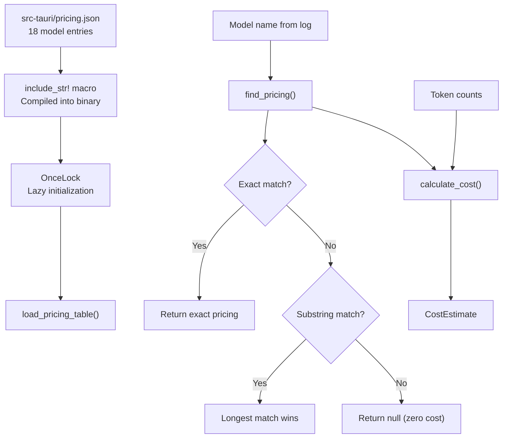
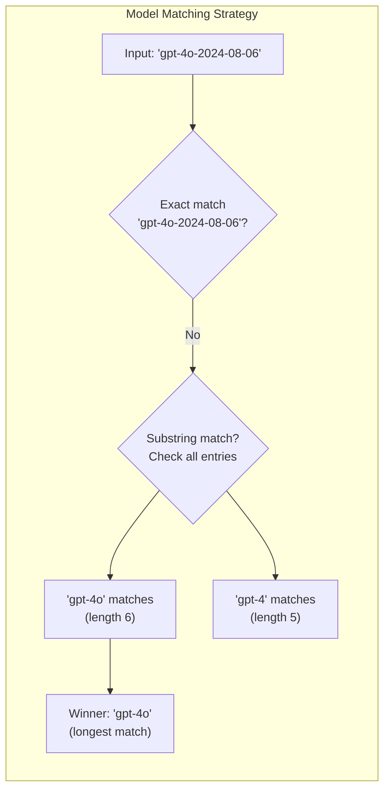
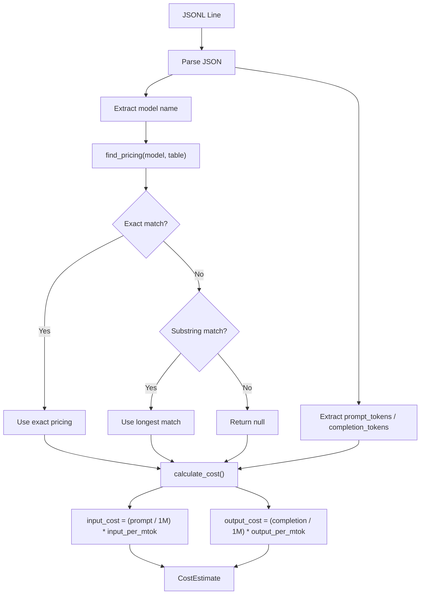

# Pricing Table

PromptLens includes a built-in pricing table for estimating LLM API costs. The table is stored in `src-tauri/pricing.json` and loaded at runtime via `include_str!`.

## Pricing Architecture





## Cost Formula

```
input_cost  = (prompt_tokens / 1,000,000) * input_per_mtok
output_cost = (completion_tokens / 1,000,000) * output_per_mtok
total_cost  = input_cost + output_cost
```

Where `input_per_mtok` and `output_per_mtok` are the USD cost per million tokens.

```rust
// file: src-tauri/src/pricing.rs:49-72
pub fn calculate_cost(
    model: &str,
    prompt_tokens: Option<u64>,
    completion_tokens: Option<u64>,
    table: &[ModelPricing],
) -> CostEstimate {
    let pricing = find_pricing(model, table);
    let input_tokens = prompt_tokens.unwrap_or(0) as f64;
    let output_tokens = completion_tokens.unwrap_or(0) as f64;
    let (input_cost, output_cost) = match pricing {
        Some(p) => (
            (input_tokens / 1_000_000.0) * p.input_per_mtok,
            (output_tokens / 1_000_000.0) * p.output_per_mtok,
        ),
        None => (0.0, 0.0),
    };
    CostEstimate {
        model: model.to_string(),
        input_cost,
        output_cost,
        total_cost: input_cost + output_cost,
        matched_pricing: pricing.map(|p| p.model.clone()),
    }
}
```

## Model Matching

The pricing engine uses two strategies to match models:

1. **Exact match:** Case-insensitive comparison of the full model name
2. **Substring match:** If no exact match, the longest matching entry in the table wins (e.g., `"gpt-4o-2024-08-06"` matches `"gpt-4o"`)

```rust
// file: src-tauri/src/pricing.rs:29-47
pub fn find_pricing<'a>(model: &str, table: &'a [ModelPricing]) -> Option<&'a ModelPricing> {
    let lower = model.to_lowercase();
    // Exact match
    if let Some(p) = table.iter().find(|p| p.model.to_lowercase() == lower) {
        return Some(p);
    }
    // Substring match (longest matching model name wins)
    let mut best: Option<(&ModelPricing, usize)> = None;
    for p in table {
        let p_lower = p.model.to_lowercase();
        if lower.contains(&p_lower) {
            let len = p_lower.len();
            if best.is_none_or(|(_, blen)| len > blen) {
                best = Some((p, len));
            }
        }
    }
    best.map(|(p, _)| p)
}
```

If no match is found, the cost is returned as zero with `matched_pricing: null`.

## Full Pricing Table

### OpenAI

| Model | Input ($/MTok) | Output ($/MTok) | Notes |
|-------|---------------|-----------------|-------|
| `gpt-4o` | $2.50 | $10.00 | GPT-4o |
| `gpt-4o-mini` | $0.15 | $0.60 | GPT-4o Mini |
| `gpt-4-turbo` | $10.00 | $30.00 | GPT-4 Turbo |
| `gpt-4` | $30.00 | $60.00 | GPT-4 |
| `gpt-3.5-turbo` | $0.50 | $1.50 | GPT-3.5 Turbo |
| `o1` | $15.00 | $60.00 | o1 reasoning model |
| `o1-mini` | $3.00 | $12.00 | o1 Mini |
| `o3-mini` | $1.10 | $4.40 | o3 Mini |

### Anthropic

| Model | Input ($/MTok) | Output ($/MTok) | Notes |
|-------|---------------|-----------------|-------|
| `claude-opus-4` | $15.00 | $75.00 | Claude Opus 4 |
| `claude-sonnet-4` | $3.00 | $15.00 | Claude Sonnet 4 |
| `claude-3.5-sonnet` | $3.00 | $15.00 | Claude 3.5 Sonnet |
| `claude-3.5-haiku` | $0.80 | $4.00 | Claude 3.5 Haiku |
| `claude-3-opus` | $15.00 | $75.00 | Claude 3 Opus |
| `claude-3-sonnet` | $3.00 | $15.00 | Claude 3 Sonnet |
| `claude-3-haiku` | $0.25 | $1.25 | Claude 3 Haiku |

### Google

| Model | Input ($/MTok) | Output ($/MTok) | Notes |
|-------|---------------|-----------------|-------|
| `gemini-2.0-flash` | $0.10 | $0.40 | Gemini 2.0 Flash |
| `gemini-1.5-pro` | $1.25 | $5.00 | Gemini 1.5 Pro |
| `gemini-1.5-flash` | $0.075 | $0.30 | Gemini 1.5 Flash |

### Raw JSON Source

```json
// file: src-tauri/pricing.json (excerpt)
[
  {
    "model": "gpt-4o",
    "provider": "openai",
    "input_per_mtok": 2.50,
    "output_per_mtok": 10.00
  },
  {
    "model": "claude-sonnet-4",
    "provider": "anthropic",
    "input_per_mtok": 3.00,
    "output_per_mtok": 15.00
  },
  {
    "model": "gemini-2.0-flash",
    "provider": "google",
    "input_per_mtok": 0.10,
    "output_per_mtok": 0.40
  }
]
```

## Summary by Provider

| Provider | Models | Cheapest Input | Most Expensive Input | Cheapest Output | Most Expensive Output |
|----------|--------|---------------|---------------------|----------------|----------------------|
| OpenAI | 8 | $0.15 (gpt-4o-mini) | $30.00 (gpt-4) | $0.60 (gpt-4o-mini) | $60.00 (gpt-4, o1) |
| Anthropic | 7 | $0.25 (claude-3-haiku) | $15.00 (opus) | $1.25 (claude-3-haiku) | $75.00 (opus) |
| Google | 3 | $0.075 (gemini-1.5-flash) | $1.25 (gemini-1.5-pro) | $0.30 (gemini-1.5-flash) | $5.00 (gemini-1.5-pro) |

## Cost Examples

### 1 Million Input + 1 Million Output Tokens

| Model | Input Cost | Output Cost | Total |
|-------|-----------|-------------|-------|
| gpt-4o | $2.50 | $10.00 | **$12.50** |
| gpt-4o-mini | $0.15 | $0.60 | **$0.75** |
| claude-opus-4 | $15.00 | $75.00 | **$90.00** |
| claude-3.5-haiku | $0.80 | $4.00 | **$4.80** |
| gemini-2.0-flash | $0.10 | $0.40 | **$0.50** |
| gemini-1.5-flash | $0.075 | $0.30 | **$0.375** |

### Typical Chat Turn (2K Input + 500 Output Tokens)

| Model | Total Cost |
|-------|-----------|
| gpt-4o | $0.010 |
| gpt-4o-mini | $0.0006 |
| claude-sonnet-4 | $0.0135 |
| claude-3.5-haiku | $0.0036 |
| gemini-2.0-flash | $0.0004 |

### Heavy Usage Session (100K Input + 50K Output Tokens)

| Model | Total Cost |
|-------|-----------|
| gpt-4o | $0.75 |
| gpt-4o-mini | $0.045 |
| claude-opus-4 | $5.25 |
| claude-3.5-haiku | $0.28 |
| gemini-2.0-flash | $0.03 |

## API

### Get Full Pricing Table

```typescript
// file: src/tauri.ts:99-101
export async function getPricingTable(): Promise<ModelPricing[]> {
  return invoke("get_pricing_table");
}
```

```typescript
import { getPricingTable } from "./tauri";

const table = await getPricingTable();
// table: ModelPricing[]
// Each entry: { model, provider, input_per_mtok, output_per_mtok }
```

### Calculate Costs

```typescript
// file: src/tauri.ts:103-107
export async function calculateCosts(
  requests: Array<{ model: string; prompt_tokens?: number; completion_tokens?: number }>,
): Promise<CostEstimate[]> {
  return invoke("calculate_costs", { requests });
}
```

```typescript
import { calculateCosts } from "./tauri";

const estimates = await calculateCosts([
  { model: "gpt-4o", prompt_tokens: 50000, completion_tokens: 10000 },
  { model: "claude-sonnet-4", prompt_tokens: 20000, completion_tokens: 5000 },
]);
// estimates: CostEstimate[]
// Each: { model, input_cost, output_cost, total_cost, matched_pricing }
```

## Rust API

```rust
// file: src-tauri/src/pricing.rs:21-27
const PRICING_JSON: &str = include_str!("../pricing.json");

static PRICING_TABLE: OnceLock<Vec<ModelPricing>> = OnceLock::new();

pub fn load_pricing_table() -> &'static [ModelPricing] {
    PRICING_TABLE.get_or_init(|| serde_json::from_str(PRICING_JSON).unwrap_or_default())
}
```

```rust
use crate::pricing::{load_pricing_table, find_pricing, calculate_cost};

let table = load_pricing_table();
let pricing = find_pricing("gpt-4o", table);
let cost = calculate_cost("gpt-4o", Some(1_000_000), Some(1_000_000), table);
assert!((cost.total_cost - 12.50).abs() < 0.01);
```

## Adding Custom Models

To add a new model, edit `src-tauri/pricing.json`:

```json
{
  "model": "new-model-name",
  "provider": "provider-name",
  "input_per_mtok": 1.00,
  "output_per_mtok": 3.00
}
```

The pricing table is compiled into the binary via `include_str!`, so a rebuild is required after editing.

## Ollama / Local Models

Ollama and other local models are not in the pricing table. Since they run locally, the API cost is zero. Cost calculations for these models will return `total_cost: 0` and `matched_pricing: null`.

## Provider Detection

PromptLens auto-detects the provider from the JSON structure of each log line:

```rust
// file: src-tauri/src/adapters.rs:11-36
pub(crate) fn detect_provider(value: &Value) -> Option<String> {
    if value.get("choices").is_some()
        || value.get("output").is_some()
        || value.get("output_text").is_some()
    {
        return Some("openai".to_string());
    }
    if value.get("candidates").is_some() || value.get("contents").is_some() {
        return Some("gemini".to_string());
    }
    if value.get("message").is_some() && value.get("done").is_some() {
        return Some("ollama".to_string());
    }
    if value
        .get("content")
        .and_then(Value::as_array)
        .is_some_and(|items| {
            items
                .iter()
                .any(|item| item.get("type").and_then(Value::as_str) == Some("text"))
        })
    {
        return Some("anthropic".to_string());
    }
    None
}
```

| JSON Signature | Detected Provider |
|---------------|-------------------|
| Has `choices` or `output` or `output_text` | `openai` |
| Has `candidates` or `contents` | `gemini` |
| Has `message` and `done` | `ollama` |
| Has `content` array with `type: "text"` items | `anthropic` |

The detected provider is stored in `LogSummary.provider` and used for pricing lookups.

## Cost Calculation Flow



## Pricing Data Sources

Pricing data is based on publicly available API pricing from provider websites. Prices are in USD and reflect standard (non-cached, non-batch) rates. Actual costs may vary due to:

| Factor | Impact |
|--------|--------|
| Prompt caching | Some providers offer discounted rates for cached prompts |
| Batch API | Lower per-token costs for batched requests |
| Volume discounts | Enterprise agreements may reduce per-token costs |
| Free tiers | Some providers offer free token allowances |
| Price changes | Provider pricing changes are only reflected after a PromptLens update |

## Updating Pricing

When providers change rates, update the pricing:

1. Edit `src-tauri/pricing.json` with new values
2. Run `cargo test` to verify the pricing table loads correctly
3. Bump the version and create a release so users get updated prices

The pricing table is compiled into the binary, so users must update PromptLens to receive new prices.

## Tests

```rust
// file: src-tauri/src/pricing.rs:74-116
#[cfg(test)]
mod tests {
    use super::*;

    #[test]
    fn loads_pricing_table() {
        let table = load_pricing_table();
        assert!(table.len() >= 15);
        assert!(table.iter().any(|p| p.model == "gpt-4o"));
    }

    #[test]
    fn exact_model_match() {
        let table = load_pricing_table();
        let p = find_pricing("gpt-4o", &table).unwrap();
        assert_eq!(p.model, "gpt-4o");
    }

    #[test]
    fn fuzzy_model_match() {
        let table = load_pricing_table();
        let p = find_pricing("gpt-4o-2024-08-06", &table).unwrap();
        assert_eq!(p.model, "gpt-4o");
    }

    #[test]
    fn unknown_model_returns_zero() {
        let table = load_pricing_table();
        let cost = calculate_cost("unknown-model-xyz", Some(1000), Some(500), &table);
        assert_eq!(cost.total_cost, 0.0);
        assert!(cost.matched_pricing.is_none());
    }

    #[test]
    fn cost_calculation() {
        let table = load_pricing_table();
        let cost = calculate_cost("gpt-4o", Some(1_000_000), Some(1_000_000), &table);
        assert!((cost.input_cost - 2.50).abs() < 0.01);
        assert!((cost.output_cost - 10.00).abs() < 0.01);
        assert!((cost.total_cost - 12.50).abs() < 0.01);
    }
}
```
