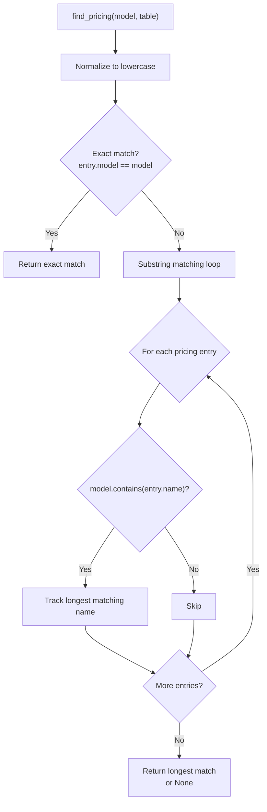
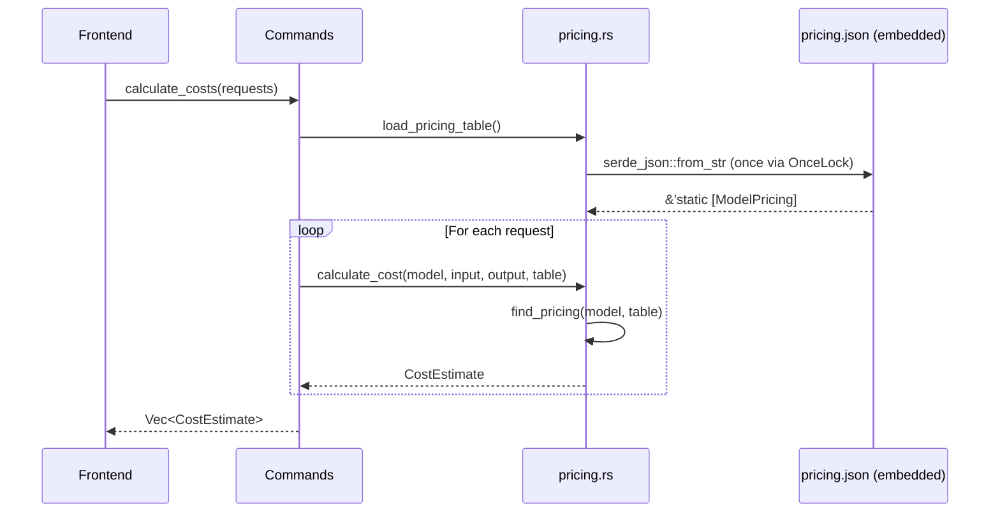
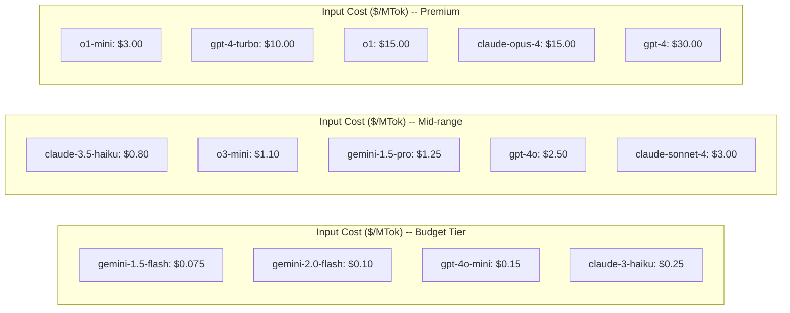

# Pricing Module

The pricing module calculates estimated costs for LLM API calls based on token usage. It includes a built-in pricing table covering 18 models across 4 providers, with fuzzy model name matching to handle versioned model strings. The module is implemented in `pricing.rs`.

## Pricing Table

Pricing data is embedded at compile time from `src-tauri/pricing.json`:

```rust
// file: src-tauri/src/pricing.rs:21
const PRICING_JSON: &str = include_str!("../pricing.json");
static PRICING_TABLE: OnceLock<Vec<ModelPricing>> = OnceLock::new();
```

The `OnceLock` ensures the JSON is parsed only once and shared across all subsequent calls. This is a thread-safe lazy initialization pattern.

```rust
// file: src-tauri/src/pricing.rs:25
pub fn load_pricing_table() -> &'static [ModelPricing] {
    PRICING_TABLE.get_or_init(|| serde_json::from_str(PRICING_JSON).unwrap_or_default())
}
```

### Supported Models

| Model | Provider | Input ($/MTok) | Output ($/MTok) |
|-------|----------|---------------|-----------------|
| `gpt-4o` | OpenAI | 2.50 | 10.00 |
| `gpt-4o-mini` | OpenAI | 0.15 | 0.60 |
| `gpt-4-turbo` | OpenAI | 10.00 | 30.00 |
| `gpt-4` | OpenAI | 30.00 | 60.00 |
| `gpt-3.5-turbo` | OpenAI | 0.50 | 1.50 |
| `o1` | OpenAI | 15.00 | 60.00 |
| `o1-mini` | OpenAI | 3.00 | 12.00 |
| `o3-mini` | OpenAI | 1.10 | 4.40 |
| `claude-opus-4` | Anthropic | 15.00 | 75.00 |
| `claude-sonnet-4` | Anthropic | 3.00 | 15.00 |
| `claude-3.5-sonnet` | Anthropic | 3.00 | 15.00 |
| `claude-3.5-haiku` | Anthropic | 0.80 | 4.00 |
| `claude-3-opus` | Anthropic | 15.00 | 75.00 |
| `claude-3-sonnet` | Anthropic | 3.00 | 15.00 |
| `claude-3-haiku` | Anthropic | 0.25 | 1.25 |
| `gemini-2.0-flash` | Google | 0.10 | 0.40 |
| `gemini-1.5-pro` | Google | 1.25 | 5.00 |
| `gemini-1.5-flash` | Google | 0.075 | 0.30 |

## ModelPricing Struct

```rust
// file: src-tauri/src/pricing.rs:4
#[derive(Debug, Clone, Serialize, Deserialize)]
pub struct ModelPricing {
    pub model: String,          // Base model name (e.g., "gpt-4o")
    pub provider: String,       // Provider name (e.g., "openai")
    pub input_per_mtok: f64,    // Cost per million input tokens
    pub output_per_mtok: f64,   // Cost per million output tokens
}
```

## Model Matching Algorithm

The `find_pricing()` function uses a two-phase strategy to match model strings against the pricing table:



```rust
// file: src-tauri/src/pricing.rs:29
pub fn find_pricing<'a>(model: &str, table: &'a [ModelPricing]) -> Option<&'a ModelPricing> {
    let lower = model.to_lowercase();
    // Exact match
    if let Some(p) = table.iter().find(|p| p.model.to_lowercase() == lower) {
        return Some(p);
    }
    // Substring matching (longest matching model name wins)
    let mut best: Option<(&ModelPricing, usize)> = None;
    for p in table {
        let p_lower = p.model.to_lowercase();
        if lower.contains(&p_lower) {
            let len = p_lower.len();
            if best.is_none_or(|(_, blen)| len > blen) {
                best = Some((p, len));
            }
        }
    }
    best.map(|(p, _)| p)
}
```

### Matching Examples

| Input Model | Matched Pricing | Strategy |
|-------------|----------------|----------|
| `gpt-4o` | `gpt-4o` | Exact match |
| `gpt-4o-2024-08-06` | `gpt-4o` | Substring match |
| `claude-sonnet-4-20250514` | `claude-sonnet-4` | Substring match |
| `claude-3-5-sonnet-20241022` | `claude-3.5-sonnet` | Substring match |
| `unknown-model-xyz` | None | No match, cost = $0 |

The longest matching substring wins to avoid ambiguity (e.g., `gpt-4` vs `gpt-4o` for input `gpt-4o-2024-08-06` correctly matches `gpt-4o`).

## Cost Calculation

```rust
// file: src-tauri/src/pricing.rs:49
pub fn calculate_cost(
    model: &str,
    prompt_tokens: Option<u64>,
    completion_tokens: Option<u64>,
    table: &[ModelPricing],
) -> CostEstimate {
    let pricing = find_pricing(model, table);
    let input_tokens = prompt_tokens.unwrap_or(0) as f64;
    let output_tokens = completion_tokens.unwrap_or(0) as f64;
    let (input_cost, output_cost) = match pricing {
        Some(p) => (
            (input_tokens / 1_000_000.0) * p.input_per_mtok,
            (output_tokens / 1_000_000.0) * p.output_per_mtok,
        ),
        None => (0.0, 0.0),
    };
    CostEstimate {
        model: model.to_string(),
        input_cost,
        output_cost,
        total_cost: input_cost + output_cost,
        matched_pricing: pricing.map(|p| p.model.clone()),
    }
}
```

### Formula

```
input_cost  = (prompt_tokens / 1,000,000) * input_per_mtok
output_cost = (completion_tokens / 1,000,000) * output_per_mtok
total_cost  = input_cost + output_cost
```

### CostEstimate Struct

```rust
// file: src-tauri/src/pricing.rs:13
#[derive(Debug, Clone, Serialize, Deserialize)]
pub struct CostEstimate {
    pub model: String,                    // Original model string
    pub input_cost: f64,                  // Input token cost
    pub output_cost: f64,                 // Output token cost
    pub total_cost: f64,                  // Sum of input + output
    pub matched_pricing: Option<String>,  // Matched base model name
}
```

### Calculation Example

For `gpt-4o` with 1,000,000 input tokens and 1,000,000 output tokens:

```
input_cost  = (1,000,000 / 1,000,000) * 2.50  = $2.50
output_cost = (1,000,000 / 1,000,000) * 10.00 = $10.00
total_cost  = $12.50
```

## Tauri Commands

### get_pricing_table

Returns the complete pricing table as `Vec<ModelPricing>`:

```rust
// file: src-tauri/src/commands.rs:531
#[tauri::command]
fn get_pricing_table() -> Vec<crate::pricing::ModelPricing> {
    crate::pricing::load_pricing_table().to_vec()
}
```

### calculate_costs

Batch cost calculation for multiple requests:

```rust
// file: src-tauri/src/commands.rs:543
#[tauri::command]
fn calculate_costs(requests: Vec<CostRequest>) -> Vec<crate::pricing::CostEstimate> {
    let table = crate::pricing::load_pricing_table();
    requests.iter().map(|r| {
        crate::pricing::calculate_cost(&r.model, r.prompt_tokens, r.completion_tokens, table)
    }).collect()
}
```

```rust
// file: src-tauri/src/commands.rs:535
struct CostRequest {
    model: String,
    prompt_tokens: Option<u64>,
    completion_tokens: Option<u64>,
}
```

## Data Flow



## Unknown Models

When no pricing match is found, `calculate_cost` returns a zero-cost estimate:

```rust
CostEstimate {
    model: model.to_string(),
    input_cost: 0.0,
    output_cost: 0.0,
    total_cost: 0.0,
    matched_pricing: None,
}
```

The frontend uses `matched_pricing: None` to display a "no pricing data" indicator.

## Provider Cost Comparison



| Tier | Models | Input Range | Output Range |
|------|--------|------------|--------------|
| Budget | `gpt-4o-mini`, `gemini-2.0-flash`, `claude-3-haiku` | $0.075-$0.25/MTok | $0.30-$1.25/MTok |
| Mid-range | `gpt-4o`, `claude-sonnet-4`, `gemini-1.5-pro` | $0.80-$3.00/MTok | $4.00-$15.00/MTok |
| Premium | `claude-opus-4`, `gpt-4`, `o1` | $10.00-$30.00/MTok | $30.00-$75.00/MTok |

## Updating Pricing

To update model pricing, edit `src-tauri/pricing.json` directly. The JSON is embedded at compile time via `include_str!`, so a rebuild is required. The pricing table should be updated when providers change their rates.

The pricing module includes unit tests that verify the table loads correctly and contains expected models:

```rust
// file: src-tauri/src/pricing.rs:78
#[test]
fn loads_pricing_table() {
    let table = load_pricing_table();
    assert!(table.len() >= 15);
    assert!(table.iter().any(|p| p.model == "gpt-4o"));
    assert!(table.iter().any(|p| p.model == "claude-sonnet-4"));
}
```
