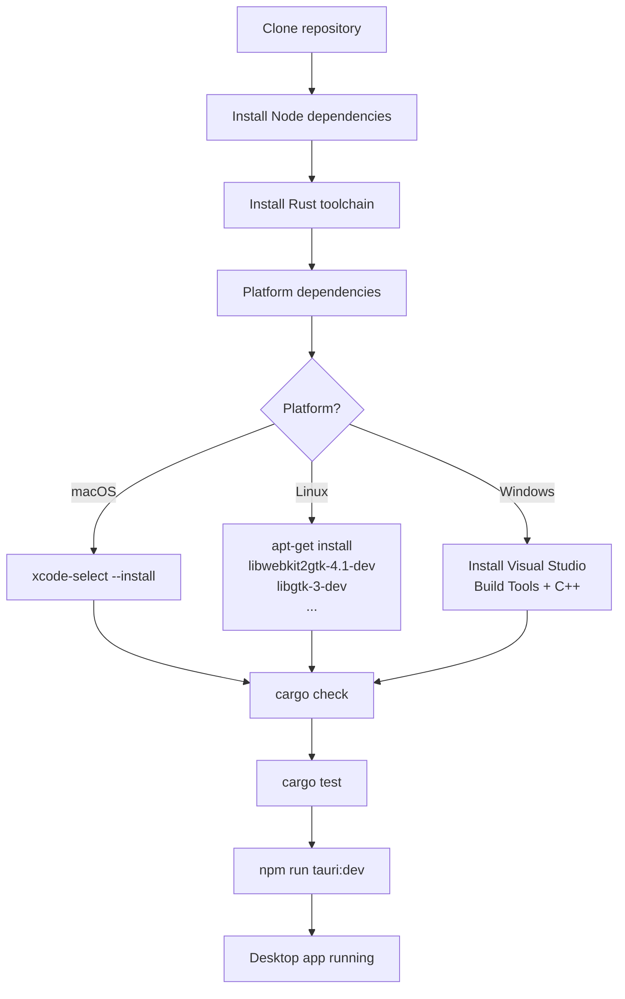
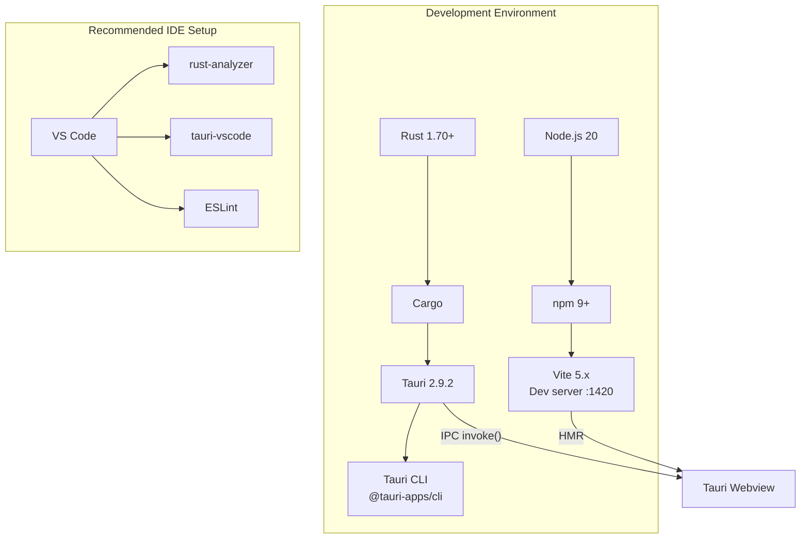
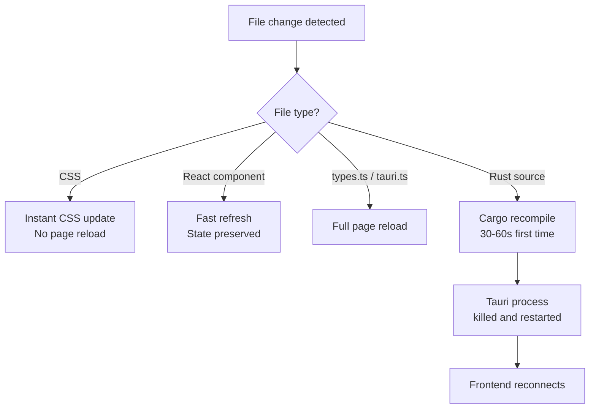

# Project Setup

Detailed instructions for setting up the PromptLens development environment on each platform.

## Setup Flow





## Frontend Setup

The frontend is a React 18 + TypeScript application built with Vite.

### Dependencies

```json
// file: package.json:16-25
{
  "dependencies": {
    "@tanstack/react-virtual": "^3.13.13",
    "@tauri-apps/api": "^2.9.0",
    "lucide-react": "^0.468.0",
    "react": "^18.3.1",
    "react-dom": "^18.3.1",
    "react-markdown": "^9.1.0",
    "remark-gfm": "^4.0.0",
    "zustand": "^5.0.8"
  }
}
```

### Dev Dependencies

```json
// file: package.json:27-38
{
  "devDependencies": {
    "@tauri-apps/cli": "^2.9.0",
    "@testing-library/jest-dom": "^6.9.1",
    "@testing-library/react": "^16.3.2",
    "@types/react": "^18.3.12",
    "@types/react-dom": "^18.3.1",
    "@vitejs/plugin-react": "^4.3.3",
    "jsdom": "^29.1.1",
    "typescript": "^5.6.3",
    "vite": "^5.4.10",
    "vitest": "^4.1.7"
  }
}
```

### Installation Steps

```bash
# From the project root
npm install

# Verify the frontend builds
npm run build

# Start the dev server
npm run dev
```

The Vite dev server starts on **port 1420**. The Tauri webview connects to this port during development.

## Backend Setup

The backend is a Rust 2021 edition crate using Tauri 2.9.

### Rust Dependencies

```toml
# file: src-tauri/Cargo.toml:17-28
[dependencies]
base64 = "0.22.1"
dirs = "6.0.0"
infer = "0.19.0"
notify = "7.0"
regex = "1"
rfd = "0.15.4"
rusqlite = { version = "0.32.1", features = ["bundled"] }
serde = { version = "1.0", features = ["derive"] }
serde_json = "1.0"
tauri = { version = "2.9.2", features = [] }
time = { version = "0.3.44", features = ["formatting"] }

[dev-dependencies]
tempfile = "3.23.0"
```

| Crate | Version | Purpose |
|-------|---------|---------|
| `tauri` | 2.9.2 | Desktop app framework, IPC, window management |
| `serde` / `serde_json` | 1.0 | JSON serialization, `camelCase` field renaming |
| `rusqlite` | 0.32.1 (bundled) | SQLite for caching scan results and FTS5 index |
| `notify` | 7.0 | Filesystem watching, detects append-only changes |
| `rfd` | 0.15.4 | Native file dialogs (open/save) |
| `regex` | 1 | Pattern matching for provider detection |
| `base64` | 0.22.1 | Base64 encoding for embedded images |
| `infer` | 0.19.0 | File type detection (MIME from bytes) |
| `dirs` | 6.0.0 | Platform-specific directory paths |
| `time` | 0.3.44 | Timestamp formatting |
| `tempfile` | 3.23.0 | (dev) Temporary files in tests |

### Installation Steps

```bash
# Ensure the Rust toolchain is installed
curl --proto '=https' --tlsv1.2 -sSf https://sh.rustup.rs | sh

# From src-tauri/
cd src-tauri
cargo check        # Verify compilation
cargo test         # Run tests
cargo fmt --check  # Verify formatting
```

## Environment Variables

| Variable | Default | Description |
|----------|---------|-------------|
| `PROMPTLENS_CACHE_PATH` | Platform data directory | Override the SQLite cache file path. Useful for isolating cache state during testing. |
| `GITHUB_TOKEN` | (CI only) | Used by `tauri-action` in GitHub Actions to upload release assets. |

The `PROMPTLENS_CACHE_PATH` variable is read in the cache module:
```rust
// Conceptual usage in src-tauri/src/cache.rs
if let Ok(custom) = std::env::var("PROMPTLENS_CACHE_PATH") {
    return PathBuf::from(custom);
}
```

## IDE Recommendations

### VS Code

Recommended extensions:

| Extension | Purpose |
|-----------|---------|
| `rust-analyzer` | Rust language server, inline type hints, go-to-definition |
| `tauri-vscode` | Tauri project commands and debugging |
| `dbaeumer.vscode-eslint` | ESLint for TypeScript |
| `esbenp.prettier-vscode` | Code formatting |

VS Code workspace Rust settings:

```json
{
  "rust-analyzer.cargo.features": [],
  "rust-analyzer.check.command": "clippy",
  "editor.formatOnSave": true
}
```

### JetBrains (RustRover / IntelliJ)

- Install the Rust plugin
- Mark `src-tauri/` as the Cargo project root
- Enable `cargo clippy` as an external inspector

### Vim / Neovim

- Use `rust-analyzer` via LSP (`nvim-lspconfig` or built-in)
- Install `mason.nvim` for automated LSP installation

## Build Configuration

The Tauri build system uses Cargo profiles. The default release profile strips debug symbols and enables optimizations:

```toml
# src-tauri/Cargo.toml (managed by Tauri)
[profile.release]
strip = true
lto = true
codegen-units = 1
panic = "abort"
```

| Profile | Optimizations | Debug Info | Use Case |
|---------|--------------|------------|----------|
| `dev` | None | Full | Development (`cargo build`) |
| `release` | Full + LTO | Stripped | Production (`cargo build --release`) |

During development, `cargo check` and `cargo build` use the dev profile by default (no optimizations, full debug info).

## macOS Code Signing

Code signing is not required for local development. For releases:

1. Set `APPLE_CERTIFICATE` and `APPLE_CERTIFICATE_PASSWORD` environment variables
2. Set `APPLE_ID`, `APPLE_PASSWORD`, and `APPLE_TEAM_ID` for notarization
3. These are handled automatically by the GitHub Actions release workflow

```yaml
# file: .github/workflows/release.yml:83-93
- name: Build and release
  uses: tauri-apps/tauri-action@v0
  env:
    GITHUB_TOKEN: ${{ secrets.GITHUB_TOKEN }}
  with:
    tagName: ${{ github.ref_name }}
    releaseName: "PromptLens ${{ github.ref_name }}"
    releaseBody: "See the assets below for platform-specific installers."
    releaseDraft: false
    prerelease: false
    args: --target ${{ matrix.target }} --bundles ${{ matrix.bundles }}
```

## Linux AppImage

CI produces `.AppImage`, `.deb`, and `.rpm` installers. To test AppImage locally:

```bash
cd src-tauri
cargo tauri build --bundles appimage
# Output: target/release/bundle/appimage/*.AppImage
```

## Windows MSI / NSIS

On Windows, CI produces `.msi` and `.nsis.zip` installers. To build locally:

```bash
cd src-tauri
cargo tauri build --bundles msi,nsis
```

## Hot Reload

During `npm run tauri:dev`, the Vite dev server provides hot module replacement (HMR) for frontend changes. Rust backend changes trigger a full recompile and app restart.



### Frontend HMR

| Change Type | Reload Behavior |
|-------------|----------------|
| CSS | Instant update, no page reload |
| React component | Fast refresh (state preserved) |
| `types.ts` | Full page reload |
| `tauri.ts` | Full page reload |

### Backend Recompilation

When Rust source files change during `tauri:dev`:

1. Cargo detects the change and recompiles the affected crate
2. The Tauri process is killed and restarted
3. The frontend reconnects to the new backend
4. First recompilation takes 30-60 seconds; incremental changes are faster

## First-Time Setup Checklist

| Step | Command | Expected Result |
|------|---------|-----------------|
| 1. Clone repo | `git clone https://github.com/XUranus/promptlens.git` | Repository cloned |
| 2. Install Node deps | `npm install` | `node_modules/` created |
| 3. Verify Rust | `cd src-tauri && cargo check` | Compiles successfully |
| 4. Run tests | `cd src-tauri && cargo test` | All tests pass |
| 5. Start dev | `npm run tauri:dev` | Desktop app opens |
| 6. Open a file | Use file dialog in app | JSONL records display |

## Dependency Management

### Updating Frontend Dependencies

```bash
# Check for outdated packages
npm outdated

# Update a specific package
npm install react@latest

# Update all packages (watch for major versions)
npm update
```

### Updating Rust Dependencies

```bash
cd src-tauri

# Check for outdated crates
cargo install cargo-edit
cargo upgrade --dry-run

# Update Cargo.lock without changing Cargo.toml
cargo update

# Update a specific crate
cargo update -p serde_json
```

### Tauri CLI Updates

The Tauri CLI is a dev dependency (`@tauri-apps/cli`). Update it with:

```bash
npm install @tauri-apps/cli@latest
```

Keep the Rust `tauri` crate in sync with the CLI version to avoid compatibility issues.
