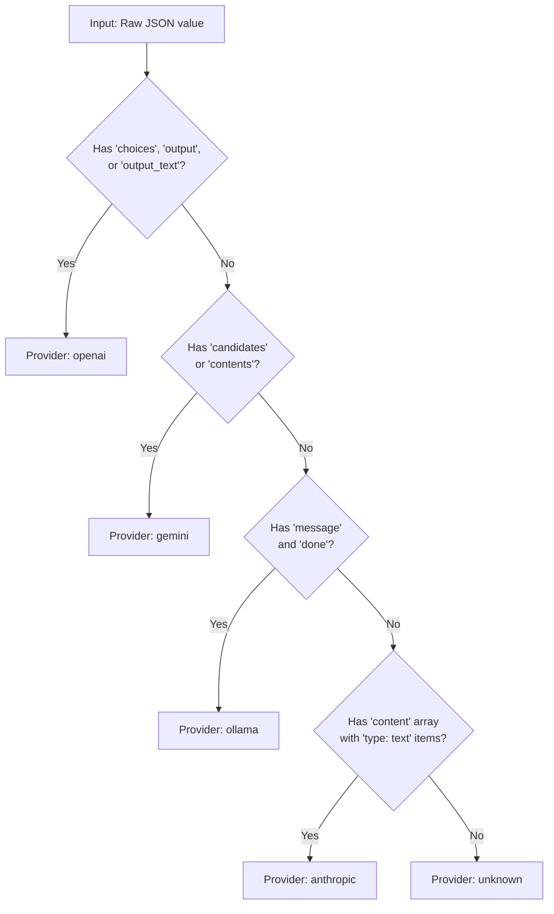
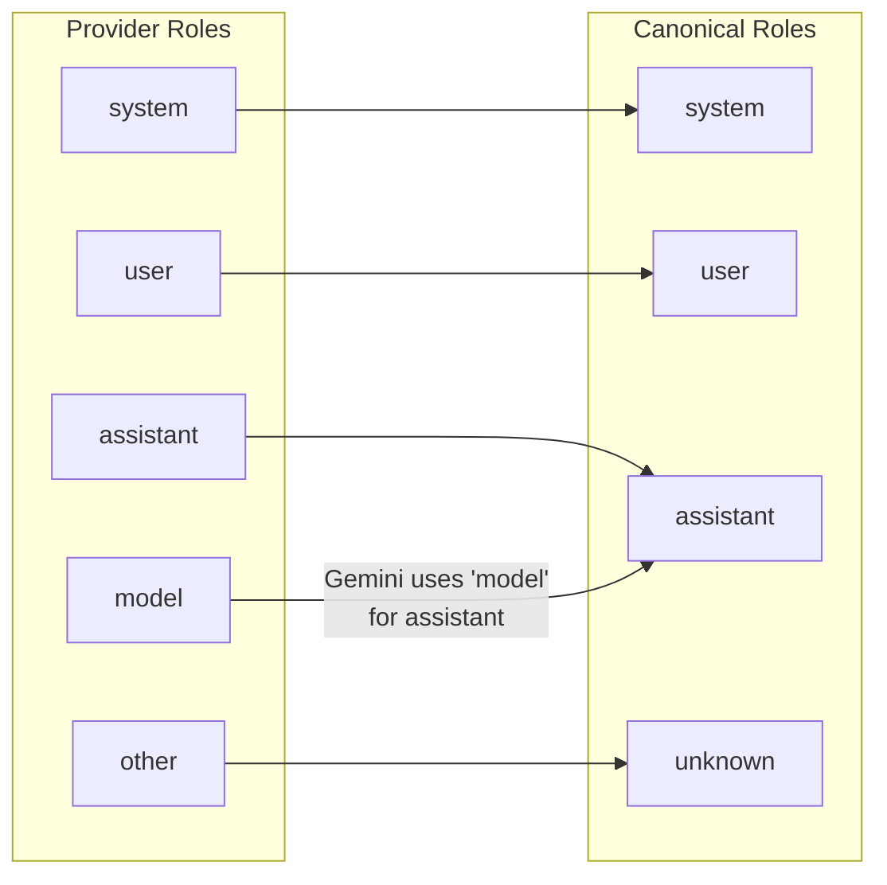
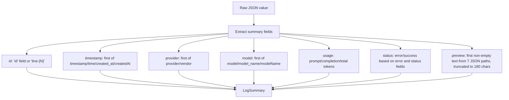
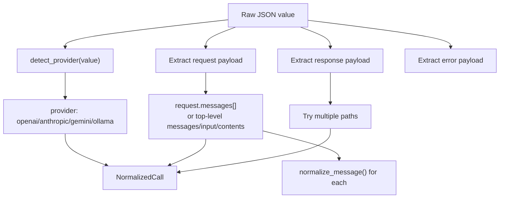
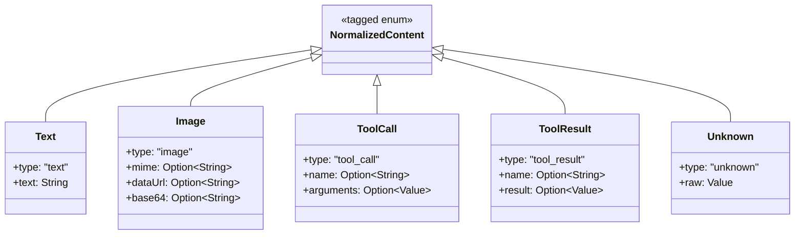

# Provider Normalization

PromptLens normalizes JSONL audit logs from four major LLM providers into a single `NormalizedCall` schema. This allows the UI to render all providers uniformly without provider-specific rendering logic.

## Provider Detection

The `detect_provider` function in `adapters.rs` uses structural heuristics on the raw JSON to identify the provider. No explicit provider field is required.

```rust
// file: src-tauri/src/adapters.rs:11
pub(crate) fn detect_provider(value: &Value) -> Option<String> {
    if value.get("choices").is_some()
        || value.get("output").is_some()
        || value.get("output_text").is_some()
    {
        return Some("openai".to_string());
    }
    if value.get("candidates").is_some() || value.get("contents").is_some() {
        return Some("gemini".to_string());
    }
    if value.get("message").is_some() && value.get("done").is_some() {
        return Some("ollama".to_string());
    }
    if value.get("content").and_then(Value::as_array).is_some_and(|items| {
        items.iter().any(|item| item.get("type").and_then(Value::as_str) == Some("text"))
    }) {
        return Some("anthropic".to_string());
    }
    None
}
```



### Detection Priority

The checks are ordered by specificity -- each examines a structural signature unlikely to appear in other providers:

| Priority | Provider | Signature | Why It Works |
|----------|----------|-----------|--------------|
| 1 | OpenAI | `choices`, `output`, or `output_text` | OpenAI uses `choices` for chat completions, `output` for the Responses API |
| 2 | Gemini | `candidates` or `contents` | Gemini uses `candidates` for responses, `contents` for requests |
| 3 | Ollama | `message` and `done` | Ollama streams use `done: true` as a completion signal |
| 4 | Anthropic | `content` array with `type: text` items | Anthropic uses `content` arrays with typed blocks |

## Role Normalization

The `normalize_role` function in `adapters.rs` maps provider-specific roles to a canonical set:

```rust
// file: src-tauri/src/adapters.rs:3
pub(crate) fn normalize_role(role: &str) -> String {
    match role {
        "system" | "developer" | "user" | "assistant" | "tool" | "function" => role.to_string(),
        "model" => "assistant".to_string(),
        _ => "unknown".to_string(),
    }
}
```

The key non-obvious mapping is `model` to `assistant` -- Gemini uses the role `"model"` where other providers use `"assistant"`.



## Normalization Pipeline

When a user selects a record, the raw JSON goes through two phases:

### Phase 1: Summary Extraction (`summary_from_value`)

This lightweight pass extracts fields for the list view without performing full message normalization:



### Phase 2: Full Normalization (`normalize_call`)

This pass reconstructs the full conversation structure. It is called only when a user selects a specific record:



## Content Part Normalization

Each message's content is normalized into typed `NormalizedContent` parts:

```rust
// file: src-tauri/src/types.rs:246
#[derive(Debug, Serialize, Deserialize)]
#[serde(tag = "type", rename_all = "snake_case")]
pub(crate) enum NormalizedContent {
    Text { text: String },
    Image { mime: Option<String>, data_url: Option<String>, base64: Option<String> },
    ToolCall { name: Option<String>, arguments: Option<Value> },
    ToolResult { name: Option<String>, result: Option<Value> },
    Unknown { raw: Value },
}
```



## Field Lookup Aliases

The normalization functions try multiple key names for each field to handle provider differences:

| Field | Aliases |
|-------|---------|
| Timestamp | `timestamp` / `time` / `created_at` / `createdAt` |
| Provider | `provider` / `vendor` |
| Model | `model` / `model_name` / `modelName` (also checks `request.model`) |
| Trace ID | `trace_id` / `traceId` / `trace` / `traceID` / `run_id` / `runId` |
| Session ID | `session_id` / `sessionId` / `conversation_id` / `conversationId` / `thread_id` / `threadId` |
| Request ID | `request_id` / `requestId` / `call_id` / `callId` / `span_id` / `spanId` |
| Latency | `latency_ms` / `latencyMs` / `duration_ms` / `durationMs` |

### Token Usage Aliases

Searched within the `usage` object (or the root value if no `usage` key exists):

| Field | Aliases |
|-------|---------|
| `prompt_tokens` | `prompt_tokens` / `promptTokens` / `input_tokens` / `inputTokens` / `promptTokenCount` |
| `completion_tokens` | `completion_tokens` / `completionTokens` / `output_tokens` / `outputTokens` / `candidatesTokenCount` |
| `total_tokens` | `total_tokens` / `totalTokens` / `totalTokenCount` |

## Provider-Specific Example Payloads

### OpenAI Chat Completion

```json
{
  "id": "chatcmpl-abc123",
  "model": "gpt-4.1",
  "choices": [{ "message": { "role": "assistant", "content": "Hello!" } }],
  "usage": { "prompt_tokens": 10, "completion_tokens": 5, "total_tokens": 15 }
}
```

Normalization extracts: provider=`openai`, model=`gpt-4.1`, response message role=`assistant`, content=`Hello!`, total_tokens=15.

### Anthropic Messages API

```json
{
  "id": "msg_abc",
  "model": "claude-sonnet-4",
  "content": [{ "type": "text", "text": "Hello!" }],
  "usage": { "input_tokens": 10, "output_tokens": 5 }
}
```

Normalization extracts: provider=`anthropic`, model=`claude-sonnet-4`, response content as `NormalizedContent::Text`, prompt_tokens from `input_tokens`, completion_tokens from `output_tokens`.

### Gemini GenerateContent Response

```json
{
  "candidates": [{ "content": { "role": "model", "parts": [{ "text": "Hello!" }] } }],
  "usageMetadata": { "promptTokenCount": 10, "candidatesTokenCount": 5, "totalTokenCount": 15 }
}
```

Normalization extracts: provider=`gemini`, role mapped from `model` to `assistant`, tokens from `usageMetadata`, response from `candidates[].content`.

### Ollama Chat Response

```json
{
  "model": "llama3",
  "message": { "role": "assistant", "content": "Hello!" },
  "done": true,
  "prompt_eval_count": 10,
  "eval_count": 5
}
```

Normalization extracts: provider=`ollama` (detected via `message` + `done`), model=`llama3`, response from `message`.

## Preview Extraction

The `find_preview` function tries multiple JSON paths to find a short text preview for the list view:

| Priority | JSON Path | Typical Source |
|----------|-----------|----------------|
| 1 | `/response/message/content` | OpenAI-style single message |
| 2 | `/response/content` | Anthropic-style content array |
| 3 | `/response/text` | Simple text response |
| 4 | `/request/messages/0/content` | First request message |
| 5 | `/messages/0/content` | Top-level messages array |
| 6 | `/output_text` | OpenAI Responses API |
| 7 | `/text` | Plain text field |

If none of these paths yield a string, the entire JSON value is serialized and truncated to 180 characters.
