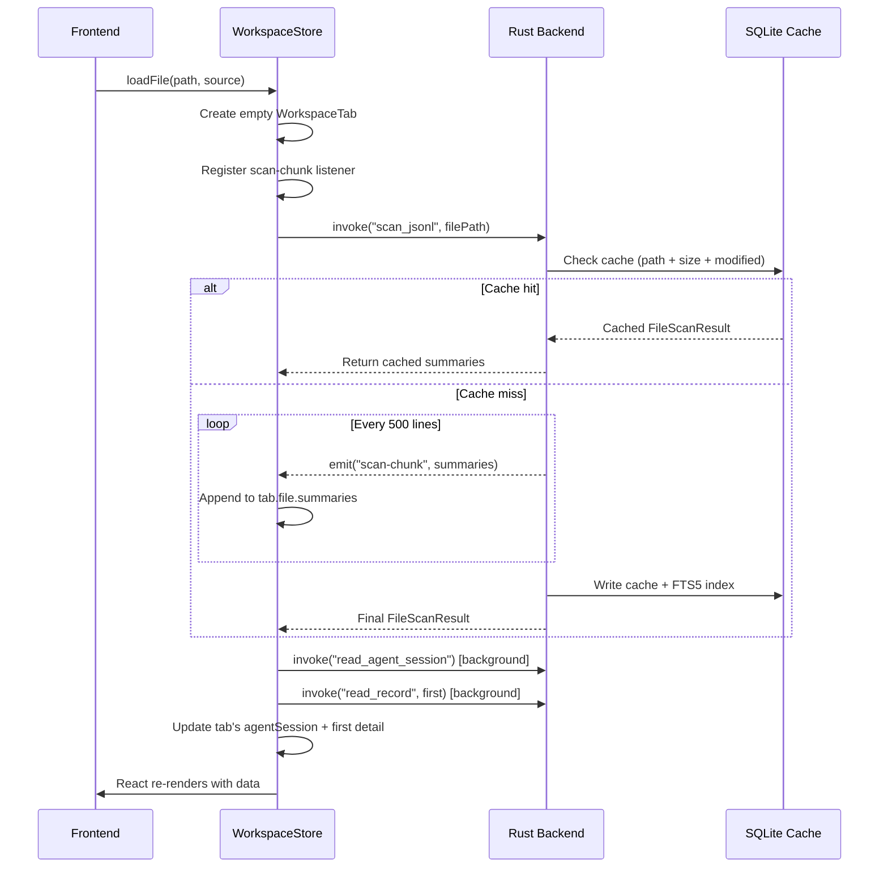
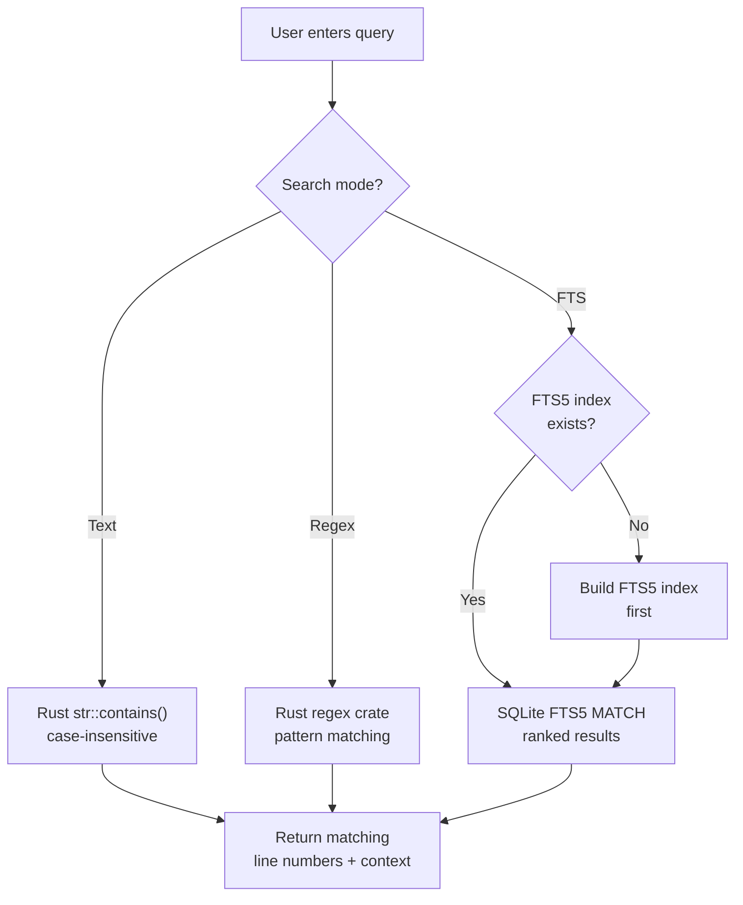
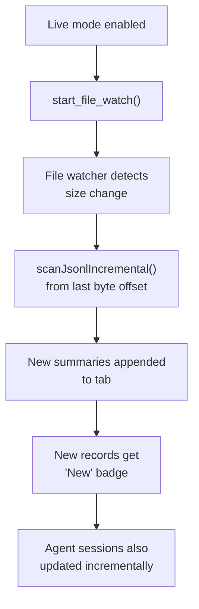

# Quick Start

This tutorial walks you through opening your first JSONL log file in PromptLens and exploring its features.

## Step 1: Launch PromptLens

Open PromptLens from your application menu, or if you built from source, run `npm run tauri:dev`. You will see the splash screen with the PromptLens logo and an "Open JSONL File" button.

## Step 2: Open a Log File

There are several ways to open a file:

1. **Click the button** -- Click "Open JSONL File" on the splash screen.
2. **Use the menu** -- Click "Open" in the title bar, then select a source type.
3. **Keyboard shortcut** -- Press `Ctrl+O` (or `Cmd+O` on macOS).

A native file dialog will appear. Navigate to your `.jsonl` file and select it.

### Don't Have a Log File?

Generate a sample:

```bash
npm run sample:large
```

This creates a sample JSONL file ready to open. You can also specify the size:

```bash
node scripts/generate-large-sample.mjs 5000 10   # 5000 lines, ~10 MB
```

### What Happens When You Open a File

The opening process involves multiple Tauri IPC calls working together:



The Rust scanner streams the file using a 256KB buffer, emitting progress events every 250 lines and chunk events every 500 lines:

```rust
// file: src-tauri/src/scanner.rs:99
// Emit scan-chunk every 500 lines for incremental UI updates
if total_lines.is_multiple_of(500) && !chunk_buffer.is_empty() {
    if let Some(app) = app {
        let _ = app.emit("scan-chunk", ScanChunkPayload {
            file_path: file_path.clone(),
            summaries: std::mem::take(&mut chunk_buffer),
            line_from: chunk_start_line,
            line_to: total_lines,
        });
    }
    chunk_start_line = total_lines + 1;
}
```

The frontend listens for these chunks to display results incrementally:

```tsx
// file: src/app/store.ts:403
const unlistenChunk = listen<ScanChunkPayload>("scan-chunk", (event) => {
  const chunk = event.payload;
  if (chunk.filePath !== scanningFilePath) return;
  set((s) => {
    const tab = s.tabs.find((t) => t.id === chunk.filePath);
    if (!tab) return s;
    return {
      tabs: s.tabs.map((t) =>
        t.id === chunk.filePath
          ? { ...t, file: { ...t.file, summaries: [...t.file.summaries, ...chunk.summaries] } }
          : t,
      ),
    };
  });
});
```

The first scan of a large file may take a few seconds. Subsequent opens of the same file will use the cache and load instantly.

## Step 3: Browse the Record List

Once the file is loaded, the left panel displays a virtualized record list. Each card shows:

- **Colored status dot** -- green for success, red for error, yellow for invalid JSON
- **Model name** and **timestamp**
- **Provider**, **latency**, and **token count**
- A text **preview** of the request content
- **Icons** for records containing images or tool calls
- **Cost estimate** when pricing data is available

The record list uses `@tanstack/react-virtual` for virtual scrolling. Only visible rows are rendered into the DOM:

```tsx
// file: src/app/components/LeftPanel.tsx:303
const rowVirtualizer = useVirtualizer({
  count: items.length,
  getScrollElement: () => parentRef.current,
  estimateSize: () => 74,
  overscan: 10,
});
```

Each record card is absolutely positioned using `transform: translateY()`:

```tsx
// file: src/app/components/LeftPanel.tsx:325
<button
  className={`log-row ${selected?.lineNumber === item.lineNumber ? "selected" : ""} ${isNew ? "new-record" : ""}`}
  onClick={() => onSelect(item)}
  style={{ transform: `translateY(${virtualRow.start}px)` }}
>
```

### Filtering Records

Use the toolbar above the record list to narrow results:

| Control | Purpose |
|---------|---------|
| Status dropdown | Filter by All, Errors, Success, Images, or Tools |
| Sort dropdown | Sort by Time, Latency, Tokens, Model, or Status |
| Provider dropdown | Filter to a specific LLM provider |
| Model dropdown | Filter to a specific model |
| Issue filter button | Show only records with detected issues |
| Min ms input | Hide records below a latency threshold |
| Min tokens input | Hide records below a token threshold |
| Live button | Enable live tail mode to watch logs in real time |

### Filter Pipeline

All filters are applied in combination (AND logic). A record must pass every active filter to appear in the list:

```mermaid
flowchart LR
    A["All records\n(from summaries)"] --> B["Status filter\nAll/Errors/Success/Images/Tools"]
    B --> C["Provider filter\n(openai/anthropic/...)"]
    C --> D["Model filter\n(gpt-4.1/claude-sonnet-4/...)"]
    D --> E["Issue filter\n(on/off)"]
    E --> F["Latency threshold\n(min ms)"]
    F --> G["Token threshold\n(min tokens)"]
    G --> H["Text query\n(frontend substring)"]
    H --> I["Sort\n(time/latency/tokens/model/status)"]
    I --> J["Display in\nvirtual list"]
```



## Step 4: View a Conversation

Click any record in the list to load its full conversation in the center panel. The loading process uses byte-offset addressing for O(1) random access:

```rust
// file: src-tauri/src/commands.rs:111
fn read_record(file_path: String, byte_offset: u64, line_number: usize)
    -> Result<RecordDetail, String>
{
    let file = File::open(&file_path).map_err(|err| format!("Failed to open file: {err}"))?;
    let mut reader = BufReader::new(file);
    reader.seek(SeekFrom::Start(byte_offset))
        .map_err(|err| format!("Failed to seek record: {err}"))?;
    // ... parse and normalize single line
}
```

You will see:

1. **Header bar** -- Model name, provider, line number, and latency.
2. **Status badge** -- Success (green) or Error (red).
3. **Message cards** -- Each message shows its role and content.

### View Modes

Each message card has three view modes:

| Mode | What It Shows |
|------|---------------|
| **Preview** | Markdown rendering with syntax highlighting, images as thumbnails, tool calls as structured cards |
| **Text** | Plain text content, no Markdown rendering |
| **JSON** | Raw JSON of the message object |

Use the buttons at the top of each message card to switch between modes. The mode is shared across all cards:

```tsx
// file: src/app/components/CenterPanel.tsx:311
<article className={`message-card role-${message.role}`}>
  <div className="message-role">
    <span>{message.role}</span>
    <div className="message-actions">
      <button onClick={() => copyJson(message.raw ?? message.content)} title="Copy message">
        <Copy size={14} />
      </button>
      <button className={viewMode === "preview" ? "active" : ""} onClick={() => onViewModeChange("preview")}>
        Preview
      </button>
      <button className={viewMode === "text" ? "active" : ""} onClick={() => onViewModeChange("text")}>
        Text
      </button>
      <button className={isJson ? "active" : ""} onClick={() => onViewModeChange("json")}>
        JSON
      </button>
    </div>
  </div>
```

### Images

If a message contains embedded images (base64 data URLs), they appear as clickable thumbnails. Click an image to open a full-size preview modal. Press `Escape` to close.

## Step 5: Inspect the Right Panel

The right panel provides additional views for the selected record:

| Tab | Purpose |
|-----|---------|
| Diff | Side-by-side comparison of two records |
| Tools | Structured view of tool calls and results |
| Error | Error details for failed records |
| JSON | Interactive JSON tree view of the full normalized JSON |
| Raw | View the raw JSON payload |

To use the diff view, click the compare icon on any record card to set it as the baseline, then select another record.

## Step 6: Search Across the File

To perform a full-text search across the file:

1. Type your query in the search box at the top of the left panel.
2. Select a search mode: **Text** (substring), **Regex**, or **FTS** (SQLite full-text search).
3. Press `Enter` or click "Search".

The search backend supports three modes, each with different tradeoffs:



Search results appear as a list with context snippets. Click a result to jump to that record.

## Step 7: Explore Analytics

Switch to the Analytics tab in the left panel to see:

- **Metric cards** -- Total records, error count and rate, P95/P99 latency, total tokens, cost estimates
- **Bar charts** -- Top models and providers by usage
- **Histogram** -- Latency distribution across all filtered records
- **Metadata** -- File path, size, valid/invalid counts, and selected record details

Analytics are computed in two places: the frontend (for instant filter updates) and the Rust backend (for comprehensive analysis):

```tsx
// file: src/app/analytics.ts:52
export function buildAnalytics(items: LogSummary[]): AnalyticsSummary {
  const latencies = items.map((item) => item.latencyMs)
    .filter((value): value is number => value !== undefined);
  const tokens = items.map((item) => item.totalTokens)
    .filter((value): value is number => value !== undefined);
  const errors = items.filter((item) =>
    item.status === "error" || item.status === "invalid_json").length;
  return {
    total: items.length,
    success: items.filter((item) => item.status === "success").length,
    errors,
    invalid: items.filter((item) => item.status === "invalid_json").length,
    errorRate: items.length ? (errors / items.length) * 100 : 0,
    p95Latency: percentile(latencies, 0.95),
    p99Latency: percentile(latencies, 0.99),
    totalTokens: tokens.reduce((sum, value) => sum + value, 0),
    p95Tokens: percentile(tokens, 0.95),
    topModels: topCounts(items.map((item) => item.model || "unknown model")),
    topProviders: topCounts(items.map((item) => item.provider || "unknown provider")),
  };
}
```

## Step 8: Export Your Data

Click "Export" in the title bar to access export options. You can export filtered records as:

- JSONL summary
- CSV summary
- Markdown report
- Raw JSONL
- Normalized JSONL
- Session Markdown

See [Export](export.md) for details on each format.

## Step 9: Enable Live Mode

If you are actively generating logs, click the **Live** button in the toolbar. PromptLens will watch the file for changes and automatically load appended records. New records appear with a "New" badge.

Live mode uses the file watcher and incremental scanning:



## Common First-Use Issues

### "I opened a file but see no records"

Check that the file is valid JSONL (one JSON object per line). If the file uses a non-standard format, try opening it with the correct source type from the Open menu.

### "Scan seems stuck on a large file"

Large files (hundreds of MB) take time to scan. Check the progress in the status bar. You can cancel if needed using the cancel button. Subsequent opens will use the cache and load instantly.

### "Records show 'unknown model' or 'unknown provider'"

PromptLens detects providers from JSON structure. If your logs use a custom format, the provider may not be recognized. The data is still viewable -- only the provider label is affected.

### "I only want to see error records"

Set the status filter dropdown (top-left of the toolbar) to "Errors". This filters the list to show only records with error or invalid_json status.

### "How do I compare two model outputs?"

1. Find the first record and click the compare icon (two arrows) on its card.
2. Select the second record.
3. Switch to the Diff tab in the right panel.
4. The diff view shows a side-by-side comparison with differences highlighted.

## Quick Reference: Record Card Anatomy

Each record card in the list shows this information:

```
+--------------------------------------------------+
| [status-dot] model-name               timestamp  |
| provider  latency  tokens  cost                  |
| preview text snippet...                          |
+--------------------------------------------------+
  ^           ^        ^       ^       ^      ^
  |           |        |       |       |      |
  green/red/  model    total   est.    image  wrench
  yellow      name     tokens  cost    icon   icon
```

- **Status dot**: Green = success, Red = error, Yellow = invalid JSON
- **Model name**: The detected model (e.g., gpt-4.1, claude-sonnet-4)
- **Timestamp**: When the API call was made
- **Provider**: The detected LLM provider
- **Latency**: Response time in milliseconds
- **Tokens**: Total token count (prompt + completion)
- **Cost**: Estimated cost from pricing data
- **Preview**: First user message snippet

## Tauri IPC Commands Used

During this tutorial, the following Tauri commands were invoked:

| Command | When | Purpose |
|---------|------|---------|
| `open_file_dialog` | Opening a file | Shows native file picker |
| `scan_jsonl` | File selected | Scans file and returns summaries |
| `read_record` | Clicking a record | Loads full record at byte offset |
| `search_jsonl` | Pressing Enter in search | Full-text search across file |
| `calculate_costs` | File loaded | Computes cost estimates |
| `compute_analytics` | File loaded | Computes server-side analytics |

## Next Steps

- [User Guide](user-guide.md) -- Comprehensive guide to all features
- [Interface Overview](interface-overview.md) -- Detailed layout documentation
- [Search](search.md) -- Deep dive into search capabilities
- [Keyboard Shortcuts](keyboard-shortcuts.md) -- All available shortcuts
