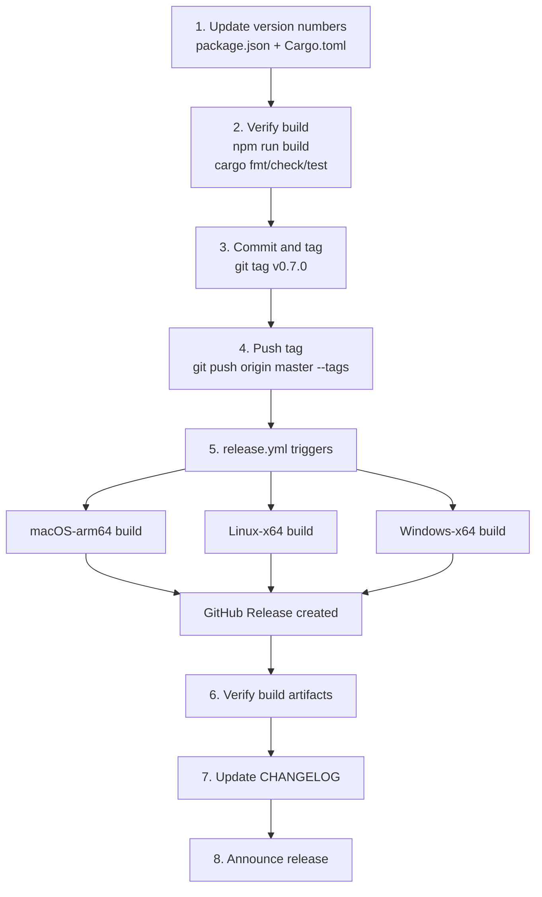
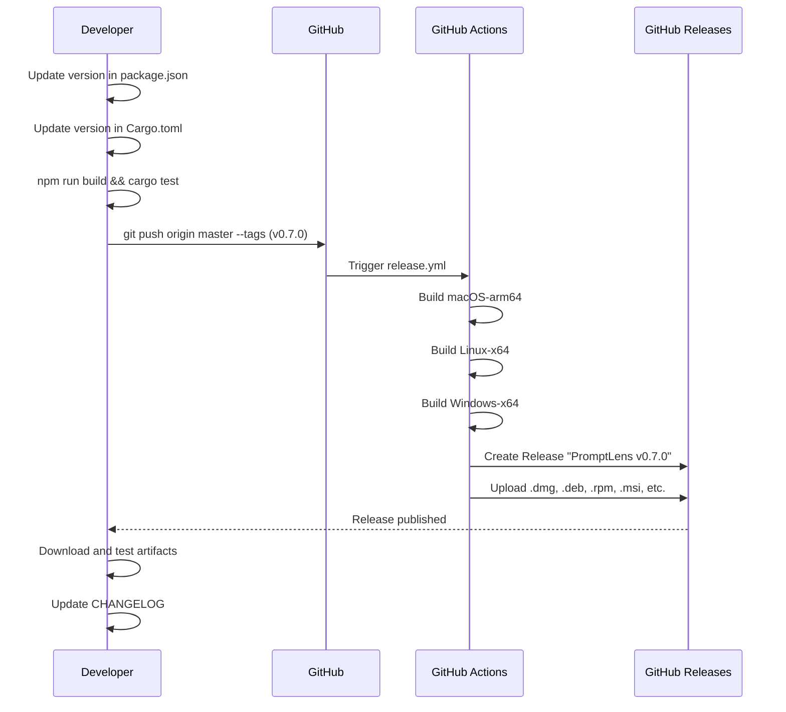
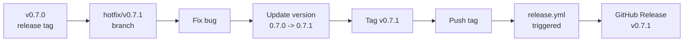

# Release Process

This document describes how to create a new PromptLens release.

## Release Flow





## Version Locations

The version string appears in two files that must be updated together:

| File | Field | Example |
|------|-------|---------|
| `package.json` | `"version"` | `"0.6.0"` |
| `src-tauri/Cargo.toml` | `[package] version` | `"0.6.0"` |

```json
// file: package.json:3
{
  "name": "promptlens",
  "version": "0.6.0"
}
```

```toml
# file: src-tauri/Cargo.toml:2
[package]
name = "promptlens"
version = "0.6.0"
```

## Step-by-Step Release

### 1. Update Version Numbers

Edit both files to the new version string. They must match exactly.

```bash
# Edit package.json
# "version": "0.7.0"

# Edit src-tauri/Cargo.toml
# version = "0.7.0"
```

### 2. Verify the Build

```bash
# Frontend type-check and build
npm run build

# Backend checks
cd src-tauri
cargo fmt --check
cargo check
cargo test
```

### 3. Commit and Tag

```bash
git add package.json src-tauri/Cargo.toml
git commit -m "Release v0.7.0"
git tag v0.7.0
git push origin master --tags
```

The tag **must** match the `v*` pattern to trigger the release workflow:

```yaml
# file: .github/workflows/release.yml:4-6
on:
  push:
    tags:
      - "v*"
```

### 4. CI Builds Artifacts

The `release.yml` workflow runs when the tag is pushed, building platform-specific installers:

| Platform | Artifacts |
|----------|-----------|
| macOS (arm64) | `.dmg` (disk image), `.app.tar.gz` (portable archive) |
| Linux (x64) | `.deb` (Debian/Ubuntu), `.rpm` (Fedora/RHEL), `.AppImage` (universal) |
| Windows (x64) | `.msi` (Windows Installer), `.nsis.zip` (NSIS installer), `.exe` |

### 5. GitHub Release Created

The `tauri-action` creates the GitHub Release automatically:

```yaml
# file: .github/workflows/release.yml:83-93
- name: Build and release
  uses: tauri-apps/tauri-action@v0
  env:
    GITHUB_TOKEN: ${{ secrets.GITHUB_TOKEN }}
  with:
    tagName: ${{ github.ref_name }}
    releaseName: "PromptLens ${{ github.ref_name }}"
    releaseBody: "See the assets below for platform-specific installers."
    releaseDraft: false
    prerelease: false
    args: --target ${{ matrix.target }} --bundles ${{ matrix.bundles }}
```

- **Tag:** `v0.7.0`
- **Name:** `PromptLens v0.7.0`
- **Body:** "See the assets below for platform-specific installers."
- **Draft:** No
- **Prerelease:** No

All platform artifacts are attached to the release.

## CI Release Matrix

| Platform | Runner | Target | Installer Formats |
|----------|--------|--------|-------------------|
| macOS-arm64 | `macos-14` | `aarch64-apple-darwin` | dmg, app |
| Linux-x64 | `ubuntu-22.04` | `x86_64-unknown-linux-gnu` | deb, rpm, appimage |
| Windows-x64 | `windows-latest` | `x86_64-pc-windows-msvc` | msi, nsis |

## Artifact File Sizes (Approximate)

| Artifact | Size Range | Target Platform |
|----------|-----------|----------------|
| `.dmg` (macOS) | 8-15 MB | macOS Apple Silicon |
| `.app.tar.gz` (macOS) | 8-15 MB | macOS Apple Silicon (portable) |
| `.deb` (Linux) | 7-12 MB | Debian, Ubuntu, Mint |
| `.rpm` (Linux) | 7-12 MB | Fedora, RHEL, CentOS |
| `.AppImage` (Linux) | 8-15 MB | Universal Linux |
| `.msi` (Windows) | 7-12 MB | Enterprise deployment |
| `.nsis.zip` (Windows) | 7-12 MB | End-user installation |

## Hotfix Releases

For urgent fixes between planned releases:

```bash
# Create a hotfix branch from the release tag
git checkout -b hotfix/v0.7.1 v0.7.0

# Apply the fix
git commit -m "Fix critical bug"

# Update the patch version in package.json and Cargo.toml
# Then tag and push
git tag v0.7.1
git push origin hotfix/v0.7.1 --tags
```



## Pre-release / Beta

To create a pre-release, modify the release workflow or manually create a GitHub Release with the `prerelease` flag. The current workflow sets `prerelease: false`.

## Post-Release Checklist

| Task | Description |
|------|-------------|
| Verify artifacts | Download and test installers for each platform |
| Update CHANGELOG | Document changes since the last release |
| Announce | Post to GitHub Discussions, social media, etc. |
| Update dev version | Optional: set the next development version |

## Manual Release (No CI)

If CI is unavailable, build locally for each platform:

```bash
# macOS
cd src-tauri
cargo tauri build --target aarch64-apple-darwin --bundles dmg,app

# Linux
cargo tauri build --target x86_64-unknown-linux-gnu --bundles deb,rpm,appimage

# Windows
cargo tauri build --target x86_64-pc-windows-msvc --bundles msi,nsis
```

Upload the resulting files from `src-tauri/target/<target>/release/bundle/` to a GitHub Release manually.

## Versioning Scheme

PromptLens follows [Semantic Versioning](https://semver.org/):

| Component | When to Bump | Example |
|-----------|--------------|---------|
| Major (`X.0.0`) | Breaking changes to file format or IPC interface | `1.0.0` |
| Minor (`0.X.0`) | New features, new providers, UI changes | `0.7.0` |
| Patch (`0.0.X`) | Bug fixes, documentation, minor improvements | `0.6.1` |

## Changelog Template

Each release should include a changelog entry:

```markdown
## v0.7.0

### Features
- Added support for new provider X
- New analytics dashboard with cost tracking

### Bug Fixes
- Fixed incremental scan offset calculation
- Resolved dark mode contrast issues

### Internal
- Upgraded Tauri to 2.9
- Added Vitest for frontend testing
```

## Release Artifacts by Platform

| Platform | Installer Type | File Extension | Target Users |
|----------|---------------|----------------|-------------|
| macOS (Apple Silicon) | Disk Image | `.dmg` | macOS users on M1+ |
| macOS (Apple Silicon) | Portable Archive | `.app.tar.gz` | Power macOS users |
| Linux (Debian/Ubuntu) | Debian Package | `.deb` | Ubuntu, Debian, Mint |
| Linux (Fedora/RHEL) | RPM Package | `.rpm` | Fedora, RHEL, CentOS |
| Linux (Universal) | AppImage | `.AppImage` | Any Linux distribution |
| Windows | MSI Installer | `.msi` | Enterprise deployment |
| Windows | NSIS Installer | `.nsis.zip` | End-user installation |

## Rollback Procedure

If a release has critical issues:

1. Create a new patch release with the fix (preferred)
2. Alternatively, mark the GitHub Release as a prerelease to hide it from latest
3. If necessary, delete the tag:

```bash
git tag -d v0.7.0
git push origin :refs/tags/v0.7.0
```

## Verification Checklist

After a release is published:

| Step | Description |
|------|-------------|
| Download artifacts | Download at least one artifact per platform |
| Install and launch | Verify the app starts without errors |
| Open a sample file | Confirm scanning and record viewing work |
| Check version | Verify the displayed version matches the tag |
| Test auto-update | (if configured) Verify update notification appears |
