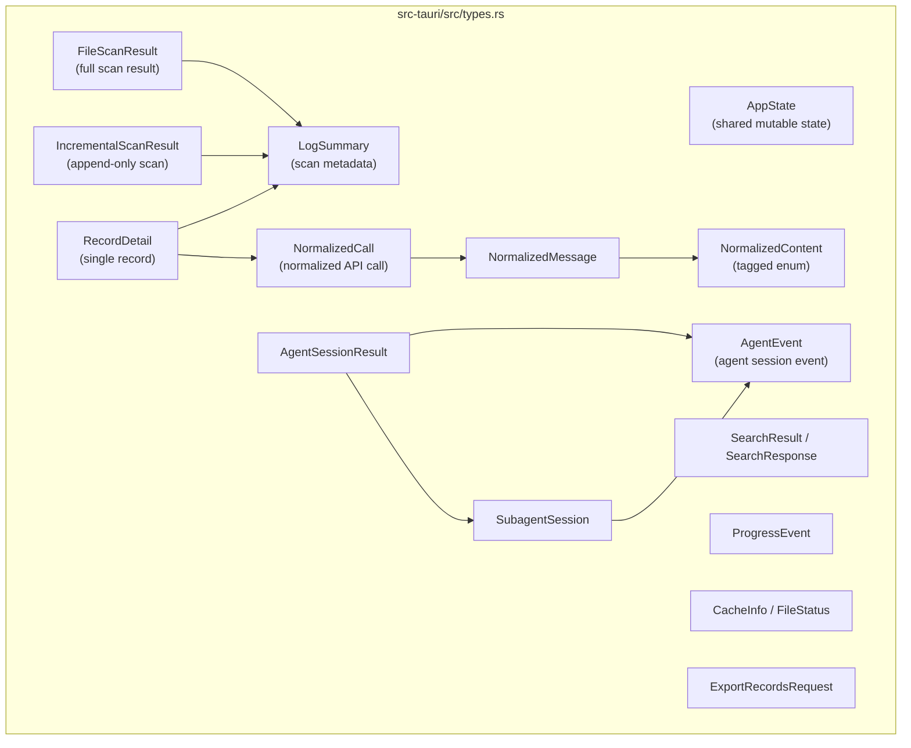

# Rust Types

All Rust type definitions live in `src-tauri/src/types.rs`. They use `serde` with `rename_all = "camelCase"` for JSON serialization, matching the frontend TypeScript types exactly.

## Type Architecture

```mermaid
classDiagram
    class AppState {
        +AtomicBool cancel_scan
        +AtomicBool cancel_search
        +Mutex~Option~FileWatcher~~ file_watcher
    }

    class LogSummary {
        +String id
        +usize line_number
        +u64 byte_offset
        +Option~String~ provider
        +Option~String~ model
        +String status
        +bool has_image
        +bool has_tool_call
    }

    class FileScanResult {
        +String file_path
        +String file_name
        +u64 file_size
        +usize total_lines
        +usize valid_records
        +Vec~LogSummary~ summaries
    }

    class NormalizedCall {
        +String id
        +usize line_number
        +String status
        +Option~Usage~ usage
        +Option~NormalizedPayload~ request
        +Option~NormalizedResponse~ response
        +Option~NormalizedError~ error
        +Value raw
    }

    class NormalizedMessage {
        +String role
        +Vec~NormalizedContent~ content
        +Option~Value~ raw
    }

    class NormalizedContent {
        <<enum>>
        Text{text}
        Image{mime, data_url, base64}
        ToolCall{name, arguments}
        ToolResult{name, result}
        Unknown{raw}
    }

    class AgentEvent {
        +String id
        +usize line_number
        +u64 byte_offset
        +String event_type
        +Vec~String~ file_paths
        +bool is_error
        +bool is_sidechain
    }

    class SearchResponse {
        +Vec~SearchResult~ results
        +bool truncated
        +bool cancelled
        +u128 duration_ms
        +bool indexed
    }

    AppState --> FileScanResult
    FileScanResult --> LogSummary
    NormalizedCall --> NormalizedMessage
    NormalizedMessage --> NormalizedContent
```



## Constants

```rust
// file: src-tauri/src/types.rs:6-7
pub(crate) const MAX_SEARCH_RESULTS: usize = 1000;
pub(crate) const CACHE_SCHEMA_VERSION: i64 = 3;
```

| Constant | Type | Value | Purpose |
|----------|------|-------|---------|
| `MAX_SEARCH_RESULTS` | `usize` | `1000` | Maximum search results returned |
| `CACHE_SCHEMA_VERSION` | `i64` | `3` | SQLite cache schema version |

## Application State

### `AppState`

Holds shared mutable state for the Tauri application.

```rust
// file: src-tauri/src/types.rs:9-23
pub(crate) struct AppState {
    pub(crate) cancel_scan: AtomicBool,
    pub(crate) cancel_search: AtomicBool,
    pub(crate) file_watcher: Mutex<Option<crate::watcher::FileWatcher>>,
}

impl Default for AppState {
    fn default() -> Self {
        Self {
            cancel_scan: AtomicBool::new(false),
            cancel_search: AtomicBool::new(false),
            file_watcher: Mutex::new(None),
        }
    }
}
```

| Field | Type | Description |
|-------|------|-------------|
| `cancel_scan` | `AtomicBool` | Flag to cancel in-progress scans |
| `cancel_search` | `AtomicBool` | Flag to cancel in-progress searches |
| `file_watcher` | `Mutex<Option<FileWatcher>>` | Active file watcher |

Implements `Default` with both flags set to `false` and no watcher.

## Scan Types

### `LogSummary`

Metadata extracted from a single JSONL line during scanning.

```rust
// file: src-tauri/src/types.rs:25-47
#[derive(Debug, Serialize, Deserialize, Clone)]
#[serde(rename_all = "camelCase")]
pub(crate) struct LogSummary {
    pub(crate) id: String,
    pub(crate) line_number: usize,
    pub(crate) byte_offset: u64,
    pub(crate) timestamp: Option<String>,
    pub(crate) provider: Option<String>,
    pub(crate) model: Option<String>,
    pub(crate) trace_id: Option<String>,
    pub(crate) session_id: Option<String>,
    pub(crate) request_id: Option<String>,
    pub(crate) parent_id: Option<String>,
    pub(crate) status: String,
    pub(crate) latency_ms: Option<u64>,
    pub(crate) prompt_tokens: Option<u64>,
    pub(crate) completion_tokens: Option<u64>,
    pub(crate) total_tokens: Option<u64>,
    pub(crate) has_image: bool,
    pub(crate) has_tool_call: bool,
    pub(crate) preview: Option<String>,
    pub(crate) parse_error: Option<String>,
}
```

| Field | Rust Type | JSON Key | Description |
|-------|-----------|----------|-------------|
| `id` | `String` | `id` | Unique record identifier |
| `line_number` | `usize` | `lineNumber` | 1-based line number |
| `byte_offset` | `u64` | `byteOffset` | Byte offset for seeking |
| `timestamp` | `Option<String>` | `timestamp` | ISO 8601 timestamp |
| `provider` | `Option<String>` | `provider` | LLM provider |
| `model` | `Option<String>` | `model` | Model name |
| `trace_id` | `Option<String>` | `traceId` | Trace identifier |
| `session_id` | `Option<String>` | `sessionId` | Session identifier |
| `request_id` | `Option<String>` | `requestId` | Request identifier |
| `parent_id` | `Option<String>` | `parentId` | Parent record ID |
| `status` | `String` | `status` | `"success"`, `"error"`, `"invalid_json"`, `"unknown"` |
| `latency_ms` | `Option<u64>` | `latencyMs` | Latency in milliseconds |
| `prompt_tokens` | `Option<u64>` | `promptTokens` | Input token count |
| `completion_tokens` | `Option<u64>` | `completionTokens` | Output token count |
| `total_tokens` | `Option<u64>` | `totalTokens` | Total token count |
| `has_image` | `bool` | `hasImage` | Contains image content |
| `has_tool_call` | `bool` | `hasToolCall` | Contains tool calls |
| `preview` | `Option<String>` | `preview` | Truncated text preview |
| `parse_error` | `Option<String>` | `parseError` | Parse error message |

Derives: `Debug, Serialize, Deserialize, Clone`

### `FileScanResult`

Result of a full scan of a JSONL file.

```rust
// file: src-tauri/src/types.rs:49-63
#[derive(Debug, Serialize, Deserialize, Clone)]
#[serde(rename_all = "camelCase")]
pub(crate) struct FileScanResult {
    pub(crate) file_path: String,
    pub(crate) file_name: String,
    pub(crate) file_size: u64,
    pub(crate) modified: Option<String>,
    pub(crate) total_lines: usize,
    pub(crate) valid_records: usize,
    pub(crate) invalid_records: usize,
    pub(crate) duration_ms: u128,
    pub(crate) cancelled: bool,
    pub(crate) cache_hit: bool,
    pub(crate) summaries: Vec<LogSummary>,
}
```

| Field | Rust Type | JSON Key | Description |
|-------|-----------|----------|-------------|
| `file_path` | `String` | `filePath` | Absolute file path |
| `file_name` | `String` | `fileName` | File base name |
| `file_size` | `u64` | `fileSize` | File size in bytes |
| `modified` | `Option<String>` | `modified` | Last modified timestamp |
| `total_lines` | `usize` | `totalLines` | Total lines scanned |
| `valid_records` | `usize` | `validRecords` | Successfully parsed records |
| `invalid_records` | `usize` | `invalidRecords` | Failed-to-parse records |
| `duration_ms` | `u128` | `durationMs` | Scan duration in milliseconds |
| `cancelled` | `bool` | `cancelled` | Whether cancelled |
| `cache_hit` | `bool` | `cacheHit` | Whether served from cache |
| `summaries` | `Vec<LogSummary>` | `summaries` | All parsed summaries |

### `IncrementalScanResult`

```rust
// file: src-tauri/src/types.rs:65-73 (line 92-102 in actual file)
#[derive(Debug, Serialize, Deserialize)]
#[serde(rename_all = "camelCase")]
pub(crate) struct IncrementalScanResult {
    pub(crate) summaries: Vec<LogSummary>,
    pub(crate) file_size: u64,
    pub(crate) modified: Option<String>,
    pub(crate) next_line_number: usize,
    pub(crate) valid_records: usize,
    pub(crate) invalid_records: usize,
    pub(crate) duration_ms: u128,
}
```

| Field | Rust Type | JSON Key |
|-------|-----------|----------|
| `summaries` | `Vec<LogSummary>` | `summaries` |
| `file_size` | `u64` | `fileSize` |
| `modified` | `Option<String>` | `modified` |
| `next_line_number` | `usize` | `nextLineNumber` |
| `valid_records` | `usize` | `validRecords` |
| `invalid_records` | `usize` | `invalidRecords` |
| `duration_ms` | `u128` | `durationMs` |

## Record Types

### `RecordDetail`

```rust
// file: src-tauri/src/types.rs:65-72
#[derive(Debug, Serialize, Deserialize)]
#[serde(rename_all = "camelCase")]
pub(crate) struct RecordDetail {
    pub(crate) summary: LogSummary,
    pub(crate) normalized: Option<NormalizedCall>,
    pub(crate) raw: Option<Value>,
    pub(crate) parse_error: Option<String>,
}
```

| Field | Rust Type | JSON Key | Description |
|-------|-----------|----------|-------------|
| `summary` | `LogSummary` | `summary` | Lightweight metadata |
| `normalized` | `Option<NormalizedCall>` | `normalized` | Normalized LLM call |
| `raw` | `Option<Value>` | `raw` | Original JSON |
| `parse_error` | `Option<String>` | `parseError` | Parse error |

### `NormalizedCall`

```rust
// file: src-tauri/src/types.rs:182-203
#[derive(Debug, Serialize, Deserialize)]
#[serde(rename_all = "camelCase")]
pub(crate) struct NormalizedCall {
    pub(crate) id: String,
    pub(crate) line_number: usize,
    pub(crate) timestamp: Option<String>,
    pub(crate) provider: Option<String>,
    pub(crate) model: Option<String>,
    pub(crate) trace_id: Option<String>,
    pub(crate) session_id: Option<String>,
    pub(crate) request_id: Option<String>,
    pub(crate) parent_id: Option<String>,
    pub(crate) endpoint: Option<String>,
    pub(crate) status: String,
    pub(crate) latency_ms: Option<u64>,
    pub(crate) usage: Option<Usage>,
    pub(crate) request: Option<NormalizedPayload>,
    pub(crate) response: Option<NormalizedResponse>,
    pub(crate) error: Option<NormalizedError>,
    pub(crate) metadata: Option<Value>,
    pub(crate) raw: Value,
}
```

| Field | Rust Type | JSON Key | Description |
|-------|-----------|----------|-------------|
| `id` | `String` | `id` | Record ID |
| `line_number` | `usize` | `lineNumber` | Line number |
| `timestamp` | `Option<String>` | `timestamp` | Timestamp |
| `provider` | `Option<String>` | `provider` | LLM provider |
| `model` | `Option<String>` | `model` | Model name |
| `trace_id` | `Option<String>` | `traceId` | Trace ID |
| `session_id` | `Option<String>` | `sessionId` | Session ID |
| `request_id` | `Option<String>` | `requestId` | Request ID |
| `parent_id` | `Option<String>` | `parentId` | Parent ID |
| `endpoint` | `Option<String>` | `endpoint` | API endpoint |
| `status` | `String` | `status` | Call status |
| `latency_ms` | `Option<u64>` | `latencyMs` | Latency |
| `usage` | `Option<Usage>` | `usage` | Token usage |
| `request` | `Option<NormalizedPayload>` | `request` | Request data |
| `response` | `Option<NormalizedResponse>` | `response` | Response data |
| `error` | `Option<NormalizedError>` | `error` | Error data |
| `metadata` | `Option<Value>` | `metadata` | Extra metadata |
| `raw` | `Value` | `raw` | Original JSON |

### Supporting Normalization Types

```rust
// file: src-tauri/src/types.rs:205-236
#[derive(Debug, Serialize, Deserialize)]
#[serde(rename_all = "camelCase")]
pub(crate) struct Usage {
    pub(crate) prompt_tokens: Option<u64>,
    pub(crate) completion_tokens: Option<u64>,
    pub(crate) total_tokens: Option<u64>,
}

#[derive(Debug, Serialize, Deserialize)]
#[serde(rename_all = "camelCase")]
pub(crate) struct NormalizedPayload {
    pub(crate) messages: Option<Vec<NormalizedMessage>>,
    pub(crate) raw: Option<Value>,
}

#[derive(Debug, Serialize, Deserialize)]
#[serde(rename_all = "camelCase")]
pub(crate) struct NormalizedResponse {
    pub(crate) text: Option<String>,
    pub(crate) messages: Option<Vec<NormalizedMessage>>,
    pub(crate) tool_calls: Option<Value>,
    pub(crate) raw: Option<Value>,
}

#[derive(Debug, Serialize, Deserialize)]
#[serde(rename_all = "camelCase")]
pub(crate) struct NormalizedError {
    pub(crate) message: Option<String>,
    pub(crate) error_type: Option<String>,
    pub(crate) stack: Option<String>,
    pub(crate) raw: Option<Value>,
}
```

### `NormalizedMessage`

```rust
// file: src-tauri/src/types.rs:238-244
#[derive(Debug, Serialize, Deserialize)]
#[serde(rename_all = "camelCase")]
pub(crate) struct NormalizedMessage {
    pub(crate) role: String,
    pub(crate) content: Vec<NormalizedContent>,
    pub(crate) raw: Option<Value>,
}
```

### `NormalizedContent` (Tagged Enum)

```rust
// file: src-tauri/src/types.rs:246-269
#[derive(Debug, Serialize, Deserialize)]
#[serde(tag = "type", rename_all = "snake_case")]
pub(crate) enum NormalizedContent {
    Text {
        text: String,
    },
    Image {
        mime: Option<String>,
        #[serde(rename = "dataUrl")]
        data_url: Option<String>,
        base64: Option<String>,
    },
    ToolCall {
        name: Option<String>,
        arguments: Option<Value>,
    },
    ToolResult {
        name: Option<String>,
        result: Option<Value>,
    },
    Unknown {
        raw: Value,
    },
}
```

| Variant | Fields | JSON `type` |
|---------|--------|-------------|
| `Text` | `text: String` | `"text"` |
| `Image` | `mime: Option<String>`, `data_url: Option<String>`, `base64: Option<String>` | `"image"` |
| `ToolCall` | `name: Option<String>`, `arguments: Option<Value>` | `"tool_call"` |
| `ToolResult` | `name: Option<String>`, `result: Option<Value>` | `"tool_result"` |
| `Unknown` | `raw: Value` | `"unknown"` |

The `#[serde(tag = "type")]` attribute makes this an internally tagged enum, meaning JSON looks like `{ "type": "text", "text": "hello" }`.

## Search Types

```rust
// file: src-tauri/src/types.rs:74-90
#[derive(Debug, Serialize, Deserialize)]
#[serde(rename_all = "camelCase")]
pub(crate) struct SearchResult {
    pub(crate) line_number: usize,
    pub(crate) byte_offset: u64,
    pub(crate) context: String,
}

#[derive(Debug, Serialize, Deserialize)]
#[serde(rename_all = "camelCase")]
pub(crate) struct SearchResponse {
    pub(crate) results: Vec<SearchResult>,
    pub(crate) truncated: bool,
    pub(crate) cancelled: bool,
    pub(crate) duration_ms: u128,
    pub(crate) indexed: bool,
}
```

| Field | Rust Type | JSON Key |
|-------|-----------|----------|
| `results` | `Vec<SearchResult>` | `results` |
| `truncated` | `bool` | `truncated` |
| `cancelled` | `bool` | `cancelled` |
| `duration_ms` | `u128` | `durationMs` |
| `indexed` | `bool` | `indexed` |

## Agent Session Types

### `AgentEvent`

```rust
// file: src-tauri/src/types.rs:148-180
#[derive(Debug, Serialize, Deserialize, Clone)]
#[serde(rename_all = "camelCase")]
pub(crate) struct AgentEvent {
    pub(crate) id: String,
    pub(crate) line_number: usize,
    pub(crate) byte_offset: u64,
    pub(crate) timestamp: Option<String>,
    pub(crate) session_id: Option<String>,
    pub(crate) turn_id: Option<String>,
    pub(crate) parent_id: Option<String>,
    pub(crate) role: Option<String>,
    pub(crate) event_type: String,
    pub(crate) provider: Option<String>,
    pub(crate) model: Option<String>,
    pub(crate) tool_name: Option<String>,
    pub(crate) tool_use_id: Option<String>,
    pub(crate) subagent_type: Option<String>,
    pub(crate) subagent_description: Option<String>,
    pub(crate) subagent_prompt: Option<String>,
    pub(crate) command: Option<String>,
    pub(crate) file_paths: Vec<String>,
    pub(crate) status: Option<String>,
    pub(crate) duration_ms: Option<u64>,
    pub(crate) input_tokens: Option<u64>,
    pub(crate) output_tokens: Option<u64>,
    pub(crate) is_error: bool,
    pub(crate) tool_result_content: Option<Value>,
    pub(crate) is_sidechain: bool,
    pub(crate) agent_id: Option<String>,
    pub(crate) preview: Option<String>,
    pub(crate) text: Option<String>,
    pub(crate) raw: Value,
}
```

| Field | Rust Type | JSON Key | Description |
|-------|-----------|----------|-------------|
| `id` | `String` | `id` | Event ID |
| `line_number` | `usize` | `lineNumber` | Line number |
| `byte_offset` | `u64` | `byteOffset` | Byte offset |
| `timestamp` | `Option<String>` | `timestamp` | Timestamp |
| `session_id` | `Option<String>` | `sessionId` | Session ID |
| `turn_id` | `Option<String>` | `turnId` | Turn ID |
| `event_type` | `String` | `eventType` | Event type |
| `tool_name` | `Option<String>` | `toolName` | Tool name |
| `command` | `Option<String>` | `command` | Shell command |
| `file_paths` | `Vec<String>` | `filePaths` | Affected files |
| `is_error` | `bool` | `isError` | Whether error event |
| `is_sidechain` | `bool` | `isSidechain` | Whether sidechain event |
| `raw` | `Value` | `raw` | Original JSON |

Derives: `Debug, Serialize, Deserialize, Clone`

### `SubagentSession`

```rust
// file: src-tauri/src/types.rs:138-146
#[derive(Debug, Serialize, Deserialize, Clone)]
#[serde(rename_all = "camelCase")]
pub(crate) struct SubagentSession {
    pub(crate) agent_id: String,
    pub(crate) agent_type: Option<String>,
    pub(crate) description: Option<String>,
    pub(crate) tool_use_id: Option<String>,
    pub(crate) events: Vec<AgentEvent>,
}
```

### `AgentSessionResult`

```rust
// file: src-tauri/src/types.rs:127-136
#[derive(Debug, Serialize, Deserialize)]
#[serde(rename_all = "camelCase")]
pub(crate) struct AgentSessionResult {
    pub(crate) file_path: String,
    pub(crate) source: String,
    pub(crate) total_events: usize,
    pub(crate) sessions: Vec<String>,
    pub(crate) events: Vec<AgentEvent>,
    pub(crate) subagent_sessions: Vec<SubagentSession>,
}
```

## Utility Types

```rust
// file: src-tauri/src/types.rs:271-295
#[derive(Debug, Serialize, Clone)]
#[serde(rename_all = "camelCase")]
pub(crate) struct ScanChunkPayload {
    pub(crate) file_path: String,
    pub(crate) summaries: Vec<LogSummary>,
    pub(crate) line_from: usize,
    pub(crate) line_to: usize,
}

#[derive(Debug, Serialize, Deserialize)]
#[serde(rename_all = "camelCase")]
pub(crate) struct AgentSessionIncrementalResult {
    pub(crate) events: Vec<AgentEvent>,
    pub(crate) next_line_number: usize,
    pub(crate) total_events: usize,
}

#[derive(Debug, Deserialize)]
#[serde(rename_all = "camelCase")]
pub(crate) struct ExportRecordsRequest {
    pub(crate) file_path: String,
    pub(crate) line_numbers: Vec<usize>,
    pub(crate) kind: String,
    pub(crate) default_file_name: String,
}
```

| Type | Field | JSON Key |
|------|--------|-----------|
| `ProgressEvent` | `processed_bytes: u64`, `total_bytes: u64`, `line_number: usize` | `processedBytes`, `totalBytes`, `lineNumber` |
| `CacheInfo` | `path: String`, `exists: bool` | `path`, `exists` |
| `FileStatus` | `exists: bool`, `file_size: Option<u64>`, `modified: Option<String>` | `exists`, `fileSize`, `modified` |
| `ScanChunkPayload` | `file_path`, `summaries`, `line_from`, `line_to` | `filePath`, `summaries`, `lineFrom`, `lineTo` |
| `ExportRecordsRequest` | `file_path`, `line_numbers`, `kind`, `default_file_name` | `filePath`, `lineNumbers`, `kind`, `defaultFileName` |

## Pricing Types (`src-tauri/src/pricing.rs`)

```rust
// file: src-tauri/src/pricing.rs:4-19
#[derive(Debug, Clone, Serialize, Deserialize)]
pub struct ModelPricing {
    pub model: String,
    pub provider: String,
    pub input_per_mtok: f64,
    pub output_per_mtok: f64,
}

#[derive(Debug, Clone, Serialize, Deserialize)]
pub struct CostEstimate {
    pub model: String,
    pub input_cost: f64,
    pub output_cost: f64,
    pub total_cost: f64,
    pub matched_pricing: Option<String>,
}
```

| Type | Field | Rust Type | Description |
|------|-------|-----------|-------------|
| `ModelPricing` | `model` | `String` | Model name |
| | `provider` | `String` | Provider name |
| | `input_per_mtok` | `f64` | Cost per million input tokens (USD) |
| | `output_per_mtok` | `f64` | Cost per million output tokens (USD) |
| `CostEstimate` | `model` | `String` | Model name |
| | `input_cost` | `f64` | Input cost (USD) |
| | `output_cost` | `f64` | Output cost (USD) |
| | `total_cost` | `f64` | Total cost (USD) |
| | `matched_pricing` | `Option<String>` | Matched pricing entry, or `None` |

## Serde Configuration Pattern

All types follow a consistent pattern:

```rust
#[derive(Debug, Serialize, Deserialize)]  // or Clone if needed
#[serde(rename_all = "camelCase")]          // snake_case -> camelCase JSON keys
pub(crate) struct TypeName {                // pub(crate) visibility
    pub(crate) field_name: RustType,        // snake_case fields
}
```

This ensures Rust `snake_case` fields serialize to `camelCase` JSON keys, matching the TypeScript types exactly.
