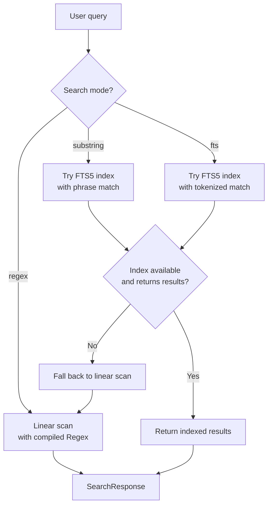
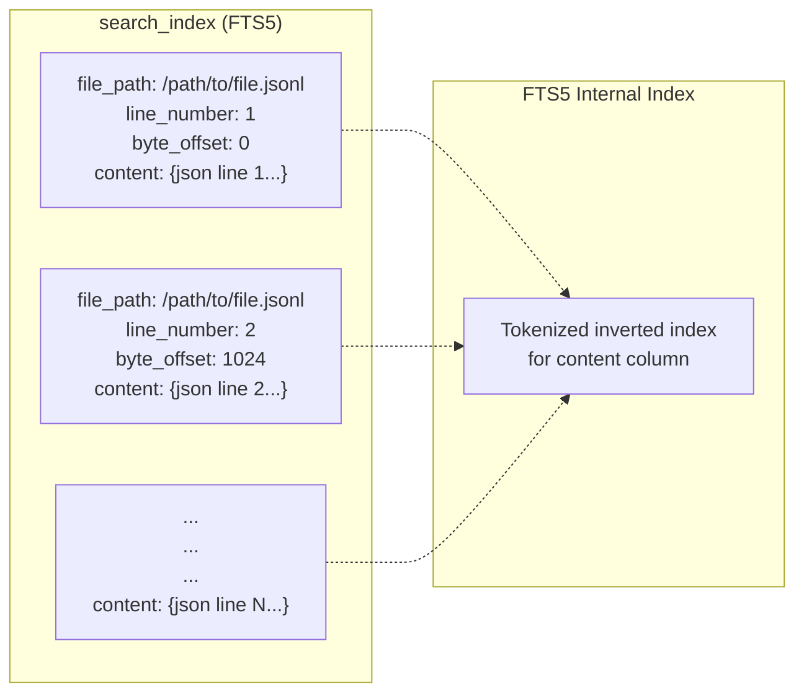
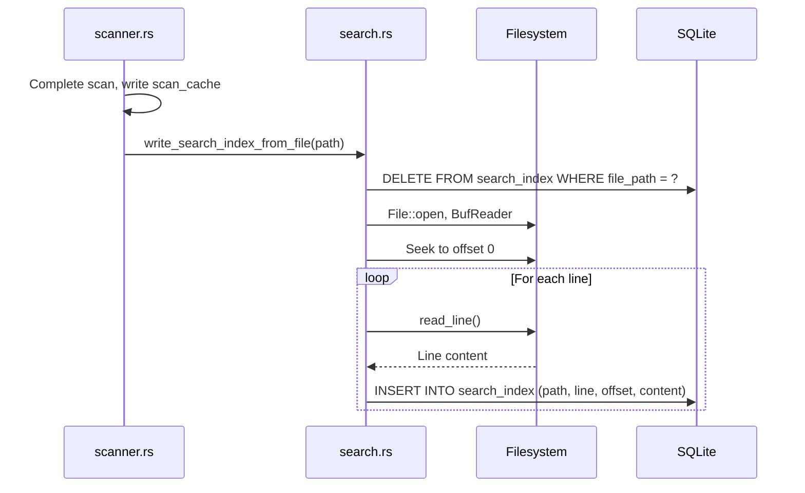
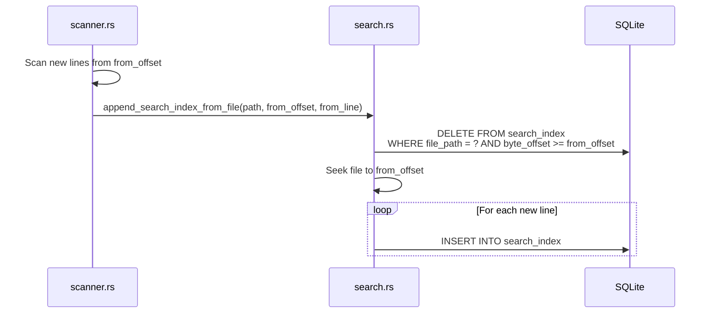
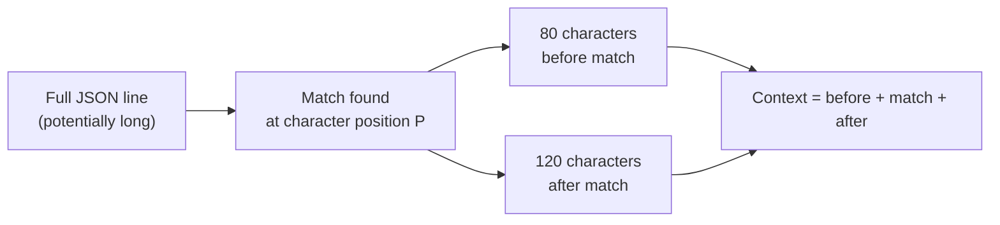
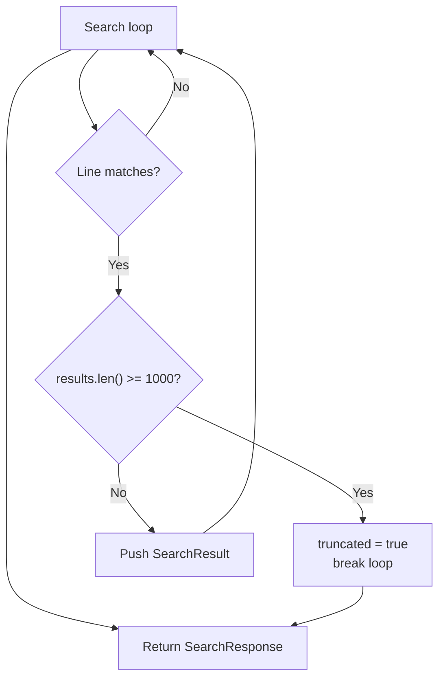
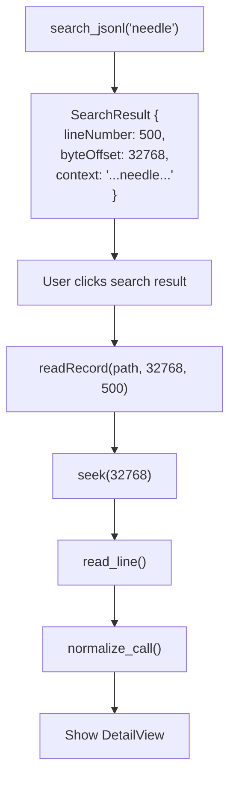

# Search Engine

PromptLens provides full-text search across JSONL files with three modes: `substring`, `fts` (full-text search), and `regex`. The `substring` and `fts` modes use an FTS5 index built during the scanning phase for fast lookups. The `regex` mode always performs a linear scan with a compiled `Regex` pattern.

## Search Modes



### Mode Comparison

| Mode | Query Processing | Uses Index | Speed | Use Case |
|------|-----------------|------------|-------|----------|
| `substring` | Wrapped in `"quotes"` | FTS5 | Fast | Finding exact phrases in content |
| `fts` | Passed as-is (tokenized) | FTS5 | Fast | Token-based word matching |
| `regex` | Compiled to `Regex` | None | Slower | Complex pattern matching |

### When to Use Each Mode

- **`substring`** -- Best for finding exact text like error messages, model names, or specific phrases. FTS5 phrase matching is very fast even on large files.
- **`fts`** -- Best for finding documents containing multiple words regardless of order. FTS5 tokenizes the query and matches documents containing all tokens.
- **`regex`** -- Best for complex patterns like UUIDs, timestamps, or custom formats. Always uses a linear scan because FTS5 does not support regex queries.

## FTS5 Index Structure

The search index is an FTS5 virtual table within the SQLite cache database:

```sql
CREATE VIRTUAL TABLE IF NOT EXISTS search_index USING fts5(
    file_path UNINDEXED,
    line_number UNINDEXED,
    byte_offset UNINDEXED,
    content
)
```



| Column | Indexed? | Purpose |
|--------|----------|---------|
| `file_path` | No (UNINDEXED) | Scope search to a specific file |
| `line_number` | No (UNINDEXED) | Returned in results for record lookup |
| `byte_offset` | No (UNINDEXED) | Used by frontend to call `readRecord()` |
| `content` | Yes (FTS5) | Full JSON line text, tokenized by FTS5 |

The `UNINDEXED` keyword on the first three columns means FTS5 does not tokenize or index them, saving storage and improving write performance. They are only used for filtering and result construction.

### Why FTS5?

FTS5 is SQLite's built-in full-text search engine. Alternatives considered:

| Approach | Pros | Cons |
|----------|------|------|
| **FTS5** | Built into SQLite, fast tokenized search, no external dependencies | Limited query syntax compared to Elasticsearch |
| **Elasticsearch** | Full-featured, complex queries | External dependency, requires separate process |
| **Linear scan only** | Simple, no index maintenance | Slow on large files |
| **Tantivy** | Rust-native, fast | Large dependency, complex integration |

FTS5 won because PromptLens already uses SQLite for caching, so FTS5 provides fast indexed search without adding any extra dependencies.

## Index Construction

### Full Index Build

During a full scan, after all lines are processed, the search index is built from scratch:

```rust
// file: src-tauri/src/search.rs:13
pub(crate) fn write_search_index_from_file(file_path: &str) -> Result<(), String> {
    let conn = open_cache()?;
    conn.execute(
        "DELETE FROM search_index WHERE file_path = ?1",
        params![file_path],
    )?;
    index_file_from_offset(&conn, file_path, 0, 0)
}
```



The delete-then-insert pattern ensures a clean index. There is no incremental construction during a full scan -- all lines are indexed in order.

### Index Construction Code

The core indexing function reads lines from the file and inserts them into the FTS5 table:

```rust
// file: src-tauri/src/search.rs:37
fn index_file_from_offset(
    conn: &rusqlite::Connection,
    file_path: &str,
    from_offset: u64,
    from_line_number: usize,
) -> Result<(), String> {
    let file = File::open(file_path)?;
    let mut reader = BufReader::new(file);
    reader.seek(SeekFrom::Start(from_offset))?;
    let mut line = String::new();
    let mut byte_offset = from_offset;
    let mut line_number = from_line_number;
    loop {
        line.clear();
        let bytes_read = reader.read_line(&mut line)?;
        if bytes_read == 0 { break; }
        line_number += 1;
        let current_offset = byte_offset;
        byte_offset += bytes_read as u64;
        let content = line.trim();
        if !content.is_empty() {
            conn.execute(
                "INSERT INTO search_index (file_path, line_number, byte_offset, content)
                 VALUES (?1, ?2, ?3, ?4)",
                params![file_path, line_number as i64, current_offset as i64, content],
            )?;
        }
    }
    Ok(())
}
```

### Incremental Index Build

When a file grows and an incremental scan runs, only new lines are indexed:

```rust
// file: src-tauri/src/search.rs:23
pub(crate) fn append_search_index_from_file(
    file_path: &str,
    from_offset: u64,
    from_line_number: usize,
) -> Result<(), String> {
    let conn = open_cache()?;
    conn.execute(
        "DELETE FROM search_index WHERE file_path = ?1 AND byte_offset >= ?2",
        params![file_path, from_offset as i64],
    )?;
    index_file_from_offset(&conn, file_path, from_offset, from_line_number)
}
```



The `DELETE ... WHERE byte_offset >= from_offset` removes all lines at and after the append point. This handles the edge case where a previous incremental build was interrupted mid-write.

## Search Execution Flow

### Indexed Search (`substring` and `fts` modes)

```mermaid
sequenceDiagram
    participant Cmd as commands.rs
    participant Search as search.rs
    participant SQLite as SQLite

    Cmd->>Search: search_jsonl_inner(path, query, "substring")
    Search->>Search: needle = query.trim().to_lowercase()
    Search->>Search: mode != "regex", try indexed
    Search->>Search: search_indexed(path, needle, "substring")

    Search->>SQLite: open_cache()
    Search->>Search: match_query = '"needle"' (phrase match)
    Search->>SQLite: SELECT line_number, byte_offset, substr(content, 1, 240)
    Note over SQLite: FROM search_index WHERE file_path = ?<br/>AND content MATCH ? LIMIT 1001

    loop For each row
        SQLite-->>Search: (line_number, byte_offset, content_preview)
        Search->>Search: Push SearchResult
        alt results >= MAX_SEARCH_RESULTS (1000)
            Search->>Search: truncated = true; break
        end
    end

    Search-->>Cmd: Some(SearchResponse { indexed: true })
```

### FTS vs Substring Query Construction

The difference between `fts` and `substring` modes is how the FTS5 `MATCH` query is constructed:

```mermaid
flowchart TD
    Query["Query: 'hello world'"] --> Mode{"Mode?"}
    Mode -->|fts| FtsQuery["MATCH query: hello world<br/>(tokenized: matches documents<br/>containing both 'hello' AND 'world')"]
    Mode -->|substring| SubQuery["MATCH query: \"hello world\"<br/>(phrase match: matches documents<br/>containing the exact phrase)"]
```

For `substring` mode, the query is wrapped in double quotes to create a phrase query. Any double quotes within the query are escaped by doubling (`"` becomes `""`).

### Linear Scan Fallback

When the FTS5 index is unavailable (first scan, cleared cache, or `regex` mode), a linear scan is performed:

```rust
// file: src-tauri/src/search.rs:113
let file = File::open(&file_path)?;
let total_bytes = fs::metadata(&file_path)?.len();
let mut reader = BufReader::with_capacity(256 * 1024, file);
```

```mermaid
sequenceDiagram
    participant Search as search.rs
    participant FS as Filesystem

    Search->>FS: File::open + BufReader(256KB buffer)
    loop For each line
        Search->>FS: read_line()
        FS-->>Search: Line bytes
        Search->>Search: Track byte_offset

        alt mode == "regex"
            Search->>Search: regex.is_match(line)
        else mode == "substring" (fallback)
            Search->>Search: line.to_lowercase().contains(needle)
        end

        alt Match found
            Search->>Search: Calculate match position
            Search->>Search: Extract context window
            Search->>Search: Push SearchResult
        end

        alt results >= MAX_SEARCH_RESULTS
            Search->>Search: truncated = true; break
        end

        alt Every 250 lines
            Search->>Search: emit("search-progress")
        end
    end
```

The 256KB read buffer (`BufReader::with_capacity(256 * 1024, file)`) reduces system call overhead by reading large chunks at once. This is important for linear scans where the bottleneck is I/O, not string matching.

## Context Extraction

Each search result includes a context snippet around the match. The extraction logic differs between indexed and linear modes.

### Indexed Context

For FTS5 index searches, context comes from the stored content:

```sql
substr(content, 1, 240)
```

This returns the first 240 characters of the line. Since FTS5 stores the full line content, this is a simple substring of the stored text.

### Linear Scan Context

For linear scans, context is extracted using a character-count window around the match position:



```
|<-- 80 chars -->|<-- match -->|<-- 120 chars -->|
                  ^^^^^^^^^^^^
                  match position
```

For `regex` mode, the match position comes from `Regex::find()`. For `substring` mode, the position comes from `str::find()` on the lowercased line. The context is trimmed of leading/trailing whitespace before returning.

### Why an Asymmetric Context Window?

The context uses 80 characters before and 120 characters after the match. This asymmetry is intentional:

- **Before (80 chars)** -- Enough to show the JSON key or field name preceding the match, providing context about which field matched.
- **After (120 chars)** -- Enough to show the beginning of the matched value, which is typically more useful than what comes before.

## Result Limiting

All search modes are capped at `MAX_SEARCH_RESULTS` (1000):

```rust
// file: src-tauri/src/types.rs:6
pub(crate) const MAX_SEARCH_RESULTS: usize = 1000;
```



When results are truncated, the `SearchResponse.truncated` flag is set to `true`. The frontend uses this flag to display a "showing first 1000 results" indicator.

### Why Limit to 1000 Results?

The 1000-result limit exists for several reasons:

1. **UI performance** -- Rendering 1000+ search results in the log list causes noticeable lag
2. **Memory** -- Each `SearchResult` contains a context string, so 1000 results is a reasonable upper bound
3. **Relevance** -- Beyond 1000 results, the user should refine their query rather than scroll through more matches

## Cancellation

Search supports cancellation via an `AtomicBool` flag shared between the command handler and the search loop:

```mermaid
sequenceDiagram
    participant UI as React
    participant Cmd as commands.rs
    participant Search as search.rs

    UI->>Cmd: invoke("cancel_search")
    Cmd->>Cmd: state.cancel_search.store(true, Relaxed)
    Note over Search: Next loop iteration
    Search->>Search: cancel_flag.load(Relaxed) == true
    Search->>Search: cancelled = true; break
    Search-->>UI: SearchResponse { cancelled: true }
```

The cancel flag is checked on every line iteration, so cancellation is responsive even for large files.

## Search Response Structure

The `SearchResponse` returned to the frontend contains:

```typescript
// file: src/types.ts:114
export type SearchResponse = {
  results: SearchResult[];    // Up to 1000 matches
  truncated: boolean;         // True if results were truncated
  cancelled: boolean;         // True if user cancelled
  durationMs: number;         // How long the search took
  indexed: boolean;           // True if FTS5 index was used
};

export type SearchResult = {
  lineNumber: number;         // 1-based line number
  byteOffset: number;         // Byte offset for readRecord()
  context: string;            // Surrounding text snippet
};
```

The `byteOffset` in each result allows the frontend to call `readRecord(filePath, byteOffset, lineNumber)` to load the full normalized record when the user clicks a search result -- leveraging the same byte-offset indexing used by the list view.



## Performance Characteristics

| Scenario | Complexity | Typical Time (10k lines) |
|----------|-----------|--------------------------|
| FTS5 index search | O(k) | < 10ms |
| Linear substring search | O(n) | ~50-200ms |
| Linear regex search | O(n) | ~100-500ms |
| Index build (full) | O(n) | ~200-500ms |
| Index build (incremental) | O(delta) | < 50ms |

FTS5 performance depends on the number of matching results (k) rather than the total number of lines (n), making it significantly faster for common queries on large files. Linear scans use a 256KB read buffer for efficient I/O.
