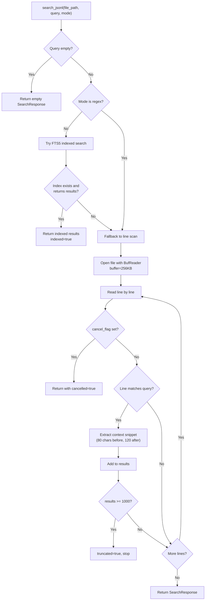
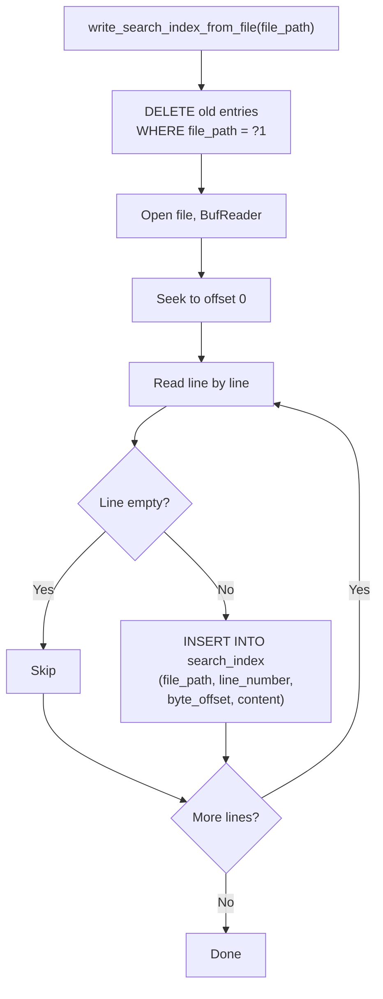
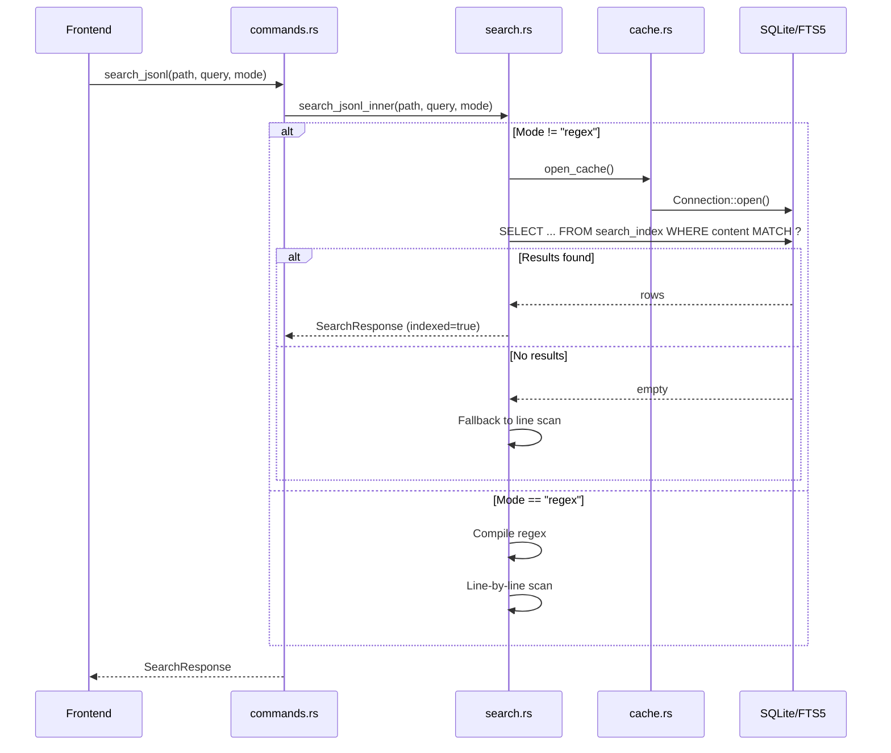

# Search Module

The search module provides full-text search across JSONL files using SQLite FTS5 indexes with fallback to line-by-line scanning. Three search modes are supported: substring, FTS, and regex. The module is implemented in `search.rs`.

## Search Modes

| Mode | Behavior | Uses Index | Query Format |
|------|----------|------------|--------------|
| `substring` | Case-insensitive phrase match | FTS5 phrase query | `"gpt-4o"` (quoted) |
| `fts` | Tokenized full-text search | FTS5 tokenized query | `gpt AND error` |
| `regex` | Regular expression match | None (line scan) | Raw regex pattern |

## Search Flow



```rust
// file: src-tauri/src/search.rs:80
pub(crate) fn search_jsonl_inner(
    file_path: String,
    query: String,
    mode: &str,
    app: Option<&AppHandle>,
    cancel_flag: Option<&AtomicBool>,
) -> Result<SearchResponse, String> {
    let started = Instant::now();
    let needle = query.trim().to_lowercase();
    if needle.is_empty() {
        return Ok(SearchResponse { results: Vec::new(), truncated: false, cancelled: false, duration_ms: 0, indexed: false });
    }

    // Try indexed search for substring and fts modes
    if mode != "regex" {
        if let Ok(Some(indexed)) = search_indexed(&file_path, &needle, mode, started, app) {
            return Ok(indexed);
        }
    }

    // Regex mode: compile pattern
    let re = if mode == "regex" {
        Some(Regex::new(&query).map_err(|e| format!("Invalid regex: {e}"))?)
    } else {
        None
    };
    // ... line-by-line scan
}
```

## FTS5 Index

### Index Structure

The search index is an FTS5 virtual table:

```sql
-- file: src-tauri/src/cache.rs:57
CREATE VIRTUAL TABLE IF NOT EXISTS search_index USING fts5(
    file_path UNINDEXED,
    line_number UNINDEXED,
    byte_offset UNINDEXED,
    content
)
```

Only the `content` column is indexed for full-text search. The other columns are stored but not tokenized, allowing them to be returned in query results without participating in search.

### Index Construction

When a file is scanned, all content is indexed:



```rust
// file: src-tauri/src/search.rs:13
pub(crate) fn write_search_index_from_file(file_path: &str) -> Result<(), String> {
    let conn = open_cache()?;
    conn.execute("DELETE FROM search_index WHERE file_path = ?1", params![file_path])?;
    index_file_from_offset(&conn, file_path, 0, 0)
}
```

### Incremental Index Updates

For incremental scans, only new content is indexed:

```rust
// file: src-tauri/src/search.rs:23
pub(crate) fn append_search_index_from_file(
    file_path: &str,
    from_offset: u64,
    from_line_number: usize,
) -> Result<(), String> {
    let conn = open_cache()?;
    // Delete entries at and after the append point
    conn.execute(
        "DELETE FROM search_index WHERE file_path = ?1 AND byte_offset >= ?2",
        params![file_path, from_offset as i64],
    )?;
    index_file_from_offset(&conn, file_path, from_offset, from_line_number)
}
```

This handles the case where a file was truncated and rewritten: stale entries after `from_offset` are cleared before indexing new content.

### FTS5 Query Construction

Query format depends on the search mode:

```rust
// file: src-tauri/src/search.rs:214
let match_query = if mode == "fts" {
    query.to_string()           // Tokenized query: "gpt AND error"
} else {
    format!("\"{}\"", query.replace('"', "\"\""))  // Phrase query: "\"gpt-4o\""
};
```

Substring mode wraps the query in double quotes to force phrase matching, escaping any embedded quotes by doubling them.

## Indexed Search

The `search_indexed()` function queries the FTS5 table:

```sql
-- file: src-tauri/src/search.rs:220
SELECT line_number, byte_offset, substr(content, 1, 240)
FROM search_index
WHERE file_path = ?1 AND content MATCH ?2
LIMIT ?3
```

```rust
// file: src-tauri/src/search.rs:205
fn search_indexed(
    file_path: &str,
    query: &str,
    mode: &str,
    started: Instant,
    app: Option<&AppHandle>,
) -> Result<Option<SearchResponse>, String> {
    let conn = open_cache()?;
    let match_query = if mode == "fts" { query.to_string() }
                      else { format!("\"{}\"", query.replace('"', "\"\"")) };
    let mut stmt = conn.prepare(
        "SELECT line_number, byte_offset, substr(content, 1, 240)
         FROM search_index WHERE file_path = ?1 AND content MATCH ?2 LIMIT ?3",
    )?;
    let mut rows = stmt.query(params![file_path, match_query, (MAX_SEARCH_RESULTS + 1) as i64])?;
    // ... collect results
}
```

Key details:
- Context is truncated to 240 characters via `substr()`
- Results are limited to `MAX_SEARCH_RESULTS + 1` to detect truncation
- Progress events are emitted every 100 results
- If the FTS query returns zero results, `None` is returned to signal fallback

## Line Scan Fallback

When FTS5 is unavailable (regex mode or missing index), the scanner falls back to line-by-line reading:

### Substring Matching

```rust
let needle = query.trim().to_lowercase();
let matched = line.to_lowercase().contains(&needle);
```

### Regex Matching

```rust
let re = Regex::new(&query).map_err(|e| format!("Invalid regex: {e}"))?;
let matched = re.is_match(&line);
```

### Context Extraction

When a match is found, a context snippet is extracted around the match:


```rust
// file: src-tauri/src/search.rs:162
let (start_chars, match_len) = if let Some(re) = &re {
    if let Some(m) = re.find(&line) {
        let prefix = &line[..m.start()];
        (prefix.chars().count(), m.as_str().chars().count())
    } else { (0, 0) }
} else {
    let haystack = line.to_lowercase();
    if let Some(index) = haystack.find(&needle) {
        (haystack[..index].chars().count(), needle.chars().count())
    } else { (0, 0) }
};
let context_start = start_chars.saturating_sub(80);
let context_end = start_chars + match_len + 120;
let context = line.chars().skip(context_start)
    .take(context_end.saturating_sub(context_start))
    .collect::<String>();
```

The context window is 80 characters before the match and 120 characters after, providing enough surrounding text for the user to understand the match location.

## Search Response

```rust
// file: src-tauri/src/types.rs:75
struct SearchResult {
    line_number: usize,          // 1-based line number
    byte_offset: u64,            // For O(1) record access
    context: String,             // Snippet around the match
}

// file: src-tauri/src/types.rs:82
struct SearchResponse {
    results: Vec<SearchResult>,  // Up to 1000 results
    truncated: bool,             // True if results hit the limit
    cancelled: bool,             // True if user cancelled
    duration_ms: u128,           // Search duration
    indexed: bool,               // True if FTS5 was used
}
```

## Cancellation

Search checks the `AtomicBool` flag at the start of each line iteration:

```rust
// file: src-tauri/src/search.rs:126
if cancel_flag.is_some_and(|flag| flag.load(Ordering::Relaxed)) {
    cancelled = true;
    break;
}
```

The frontend sets this flag via the `cancel_search` command.

## Progress Events

During line-scan search, progress events are emitted every 250 lines:

```rust
// file: src-tauri/src/search.rs:142
if line_number == 1 || line_number.is_multiple_of(250) {
    if let Some(app) = app {
        let _ = app.emit("search-progress", ProgressEvent {
            processed_bytes: byte_offset,
            total_bytes,
            line_number,
        });
    }
}
```

During indexed search, progress events are emitted every 100 results.

## Result Limits

```rust
// file: src-tauri/src/types.rs:6
pub(crate) const MAX_SEARCH_RESULTS: usize = 1000;
```

When this limit is reached, `truncated` is set to `true` and the search stops. This prevents excessive memory usage from very common search terms in large files.

## Performance Characteristics

| Scenario | Performance | Notes |
|----------|------------|-------|
| FTS5 indexed (substring) | ~1-10 ms | Depends on result count |
| FTS5 indexed (FTS) | ~1-10 ms | Tokenized matching |
| Line scan (substring) | ~1-5s for 100 MB | Full file read |
| Line scan (regex) | ~2-10s for 100 MB | Regex overhead |
| Index build | ~2-5s for 100 MB | One INSERT per line |
| Index append | Proportional to new data | Only indexes new lines |

## Module Interaction


