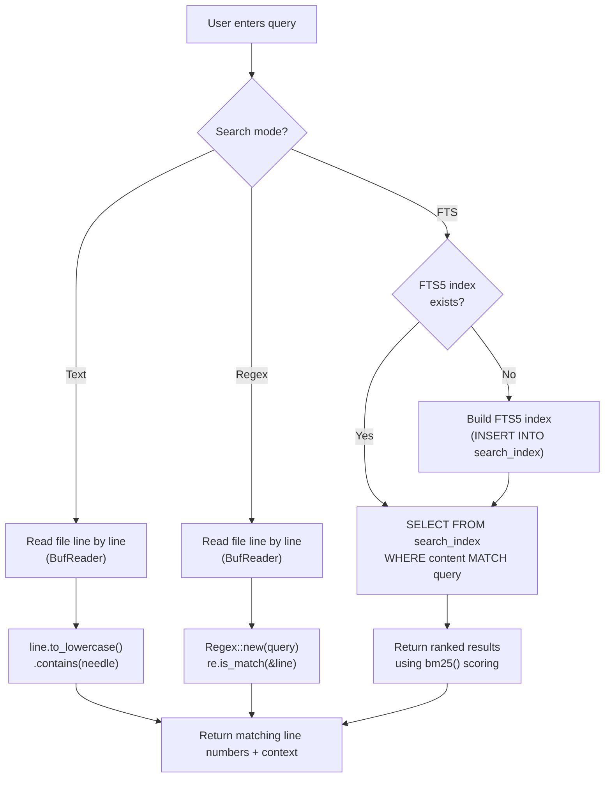
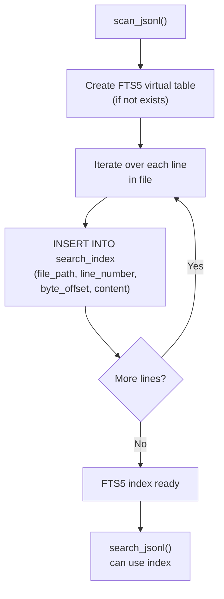
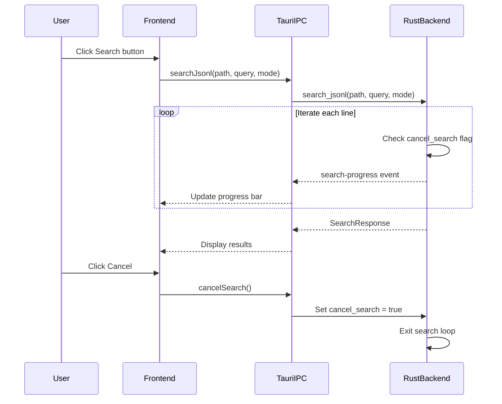
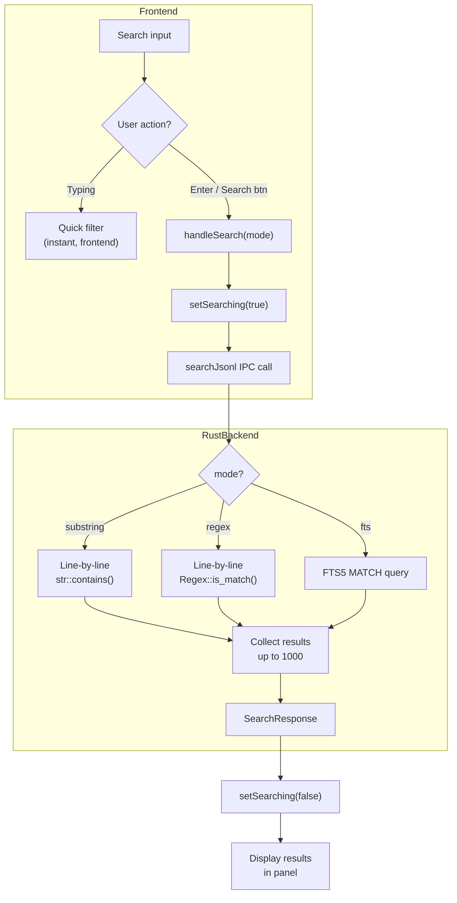
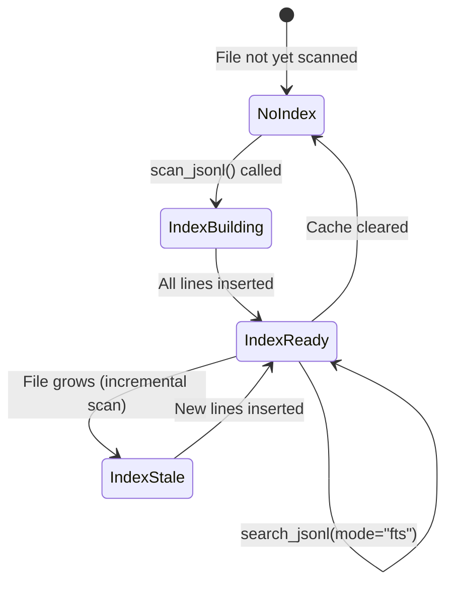
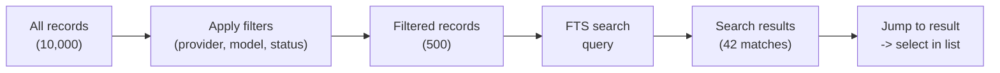
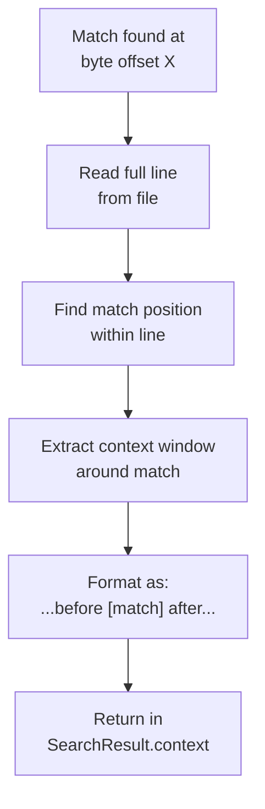

# Search

PromptLens provides two levels of search: quick local filters for narrowing the record list, and a full-text search engine for finding content across the entire file.

## Quick Filter (Record List)

The search input at the top of the "Records" tab acts as a quick filter. As you type, the record list narrows to show only records whose metadata matches the query.

The filter searches across these fields:

- Model name
- Provider name
- Preview text (first user message summary)
- Timestamp
- Status
- Trace ID
- Session ID
- Request ID

This filter runs entirely in the frontend and is instant. The filter logic is a simple case-insensitive substring match:

```ts
// file: src/app/store.ts
const query = appStore.query.toLowerCase();
const filtered = summaries.filter((s) => {
  const hay = [
    s.model, s.provider, s.preview, s.timestamp,
    s.status, s.traceId, s.sessionId, s.requestId,
  ].filter(Boolean).join(" ").toLowerCase();
  return hay.includes(query);
});
```


## Full-Text Search

To search message content, use the full-text search engine. Enter a query, select a mode, and press `Enter` or click "Search".

### Search Modes

| Mode | Selector | Description |
|------|----------|-------------|
| **Text** | `substring` | Simple substring matching on raw JSON lines |
| **Regex** | `regex` | Regular expression matching on raw JSON lines |
| **FTS** | `fts` | SQLite FTS5 full-text search with tokenization and ranking |

### How Each Mode Works



### Text Mode

Text mode performs a case-insensitive substring search. In Rust, this uses `str::contains()` after lowercasing:

```rust
// file: src-tauri/src/search.rs:155-160
let matched = if let Some(re) = &re {
    re.is_match(&line)
} else {
    line.to_lowercase().contains(&needle)
};
```

**Pros:** Fast, no index required, works immediately.
**Cons:** No ranking, no tokenization, matches any part of the JSON structure.

### Regex Mode

Regex mode uses the Rust `regex` crate to apply a regular expression to each line:

```rust
// file: src-tauri/src/search.rs:107-112
let re = if mode == "regex" {
    Some(Regex::new(&query).map_err(|e| format!("Invalid regex: {e}"))?)
} else {
    None
};
```

If the regex is invalid, the error propagates to the frontend and is displayed as a toast notification.

**Pros:** Flexible pattern matching, can target specific fields.
**Cons:** Slower than substring on large files, requires regex knowledge.

### FTS Mode (Full-Text Search)

FTS mode uses SQLite's FTS5 extension. The index is built by inserting each line's content into an FTS5 virtual table:

```rust
// file: src-tauri/src/search.rs:64-68
conn.execute(
    "INSERT INTO search_index (file_path, line_number, byte_offset, content)
     VALUES (?1, ?2, ?3, ?4)",
    params![file_path, line_number as i64, current_offset as i64, content],
)
```

For FTS mode, the query is passed directly to SQLite's MATCH operator:

```rust
// file: src-tauri/src/search.rs:214-218
let match_query = if mode == "fts" {
    query.to_string()
} else {
    format!("\"{}\"", query.replace('"', "\"\""))
};
```

FTS5 query syntax supports:

| Syntax | Example | Matches |
|--------|---------|---------|
| Simple terms | `quantum computing` | Records containing both words |
| Phrase query | `"error rate"` | Records containing the exact phrase |
| Prefix | `comput*` | Words starting with "comput" |
| Boolean AND | `error AND timeout` | Records containing both terms |
| Boolean OR | `gpt-4 OR claude` | Records containing either term |
| Boolean NOT | `error NOT timeout` | Records containing "error" but not "timeout" |

### FTS Index Building

The FTS index is built incrementally. When the file is first scanned, the backend creates the `search_index` table and populates it:



## Search Results

After running a search, results appear in a panel above the record list:

```
+--------------------------------------------------+
| 42 matches          Indexed              [x]     |
+--------------------------------------------------+
| [Line 15]  ...prompt mentions "error rate"...     |
| [Line 23]  ...response discusses "error rate"...  |
| [Line 67]  ...tool call with "error_rate" param...|
+--------------------------------------------------+
```

| Element | Description |
|---------|-------------|
| **Match count** | Total number of matching records |
| **Index status** | "Indexed" (FTS mode used index) or "Streaming" (line-by-line scan) |
| **Line number** | Where the match was found |
| **Context** | Snippet of the matched content |

### Jumping to Results

Clicking a search result triggers `jumpToResult()`, which reads the record at the matching byte offset and scrolls the record list to that position:

```ts
// file: src/app/store.ts
jumpToResult: async (result, file) => {
  if (!file) return;
  const summary = file.summaries.find(
    (s) => s.lineNumber === result.lineNumber
  );
  if (summary) {
    await get().handleSelect(summary);
  }
},
```

## Search Progress and Cancellation

Search operations report progress via Tauri events:

```tsx
// file: src/app/store.ts:521-533
handleSearch: async (mode = "substring") => {
    set({ searching: true, searchProgress: null });
    try {
      const response = await searchJsonl(file.filePath, term, mode);
      get().updateActiveSessionTab({ searchResults: response.results });
      get().updateActiveTab({
        lastSearchMs: response.durationMs,
        lastSearchIndexed: response.indexed,
      });
      if (response.truncated) {
        useAppStore.getState().setError(
          "Search stopped after 1,000 matches."
        );
      }
    } finally {
      set({ searching: false, searchProgress: null });
    }
},
```

Search results are capped at a maximum of 1,000:

```rust
// file: src-tauri/src/types.rs:6
pub(crate) const MAX_SEARCH_RESULTS: usize = 1000;
```

### Cancelling a Search

A long-running search can be cancelled via the `cancel_search` command:

```rust
// file: src-tauri/src/types.rs:12
pub(crate) cancel_search: AtomicBool,
```

The search loop checks this flag between iterations and exits early if set to `true`.



## Search Response Type

The Rust backend returns a `SearchResponse` object:

```rust
// file: src-tauri/src/types.rs:82-90
pub(crate) struct SearchResponse {
    pub(crate) results: Vec<SearchResult>,
    pub(crate) truncated: bool,
    pub(crate) cancelled: bool,
    pub(crate) duration_ms: u128,
    pub(crate) indexed: bool,
}
```

| Field | Description |
|-------|-------------|
| `results` | Array of matching records with line number, byte offset, and context |
| `truncated` | `true` if results exceeded the 1,000 limit |
| `cancelled` | `true` if the user cancelled the search |
| `duration_ms` | Search duration in milliseconds |
| `indexed` | `true` if FTS mode used a pre-built index |

## Search Tips

| Tip | Description |
|-----|-------------|
| Use Text mode for quick lookups | Fastest mode for simple keyword searches |
| Use FTS mode for content search | Best for searching message text with ranking |
| Use Regex mode for structured queries | Target specific JSON fields or patterns |
| Combine with filters | Filter by provider/model first, then search within results |
| Clear search to reset | Click the x button or clear the search box to return to the full list |

## Limitations

| Limitation | Details |
|-----------|---------|
| FTS index size | The FTS index approximately doubles the storage of file content |
| Regex complexity | Very complex regexes can be slow on large files |
| Context window | Search results show a fixed-size context snippet, not the full message |
| No field-specific search | Cannot search within only specific JSON fields |
| Single-file search | Search operates on one file at a time |
| Max 1,000 results | Search is truncated after 1,000 matches |

## Search Architecture Diagram

The complete search architecture spans frontend and backend:



## FTS5 Index Lifecycle

The FTS5 index follows a specific lifecycle tied to the scan cache:



## Search Performance Characteristics

| Mode | Time Complexity | Space Overhead | Best For |
|------|----------------|----------------|----------|
| Text | O(n), n = file size | None | Quick keyword lookups |
| Regex | O(n * r), r = regex complexity | None | Pattern matching |
| FTS | O(k), k = matching docs | ~2x file size | Full-text content search |

## Combining Search with Filters

Search and filters work together. The recommended workflow:

1. First, apply quick filters (provider, model, status) to narrow the record list.
2. Then, run a full-text search within the filtered set.
3. Search runs on the full file, but results are displayed alongside the filtered list.



## Search Result Context Snippets

Each search result includes a context snippet showing the matched content and surrounding text. The context is extracted from the raw JSON line at the match position:



The context window is a fixed number of characters around the match, not the full message. This keeps the search results panel compact while showing enough context to identify each match's relevance.

## Advanced FTS5 Queries

For advanced users, FTS5 supports sophisticated query syntax:

| Query | Description | Example Match |
|-------|-------------|---------------|
| `NEAR(error timeout, 5)` | Terms within 5 tokens of each other | "error in timeout handling" |
| `column:term` | Search specific column (if indexed) | `content:error` |
| `term* AND NOT term2*` | Prefix match with exclusion | "errors" but not "error_handling" |
| `"exact phrase" OR term` | Combine phrase and term queries | "rate limit" or timeout |

Note: PromptLens indexes the full JSON line as a single `content` column, so column-specific search targets the entire line content.

## Related Pages

- [Browsing Records](browsing-records.md) -- Filtering and sorting the record list
- [Keyboard Shortcuts](keyboard-shortcuts.md) -- `Ctrl+F` to focus search
- [Export](export.md) -- Exporting search results
