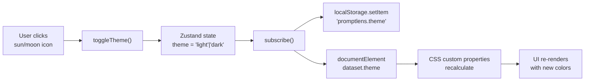
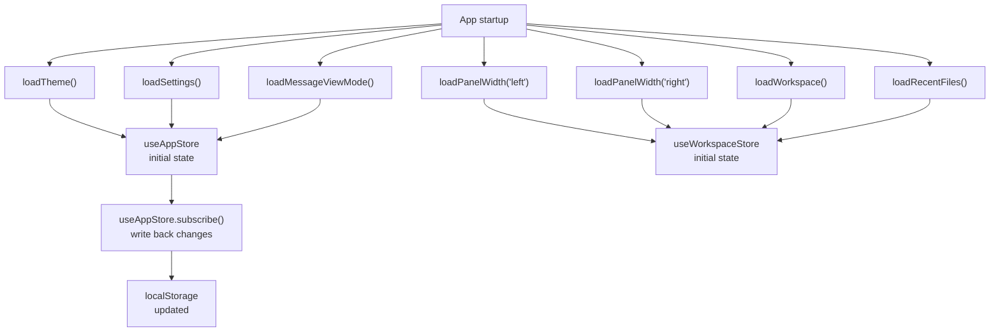
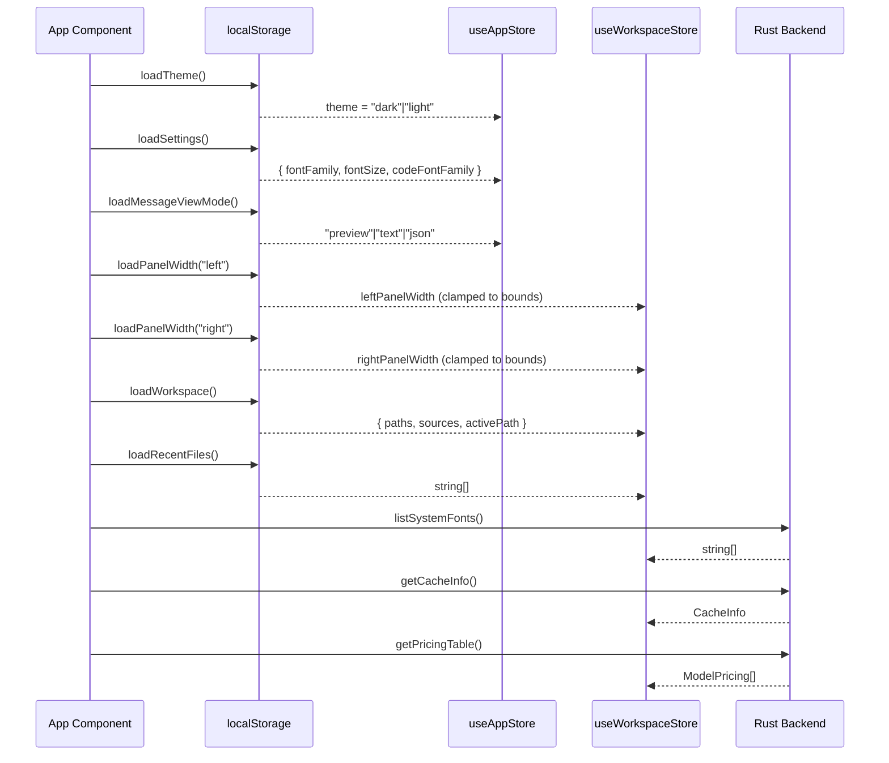

# Settings

PromptLens provides settings to customize the visual appearance of the application. Settings are accessible via the **Setting** menu in the title bar.

## Themes

PromptLens supports two themes: **dark** and **light**. The theme affects all colors in the application, including backgrounds, text, borders, and accent colors.

### Switching Themes

- Click the **sun/moon icon** in the traffic light area of the title bar.
- The theme preference is saved in local storage and persists across sessions.

### Theme Toggle Implementation

The theme toggle updates both the Zustand store and the DOM:

```ts
// file: src/app/store.ts:202
toggleTheme: () =>
  set((s) => ({ theme: s.theme === "dark" ? "light" : "dark" })),
```

The subscribe mechanism writes the theme to `localStorage` and updates the `data-theme` attribute on `<html>`:

```ts
// file: src/app/store.ts:213-216
useAppStore.subscribe((state, prev) => {
  if (state.theme !== prev.theme) {
    document.documentElement.dataset.theme = state.theme;
    localStorage.setItem(THEME_KEY, state.theme);
  }
  // ...
});
```



### Theme Implementation

Themes use CSS custom properties (variables) with the `data-theme` attribute on the root element. Each theme defines values for:

- Background colors (panels, cards, inputs)
- Text colors (primary, secondary, muted)
- Border colors
- Accent colors (brand blue, success green, error red)
- Status dot colors
- Code syntax highlighting colors

```css
/* From src/styles.css */
[data-theme="dark"] {
  --app-bg: #0f1117;
  --app-fg: #e2e4e9;
  --panel-bg: #161822;
  --card-bg: #1c1e2b;
  --border: #2a2d3a;
  --accent: #4a7bf7;
  --success: #22c55e;
  --error: #ef4444;
  --muted: #6b7280;
}

[data-theme="light"] {
  --app-bg: #ffffff;
  --app-fg: #1a1a2e;
  --panel-bg: #f5f5f7;
  --card-bg: #ffffff;
  --border: #e0e0e6;
  --accent: #3b6df5;
  --success: #16a34a;
  --error: #dc2626;
  --muted: #9ca3af;
}
```

## Font Settings

The Setting menu provides three font controls:

### UI Font

Controls the font family used for all user interface text (labels, buttons, menus, record cards).

| Option | Value |
|--------|-------|
| System | Uses the system default sans-serif font stack |
| Specific font | Inter, Arial, Noto Sans, DejaVu Sans, and other installed fonts |

The font list is populated by the Rust backend detecting system fonts via the `list_system_fonts` command.

```ts
// file: src/app/store.ts:206
listSystemFonts().then((fonts) =>
  useWorkspaceStore.setState({ systemFonts: fonts })
).catch(() => {});
```

### Font Size

Controls the base font size for the entire application. Values are in pixels.

| Property | Value |
|----------|-------|
| Minimum | 11px |
| Maximum | 18px |
| Default | 13px |

Font size is applied via the `--app-font-size` CSS custom property. The storage module enforces min/max bounds on load:

```ts
// file: src/app/storage.ts:52-55
fontSize:
  typeof parsed.fontSize === "number" &&
  parsed.fontSize >= 11 &&
  parsed.fontSize <= 18
    ? parsed.fontSize
    : DEFAULT_SETTINGS.fontSize,
```

### Code Font

Controls the font family used for code blocks, JSON views, and raw payloads.

| Option | Value |
|--------|-------|
| System mono | Uses the system default monospace font stack |
| Specific font | JetBrains Mono, Fira Code, Consolas, and other installed monospace fonts |

Code font is applied via the `--code-font-family` CSS custom property.

### Reset Fonts

Click the **Reset fonts** button to restore all font settings to their defaults:

```ts
// file: src/app/types.ts
const DEFAULT_SETTINGS: AppSettings = {
  fontFamily: 'Inter, ui-sans-serif, system-ui, -apple-system, BlinkMacSystemFont, "Segoe UI", sans-serif',
  fontSize: 13,
  codeFontFamily: "ui-monospace, SFMono-Regular, Menlo, Consolas, monospace",
};
```

## Message View Mode

The message view mode (Preview, Text, JSON) is shared across all message cards and persisted across sessions.

```ts
// file: src/app/types.ts
export type MessageViewMode = "preview" | "text" | "json";
```

| Mode | Description |
|------|-------------|
| **Preview** | Renders Markdown content with syntax highlighting, images, and tool cards |
| **Text** | Shows plain text content without Markdown rendering |
| **JSON** | Shows the raw JSON structure of the message content |

See [Viewing Conversations](viewing-conversations.md) for details.

## Panel Widths

The left and right panel widths are adjustable by dragging the resize handles. These widths are saved in local storage and restored on the next launch.

| Panel | Minimum | Maximum | Default |
|-------|---------|---------|---------|
| Left | 260px | 560px | 340px |
| Right | 300px | 60% of window | 400px |
| Center | 200px | (fills remaining) | -- |

Panel widths are stored with enforced bounds on load:

```ts
// file: src/app/storage.ts:69-78
export function loadPanelWidth(side: "left" | "right", fallback: number): number {
  try {
    const raw = localStorage.getItem(`${PANEL_WIDTH_KEY}.${side}`);
    if (!raw) return fallback;
    const val = Number(raw);
    if (!Number.isFinite(val)) return fallback;
    return side === "left"
      ? Math.min(LEFT_MAX, Math.max(LEFT_MIN, val))
      : Math.max(RIGHT_MIN, val);
  } catch {
    return fallback;
  }
}
```

## Settings Storage Location

All settings are stored in the browser's `localStorage` with the following keys:

| Key | Contents |
|-----|----------|
| `promptlens.theme` | "dark" or "light" |
| `promptlens.settings` | JSON object with fontFamily, fontSize, codeFontFamily |
| `promptlens.messageViewMode` | "preview", "text", or "json" |
| `promptlens.panelWidth.left` | Left panel width in pixels |
| `promptlens.panelWidth.right` | Right panel width in pixels |
| `promptlens.workspace` | Serialized workspace state (open tabs, active tab, source) |
| `promptlens.recentFiles` | JSON array of recent file paths |

Settings are read on app startup and applied immediately. Changes take effect in real time as you adjust them in the Setting menu.



## CSS Custom Properties

PromptLens applies settings via CSS custom properties on the main application shell element:

| Property | Source | Example Value |
|----------|--------|---------------|
| `--app-font-family` | UI font setting | `"Inter", ui-sans-serif, system-ui` |
| `--app-font-size` | Font size setting | `13px` |
| `--code-font-family` | Code font setting | `ui-monospace, SFMono-Regular, Menlo` |

These properties cascade to all child elements, ensuring consistent styling throughout the application.

## Cache Management

While not a visual setting, cache management is accessible from the Open menu:

| Action | Description |
|--------|-------------|
| **Clear scan cache** | Removes all cached scan results from the SQLite database. Cache path is shown in a tooltip. |
| **Rescan active file** | Forces a fresh scan of the current file, bypassing the cache. |

Cache is stored in a platform-specific location:

| Platform | Typical Location |
|----------|-----------------|
| macOS | `~/Library/Application Support/promptlens/` |
| Linux | `~/.local/share/promptlens/` or `~/.config/promptlens/` |
| Windows | `%APPDATA%\promptlens\` |

The cache uses SQLite with FTS5 for full-text search indexing. Cache size depends on the number and size of files you have scanned.

### Clearing Cache

```ts
// file: src/app/store.ts
handleClearCache: async () => {
  await clearScanCache();
  const info = await getCacheInfo();
  set({ cacheInfo: info });
  app.addToast("Scan cache cleared.", "success");
},
```

## Performance Considerations

| Setting | Impact |
|---------|--------|
| Large font size | Slightly fewer visible records in the virtual list |
| Custom fonts | Minimal impact; fonts are loaded once at startup |
| Panel widths | Affects how much content is visible without scrolling |
| Theme | No performance difference between dark and light |

## Keyboard Shortcuts for Settings

There are no dedicated keyboard shortcuts for changing settings. All settings are accessed through the Setting menu in the title bar. The theme can be toggled via the sun/moon icon in the traffic light area.

## Settings Persistence

All settings are stored in the browser's `localStorage` API, which means:

- Settings persist across app restarts
- Settings are specific to the user's OS account
- Settings are not synced across machines
- Clearing browser data (in the Tauri webview context) resets settings

The Zustand store reads settings from `localStorage` on startup and writes them back on changes. This is done transparently via the `loadSettings()` and `saveSettings()` functions in the storage module.

```ts
// file: src/app/store.ts:212-230
useAppStore.subscribe((state, prev) => {
  if (state.theme !== prev.theme) {
    document.documentElement.dataset.theme = state.theme;
    localStorage.setItem(THEME_KEY, state.theme);
  }
  if (state.settings !== prev.settings) {
    localStorage.setItem(SETTINGS_KEY, JSON.stringify(state.settings));
  }
  if (state.messageViewMode !== prev.messageViewMode) {
    localStorage.setItem(MESSAGE_VIEW_MODE_KEY, state.messageViewMode);
  }
  if (state.leftPanelWidth !== prev.leftPanelWidth) {
    savePanelWidth("left", state.leftPanelWidth);
  }
  if (state.rightPanelWidth !== prev.rightPanelWidth) {
    savePanelWidth("right", state.rightPanelWidth);
  }
});
```

## Accessibility

| Feature | Description |
|---------|-------------|
| Font size control | Users with visual impairments can increase font size up to 18px |
| Theme selection | Light theme for bright environments, dark theme for low-light |
| System fonts | Falls back to system fonts if custom fonts are unavailable |
| Keyboard navigation | All setting controls are accessible via keyboard |

## Advanced: Custom CSS

Since PromptLens uses CSS custom properties, advanced users can inject custom styles via Tauri webview configuration. Key variables include:

| Variable | Default (Dark) | Controls |
|----------|---------------|----------|
| `--app-bg` | `#0f1117` | Main background color |
| `--app-fg` | `#e2e4e9` | Main text color |
| `--panel-bg` | `#161822` | Panel background |
| `--card-bg` | `#1c1e2b` | Card background |
| `--border` | `#2a2d3a` | Border color |
| `--accent` | `#4a7bf7` | Brand accent color |
| `--success` | `#22c55e` | Success indicator color |
| `--error` | `#ef4444` | Error indicator color |
| `--muted` | `#6b7280` | Muted text color |

These are set on the root element and cascade to all child components through the CSS custom property inheritance chain.

## Settings Loading Sequence

When the application starts, settings are loaded in a specific order:



## AppSettings Type

The full TypeScript type for application settings:

```ts
// file: src/app/types.ts
export type AppSettings = {
  fontFamily: string;
  fontSize: number;
  codeFontFamily: string;
};
```

## Default Settings Constants

```ts
// file: src/app/types.ts
export const DEFAULT_SETTINGS: AppSettings = {
  fontFamily: 'Inter, ui-sans-serif, system-ui, -apple-system, BlinkMacSystemFont, "Segoe UI", sans-serif',
  fontSize: 13,
  codeFontFamily: "ui-monospace, SFMono-Regular, Menlo, Consolas, monospace",
};

export const THEME_KEY = "promptlens.theme";
export const SETTINGS_KEY = "promptlens.settings";
export const MESSAGE_VIEW_MODE_KEY = "promptlens.messageViewMode";
export const PANEL_WIDTH_KEY = "promptlens.panelWidth";
export const WORKSPACE_KEY = "promptlens.workspace";
```

## How Settings Affect Rendering

Each setting maps to a CSS mechanism that affects rendering:

| Setting | CSS Mechanism | Scope |
|---------|--------------|-------|
| Theme | `data-theme` attribute selector | All elements |
| UI font | `--app-font-family` custom property | All text elements |
| Font size | `--app-font-size` custom property | Root font-size, cascades via `rem` |
| Code font | `--code-font-family` custom property | Code blocks, JSON views |
| View mode | Conditional rendering in MessageCard | Each message card |
| Panel widths | Inline `width` style on panel divs | Left and right panels |

## Settings Migration

When PromptLens updates and adds new settings, the `loadSettings()` function handles missing fields gracefully by falling back to defaults:

```ts
// file: src/app/storage.ts:45-61
export function loadSettings(): AppSettings {
  try {
    const raw = localStorage.getItem(SETTINGS_KEY);
    if (!raw) return DEFAULT_SETTINGS;
    const parsed = JSON.parse(raw) as Partial<AppSettings>;
    return {
      fontFamily: parsed.fontFamily || DEFAULT_SETTINGS.fontFamily,
      fontSize:
        typeof parsed.fontSize === "number" && parsed.fontSize >= 11 && parsed.fontSize <= 18
          ? parsed.fontSize
          : DEFAULT_SETTINGS.fontSize,
      codeFontFamily: parsed.codeFontFamily || DEFAULT_SETTINGS.codeFontFamily,
    };
  } catch {
    return DEFAULT_SETTINGS;
  }
}
```

This ensures that upgrading PromptLens does not break existing user settings.

## Related Pages

- [Keyboard Shortcuts](keyboard-shortcuts.md) -- All keyboard shortcuts
- [Interface Overview](interface-overview.md) -- Layout and component details
- [Export](export.md) -- Export format options
