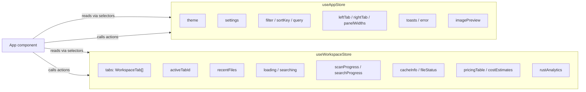
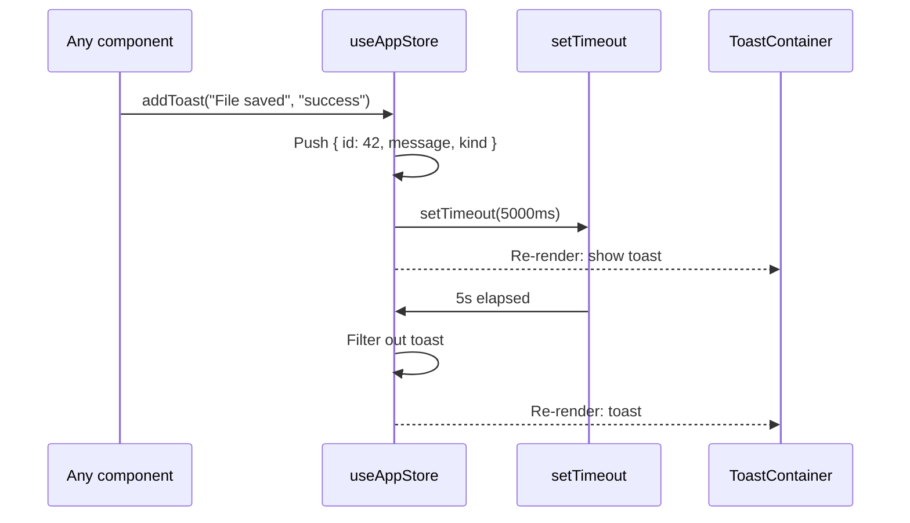
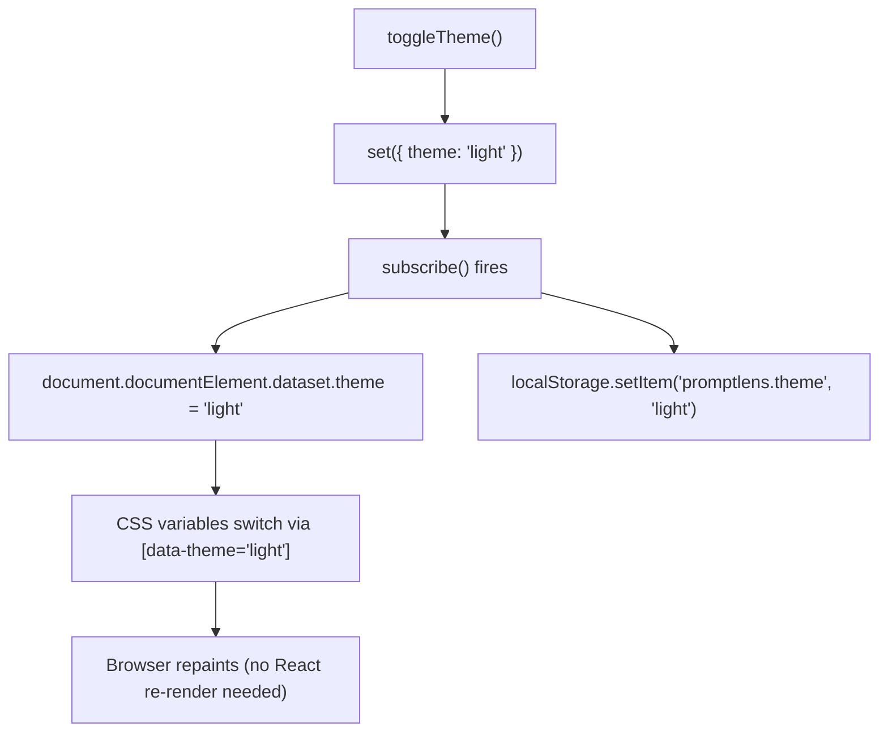
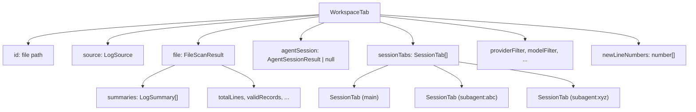
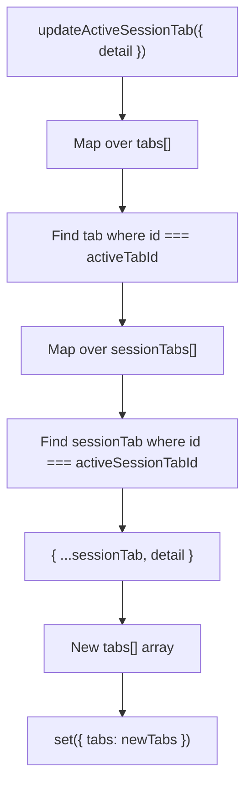
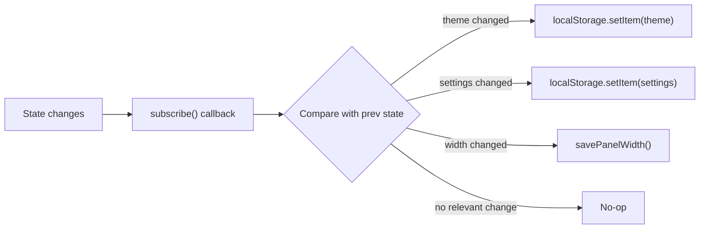
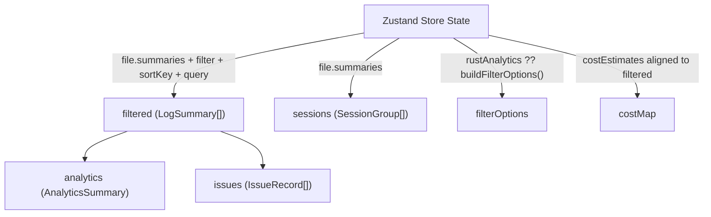
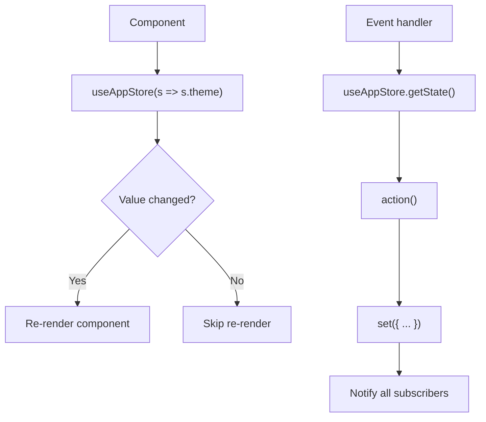

# State Management

PromptLens uses [Zustand](https://github.com/pmndrs/zustand) v5 with two separate stores. All application state lives in these stores -- components hold no local state beyond transient UI concerns (such as dropdown open/close).

## Dual-Store Architecture



### Why Two Stores?

The separation follows domain boundaries:

| Store | Domain | Change Frequency | Persistence |
|-------|--------|-----------------|-------------|
| `useAppStore` | UI preferences, theme, filters | Rarely changes during session | localStorage |
| `useWorkspaceStore` | File data, tabs, async operations | Changes frequently | localStorage (workspace paths) |

This separation prevents UI-only updates (like toggling a tab) from re-rendering components that only care about file data, and vice versa.

### Alternatives Considered

| Approach | Pros | Cons | Why Not Chosen |
|----------|------|------|----------------|
| Single store | Simple, single source of truth | Any change re-renders all components | Too coarse-grained |
| React Context | Built-in, no dependencies | Any change re-renders all consumers | Performance issues at scale |
| Redux | Mature ecosystem | Boilerplate, overkill for this app | Too complex |
| Jotai | Atomic state | Harder to reason about derived state | Less natural for this data shape |

## App Store (`useAppStore`)

Holds all user preferences and transient UI state.

```typescript
// file: src/app/store.ts:91
interface AppState {
  // Theme
  theme: Theme;                              // "dark" | "light"

  // User settings
  settings: AppSettings;                     // { fontFamily, fontSize, codeFontFamily }
  messageViewMode: MessageViewMode;          // "preview" | "text" | "json"

  // UI chrome
  settingsOpen: boolean;
  imagePreview: string | null;
  sourceConfirmDialog: SourceConfirmDialog | null;
  error: string | null;
  toasts: Toast[];
  liveMode: boolean;

  // Navigation
  openSource: LogSource;
  leftPanelWidth: number;
  rightPanelWidth: number;
  leftTab: LeftTab;                          // "records" | "timeline" | "trace" | ...
  leftSortOrder: SortOrder;                  // "desc" | "asc"
  rightTab: RightTab;                        // "diff" | "tools" | "error" | "json" | "raw"

  // Filter state
  filter: Filter;                            // "all" | "error" | "success" | "image" | "tool"
  sortKey: SortKey;                          // "time" | "latency" | "tokens" | "model" | "status"
  query: string;
  latencyMin: string;
  tokensMin: string;

  // Transient
  selectedAgentEvent: AgentEvent | null;
  ready: boolean;
  fadeOut: boolean;
  tabSwitching: boolean;
}
```

### Store Creation

```typescript
// file: src/app/store.ts:147
export const useAppStore = create<AppState>((set, get) => ({
  theme: loadTheme(),
  settings: loadSettings(),
  messageViewMode: loadMessageViewMode(),
  // ... all initial values loaded from localStorage

  setTheme: (t) => set({ theme: t }),
  setSettings: (s) => set({ settings: s }),
  toggleTheme: () => set((s) => ({ theme: s.theme === "dark" ? "light" : "dark" })),
  // ... all actions
}));
```

### Toast System

Toasts use a self-cleaning pattern. Each toast gets a monotonically increasing ID and is automatically removed after 5 seconds:

```typescript
// file: src/app/store.ts:180
addToast: (message, kind = "info") => {
  const id = ++toastId;
  set((s) => ({ toasts: [...s.toasts, { id, message, kind }] }));
  setTimeout(() => set((s) => ({
    toasts: s.toasts.filter((t) => t.id !== id),
  })), 5000);
},
```



### Theme Toggle

The theme change is applied in two places simultaneously: the Zustand store and the DOM attribute:

```typescript
// file: src/app/store.ts:202
toggleTheme: () => set((s) => ({
  theme: s.theme === "dark" ? "light" : "dark",
})),
```

A `subscribe` listener on the store persists the change and updates the DOM:

```typescript
// file: src/app/store.ts:213
useAppStore.subscribe((state, prev) => {
  if (state.theme !== prev.theme) {
    document.documentElement.dataset.theme = state.theme;
    localStorage.setItem(THEME_KEY, state.theme);
  }
  if (state.settings !== prev.settings) {
    localStorage.setItem(SETTINGS_KEY, JSON.stringify(state.settings));
  }
  // ... panel widths, message view mode
});
```



## Workspace Store (`useWorkspaceStore`)

Holds all file data, tab state, and async operation state.

```typescript
// file: src/app/store.ts:234
interface WorkspaceState {
  tabs: WorkspaceTab[];
  activeTabId: string | null;
  recentFiles: string[];
  systemFonts: string[];
  loading: boolean;
  searching: boolean;
  scanProgress: ProgressEvent | null;
  searchProgress: ProgressEvent | null;
  cacheInfo: CacheInfo | null;
  fileStatus: FileStatus | null;
  pricingTable: ModelPricing[];
  costEstimates: CostEstimate[];
  rustAnalytics: ComputedAnalyticsRaw | null;
}
```

### WorkspaceTab Structure

Each opened file gets a `WorkspaceTab` containing all file-level state:

```typescript
// file: src/app/types.ts (approximate)
type WorkspaceTab = {
  id: string;                        // File path
  source: LogSource;                 // "audit" | "claude_code" | "codex" | ...
  file: FileScanResult;              // Scan result + summaries
  agentSession: AgentSessionResult | null;
  sessionTabs: SessionTab[];         // Main tab + sub-agent tabs
  activeSessionTabId: string;
  providerFilter: string;
  modelFilter: string;
  statusFilter: string;
  issueOnly: boolean;
  traceFilter: string;
  lastSearchIndexed: boolean | null;
  newLineNumbers: number[];
  lastScanMs: number | null;
  lastSearchMs: number | null;
};
```



### SessionTab Structure

Each tab within a workspace can have its own selected record and search state:

```typescript
type SessionTab = {
  id: string;                        // "main" or "subagent:<agentId>"
  kind: SessionTabKind;              // "main" | "subagent"
  label: string;
  agentId?: string;
  selected: LogSummary | null;
  detail: RecordDetail | null;
  compareBase: RecordDetail | null;
  searchTerm: string;
  searchResults: SearchResult[];
};
```

### Updating Nested Tab State

The store provides helper actions for updating the active tab without manual array spreading:

```typescript
// file: src/app/store.ts:300
updateActiveTab: (patch) =>
  set((s) => ({
    tabs: s.tabs.map((tab) =>
      tab.id === s.activeTabId ? { ...tab, ...patch } : tab,
    ),
  })),

updateActiveSessionTab: (patch) =>
  set((s) => ({
    tabs: s.tabs.map((tab) => {
      if (tab.id !== s.activeTabId) return tab;
      return {
        ...tab,
        sessionTabs: tab.sessionTabs.map((st) =>
          st.id === tab.activeSessionTabId ? { ...st, ...patch } : st,
        ),
      };
    }),
  })),
```



## Persistence Strategy

### localStorage Keys

| Key | Type | Content |
|-----|------|---------|
| `promptlens.theme` | `string` | `"dark"` or `"light"` |
| `promptlens.settings` | `JSON` | `{ fontFamily, fontSize, codeFontFamily }` |
| `promptlens.messageViewMode` | `string` | `"preview"`, `"text"`, or `"json"` |
| `promptlens.panelWidth.left` | `number` | Left panel width in pixels |
| `promptlens.panelWidth.right` | `number` | Right panel width in pixels |
| `promptlens.workspace` | `JSON` | `{ paths[], sources[], activePath }` |
| `promptlens.recentFiles` | `JSON` | Recent file paths (up to 8) |

### How Persistence Works

Persistence is implemented via `useAppStore.subscribe()` -- a side-effect listener that runs after every state update:

```typescript
// file: src/app/store.ts:213
useAppStore.subscribe((state, prev) => {
  if (state.theme !== prev.theme) {
    document.documentElement.dataset.theme = state.theme;
    localStorage.setItem(THEME_KEY, state.theme);
  }
  if (state.settings !== prev.settings) {
    localStorage.setItem(SETTINGS_KEY, JSON.stringify(state.settings));
  }
  if (state.messageViewMode !== prev.messageViewMode) {
    localStorage.setItem(MESSAGE_VIEW_MODE_KEY, state.messageViewMode);
  }
  if (state.leftPanelWidth !== prev.leftPanelWidth) {
    savePanelWidth("left", state.leftPanelWidth);
  }
  if (state.rightPanelWidth !== prev.rightPanelWidth) {
    savePanelWidth("right", state.rightPanelWidth);
  }
});
```



### Workspace Persistence Guard

For the workspace store, persistence is guarded by a `restoredWorkspace` flag to avoid overwriting saved state during initial load:

```typescript
// file: src/app/storage.ts (approximate)
let restoredWorkspace = false;

useWorkspaceStore.subscribe((state) => {
  if (!restoredWorkspace) return;
  saveWorkspace(
    state.tabs.map((t) => ({ filePath: t.file.filePath, source: t.source })),
    state.activeTabId,
  );
});

export function markWorkspaceRestored() {
  restoredWorkspace = true;
}
```

Without this guard, the initial empty state would overwrite the saved workspace paths before they are loaded.

## Derived State

The `App` component uses `useMemo` to compute derived values from store state. This is the primary mechanism for filtering, sorting, analytics, and issue detection.



Key derived computations in `App`:

```typescript
// Apply all filters and sorting
const filtered = useMemo(() => {
  return [...file.summaries]
    .filter((item) => { /* filter, provider, model, status, trace, latency, tokens, query */ })
    .sort((a, b) => compareSummary(a, b, sortKey));
}, [file, filter, sortKey, query, latencyMin, tokensMin,
    providerFilter, modelFilter, statusFilter, traceFilter, issueOnly]);

// Compute analytics on the filtered subset
const analytics = useMemo(() => buildAnalytics(filtered), [filtered]);

// Detect anomalies
const issues = useMemo(() => detectIssues(filtered, analytics), [filtered, analytics]);

// Group into sessions
const sessions = useMemo(() => buildSessionGroups(file?.summaries ?? []), [file]);
```

### Why useMemo Instead of Zustand Selectors?

Derived state like `filtered` depends on multiple store values (`file.summaries`, `filter`, `sortKey`, `query`, etc.). Computing them inside the store would require:

1. Subscribing to all dependencies
2. Recomputing when any dependency changes
3. Storing results in the store (polluting the store with derived data)

Using `useMemo` in the component is simpler because:
- The dependency array explicitly declares all inputs
- React's `useMemo` caches the result and only recomputes when dependencies change
- Derived values are co-located with where they are used

## Store Access Patterns

Components never call `useAppStore()` or `useWorkspaceStore()` directly. Instead, `App` selects individual values and passes them as props:

```typescript
// In App.tsx -- stable selectors prevent re-render loops
const theme = useAppStore((s) => s.theme);
const filter = useAppStore((s) => s.filter);
const tabs = useWorkspaceStore((s) => s.tabs);
const loading = useWorkspaceStore((s) => s.loading);

// Access actions via getState() in callbacks
const ws = useWorkspaceStore.getState;
const app = useAppStore.getState;
```

For imperative code (event handlers, effects), the store is accessed via `getState()`:

```typescript
useEffect(() => {
  app().init();
}, []);
```



This pattern ensures that components re-render only when their specific slice of state changes, rather than when any unrelated part of the store is updated.
