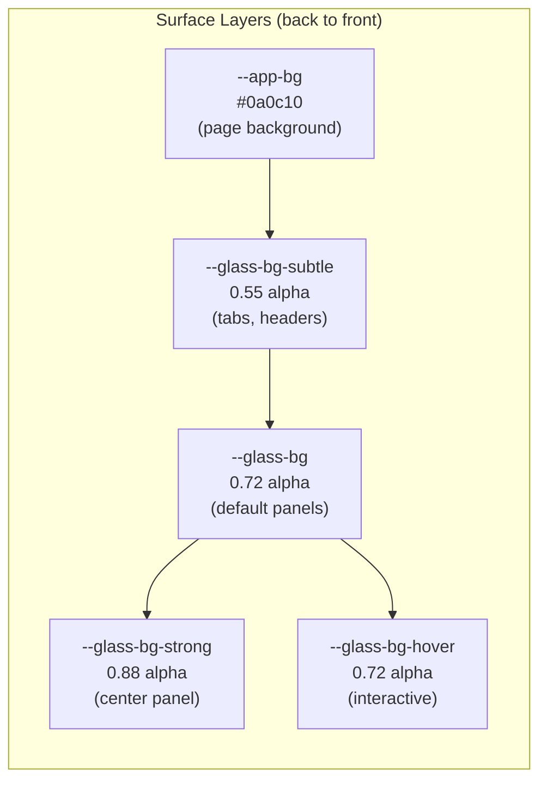
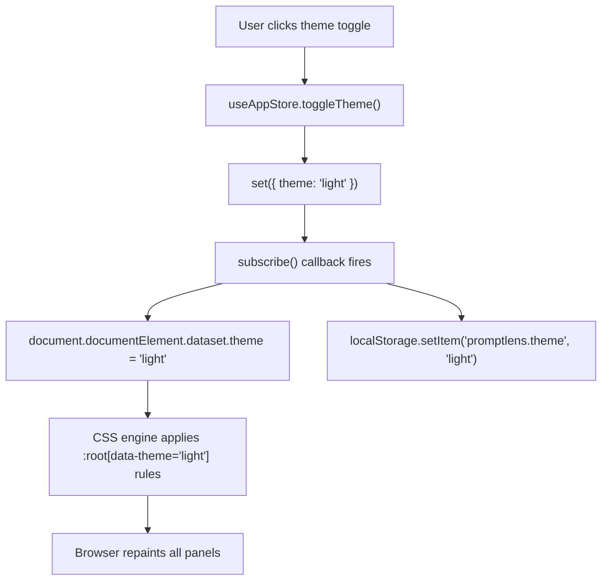
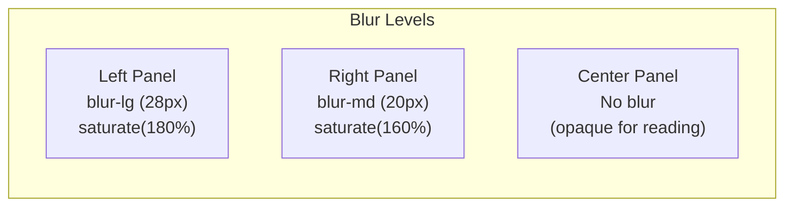
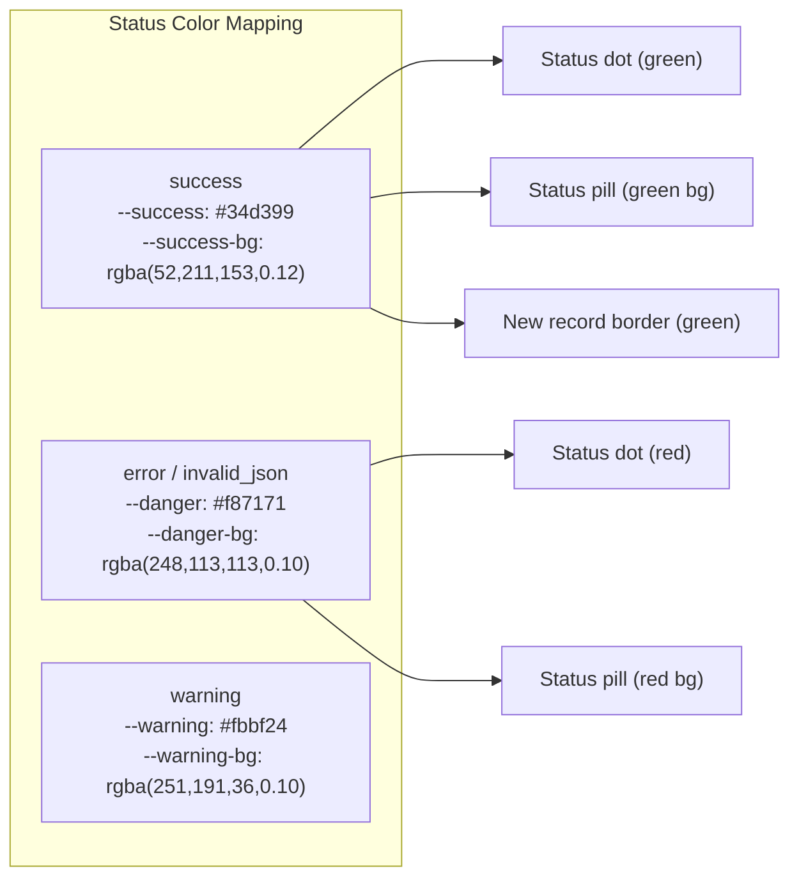
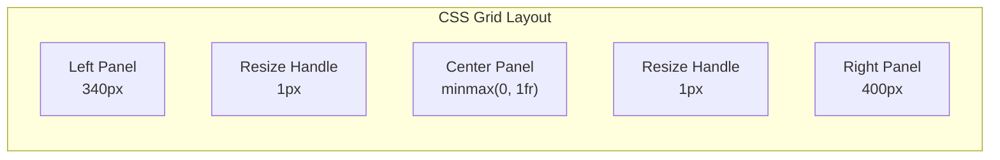

# Styling System

PromptLens uses a vanilla CSS approach with no CSS-in-JS library, no CSS Modules, and no utility-class framework. All styles are organized as partial CSS files imported through a single barrel file.

## CSS Architecture

```mermaid
graph TD
    Barrel["src/styles.css<br/>(barrel file)"]
    Variables["variables.css<br/>Custom properties, themes"]
    Reset["reset.css<br/>Minimal normalize"]
    Layout["layout.css<br/>3-pane grid, resize handles"]
    Titlebar["titlebar.css<br/>macOS title bar"]
    Toolbar["toolbar.css<br/>Filter/sort toolbar"]
    List["list.css<br/>Virtual scroll list"]
    Detail["detail.css<br/>Message cards"]
    RightPanel["rightpanel.css<br/>Right panel tabs"]
    Tabs["tabs.css<br/>Workspace tabs"]
    Agent["agent.css<br/>Agent timeline"]
    Analytics["analytics.css<br/>Charts"]
    Diff["diff.css<br/>Text diff"]
    Sessions["sessions.css<br/>Session cards"]
    Search["search.css<br/>Search results"]
    Banners["banners.css<br/>Toasts, banners"]
    Loading["loading.css<br/>Progress overlay"]
    Media["media.css<br/>Image preview"]
    Metadata["metadata.css<br/>Key-value rows"]
    Misc["misc.css<br/>Landing, empty states"]

    Barrel --> Variables & Reset & Layout & Titlebar & Toolbar
    Barrel --> List & Detail & RightPanel & Tabs & Agent
    Barrel --> Analytics & Diff & Sessions & Search & Banners
    Barrel --> Loading & Media & Metadata & Misc
```



The barrel file simply imports each partial:

```css
/* file: src/styles.css */
@import "./styles/variables.css";
@import "./styles/reset.css";
@import "./styles/layout.css";
@import "./styles/titlebar.css";
@import "./styles/toolbar.css";
@import "./styles/list.css";
@import "./styles/detail.css";
@import "./styles/rightpanel.css";
@import "./styles/tabs.css";
@import "./styles/agent.css";
@import "./styles/analytics.css";
@import "./styles/diff.css";
@import "./styles/sessions.css";
@import "./styles/search.css";
@import "./styles/banners.css";
@import "./styles/loading.css";
@import "./styles/media.css";
@import "./styles/metadata.css";
@import "./styles/misc.css";
```

### Why Vanilla CSS?

| Approach | Pros | Cons |
|----------|------|------|
| **Vanilla CSS (chosen)** | Zero runtime cost, simple, browser-native | No scoping, manual naming conventions |
| CSS Modules | Scoped class names | Build step, harder to share variables |
| Tailwind | Rapid prototyping | Large bundle, class name soup in JSX |
| styled-components | Scoped, dynamic | Runtime cost, bundle size |

Vanilla CSS won because:
1. PromptLens is a desktop app where bundle size is less critical, but runtime performance matters for smooth scrolling
2. The CSS variable system provides theme switching without any JavaScript runtime
3. The flat component structure means naming collisions are manageable

## CSS Custom Properties (Design Tokens)

All visual decisions are expressed as CSS custom properties on `:root`. Theme switching is achieved by changing a single `data-theme` attribute on `<html>`.

### Surface Layers

The design system defines four glass opacity levels from back to front:

```css
/* file: src/styles/variables.css:9 */
:root {
  --app-bg: #0a0c10;                              /* Page background */
  --glass-bg: rgba(22, 27, 36, 0.72);             /* Default glass panels */
  --glass-bg-strong: rgba(28, 33, 44, 0.88);      /* High-readability panels */
  --glass-bg-subtle: rgba(18, 22, 30, 0.55);      /* Chrome (tabs, headers) */
  --glass-bg-hover: rgba(38, 44, 58, 0.72);       /* Interactive hover */
}
```



### Borders and Edges

```css
/* file: src/styles/variables.css:17 */
:root {
  --glass-border: rgba(255, 255, 255, 0.08);          /* Subtle dividers */
  --glass-border-strong: rgba(255, 255, 255, 0.14);   /* Emphasized borders */
  --glass-border-accent: rgba(91, 156, 246, 0.30);    /* Focus/active borders */
}
```

### Shadows and Depth

```css
/* file: src/styles/variables.css:23 */
:root {
  --glass-shadow: 0 2px 20px rgba(0, 0, 0, 0.35);
  --glass-shadow-lg: 0 8px 40px rgba(0, 0, 0, 0.45);
  --glass-highlight: inset 0 1px 0 rgba(255, 255, 255, 0.05);
  --glass-inset: inset 0 1px 3px rgba(0, 0, 0, 0.2);
}
```

### Typography Colors

```css
/* file: src/styles/variables.css:29 */
:root {
  --text-primary: #e8eaed;
  --text-secondary: #8b95a5;
  --text-tertiary: #5a6370;
  --text-inverse: #1d1d1f;
}
```

### Accent and Semantic Colors

```css
/* file: src/styles/variables.css:35 */
:root {
  /* Brand accent */
  --accent: #5b9cf6;
  --accent-hover: #7ab3ff;
  --accent-bg: rgba(91, 156, 246, 0.15);
  --accent-glow: 0 0 16px rgba(91, 156, 246, 0.20);

  /* Semantic */
  --success: #34d399;
  --success-bg: rgba(52, 211, 153, 0.12);
  --danger: #f87171;
  --danger-bg: rgba(248, 113, 113, 0.10);
  --warning: #fbbf24;
  --warning-bg: rgba(251, 191, 36, 0.10);

  /* JSON syntax */
  --json-key: #7cc4f7;
  --json-string: #9bd88f;
  --json-number: #f8c77e;
  --json-boolean: #c69cff;
}
```

### Blur Presets

```css
/* file: src/styles/variables.css:61 */
:root {
  --blur-sm: blur(12px);
  --blur-md: blur(20px);
  --blur-lg: blur(28px);
}
```

## Dark/Light Theme Switching

Themes are switched by setting `data-theme` on the document element:

```html
<html data-theme="dark">   {/* Dark theme (default) */}
<html data-theme="light">  {/* Light theme */}
```

The light theme overrides each variable using an attribute selector:

```css
/* file: src/styles/variables.css:78 */
:root[data-theme="light"] {
  color-scheme: light;

  --app-bg: #e8ecf1;
  --glass-bg: rgba(255, 255, 255, 0.55);
  --glass-bg-strong: rgba(255, 255, 255, 0.82);
  --glass-bg-subtle: rgba(255, 255, 255, 0.40);

  --glass-border: rgba(255, 255, 255, 0.60);
  --glass-border-strong: rgba(0, 0, 0, 0.08);

  --text-primary: #1d1d1f;
  --text-secondary: #6e7681;
  --text-tertiary: #9ca3af;

  --accent: #3478f6;
  --accent-hover: #2563eb;
  /* ... all other overrides */
}
```

### Theme Persistence Flow



Because every color in the app references CSS variables, the theme switch is instantaneous with zero component re-renders -- the browser repaints via CSS alone.

### Dark vs Light Color Comparison

| Variable | Dark | Light | Purpose |
|----------|------|-------|---------|
| `--app-bg` | `#0a0c10` | `#e8ecf1` | Page background |
| `--glass-bg` | `rgba(22,27,36,0.72)` | `rgba(255,255,255,0.55)` | Panel background |
| `--glass-bg-strong` | `rgba(28,33,44,0.88)` | `rgba(255,255,255,0.82)` | Center panel |
| `--text-primary` | `#e8eaed` | `#1d1d1f` | Primary text |
| `--text-secondary` | `#8b95a5` | `#6e7681` | Secondary text |
| `--accent` | `#5b9cf6` | `#3478f6` | Brand blue |
| `--success` | `#34d399` | `#34d399` | Success green (same) |
| `--danger` | `#f87171` | `#f87171` | Error red (same) |

## Glassmorphism

The visual language is macOS-style glassmorphism. Each panel uses `backdrop-filter` to blur what is behind it, combined with a semi-transparent background.

```css
/* Sidebar -- heavy blur */
.list-pane {
  background: var(--glass-bg);
  backdrop-filter: var(--blur-lg) saturate(180%);
  -webkit-backdrop-filter: var(--blur-lg) saturate(180%);
}

/* Right panel -- medium blur */
.json-pane {
  background: var(--glass-bg);
  backdrop-filter: var(--blur-md) saturate(160%);
  -webkit-backdrop-filter: var(--blur-md) saturate(160%);
}

/* Center panel -- no blur (opaque for readability) */
.conversation-pane {
  background: var(--glass-bg-strong);
}
```



The `--glass-bg-strong` variable has a higher alpha value (0.88 in dark mode, 0.82 in light mode), making the center panel nearly opaque for comfortable reading.

### Why Different Blur Levels?

- **Left panel (heavy blur)** -- The log list is for quick scanning; the blur creates visual depth without distracting from the center
- **Right panel (medium blur)** -- Supplementary data; moderate blur maintains readability while showing depth
- **Center panel (no blur)** -- The primary content area where the user reads messages; fully opaque for maximum readability

### Background Orbs

The app renders decorative background gradient orbs behind the glass panels:

```css
.app-bg-orbs {
  position: fixed;
  inset: 0;
  z-index: 0;
  background:
    radial-gradient(ellipse 600px 400px at 20% 30%, rgba(74, 123, 247, 0.08), transparent),
    radial-gradient(ellipse 500px 500px at 80% 70%, rgba(139, 92, 246, 0.06), transparent);
  pointer-events: none;
}
```

These orbs create a colored background that is visible through the frosted glass.

## Dynamic CSS Variables

The `App` component sets runtime CSS variables for user-configurable font settings:

```tsx
// file: src/app/App.tsx (approximate)
<main
  className="app-shell"
  style={{
    "--app-font-family": settings.fontFamily,
    "--app-font-size": `${settings.fontSize}px`,
    "--code-font-family": settings.codeFontFamily,
  } as CSSProperties}
>
```

These override the defaults defined in `:root` and cascade to all child components.

## Transitions

All interactive state changes use a shared easing curve:

```css
/* file: src/styles/variables.css:67 */
:root {
  --ease: cubic-bezier(0.25, 0.1, 0.25, 1);
}
```

| Element | Duration | Property |
|---------|----------|----------|
| `.log-row` | 120ms | `background` |
| `.tab-button-base` | 150ms | `all` |
| Landing page | 400ms | `opacity` |
| Loading states | 500-800ms | `opacity, transform` |

Durations are kept short (120-300ms) to maintain a responsive feel. Longer animations are reserved for landing page fade-in and loading state transitions.

## Status Color System

Each record status maps to a semantic color used consistently across dots, pills, badges, and borders:

```css
/* Status dot (7px circle in log list) */
.status-dot.success { background: var(--success); }
.status-dot.error, .status-dot.invalid_json { background: var(--danger); }

/* Status pill (rounded badge in detail view) */
.pill.success { background: var(--success-bg); border-color: var(--success-border); }
.pill.error { background: var(--danger-bg); border-color: var(--danger-border); */

/* New record highlight (incremental scan) */
.log-row.new-record {
  border-left: 3px solid var(--success);
  background: var(--success-bg);
}
```



## Panel Layout

The three-panel layout uses CSS Grid with explicit pixel widths controlled by JavaScript:

```css
.workspace {
  display: grid;
  /* Template set dynamically via style attribute */
  /* e.g., "340px 1px minmax(0, 1fr) 1px 400px" */
}
```

The `1px` columns are resize handles. The center panel uses `minmax(0, 1fr)` to fill remaining space. Panel widths are clamped to min/max values defined in TypeScript:

```typescript
export const LEFT_MIN = 260;
export const LEFT_MAX = 560;
export const LEFT_DEFAULT = 340;
export const RIGHT_MIN = 300;
export const RIGHT_MAX_RATIO = 0.6;
export const RIGHT_DEFAULT = 400;
export const CENTER_MIN = 200;
```



## Responsive Behavior

The layout is not responsive in the traditional sense -- PromptLens is a desktop app with a minimum window size. However, it handles window resizing by proportionally shrinking panels:

```typescript
// When window is resized, proportionally shrink panels
if (l + r + CENTER_MIN > available) {
  const deficit = l + r + CENTER_MIN - available;
  l = Math.max(LEFT_MIN, Math.round(l - deficit * (l / total)));
  r = Math.max(RIGHT_MIN, Math.round(r - deficit * (r / total)));
}
```

This ensures the center panel always has at least `CENTER_MIN` (200px) of space, even on smaller screens.
