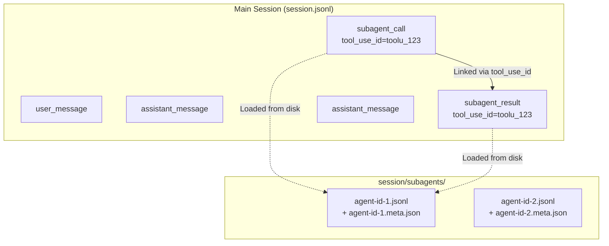
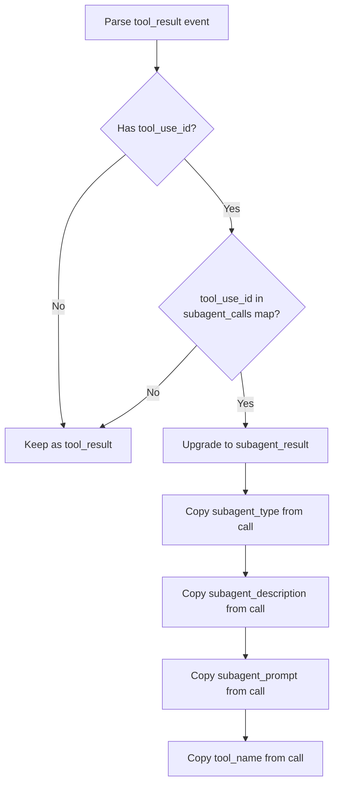
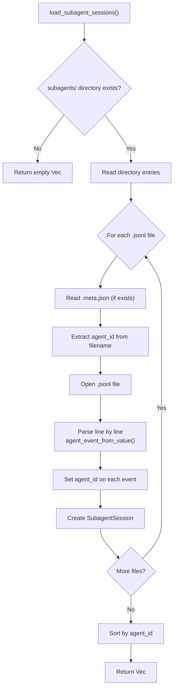
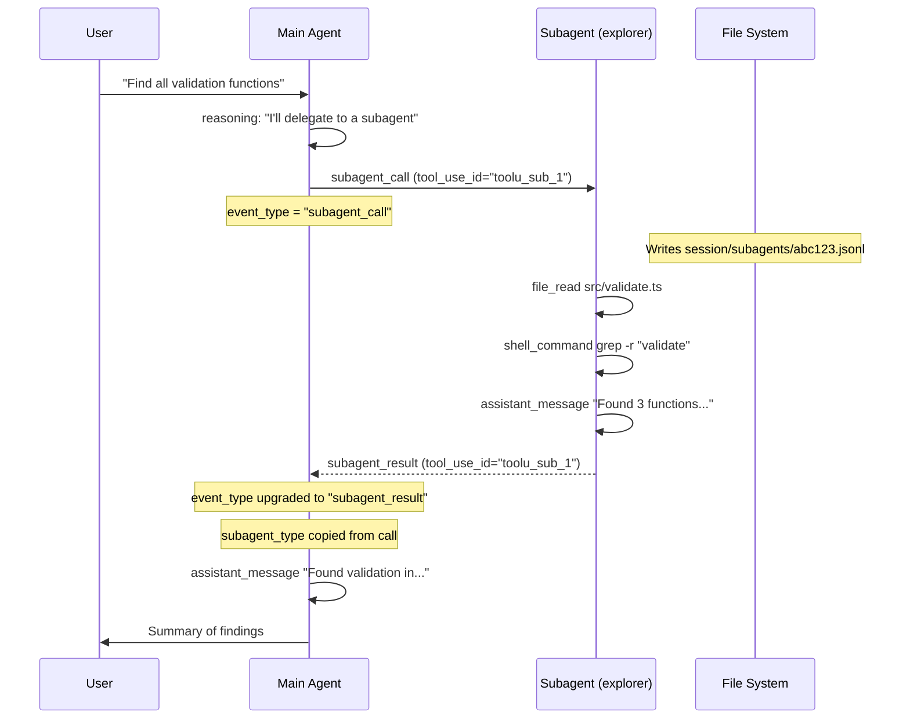
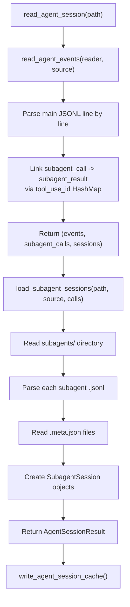

# Subagent Sessions

Subagent sessions represent the activity of subagents spawned by the main coding agent. In Claude Code, this happens when the `Task` or `Agent` tool is used to delegate work to a specialized subagent. PromptLens links these subagent invocations to their results and loads their separate JSONL log files.

## Subagent Architecture



## Call/Result Linking

When the parser encounters a `tool_result` event, it checks whether the `tool_use_id` matches a previously seen `subagent_call`. If a match is found:

1. `event_type` is upgraded from `tool_result` to `subagent_result`
2. `subagent_type`, `subagent_description`, and `subagent_prompt` fields are copied from the call to the result
3. `tool_name` is also copied if not already set



### Linking Implementation

The `read_agent_events()` function maintains a `HashMap<String, AgentEvent>` called `subagent_calls`:

```rust
// file: src-tauri/src/commands.rs:296
// When a subagent_call is seen
if event.event_type == "subagent_call" {
    if let Some(tool_use_id) = &event.tool_use_id {
        subagent_calls.insert(tool_use_id.clone(), event.clone());
    }
}

// When a tool_result is seen
if event.event_type == "tool_result" {
    if let Some(call) = event.tool_use_id.as_ref()
        .and_then(|tool_use_id| subagent_calls.get(tool_use_id))
    {
        event.event_type = "subagent_result".to_string();
        event.tool_name = event.tool_name.or_else(|| call.tool_name.clone());
        event.subagent_type = event.subagent_type.or_else(|| call.subagent_type.clone());
        event.subagent_description = event.subagent_description
            .or_else(|| call.subagent_description.clone());
        event.subagent_prompt = event.subagent_prompt
            .or_else(|| call.subagent_prompt.clone());
    }
}
```

The map is keyed by `tool_use_id` because each subagent invocation has a unique tool use ID. This allows multiple concurrent subagent calls to be tracked independently. Session IDs are also collected into a `HashSet` during parsing:

```rust
// file: src-tauri/src/commands.rs:318
if let Some(session_id) = &event.session_id {
    sessions.insert(session_id.clone());
}
```

### Frontend Subagent Task Construction

On the frontend, `buildSubagentTasks()` reconstructs call/result pairs from the event list:

```tsx
// file: src/app/analytics.ts:278
export function buildSubagentTasks(events: AgentEvent[]): SubagentTask[] {
  const resultsByToolUseId = new Map<string, AgentEvent>();
  for (const event of events) {
    if (event.eventType !== "subagent_result") continue;
    if (event.toolUseId) resultsByToolUseId.set(event.toolUseId, event);
  }
  return events
    .filter((event) => event.eventType === "subagent_call")
    .map((call): SubagentTask => {
      const result = call.toolUseId ? resultsByToolUseId.get(call.toolUseId) : undefined;
      const status = result?.status === "error" ? "error" : result ? "completed" : "running";
      return {
        id: call.toolUseId || call.id,
        type: call.subagentType || "subagent",
        description: call.subagentDescription || call.preview || "Subagent task",
        prompt: call.subagentPrompt,
        call,
        result,
        status,
      };
    });
}
```

The `SubagentTask` type tracks each subagent's lifecycle:

```tsx
// file: src/app/types.ts:69
export type SubagentTask = {
  id: string;
  type: string;
  description: string;
  prompt?: string;
  call: AgentEvent;
  result?: AgentEvent;
  status: "running" | "completed" | "error";
};
```

## Subagent Log Files

### Directory Structure

Subagent logs are stored in a directory structure alongside the main session file:

```
session.jsonl                    # Main session log
session/                         # Directory named after main file
  subagents/                     # Subagent logs directory
    agent-id-1.jsonl             # Subagent event log
    agent-id-1.meta.json         # Subagent metadata
    agent-id-2.jsonl
    agent-id-2.meta.json
```

The directory path is derived from the main file:

```rust
// file: src-tauri/src/commands.rs:333
let session_dir = main_file_path
    .parent()                           // Parent directory
    .map(|p| {
        let stem = main_file_path
            .file_stem()                // Filename without extension
            .map(|s| s.to_string_lossy().to_string())
            .unwrap_or_default();
        p.join(stem)                    // <parent>/<stem>/
    })
    .filter(|d| d.is_dir());            // Only if directory exists

let subagents_dir = session_dir.join("subagents");
```

### Meta File Format

Each subagent JSONL file may have an accompanying `.meta.json` file:

```json
{
  "agentType": "explorer",
  "description": "Find all validation functions in the codebase",
  "toolUseId": "toolu_sub_1"
}
```

| Field | Type | Description |
|-------|------|-------------|
| `agentType` | `String` | Subagent type (e.g., `explorer`, `general-purpose`) |
| `description` | `String` | Human-readable description of the subagent task |
| `toolUseId` | `String` | The `tool_use_id` from the parent `subagent_call` |

Meta files are read during subagent loading. If the `.meta.json` file is missing or malformed, the subagent session is still loaded but without metadata fields:

```rust
// file: src-tauri/src/commands.rs:379
let meta_path = path.with_extension("meta.json");
let meta: Option<Value> = fs::read_to_string(&meta_path)
    .ok()
    .and_then(|s| serde_json::from_str(&s).ok());

let agent_type = meta.as_ref().and_then(|m| {
    m.get("agentType").and_then(Value::as_str).map(str::to_string)
});
```

### Loading Process



```rust
// file: src-tauri/src/commands.rs:328
fn load_subagent_sessions(
    main_file_path: &Path,
    source: LogSource,
    subagent_calls: &HashMap<String, AgentEvent>,
) -> Vec<SubagentSession> {
    // 1. Derive session directory path from main file name
    // 2. Check for subagents/ subdirectory
    // 3. Iterate .jsonl files in the directory
    // 4. Read .meta.json for metadata
    // 5. Parse JSONL events with agent_event_from_value()
    // 6. Set agent_id on each event from filename
    // 7. Create SubagentSession objects
    // 8. Sort by agent_id
}
```

The function also builds a lookup table from `agent_id` to `subagent_call` events, enabling cross-referencing between the main session's subagent calls and the subagent log files:

```rust
// file: src-tauri/src/commands.rs:359
let mut call_by_agent_id: HashMap<&str, &AgentEvent> = HashMap::new();
for call in subagent_calls.values() {
    if let Some(ref agent_id) = call.agent_id {
        call_by_agent_id.insert(agent_id.as_str(), call);
    }
}
```

## SubagentSession Struct

```rust
// file: src-tauri/src/types.rs:138
#[derive(Debug, Serialize, Deserialize, Clone)]
#[serde(rename_all = "camelCase")]
pub(crate) struct SubagentSession {
    pub(crate) agent_id: String,                    // Filename (e.g., "agent-id-1")
    pub(crate) agent_type: Option<String>,          // From meta.json agentType
    pub(crate) description: Option<String>,         // From meta.json description
    pub(crate) tool_use_id: Option<String>,         // From meta.json toolUseId
    pub(crate) events: Vec<AgentEvent>,             // Parsed events from JSONL
}
```

## Example: Full Subagent Flow



## Subagent Tab Navigation

In the UI, subagent sessions appear as separate tabs in the left panel. The main session's events are filtered to exclude sidechain and subagent events, while each subagent tab shows only its own events:

```tsx
// file: src/app/App.tsx:90
const filteredAgentSession = useMemo(() => {
  if (!agentSession) return null;
  if (activeSessionTabId === "main") {
    return { ...agentSession, events: agentSession.events.filter(
      (e) => !e.isSidechain && !e.agentId
    )};
  }
  const sub = agentSession.subagentSessions.find(
    (s) => `subagent:${s.agentId}` === activeSessionTabId
  );
  if (!sub) return agentSession;
  return { ...agentSession, events: sub.events };
}, [agentSession, activeSessionTabId]);
```

Subagent tabs are conditionally rendered when the source is an agent session:

```tsx
// file: src/app/components/LeftPanel.tsx:149
{isAgentSession && (
  <button role="tab" className={...} onClick={() => setTab("subagents")} title="Subagents">
    <Bot size={14} />
  </button>
)}
```

## Data Flow Summary



## Cache Interaction

Subagent sessions are included in the cached `AgentSessionResult`, stored in the `agent_session_cache` SQLite table:

```rust
// file: src-tauri/src/commands.rs:247
let result = AgentSessionResult {
    file_path,
    source: source.as_str().to_string(),
    total_events: events.len(),
    sessions,
    events,
    subagent_sessions,  // Included in cache
};
let _ = write_agent_session_cache(&result, metadata.len(), modified.as_deref());
```

The cache table uses a `(file_path, source)` composite primary key:

```rust
// file: src-tauri/src/cache.rs:44
"CREATE TABLE IF NOT EXISTS agent_session_cache (
    file_path TEXT NOT NULL,
    source TEXT NOT NULL,
    file_size INTEGER NOT NULL,
    modified TEXT,
    payload TEXT NOT NULL,
    updated_at INTEGER NOT NULL,
    PRIMARY KEY (file_path, source)
)"
```

This means subagent JSONL files are only re-parsed when the main session file changes (size or modification time changes).

## Limitations

| Limitation | Description |
|------------|-------------|
| Claude Code only | Subagent support is specific to Claude Code's Task/Agent tools |
| Directory-based | Subagent logs must be in the expected directory structure (`<stem>/subagents/`) |
| No nesting | Subagents cannot spawn their own subagents (one level deep only) |
| Static loading | All subagent sessions are loaded at once, not incrementally |
| No cross-linking | Subagent events do not link back to the parent's tool_use_id |

## Troubleshooting

| Problem | Cause | Solution |
|---------|-------|----------|
| Subagent tab not appearing | No `subagents/` directory found next to main JSONL | Ensure directory structure matches `<stem>/subagents/*.jsonl` |
| Subagent events show as `tool_result` | `tool_use_id` mismatch between call and result | Verify `tool_use_id` in main session matches subagent meta files |
| Empty subagent session | JSONL file exists but contains no parseable events | Check that the JSONL file has valid JSON lines |
| Missing metadata | `.meta.json` file not found or malformed | Create a valid `.meta.json` with `agentType`, `description`, and `toolUseId` fields |
| Stale subagent data | Cache not invalidated after subagent file changes | Re-scan the main session file (Ctrl+R) to reload subagent sessions |

## Related Types and Commands

| Type/Command | Location | Purpose |
|-------------|----------|---------|
| `SubagentSession` struct | `src-tauri/src/types.rs:138` | Rust struct holding subagent metadata and events |
| `AgentSessionResult` struct | `src-tauri/src/types.rs:128` | Top-level result containing main events + subagent sessions |
| `SubagentTask` type | `src/app/types.ts:69` | Frontend type for subagent call/result pair with status |
| `buildSubagentTasks()` | `src/app/analytics.ts:278` | Reconstructs SubagentTask[] from AgentEvent[] on frontend |
| `load_subagent_sessions()` | `src-tauri/src/commands.rs:328` | Rust function that reads the subagents/ directory |
| `read_agent_session` | `src-tauri/src/commands.rs:223` | Tauri command that triggers full session + subagent loading |
