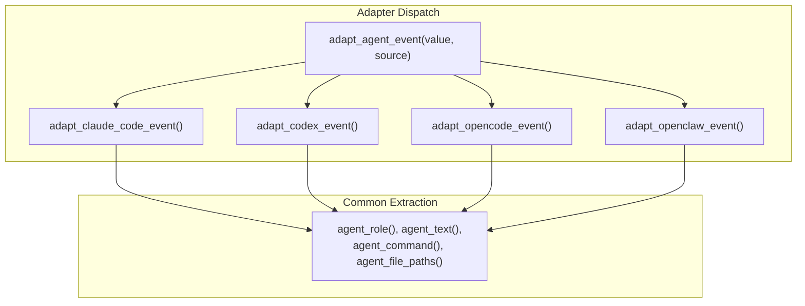

# Supported Agent Tools

PromptLens supports parsing session logs from four coding agent tools. Each tool has a dedicated adapter in `agent_adapters.rs` that transforms the tool-specific JSON structure into the unified `AgentEvent` format.

## Tool Comparison

| Feature | Claude Code | Codex | OpenCode | OpenClaw |
|---------|------------|-------|----------|----------|
| Log format | Message-based | Event-based | Part-based | Action-based |
| Key field | `message.content[]` | `type` | `part` / `payload` | `action` / `event` |
| Session ID | `sessionId` | `session_id` | `session_id` | `session_id` |
| Sidechain support | Yes (`isSidechain`) | No | No | No |
| Subagent support | Yes (`Task`, `Agent`) | No | No | No |
| Checkpoint types | 7 special types | 4 types | Snapshot | Checkpoint |
| Arguments format | Object in `input` | JSON string | Object in `input` | Object in `action` |



## Claude Code

Claude Code produces message-based JSONL logs where each line is a message with a role and content array.

### Log Structure

```json
{
  "type": "assistant",
  "sessionId": "session-abc123",
  "message": {
    "role": "assistant",
    "content": [
      {
        "type": "tool_use",
        "id": "toolu_123",
        "name": "Bash",
        "input": { "command": "npm test" }
      }
    ]
  }
}
```

### Adapter Implementation

```rust
// file: src-tauri/src/agent_adapters.rs:168
fn adapt_claude_code_event(value: &Value) -> AgentEventAdapterFields {
    let mut fields = AgentEventAdapterFields::default();
    let lowered_type = agent_record_type(value);

    // Handle special record types first
    if lowered_type == "file-history-snapshot" {
        fields.event_type = Some("checkpoint".to_string());
        return fields;
    }
    // ... more special types

    // Process message.content[] array
    if let Some(message) = value.get("message") {
        if let Some(content) = message.get("content").and_then(Value::as_array) {
            for part in content {
                let part_type = part.get("type").and_then(Value::as_str).unwrap_or_default();
                if part_type == "tool_use" {
                    // Extract tool_name, tool_use_id, input
                    // Check for Task/Agent (subagent), shell, file tools
                } else if part_type == "tool_result" {
                    // Extract tool_use_id, check is_error
                } else if part_type == "thinking" {
                    // Extract thinking text
                }
            }
        }
    }
}
```

### Special Record Types

| `type` | Description | Extra Fields |
|--------|-------------|--------------|
| `file-history-snapshot` | File state snapshot | -- |
| `queue-operation` | Queue state change | `operation` |
| `system` | System message | `subtype`, `level` |
| `permission-mode` | Permission change | `permissionMode` |
| `last-prompt` | Last user prompt | `lastPrompt` |
| `ai-title` | Session title | `title` |
| `agent-name` | Agent identifier | `name` |

### Content Part Mapping

| Content `type` | Event Type | Notes |
|----------------|-----------|-------|
| `tool_use` (Bash) | `shell_command` | Extracts `input.command` |
| `tool_use` (Read/Write/Edit) | `file_read`/`file_write`/`file_edit` | Extracts file paths from input |
| `tool_use` (Task/Agent) | `subagent_call` | Extracts `subagent_type`, `description`, `prompt` |
| `tool_use` (other) | `tool_call` | Generic tool call |
| `tool_result` | `tool_result` | Extracts text from content |
| `thinking` | `reasoning` | Extracts thinking text |
| `text` | (lower priority) | Text content |

### Subagent Support

Claude Code is the only tool with subagent support. When a `Task` or `Agent` tool_use is detected:

```rust
// file: src-tauri/src/agent_adapters.rs:223
if matches!(fields.tool_name.as_deref(), Some("Task") | Some("Agent")) {
    fields.subagent_type = first_string(input, &["subagent_type", "subagentType"]);
    fields.subagent_description = first_string(input, &["description"]);
    fields.subagent_prompt = first_string(input, &["prompt"]);
}
```

1. Event type is set to `subagent_call`
2. `subagent_type`, `subagent_description`, and `subagent_prompt` are extracted from input
3. The matching `tool_result` is upgraded to `subagent_result` with the same metadata

## Codex

Codex produces event-based JSONL logs with a `type` field that determines the event category.

### Log Structure

```json
{
  "type": "function_call",
  "session_id": "session-xyz",
  "tool_name": "exec_command",
  "arguments": "{\"cmd\": \"cargo test\"}"
}
```

### Adapter Implementation

```rust
// file: src-tauri/src/agent_adapters.rs:92
fn adapt_codex_event(value: &Value) -> AgentEventAdapterFields {
    let payload = agent_payload(value);  // May unwrap "payload" key
    let lowered_type = agent_record_type(payload);

    fields.role = agent_role(payload).or_else(|| agent_role(value));

    // Parse JSON-encoded arguments
    if let Some(arguments) = payload.get("arguments") {
        if let Some(parsed) = parse_maybe_json(arguments) {
            fields.command = agent_command(&parsed);
            fields.file_paths = agent_file_paths(&parsed);
        }
    }
}
```

### Event Type Mapping

| Codex `type` | Event Type | Notes |
|--------------|-----------|-------|
| `message` (user) | `user_message` | Role-based dispatch |
| `message` (assistant) | `assistant_message` | Role-based dispatch |
| `user_message` | `user_message` | Direct mapping |
| `agent_message` | `assistant_message` | Direct mapping |
| `reasoning` | `reasoning` | Thinking/reasoning step |
| `function_call` | `shell_command` / `file_*` / `tool_call` | Classified by tool name |
| `custom_tool_call` | `shell_command` / `file_*` / `tool_call` | Classified by tool name |
| `function_call_output` | `tool_result` | Tool execution result |
| `custom_tool_call_output` | `tool_result` | Tool execution result |
| `patch_apply_end` | `patch` | File patch applied |
| `task_started` / `task_complete` | `checkpoint` | Task lifecycle |
| `turn_aborted` | `checkpoint` | Turn lifecycle |
| `context_compacted` | `checkpoint` | Context management |

### Argument Parsing

Codex stores tool arguments as JSON strings. The adapter parses these to extract commands and file paths:

```rust
// file: src-tauri/src/agent_adapters.rs:108
if let Some(arguments) = payload.get("arguments") {
    if let Some(parsed) = parse_maybe_json(arguments) {
        fields.command = agent_command(&parsed);
        fields.file_paths = agent_file_paths(&parsed);
    }
}
```

The `parse_maybe_json` function handles both string-encoded JSON and native JSON objects:

```rust
// file: src-tauri/src/agent_adapters.rs:374
fn parse_maybe_json(value: &Value) -> Option<Value> {
    match value {
        Value::String(text) => serde_json::from_str(text).ok(),
        Value::Object(_) | Value::Array(_) => Some(value.clone()),
        _ => None,
    }
}
```

## OpenCode

OpenCode produces part-based JSONL logs where each line wraps a `part` or `payload` object.

### Log Structure

```json
{
  "type": "part",
  "part": {
    "type": "tool",
    "tool": "read",
    "input": { "path": "src/main.ts" }
  }
}
```

### Adapter Implementation

```rust
// file: src-tauri/src/agent_adapters.rs:302
fn adapt_opencode_event(value: &Value) -> AgentEventAdapterFields {
    let part = value.get("part")
        .or_else(|| value.get("payload"))
        .unwrap_or(value);
    let lowered_type = agent_record_type(part);
    fields.role = agent_role(value).or_else(|| agent_role(part));
    fields.tool_name = first_string(part, &["tool", "tool_name", "toolName", "name"]);
    fields.command = agent_command(part);
    fields.file_paths = agent_file_paths(part);
    fields.text = agent_text(part).or_else(|| agent_text(value));
}
```

### Event Type Mapping

| Part `type` | Event Type | Notes |
|-------------|-----------|-------|
| Contains `snapshot`/`checkpoint` | `checkpoint` | State snapshot |
| Contains `reason`/`thinking` | `reasoning` | Thinking step |
| Contains `tool` + `result` | `tool_result` | Tool result |
| Has command or shell tool | `shell_command` | Shell execution |
| Has file path or file tool | `file_read`/`file_write`/`file_edit` | File operation |
| Contains `tool` | `tool_call` | Generic tool |

## OpenClaw

OpenClaw produces action-based JSONL logs where each line contains an `action` or `event` object.

### Log Structure

```json
{
  "action": {
    "kind": "patch",
    "diff": "@@ -1,5 +1,10 @@",
    "target_file": "src/lib.rs"
  }
}
```

### Adapter Implementation

```rust
// file: src-tauri/src/agent_adapters.rs:336
fn adapt_openclaw_event(value: &Value) -> AgentEventAdapterFields {
    let action = value.get("action")
        .or_else(|| value.get("event"))
        .unwrap_or(value);
    let lowered_type = agent_record_type(action);
    fields.role = agent_role(value).or_else(|| agent_role(action));
    fields.tool_name = first_string(action, &["tool", "tool_name", "toolName", "name", "kind"]);
}
```

### Event Type Mapping

| Action `type` | Event Type | Notes |
|---------------|-----------|-------|
| Contains `checkpoint` | `checkpoint` | State checkpoint |
| Contains `patch` or has `diff` | `patch` | File patch |
| Contains `result`/`observation` | `tool_result` | Tool result |
| Has command or shell tool | `shell_command` | Shell execution |
| Has file path or file tool | `file_*` | File operation |

## Source Detection

When no source is specified, PromptLens auto-detects the tool from the JSON structure. See [Auto-Detection](./auto-detection.md) for the full algorithm.

### Quick Detection Rules

| Signal | Detected Source |
|--------|----------------|
| `sessionId` + `message` | Claude Code |
| `isSidechain` | Claude Code |
| `type` = `user`/`assistant` + `content` array | Claude Code |
| `exec_command` tool name | Codex |
| String contains `codex` | Codex |
| String contains `opencode` | OpenCode |
| String contains `openclaw` | OpenClaw |
