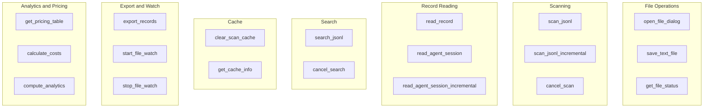
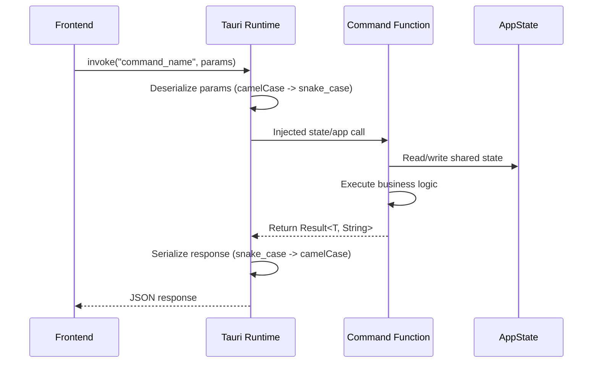

# Tauri IPC Commands

PromptLens exposes **21 Tauri IPC commands** that the frontend invokes via `invoke()`. Each command is a Rust function annotated with `#[tauri::command]` in `commands.rs`. Commands cover file operations, scanning, record reading, search, caching, export, file watching, pricing, and analytics.

## Command Registration

All commands are registered via `tauri::generate_handler!` in `commands.rs`:

```rust
// file: src-tauri/src/commands.rs:592
pub fn run() {
    tauri::Builder::default()
        .manage(AppState::default())
        .invoke_handler(tauri::generate_handler![
            open_file_dialog, scan_jsonl, scan_jsonl_incremental,
            cancel_scan, clear_scan_cache, get_cache_info, get_file_status,
            save_text_file, export_records, read_record,
            read_agent_session, read_agent_session_incremental, detect_log_source,
            search_jsonl, cancel_search, list_system_fonts,
            get_pricing_table, calculate_costs,
            start_file_watch, stop_file_watch, compute_analytics
        ])
        .run(tauri::generate_context!())
        .expect("error while running PromptLens");
}
```

## Command Categories



## Full Command Reference

### File Operations

| Command | Parameters | Returns | Description |
|---------|-----------|---------|-------------|
| `open_file_dialog` | None | `Option<String>` | Opens native file picker for `.jsonl`, `.ndjson`, `.log` |
| `save_text_file` | `default_file_name`, `contents` | `Result<Option<String>>` | Saves text content via native save dialog |
| `get_file_status` | `file_path` | `FileStatus` | Checks file existence, size, and modification time |

### Scanning

| Command | Parameters | Returns | Description |
|---------|-----------|---------|-------------|
| `scan_jsonl` | `file_path`, `log_source?` | `Result<FileScanResult>` | Full JSONL file scan with cache check |
| `scan_jsonl_incremental` | `file_path`, `from_offset`, `from_line_number` | `Result<IncrementalScanResult>` | Scans only bytes appended since last scan |
| `cancel_scan` | None | void | Sets `cancel_scan` flag to interrupt a running scan |

### Record Reading

| Command | Parameters | Returns | Description |
|---------|-----------|---------|-------------|
| `read_record` | `file_path`, `byte_offset`, `line_number` | `Result<RecordDetail>` | O(1) single record read by byte offset |
| `read_agent_session` | `file_path`, `log_source?` | `Result<AgentSessionResult>` | Parses full agent session with event linking |
| `read_agent_session_incremental` | `file_path`, `from_offset`, `from_line_number`, `log_source?` | `Result<AgentSessionIncrementalResult>` | Parses appended agent session events |

### Search

| Command | Parameters | Returns | Description |
|---------|-----------|---------|-------------|
| `search_jsonl` | `file_path`, `query`, `mode?` | `Result<SearchResponse>` | Search with substring, FTS, or regex mode |
| `cancel_search` | None | void | Sets `cancel_search` flag to interrupt a running search |

### Cache Management

| Command | Parameters | Returns | Description |
|---------|-----------|---------|-------------|
| `clear_scan_cache` | None | `Result<()>` | Deletes the SQLite cache database file |
| `get_cache_info` | None | `Result<CacheInfo>` | Returns cache file path and existence status |

### Agent Source Detection

| Command | Parameters | Returns | Description |
|---------|-----------|---------|-------------|
| `detect_log_source` | `file_path` | `Option<String>` | Reads first 20 lines and votes on source type |

### Export

| Command | Parameters | Returns | Description |
|---------|-----------|---------|-------------|
| `export_records` | `ExportRecordsRequest` | `Result<Option<String>>` | Exports selected records in 1 of 3 formats |

### File Watching

| Command | Parameters | Returns | Description |
|---------|-----------|---------|-------------|
| `start_file_watch` | `file_path` | `Result<()>` | Begins watching file for changes via `notify` |
| `stop_file_watch` | None | `Result<()>` | Stops the active file watcher |

### Pricing and Analytics

| Command | Parameters | Returns | Description |
|---------|-----------|---------|-------------|
| `get_pricing_table` | None | `Vec<ModelPricing>` | Returns the full 18-model pricing table |
| `calculate_costs` | `Vec<CostRequest>` | `Vec<CostEstimate>` | Calculates token costs for given models |
| `compute_analytics` | `file_path` | `Result<ComputedAnalytics>` | Computes analytics from cached scan results |

### System

| Command | Parameters | Returns | Description |
|---------|-----------|---------|-------------|
| `list_system_fonts` | None | `Vec<String>` | Lists available system fonts via `fc-list` |

## Key Command Implementations

### read_record -- O(1) Byte-Offset Addressing

```rust
// file: src-tauri/src/commands.rs:106
fn read_record(
    file_path: String, byte_offset: u64, line_number: usize,
) -> Result<RecordDetail, String> {
    let file = File::open(&file_path).map_err(|err| format!("Failed to open file: {err}"))?;
    let mut reader = BufReader::new(file);
    reader
        .seek(SeekFrom::Start(byte_offset))
        .map_err(|err| format!("Failed to seek record: {err}"))?;
    let mut line = String::new();
    reader
        .read_line(&mut line)
        .map_err(|err| format!("Failed to read record: {err}"))?;
    let trimmed = line.trim();
    match serde_json::from_str::<Value>(trimmed) {
        Ok(value) => {
            let summary = summary_from_value(&value, line_number, byte_offset, None);
            let normalized = normalize_call(&value, &summary);
            Ok(RecordDetail {
                summary,
                normalized: Some(normalized),
                raw: Some(value),
                parse_error: None,
            })
        }
        Err(err) => Ok(RecordDetail { /* ... invalid_json ... */ })
    }
}
```

### read_agent_session -- Full Session with Subagent Loading

```rust
// file: src-tauri/src/commands.rs:223
pub(crate) fn read_agent_session(
    file_path: String, log_source: Option<String>,
) -> Result<AgentSessionResult, String> {
    let source = LogSource::from_option(log_source);
    let path = Path::new(&file_path);
    let metadata = fs::metadata(path).map_err(|err| format!("Failed to read metadata: {err}"))?;
    let modified = modified_timestamp(&metadata);
    if let Ok(Some(cached)) =
        read_agent_session_cache(&file_path, source, metadata.len(), modified.as_deref())
    {
        return Ok(cached);
    }

    let file = File::open(path).map_err(|err| format!("Failed to open file: {err}"))?;
    let mut reader = BufReader::new(file);
    let (events, subagent_calls, sessions, ..) = read_agent_events(&mut reader, source, 0, 0)?;

    let mut sessions = sessions.into_iter().collect::<Vec<_>>();
    sessions.sort();
    let subagent_sessions = load_subagent_sessions(path, source, &subagent_calls);

    let result = AgentSessionResult {
        file_path,
        source: source.as_str().to_string(),
        total_events: events.len(),
        sessions,
        events,
        subagent_sessions,
    };
    let _ = write_agent_session_cache(&result, metadata.len(), modified.as_deref());
    Ok(result)
}
```

## Event Emitters

| Event | Payload | Emitter | Frequency |
|-------|---------|---------|-----------|
| `scan-progress` | `ProgressEvent { processed_bytes, total_bytes, line_number }` | `scan_jsonl` | Line 1, then every 250 lines |
| `scan-chunk` | `ScanChunkPayload { file_path, summaries[], line_from, line_to }` | `scan_jsonl` | Every 500 lines (batched summaries) |
| `search-progress` | `ProgressEvent` | `search_jsonl` | Every 250 lines (line scan) or every 100 results (index) |
| `file-changed` | `String` (file path) | `FileWatcher` | On file modification, debounced 500ms |

## Command Lifecycle



Each command invocation is independent and stateless (except for shared `AppState`). There is no request multiplexing -- commands execute sequentially on the Tauri thread pool.
