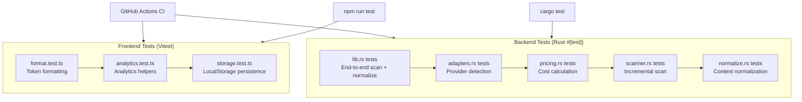
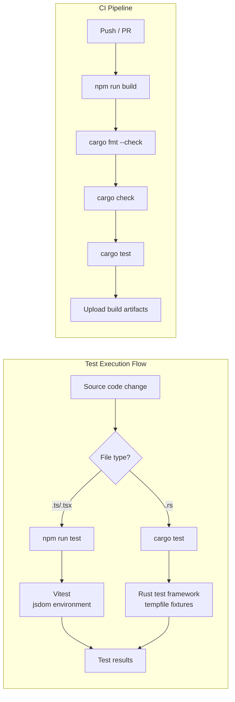

# Testing

PromptLens has both frontend (Vitest) and backend (Rust `#[test]`) test suites. Tests run automatically in CI on every push and pull request.

## Test Strategy





## Frontend Tests (Vitest)

The frontend uses **Vitest** with jsdom for unit testing.

### Running Frontend Tests

```bash
# Run all tests once
npm run test

# Run in watch mode (re-runs on file change)
npm run test:watch

# Run a specific test file
npx vitest src/lib/format.test.ts

# Run with coverage report
npx vitest --coverage
```

### Test Files

| File | Description | Approximate Tests |
|------|-------------|-------------------|
| `src/lib/format.test.ts` | Formatting utilities (token counts, dates, durations) | ~10 |
| `src/app/analytics.test.ts` | Analytics calculation helpers | ~8 |
| `src/app/storage.test.ts` | localStorage persistence helpers | ~5 |

### Test Configuration

Vitest is configured in `vite.config.ts` (or `vitest.config.ts`). Key settings:

| Setting | Value |
|---------|-------|
| Environment | `jsdom` |
| Globals | `true` (no need to import `describe`, `it`, `expect`) |
| Setup file | `@testing-library/jest-dom` for DOM matchers |

Test scripts in `package.json`:
```json
// file: package.json:13-14
{
  "scripts": {
    "test": "vitest run",
    "test:watch": "vitest"
  }
}
```

### Writing Frontend Tests

```typescript
// file: src/lib/format.test.ts (example pattern)
import { describe, it, expect } from "vitest";
import { formatTokens } from "./format";

describe("formatTokens", () => {
  it("formats small numbers without suffix", () => {
    expect(formatTokens(500)).toBe("500");
  });

  it("formats thousands with k suffix", () => {
    expect(formatTokens(1500)).toBe("1.5k");
  });

  it("returns dash for null", () => {
    expect(formatTokens(null)).toBe("-");
  });
});
```

Testing React components with Testing Library:
```typescript
// Component test pattern
import { render, screen } from "@testing-library/react";
import { describe, it, expect } from "vitest";

describe("ComponentName", () => {
  it("renders correctly", () => {
    render(<ComponentName prop="value" />);
    expect(screen.getByText("expected text")).toBeInTheDocument();
  });
});
```

## Backend Tests (Rust)

The Rust backend uses the built-in `#[test]` framework with `tempfile` for fixture files.

### Running Backend Tests

```bash
cd src-tauri

# Run all tests
cargo test

# Run with stdout visible
cargo test -- --nocapture

# Run a specific test by name
cargo test scan_jsonl_tracks

# Run tests in a specific module
cargo test adapters::tests

# List all tests without running
cargo test -- --list
```

### Test Modules

| Module | Test Count | What It Tests |
|--------|------------|---------------|
| `lib.rs` | 8+ | End-to-end scan, normalization, image detection, agent sessions |
| `adapters.rs` | 4 | Provider auto-detection heuristics (OpenAI, Gemini, Ollama, Anthropic) |
| `pricing.rs` | 5 | Pricing table loading, exact/fuzzy matching, unknown models, cost calculation |
| `normalize.rs` | (inline) | Summary extraction, content normalization |
| `scanner.rs` | (inline) | Incremental scanning, offset tracking |

### Test Fixtures

Test fixture files are located in `src-tauri/fixtures/`:

| Fixture File | Provider | Purpose |
|-------------|----------|---------|
| `openai_chat.json` | OpenAI | Chat completion response |
| `anthropic_messages.json` | Anthropic | Messages API response |
| `gemini_candidate.json` | Google Gemini | Candidate response |
| `ollama_chat.json` | Ollama | Local model response |
| `agent_claude_code_session.jsonl` | Claude Code | Agent session log |
| `agent_codex_session.jsonl` | Codex | Agent session log |

### Writing Backend Tests

```rust
// file: src-tauri/src/pricing.rs:74-116
#[cfg(test)]
mod tests {
    use super::*;

    #[test]
    fn loads_pricing_table() {
        let table = load_pricing_table();
        assert!(table.len() >= 15);
        assert!(table.iter().any(|p| p.model == "gpt-4o"));
        assert!(table.iter().any(|p| p.model == "claude-sonnet-4"));
    }

    #[test]
    fn exact_model_match() {
        let table = load_pricing_table();
        let p = find_pricing("gpt-4o", &table).unwrap();
        assert_eq!(p.model, "gpt-4o");
    }

    #[test]
    fn fuzzy_model_match() {
        let table = load_pricing_table();
        let p = find_pricing("gpt-4o-2024-08-06", &table).unwrap();
        assert_eq!(p.model, "gpt-4o");
    }

    #[test]
    fn unknown_model_returns_zero() {
        let table = load_pricing_table();
        let cost = calculate_cost("unknown-model-xyz", Some(1000), Some(500), &table);
        assert_eq!(cost.total_cost, 0.0);
        assert!(cost.matched_pricing.is_none());
    }

    #[test]
    fn cost_calculation() {
        let table = load_pricing_table();
        let cost = calculate_cost("gpt-4o", Some(1_000_000), Some(1_000_000), &table);
        assert!((cost.input_cost - 2.50).abs() < 0.01);
        assert!((cost.output_cost - 10.00).abs() < 0.01);
        assert!((cost.total_cost - 12.50).abs() < 0.01);
    }
}
```

Testing provider detection:
```rust
// file: src-tauri/src/adapters.rs:38-62
#[cfg(test)]
mod tests {
    use super::*;
    use serde_json::json;

    #[test]
    fn detects_common_providers() {
        assert_eq!(
            detect_provider(&json!({"choices": []})).as_deref(),
            Some("openai")
        );
        assert_eq!(
            detect_provider(&json!({"candidates": []})).as_deref(),
            Some("gemini")
        );
        assert_eq!(
            detect_provider(&json!({"message": {}, "done": true})).as_deref(),
            Some("ollama")
        );
        assert_eq!(
            detect_provider(&json!({"content": [{"type": "text", "text": "ok"}]})).as_deref(),
            Some("anthropic")
        );
    }
}
```

### Scan Testing with tempfile

```rust
// Pattern for scan tests using temporary files
use tempfile::NamedTempFile;
use std::io::Write;
use serde_json::json;

#[test]
fn test_scan_with_temp_file() {
    let mut file = NamedTempFile::new().expect("temp file");
    writeln!(file, "{}", json!({"model": "gpt-4o"})).unwrap();
    writeln!(file, "not-json").unwrap();

    let result = scan_jsonl_inner(
        file.path().to_string_lossy().to_string(),
        None,
        None
    ).unwrap();

    assert_eq!(result.valid_records, 1);
    assert_eq!(result.invalid_records, 1);
}
```

### Isolating Test Cache

Backend tests that interact with the SQLite cache set `PROMPTLENS_CACHE_PATH` to a temporary file and protect access with a `Mutex`:

```rust
static TEST_CACHE_ENV: Mutex<()> = Mutex::new(());

#[test]
fn cached_scan_returns_hit() {
    let _guard = TEST_CACHE_ENV.lock().unwrap();
    let cache_file = NamedTempFile::new().unwrap();
    std::env::set_var("PROMPTLENS_CACHE_PATH", cache_file.path());
    // ... test logic ...
    std::env::remove_var("PROMPTLENS_CACHE_PATH");
}
```

## CI Testing

Both test suites run automatically in the GitHub Actions `build.yml` workflow:

```yaml
# file: .github/workflows/build.yml:71-79
- name: Rust checks
  working-directory: src-tauri
  run: |
    cargo fmt --check
    cargo check --target ${{ matrix.target }}

- name: Rust tests
  working-directory: src-tauri
  run: cargo test
```

| Step | Command | Platform |
|------|---------|----------|
| Frontend build | `npm run build` | All |
| Rust formatting | `cargo fmt --check` | All |
| Rust type check | `cargo check --target <target>` | All |
| Rust tests | `cargo test` | All |

See the [CI/CD](ci-cd) page for full workflow details.

## Test Coverage

Frontend coverage tools are not configured. Rust coverage can be generated with:

```bash
# Requires cargo-tarpaulin
cargo install cargo-tarpaulin
cd src-tauri
cargo tarpaulin --out Html
```

## Manual Test Fixtures

Generate large JSONL files for manual testing:

```bash
# Generate ~100 rows
npm run sample:large

# Generate custom size
node scripts/generate-large-sample.mjs 500 10
# Arguments: [rows] [target MB]
```

## Test Best Practices

| Practice | Description |
|----------|-------------|
| Use `tempfile` | Never write test files into the repository; use `NamedTempFile` |
| Isolate cache | Use `PROMPTLENS_CACHE_PATH` env var + `Mutex` guard |
| Test edge cases | Include invalid JSON, empty files, missing fields |
| Use `json!` macro | Build test fixtures inline with `serde_json::json!` |
| Run with `--nocapture` | Use `cargo test -- --nocapture` to see `println!` output |
| Name tests clearly | Use descriptive names like `fuzzy_model_match` |
