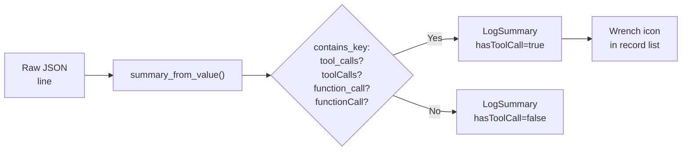
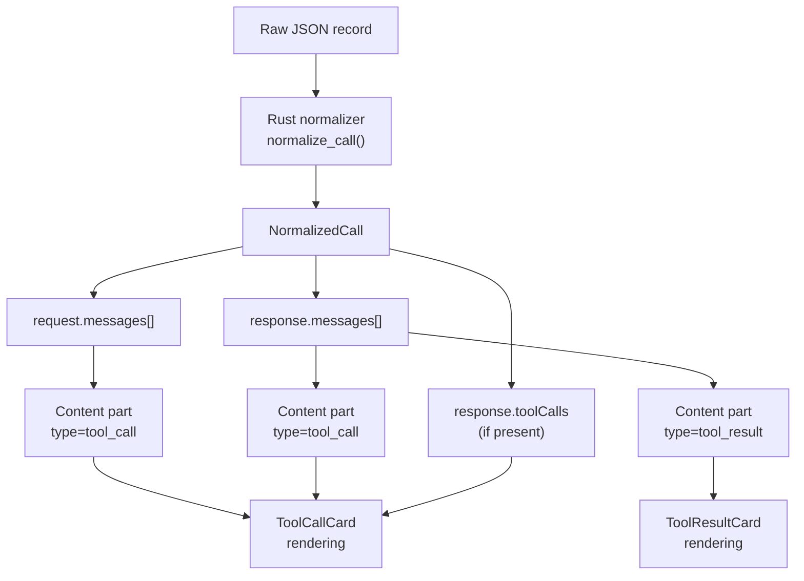
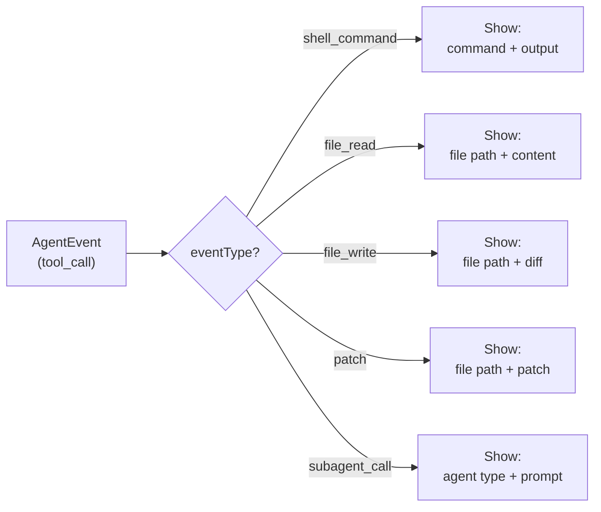
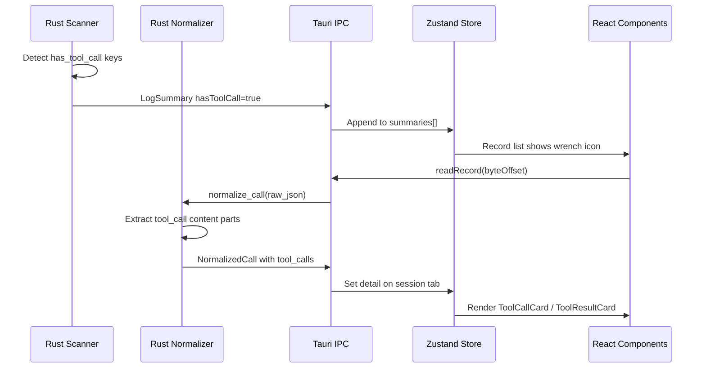
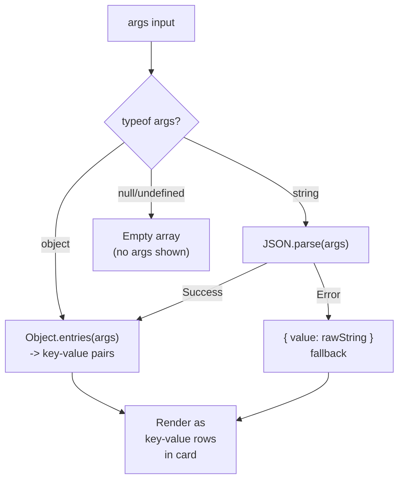

# Tool Calls

PromptLens provides structured views for tool calls and tool results in LLM conversations. Tools are functions that the LLM can invoke to perform actions like searching the web, reading files, or executing code.

## Tool Call Detection

During scanning, PromptLens flags records that contain tool calls. The detection logic checks for tool-related keys in the JSON structure:

```rust
// file: src-tauri/src/normalize.rs:74-77
has_tool_call: contains_key(
    value,
    &["tool_calls", "toolCalls", "function_call", "functionCall"],
),
```

The `contains_key` helper recursively searches the JSON value for all listed key names:

```rust
// file: src-tauri/src/normalize.rs
fn contains_key(value: &Value, keys: &[&str]) -> bool {
    match value {
        Value::Object(map) => {
            map.keys().any(|k| keys.contains(&k.as_str()))
                || map.values().any(|v| contains_key(v, keys))
        }
        Value::Array(arr) => arr.iter().any(|v| contains_key(v, keys)),
        _ => false,
    }
}
```

Records containing tool calls show a wrench icon in the record list. You can filter to tool call records using the "Tools" option in the status filter dropdown.



## ToolCallCard

When a message contains a `tool_call` content part, PromptLens renders it as a `ToolCallCard`:

```tsx
// file: src/app/components/CenterPanel.tsx:357
function ToolCallCard({ name, args }: { name?: string; args?: unknown }) {
  const parsed = parseArgs(args);
  const entries = parsed ? Object.entries(parsed) : [];
  return (
    <div className="tool-call-card">
      <div className="tool-call-header">
        <Wrench size={14} />
        <span className="tool-call-name">{name ?? "unknown"}</span>
      </div>
      {entries.length > 0 ? (
        <div className="tool-call-args">
          {entries.map(([key, value]) => (
            <div key={key} className="tool-call-kv">
              <span className="tool-call-key">{key}</span>
              <span className="tool-call-value">
                {typeof value === "object" ? JSON.stringify(value) : String(value)}
              </span>
            </div>
          ))}
        </div>
      ) : null}
    </div>
  );
}
```

```
+--------------------------------------------------+
| [wrench] get_weather                              |
+--------------------------------------------------+
| city         Paris                                |
| units        metric                               |
| format       detailed                             |
+--------------------------------------------------+
```

The `parseArgs` helper handles multiple argument formats:

- If `args` is already an object, use it directly.
- If `args` is a JSON string, parse it with `JSON.parse()`.
- If parsing fails, the raw string is returned as a single `"value"` entry.

## ToolResultCard

Tool results are displayed as collapsible cards:

```tsx
// file: src/app/components/CenterPanel.tsx:382
function ToolResultCard({ name, result }: { name?: string; result?: unknown }) {
  const [expanded, setExpanded] = useState(false);
  const text = typeof result === "string" ? result : safeJson(result);
  const preview = text.length > 120 ? text.slice(0, 120) + "..." : text;
  return (
    <div className="tool-result-card">
      <button className="tool-result-header" onClick={() => setExpanded((v) => !v)}>
        {expanded ? <ChevronDown size={14} /> : <ChevronRight size={14} />}
        <span className="tool-result-label">
          {name ? `${name} result` : "Result"}
        </span>
        {!expanded && <span className="tool-result-preview">{preview}</span>}
      </button>
      {expanded && (
        <pre className="tool-result-body">{highlightJson(safeJson(result))}</pre>
      )}
    </div>
  );
}
```

| State | What It Shows |
|-------|---------------|
| Collapsed | Tool name + first 120 characters of result as preview |
| Expanded | Full result with JSON syntax highlighting via `highlightJson()` |

## Tools Tab (Right Panel)

The **Tools** tab in the right panel provides a structured JSON view of all tool calls and results:

```tsx
// file: src/app/components/RightPanel.tsx:138
function ToolCallsView({ detail, agentEvent }) {
  if (agentEvent) {
    const toolContext = {
      eventType: agentEvent.eventType,
      toolName: agentEvent.toolName,
      toolUseId: agentEvent.toolUseId,
      command: agentEvent.command,
      filePaths: agentEvent.filePaths,
      status: agentEvent.status,
      durationMs: agentEvent.durationMs,
      output: rawTextByKeys(agentEvent.raw, [
        "output", "stdout", "stderr", "result", "content",
      ]),
      raw: agentEvent.raw,
    };
    return <JsonCode value={toolContext} />;
  }
  // ... standard tool call view
}
```

For agent events, the Tools tab shows a structured context object containing event type, tool name, command, file paths, status, duration, and output.

## Tool Call Data Flow



## Tool Content Normalization

The Rust normalizer handles multiple tool call formats from different providers:

```rust
// file: src-tauri/src/normalize.rs:449-458
if matches!(
    value.get("type").and_then(Value::as_str),
    Some("tool_call") | Some("function_call") | Some("tool_use")
) {
    return vec![NormalizedContent::ToolCall {
        name: value
            .get("name")
            .or_else(|| value.get("id"))
            .and_then(Value::as_str)
            .map(str::to_string),
        arguments: value
            .get("arguments")
            .or_else(|| value.get("input"))
            .cloned(),
    }];
}
```

The normalizer checks three possible values for the `type` field (`tool_call`, `function_call`, `tool_use`) to cover all supported providers. The tool name is extracted from the `name` or `id` field, and arguments from `arguments` or `input`.

| Provider | Tool Call Format | Normalized To |
|----------|-----------------|---------------|
| OpenAI | `tool_calls[].function` | `ToolCall { name, arguments }` |
| Anthropic | `tool_use` content block | `ToolCall { name, arguments }` |
| Gemini | Function call part | `ToolCall { name, arguments }` |
| Ollama | `tool_calls` array | `ToolCall { name, arguments }` |

## Tool Result Normalization

Tool results follow a similar normalization path:

```rust
// file: src-tauri/src/normalize.rs
if matches!(
    value.get("type").and_then(Value::as_str),
    Some("tool_result") | Some("function_call_output") | Some("tool_result_content")
) {
    return vec![NormalizedContent::ToolResult {
        name: value.get("name").and_then(Value::as_str).map(str::to_string),
        result: value
            .get("content")
            .or_else(|| value.get("output"))
            .or_else(|| value.get("result"))
            .cloned(),
    }];
}
```

| Provider | Tool Result Format | Normalized To |
|----------|-------------------|---------------|
| OpenAI | `tool` role message | `ToolResult { name, result }` |
| Anthropic | `tool_result` content block | `ToolResult { name, result }` |
| Gemini | Function response part | `ToolResult { name, result }` |

## Common Tool Types

| Provider/Agent | Common Tools |
|---------------|-------------|
| OpenAI function calling | Custom function names defined in the API request |
| Anthropic tool use | `computer_use`, `text_editor`, `Bash`, `Task`, `Agent` |
| Codex | `exec_command`, `apply_patch` |
| Claude Code | `Bash`, `Read`, `Write`, `Edit`, `Task`, `Agent`, `Glob`, `Grep` |
| OpenCode | `read`, `write`, `edit`, `shell` |

## Tool Calls in Agent Sessions

Agent sessions have richer tool interactions. When you select an agent tool event, the center panel shows a full detail view with commands, outputs, file paths, and structured tool result content.



| Event Type | Represents |
|-----------|-----------|
| `shell_command` | A terminal command was executed |
| `file_read` | A file was read |
| `file_write` | A file was written |
| `patch` | A diff/patch was applied to a file |
| `tool_call` | A generic tool was invoked |
| `tool_result` | Result of a tool call |
| `subagent_call` | A subagent was spawned |
| `subagent_result` | A subagent returned a result |

## Right Panel Tool-Related Tabs

When a tool-related message is selected, the right panel provides context-sensitive tabs:

```ts
// file: src/app/types.ts
export type RightTab = "diff" | "tools" | "error" | "raw" | "json";
```

| Tab | Content |
|-----|---------|
| **Tools** | Structured view of tool calls and results (ToolCallsView) |
| **Raw** | Raw JSON payload of the selected message |
| **JSON** | Pretty-printed normalized JSON |
| **Diff** | Side-by-side comparison (when comparison baseline is set) |
| **Error** | Error details (when the record has an error status) |

## Debugging Tool Call Issues

| Issue | Possible Cause | Solution |
|-------|---------------|----------|
| Tool calls not showing | Record not flagged `hasToolCall` | Check that JSON structure matches expected format |
| Arguments show as raw string | Arguments are a JSON string, not object | The card falls back to showing the raw string |
| Tool result truncated | Result exceeds 120 characters | Click to expand the ToolResultCard |
| Empty tool result | Result field is null or missing | Check raw JSON to confirm where the result actually lives |
| Wrong tool name | `name` field missing; falls back to `id` | Check raw JSON to confirm which field holds the name |

## Tool Call Rendering Pipeline

The complete rendering pipeline from raw JSON to visual card:



## Tool Call Content Parts

After normalization, tool calls appear as typed content parts in the message array:

```ts
// Conceptual type (from normalized output)
type NormalizedContent =
  | { type: "text"; text: string }
  | { type: "tool_call"; name?: string; arguments?: unknown }
  | { type: "tool_result"; name?: string; result?: unknown }
  | { type: "image"; source: string };
```

The center panel iterates over content parts, rendering the appropriate component for each type:

```tsx
// Conceptual rendering logic in MessageCard
{message.content.map((part, i) => {
  if (part.type === "text") return <MarkdownText key={i} text={part.text} />;
  if (part.type === "tool_call") return <ToolCallCard key={i} name={part.name} args={part.arguments} />;
  if (part.type === "tool_result") return <ToolResultCard key={i} name={part.name} result={part.result} />;
  if (part.type === "image") return <ImageCard key={i} src={part.source} />;
  return null;
})}
```

## Tool Call Statistics in Analytics

Records containing tool calls are tracked in the analytics summary. The `hasToolCall` flag on each `LogSummary` enables:

- Filtering the record list to show only tool call records (status filter: "Tools")
- Counting tool call records in the analytics overview
- Identifying which models use tool calls most frequently

## Comparing Tool Calls Across Providers

Since PromptLens normalizes tool calls from all providers into the same `ToolCall { name, arguments }` structure, you can:

1. Open a log containing mixed-provider tool calls (e.g., OpenAI + Anthropic).
2. Filter to tool call records.
3. Compare the normalized tool call structures side by side.
4. Use the Diff tab to compare specific tool call arguments.

## Tool Call Argument Handling

The `parseArgs` helper in ToolCallCard handles various argument formats:



This ensures that tool calls from different providers -- which may serialize arguments as objects or JSON strings -- always display correctly.

## Tool Call Filtering Workflow

Recommended workflow for analyzing tool calls:

1. Open your audit log.
2. Set the status filter to "Tools" to show only records containing tool calls.
3. Click a record to see the full conversation with tool call cards.
4. Switch to the Tools tab in the right panel for a structured JSON view.
5. Use search to find specific tool names (e.g., search for "Bash" or "Read").
6. Export the filtered tool call records as JSONL for further analysis.

## Related Pages

- [Agent Sessions](agent-sessions.md) -- Tool interactions in agent sessions
- [Viewing Conversations](viewing-conversations.md) -- Message card rendering and view modes
- [Search](search.md) -- Finding records with tool calls
