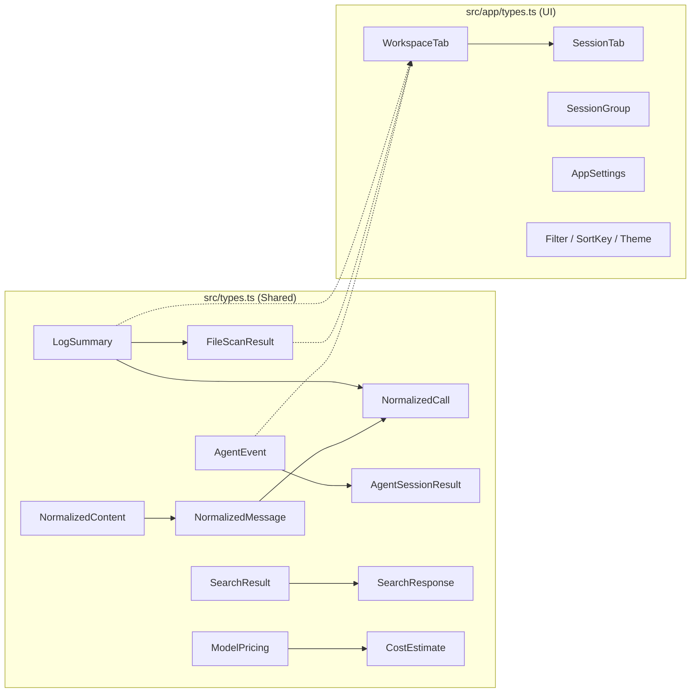
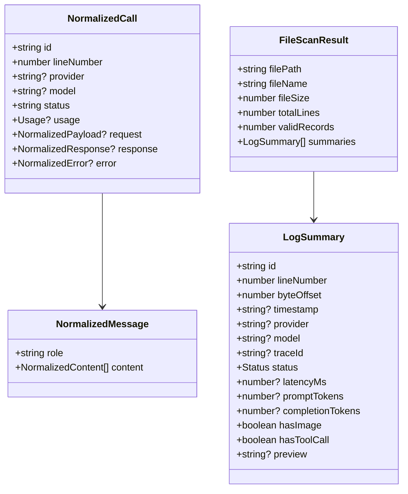

# TypeScript Types

All TypeScript type definitions live in two files: `src/types.ts` (shared/core types) and `src/app/types.ts` (UI-specific types).

## Type Architecture





## Core Types (`src/types.ts`)

`src/types.ts`

### Status and Summary

| Type | Description |
|------|-------------|
| `Status` | `"success" \| "error" \| "invalid_json" \| "unknown"` |
| `LogSummary` | Lightweight metadata for a single JSONL line |
| `FileScanResult` | Result of a full JSONL scan |
| `IncrementalScanResult` | Result of an incremental scan |

#### LogSummary

```typescript
// file: src/types.ts:3-23
export type LogSummary = {
  id: string;
  lineNumber: number;
  byteOffset: number;
  timestamp?: string;
  provider?: string;
  model?: string;
  traceId?: string;
  sessionId?: string;
  requestId?: string;
  parentId?: string;
  status: Status;
  latencyMs?: number;
  promptTokens?: number;
  completionTokens?: number;
  totalTokens?: number;
  hasImage: boolean;
  hasToolCall: boolean;
  preview?: string;
  parseError?: string;
};
```

| Field | Type | Description |
|-------|------|-------------|
| `id` | `string` | Unique record identifier |
| `lineNumber` | `number` | 1-based line number in the file |
| `byteOffset` | `number` | Byte offset for O(1) seeking |
| `timestamp?` | `string` | ISO 8601 timestamp |
| `provider?` | `string` | LLM provider name |
| `model?` | `string` | Model identifier |
| `traceId?` | `string` | Trace identifier |
| `sessionId?` | `string` | Session identifier |
| `requestId?` | `string` | Request identifier |
| `parentId?` | `string` | Parent record identifier |
| `status` | `Status` | Record status |
| `latencyMs?` | `number` | Response latency in milliseconds |
| `promptTokens?` | `number` | Input token count |
| `completionTokens?` | `number` | Output token count |
| `totalTokens?` | `number` | Total token count |
| `hasImage` | `boolean` | Contains image content |
| `hasToolCall` | `boolean` | Contains tool/function calls |
| `preview?` | `string` | Truncated text preview |
| `parseError?` | `string` | Error message if parsing failed |

#### FileScanResult

```typescript
// file: src/types.ts:25-37
export type FileScanResult = {
  filePath: string;
  fileName: string;
  fileSize: number;
  modified?: string;
  totalLines: number;
  validRecords: number;
  invalidRecords: number;
  durationMs: number;
  cancelled: boolean;
  cacheHit: boolean;
  summaries: LogSummary[];
};
```

| Field | Type | Description |
|-------|------|-------------|
| `filePath` | `string` | Absolute file path |
| `fileName` | `string` | File base name |
| `fileSize` | `number` | File size in bytes |
| `modified?` | `string` | Last modified timestamp |
| `totalLines` | `number` | Total lines in the file |
| `validRecords` | `number` | Successfully parsed records |
| `invalidRecords` | `number` | Failed-to-parse records |
| `durationMs` | `number` | Scan duration in milliseconds |
| `cancelled` | `boolean` | Whether the scan was cancelled |
| `cacheHit` | `boolean` | Whether the result came from cache |
| `summaries` | `LogSummary[]` | All parsed summaries |

#### IncrementalScanResult

```typescript
// file: src/types.ts:39-47
export type IncrementalScanResult = {
  summaries: LogSummary[];
  fileSize: number;
  modified?: string;
  nextLineNumber: number;
  validRecords: number;
  invalidRecords: number;
  durationMs: number;
};
```

### Normalization Types

```typescript
// file: src/types.ts:49-54
export type NormalizedContent =
  | { type: "text"; text: string }
  | { type: "image"; mime?: string; dataUrl?: string; data_url?: string; base64?: string }
  | { type: "tool_call"; name?: string; arguments?: unknown }
  | { type: "tool_result"; name?: string; result?: unknown }
  | { type: "unknown"; raw: unknown };
```

| Variant | Fields |
|---------|--------|
| `text` | `{ type: "text", text: string }` |
| `image` | `{ type: "image", mime?: string, dataUrl?: string, data_url?: string, base64?: string }` |
| `tool_call` | `{ type: "tool_call", name?: string, arguments?: unknown }` |
| `tool_result` | `{ type: "tool_result", name?: string, result?: unknown }` |
| `unknown` | `{ type: "unknown", raw: unknown }` |

#### NormalizedMessage

```typescript
// file: src/types.ts:56-60
export type NormalizedMessage = {
  role: "system" | "developer" | "user" | "assistant" | "tool" | "function" | "unknown";
  content: NormalizedContent[];
  raw?: unknown;
};
```

#### NormalizedCall

```typescript
// file: src/types.ts:62-99
export type NormalizedCall = {
  id: string;
  lineNumber: number;
  timestamp?: string;
  provider?: string;
  model?: string;
  traceId?: string;
  sessionId?: string;
  requestId?: string;
  parentId?: string;
  endpoint?: string;
  status: "success" | "error" | "unknown";
  latencyMs?: number;
  usage?: {
    promptTokens?: number;
    completionTokens?: number;
    totalTokens?: number;
  };
  request?: {
    messages?: NormalizedMessage[];
    raw?: unknown;
  };
  response?: {
    text?: string;
    messages?: NormalizedMessage[];
    toolCalls?: unknown;
    raw?: unknown;
  };
  error?: {
    message?: string;
    errorType?: string;
    type?: string;
    stack?: string;
    raw?: unknown;
  };
  metadata?: Record<string, unknown>;
  raw: unknown;
};
```

| Field | Type | Description |
|-------|------|-------------|
| `id` | `string` | Record identifier |
| `lineNumber` | `number` | Line number |
| `timestamp?` | `string` | ISO 8601 timestamp |
| `provider?` | `string` | LLM provider |
| `model?` | `string` | Model name |
| `traceId?` | `string` | Trace ID |
| `sessionId?` | `string` | Session ID |
| `requestId?` | `string` | Request ID |
| `parentId?` | `string` | Parent ID |
| `endpoint?` | `string` | API endpoint |
| `status` | `"success" \| "error" \| "unknown"` | Call status |
| `latencyMs?` | `number` | Latency in milliseconds |
| `usage?` | `{ promptTokens?, completionTokens?, totalTokens? }` | Token usage |
| `request?` | `{ messages?: NormalizedMessage[], raw?: unknown }` | Request payload |
| `response?` | `{ text?, messages?, toolCalls?, raw? }` | Response payload |
| `error?` | `{ message?, errorType?, type?, stack?, raw? }` | Error details |
| `metadata?` | `Record<string, unknown>` | Additional metadata |
| `raw` | `unknown` | Original JSON |

### Search Types

```typescript
// file: src/types.ts:108-120
export type SearchResult = {
  lineNumber: number;
  byteOffset: number;
  context: string;
};

export type SearchResponse = {
  results: SearchResult[];
  truncated: boolean;
  cancelled: boolean;
  durationMs: number;
  indexed: boolean;
};
```

### Agent Session Types

```typescript
// file: src/types.ts:139-158
export type LogSource = "audit" | "codex" | "opencode" | "openclaw" | "claude_code" | "generic_agent";

export type AgentEventType =
  | "user_message"
  | "assistant_message"
  | "tool_call"
  | "tool_result"
  | "subagent_call"
  | "subagent_result"
  | "shell_command"
  | "file_read"
  | "file_write"
  | "patch"
  | "file_edit"
  | "checkpoint"
  | "plan_update"
  | "reasoning"
  | "error"
  | "system"
  | "unknown";
```

| Type | Description |
|------|-------------|
| `LogSource` | `"audit" \| "codex" \| "opencode" \| "openclaw" \| "claude_code" \| "generic_agent"` |
| `AgentEventType` | Union of 17 event types |
| `AgentEvent` | A single event in an agent session |
| `SubagentSession` | Subagent events grouped by agent ID |
| `AgentSessionResult` | Full agent session parse result |
| `AgentSessionIncrementalResult` | Incremental agent session result |

#### AgentEvent

```typescript
// file: src/types.ts:160-190
export type AgentEvent = {
  id: string;
  lineNumber: number;
  byteOffset: number;
  timestamp?: string;
  sessionId?: string;
  turnId?: string;
  parentId?: string;
  role?: string;
  eventType: AgentEventType | string;
  provider?: string;
  model?: string;
  toolName?: string;
  toolUseId?: string;
  subagentType?: string;
  subagentDescription?: string;
  subagentPrompt?: string;
  command?: string;
  filePaths: string[];
  status?: string;
  durationMs?: number;
  inputTokens?: number;
  outputTokens?: number;
  isError?: boolean;
  toolResultContent?: unknown;
  isSidechain?: boolean;
  agentId?: string;
  preview?: string;
  text?: string;
  raw: unknown;
};
```

### Pricing Types

```typescript
// file: src/types.ts:209-222
export type ModelPricing = {
  model: string;
  provider: string;
  input_per_mtok: number;
  output_per_mtok: number;
};

export type CostEstimate = {
  model: string;
  input_cost: number;
  output_cost: number;
  total_cost: number;
  matched_pricing: string | null;
};
```

### Analytics Types

```typescript
// file: src/types.ts:224-279
export type AnalyticsSummaryRaw = {
  total: number;
  success: number;
  errors: number;
  invalid: number;
  errorRate: number;
  p95Latency?: number;
  p99Latency?: number;
  totalTokens: number;
  p95Tokens?: number;
  topModels: NameCountRaw[];
  topProviders: NameCountRaw[];
};

export type NameCountRaw = {
  name: string;
  count: number;
};

export type IssueRecordRaw = {
  lineNumber: number;
  byteOffset: number;
  kind: string;
  message: string;
  severity: string;
  model?: string;
};

export type ComputedAnalyticsRaw = {
  analytics: AnalyticsSummaryRaw;
  issues: IssueRecordRaw[];
  sessions: SessionGroupRaw[];
  filterOptions: FilterOptionsRaw;
};
```

### Utility Types

```typescript
// file: src/types.ts:122-137
export type ProgressEvent = {
  processedBytes: number;
  totalBytes: number;
  lineNumber: number;
};

export type CacheInfo = {
  path: string;
  exists: boolean;
};

export type FileStatus = {
  exists: boolean;
  fileSize?: number;
  modified?: string;
};
```

## Application Types (`src/app/types.ts`)

`src/app/types.ts`

### UI State Types

```typescript
// file: src/app/types.ts:11-30
export type Filter = "all" | "error" | "success" | "image" | "tool";
export type SortKey = "time" | "latency" | "tokens" | "model" | "status";
export type SortOrder = "desc" | "asc";
export type MessageViewMode = "preview" | "text" | "json";
export type LeftTab =
  | "records" | "timeline" | "subagents" | "agentFiles"
  | "trace" | "sessions" | "analytics" | "issues";
export type RightTab =
  | "diff" | "tools" | "error" | "raw" | "json";
export type Theme = "dark" | "light";
```

| Type | Values/Description |
|------|-------------------|
| `Filter` | `"all" \| "error" \| "success" \| "image" \| "tool"` |
| `SortKey` | `"time" \| "latency" \| "tokens" \| "model" \| "status"` |
| `SortOrder` | `"desc" \| "asc"` |
| `MessageViewMode` | `"preview" \| "text" \| "json"` |
| `Theme` | `"dark" \| "light"` |
| `SessionTabKind` | `"main" \| "subagent"` |

#### LeftTab

| Value | Panel |
|-------|-------|
| `"records"` | Record list |
| `"timeline"` | Timeline view |
| `"subagents"` | Subagent sessions |
| `"agentFiles"` | Agent file browser |
| `"trace"` | Trace view |
| `"sessions"` | Session groups |
| `"analytics"` | Analytics dashboard |
| `"issues"` | Issues list |

#### RightTab

| Value | Panel |
|-------|-------|
| `"diff"` | Diff view |
| `"tools"` | Tool calls |
| `"error"` | Error details |
| `"raw"` | Raw JSON |
| `"json"` | Parsed JSON |

### Complex Application Types

#### WorkspaceTab

```typescript
// file: src/app/types.ts:99-115
export type WorkspaceTab = {
  id: string;
  source: LogSource;
  file: FileScanResult;
  agentSession: AgentSessionResult | null;
  sessionTabs: SessionTab[];
  activeSessionTabId: string;
  providerFilter: string;
  modelFilter: string;
  statusFilter: string;
  issueOnly: boolean;
  traceFilter: string;
  lastSearchIndexed: boolean | null;
  newLineNumbers: number[];
  lastScanMs: number | null;
  lastSearchMs: number | null;
};
```

| Field | Type | Description |
|-------|------|-------------|
| `id` | `string` | Tab identifier |
| `source` | `LogSource` | Log source type |
| `file` | `FileScanResult` | Scan result for this tab |
| `agentSession` | `AgentSessionResult \| null` | Agent session data |
| `sessionTabs` | `SessionTab[]` | Sub-tabs within this workspace |
| `activeSessionTabId` | `string` | Currently active sub-tab |
| `providerFilter` | `string` | Active provider filter |
| `modelFilter` | `string` | Active model filter |
| `statusFilter` | `string` | Active status filter |
| `issueOnly` | `boolean` | Show only issues |
| `traceFilter` | `string` | Active trace filter |
| `lastSearchIndexed` | `boolean \| null` | Whether FTS5 index is built |
| `newLineNumbers` | `number[]` | New lines from incremental scan |
| `lastScanMs` | `number \| null` | Last scan timestamp |
| `lastSearchMs` | `number \| null` | Last search timestamp |

#### SessionGroup

```typescript
// file: src/app/types.ts:32-46
export type SessionGroup = {
  id: string;
  label: string;
  records: LogSummary[];
  startLine: number;
  endLine: number;
  startTime?: string;
  endTime?: string;
  provider: string;
  model: string;
  traceKey: string | null;
  errors: number;
  totalTokens: number;
  avgLatencyMs: number | null;
};
```

#### AppSettings

```typescript
// file: src/app/types.ts:79-83
export type AppSettings = {
  fontFamily: string;
  fontSize: number;
  codeFontFamily: string;
};
```

```typescript
// file: src/app/types.ts:156-160
export const DEFAULT_SETTINGS: AppSettings = {
  fontFamily: 'Inter, ui-sans-serif, system-ui, -apple-system, BlinkMacSystemFont, "Segoe UI", sans-serif',
  fontSize: 13,
  codeFontFamily: "ui-monospace, SFMono-Regular, Menlo, Consolas, monospace",
};
```

### Constants

```typescript
// file: src/app/types.ts:117-121
export const THEME_KEY = "promptlens.theme";
export const WORKSPACE_KEY = "promptlens.workspace";
export const SETTINGS_KEY = "promptlens.settings";
export const MESSAGE_VIEW_MODE_KEY = "promptlens.messageViewMode";
export const PANEL_WIDTH_KEY = "promptlens.panelWidth";
```

| Constant | Value | Purpose |
|----------|-------|---------|
| `THEME_KEY` | `"promptlens.theme"` | localStorage key for theme |
| `WORKSPACE_KEY` | `"promptlens.workspace"` | localStorage key for workspace state |
| `SETTINGS_KEY` | `"promptlens.settings"` | localStorage key for app settings |
| `MESSAGE_VIEW_MODE_KEY` | `"promptlens.messageViewMode"` | localStorage key for message view mode |
| `PANEL_WIDTH_KEY` | `"promptlens.panelWidth"` | localStorage key for panel widths |
| `LEFT_MIN` | `260` | Left panel minimum width (px) |
| `LEFT_MAX` | `560` | Left panel maximum width (px) |
| `LEFT_DEFAULT` | `340` | Left panel default width (px) |
| `RIGHT_MIN` | `300` | Right panel minimum width (px) |
| `RIGHT_MAX_RATIO` | `0.6` | Right panel max ratio of window |
| `RIGHT_DEFAULT` | `400` | Right panel default width (px) |
| `CENTER_MIN` | `200` | Center panel minimum width (px) |

### LogSource Options

```typescript
// file: src/app/types.ts:123-130
export const LOG_SOURCE_OPTIONS: Array<{ value: LogSource; label: string }> = [
  { value: "audit", label: "Audit Log" },
  { value: "codex", label: "Codex" },
  { value: "opencode", label: "OpenCode" },
  { value: "openclaw", label: "OpenClaw" },
  { value: "claude_code", label: "Claude Code" },
  { value: "generic_agent", label: "Agent JSONL" },
];
```

| Value | Label |
|-------|-------|
| `"audit"` | Audit Log |
| `"codex"` | Codex |
| `"opencode"` | OpenCode |
| `"openclaw"` | OpenClaw |
| `"claude_code"` | Claude Code |
| `"generic_agent"` | Agent JSONL |
